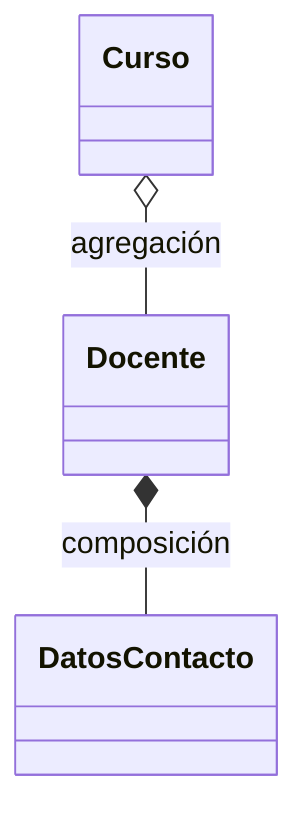
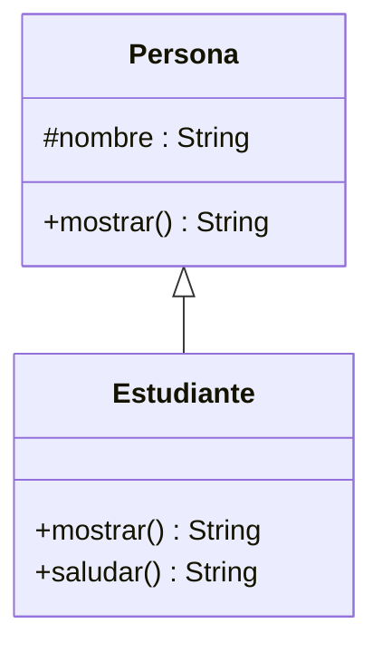
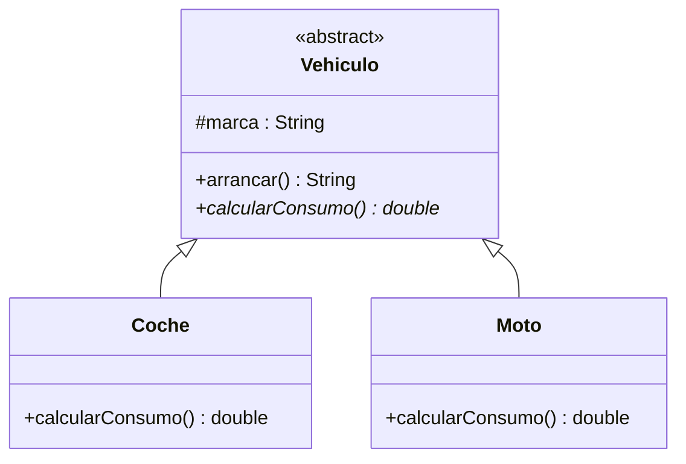
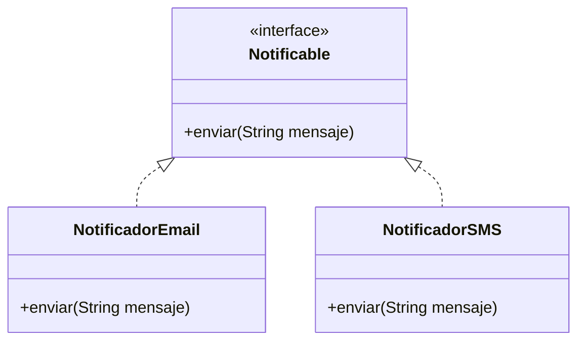

<a id="relaciones-clases"></a>

# 2. Relaciones entre clases

{ type=application/pdf style="width:100%;min-height:80vh" }

!!!info "Descarga de diapositivas"
    [Descarga las diapositivas](diapositivas/02-relaciones-clases.pptx){target="_blank" rel="noopener"}

Para diseñar cualquier aplicación un poco más grande que un programa suelto necesitas varias clases que colaboren entre sí. En este apartado repasamos las formas en las que unas clases se relacionan con otras: asociación, herencia, polimorfismo, clases abstractas, interfaces e interfaces funcionales.

---

## 2.1 Asociación, agregación y composición

!!! info "Idea clave"
    La asociación es una relación entre clases cuyos objetos interactúan entre sí. Puede ser unidireccional o bidireccional (navegabilidad) y de tipo 1-1, 1-N o N-N (multiplicidad).

Un `Estudiante` que conoce sus `Curso` y un `Curso` que conoce a sus `Estudiante` es una asociación bidireccional N-N: cada estudiante puede estar en varios cursos, y cada curso tiene varios estudiantes.

```java
public class Estudiante {
    private Curso[] cursos;

    public void addCurso(Curso c) { /* ... */ }
}

public class Curso {
    private Estudiante[] estudiantes;

    public void addEstudiante(Estudiante e) { /* ... */ }
}
```

Esa es bidireccional, porque las dos clases se conocen mutuamente. Si solo `Estudiante` guardara sus `Curso` (y `Curso` no supiera nada de sus estudiantes), sería **unidireccional**: solo se puede navegar en un sentido, de `Estudiante` hacia `Curso`.

Dentro de la asociación hay dos casos particulares que conviene distinguir, porque se preguntan mucho y se confunden fácil:

| | Agregación | Composición |
|---|---|---|
| ¿Es obligatoria? | No, es opcional | Sí, es obligatoria |
| ¿El contenido existe sin el contenedor? | Sí | No |
| Ejemplo | Un `Curso` y su `Docente` | Un `Docente` y sus datos de contacto |



!!! warning "Cuidado"
    Si el objeto contenido no puede existir por sí solo fuera de la clase que lo contiene (no tiene sentido un `DatosContacto` sin su `Docente`), es composición. Si puede existir de forma independiente (un `Docente` sigue existiendo aunque se elimine el `Curso`), es agregación.

---

## 2.2 Herencia

!!! info "Idea clave"
    La herencia permite crear una clase nueva (subclase) a partir de otra ya existente (superclase), conservando sus miembros no privados e incorporando otros propios.

```java
public class Persona {
    protected String nombre;

    public String mostrar() {
        return nombre;
    }
}

public class Estudiante extends Persona {

    @Override
    public String mostrar() {
        return "Estudiante " + super.mostrar(); // llama a la versión del padre
    }

    public String saludar() {
        return "Hola, " + nombre;
    }
}
```



`Estudiante` hereda el atributo `nombre` (protegido, así que accesible desde la subclase) y sobrescribe `mostrar()` con `@Override`, además de añadir su propio método `saludar()`.

!!! warning "Cuidado"
    No confundas **sobrescribir** (*override*) con **sobrecargar** (*overload*). Sobrescribir es redefinir en la subclase un método heredado, con exactamente la misma firma (mismo nombre y mismos parámetros): es lo que hace `mostrar()` aquí, y por eso lleva `@Override`. Sobrecargar es tener varios métodos con el mismo nombre pero distintos parámetros dentro de la misma clase, y no tiene nada que ver con la herencia.

---

## 2.3 Polimorfismo

!!! info "Idea clave"
    Una variable declarada del tipo de una superclase puede referenciar un objeto de cualquiera de sus subclases.

```java
// Asignación polimorfa: la variable es de tipo Persona,
// pero el objeto real es un Estudiante
Persona estudiante = new Estudiante();

// Ejecución polimorfa: se ejecuta el mostrar() de Estudiante,
// no el de Persona, porque el objeto real es un Estudiante
System.out.println(estudiante.mostrar());

// Para llamar a un método que solo existe en Estudiante hace falta
// un casting explícito, porque la variable es de tipo Persona
System.out.println(((Estudiante) estudiante).saludar());
```

!!! warning "Cuidado"
    `estudiante.saludar()` no compila directamente: aunque el objeto sea un `Estudiante`, el compilador solo ve lo que declara el tipo de la variable (`Persona`). Por eso hace falta el casting `((Estudiante) estudiante)`.

---

## 2.4 Clases abstractas

!!! info "Idea clave"
    Una clase abstracta no se puede instanciar porque su funcionalidad no está completamente definida. Puede declarar métodos abstractos, sin cuerpo, que las subclases están obligadas a implementar.

Para que no se mezcle con el ejemplo de `Persona`/`Estudiante` de antes, aquí cambiamos de dominio: todo `Vehiculo` sabe arrancar de la misma forma, pero cada tipo de vehículo calcula su consumo a su manera, así que ese método no se puede dar por hecho en la clase padre.

```java
public abstract class Vehiculo {
    protected String marca;

    public abstract double calcularConsumo(); // sin cuerpo: cada subclase decide cómo

    public String arrancar() { // método concreto: las subclases lo heredan tal cual
        return marca + " arrancando...";
    }
}

public class Coche extends Vehiculo {

    @Override
    public double calcularConsumo() {
        return 6.5; // litros cada 100 km
    }
}

public class Moto extends Vehiculo {

    @Override
    public double calcularConsumo() {
        return 3.2;
    }
}
```



`new Vehiculo()` no compilaría aquí: solo se pueden crear objetos de subclases concretas, como `Coche` o `Moto`, que implementen todos los métodos abstractos heredados.

Fíjate en que `Vehiculo` mezcla los dos tipos de métodos: `calcularConsumo()` es abstracto (cada subclase decide cómo lo calcula) y `arrancar()` ya viene con implementación, así que `Coche` y `Moto` lo heredan sin tener que volver a escribirlo. Una clase abstracta no está obligada a ser 100% abstracta.

---

## 2.5 Interfaces

!!! info "Idea clave"
    Una interfaz es como una clase abstracta donde todos los métodos son abstractos: define una plantilla de comportamiento que las clases que la implementan están obligadas a cumplir.

La diferencia clave con la herencia es esta: `Coche` y `Moto` del ejemplo anterior *son* un `Vehiculo`, pertenecen a la misma familia. Una interfaz, en cambio, la pueden implementar clases que no tienen nada que ver entre sí, siempre que necesiten cumplir el mismo contrato:

```java
public interface Notificable {
    void enviar(String mensaje);
}

public class NotificadorEmail implements Notificable {

    @Override
    public void enviar(String mensaje) {
        System.out.println("Email enviado: " + mensaje);
    }
}

public class NotificadorSMS implements Notificable {

    @Override
    public void enviar(String mensaje) {
        System.out.println("SMS enviado: " + mensaje);
    }
}
```



`NotificadorEmail` y `NotificadorSMS` no comparten ninguna superclase ni tienen nada en común salvo que ambas saben `enviar()` un mensaje. Eso es lo que aporta una interfaz frente a la herencia: un contrato compartido entre clases que, por lo demás, son completamente distintas.

Desde Java 8, una interfaz también puede incluir métodos `default`, con implementación propia, que las clases que la implementan heredan tal cual sin tener que redefinirlos:

```java
public interface Notificable {
    void enviar(String mensaje);

    default void enviarConAviso(String mensaje) { // método default: ya trae implementación
        System.out.println("Preparando envío...");
        enviar(mensaje);
    }
}
```

!!! tip "Recuerda"
    Java no permite herencia múltiple de clases (una clase no puede hacer `extends` de dos clases a la vez), pero sí puede implementar varias interfaces a la vez. Es la forma que tiene Java de simular la herencia múltiple.

---

## 2.6 Interfaces funcionales

!!! info "Idea clave"
    Una interfaz es funcional si declara un único método abstracto. `Comparable` es el ejemplo más habitual: define `compareTo`, que compara el objeto actual (`this`) con otro de la misma clase (`o`).

```java
public class Estudiante implements Comparable<Estudiante> {

    @Override
    public int compareTo(Estudiante o) {
        return o.edad - this.edad; // ordenación descendente por edad
        // return this.edad - o.edad;  sería ordenación ascendente
    }
}
```

El valor que devuelve `compareTo` indica el orden relativo entre los dos objetos:

| Valor devuelto | Significado |
|---|---|
| Negativo | `this` es menor que `o` |
| Cero | `this` es igual a `o` |
| Positivo | `this` es mayor que `o` |

!!! example "Ejemplo"
    Si `this.edad` es 20 y `o.edad` es 25, `o.edad - this.edad` da 5 (positivo), así que `this` se considera mayor: en una lista ordenada con este `compareTo`, los estudiantes de más edad quedan antes.

Este concepto de interfaz funcional es clave para el siguiente apartado: las lambdas y los streams se apoyan precisamente en interfaces de un solo método como esta.

---

## Resumen del apartado

Con tantos tipos de relación es fácil liarse. Esta tabla resume cuándo usar cada una y qué palabra clave la marca en Java:

| Relación | ¿Es obligatoria? | ¿Cuántas puede tener una clase? | Palabra clave en Java |
|---|---|---|---|
| Asociación / Agregación | No | Varias | atributo normal (sin palabra clave especial) |
| Composición | Sí | Varias | atributo normal, creado dentro de la propia clase |
| Herencia | — | Como mucho una superclase | `extends` |
| Interfaz | — | Varias a la vez | `implements` |
