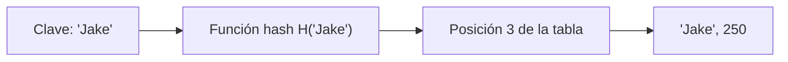
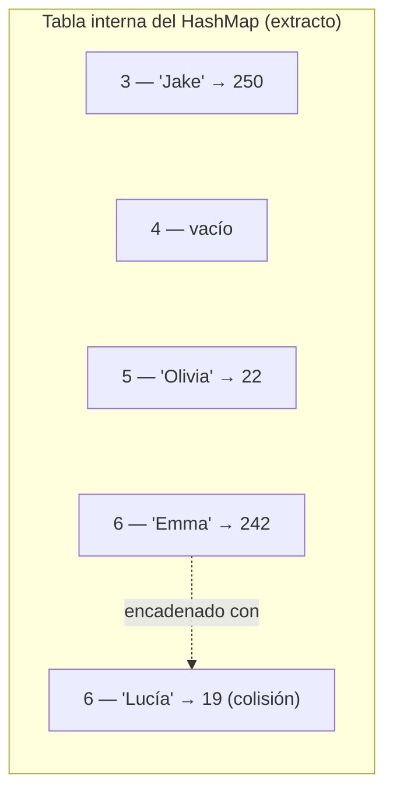
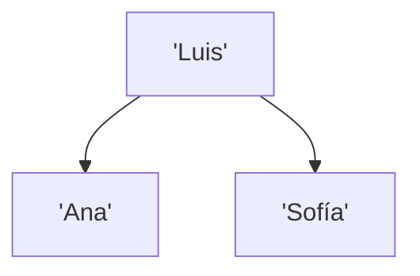
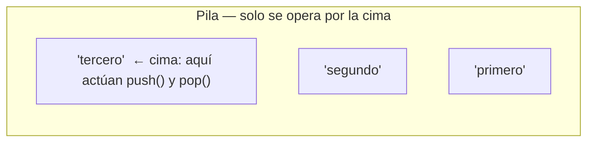
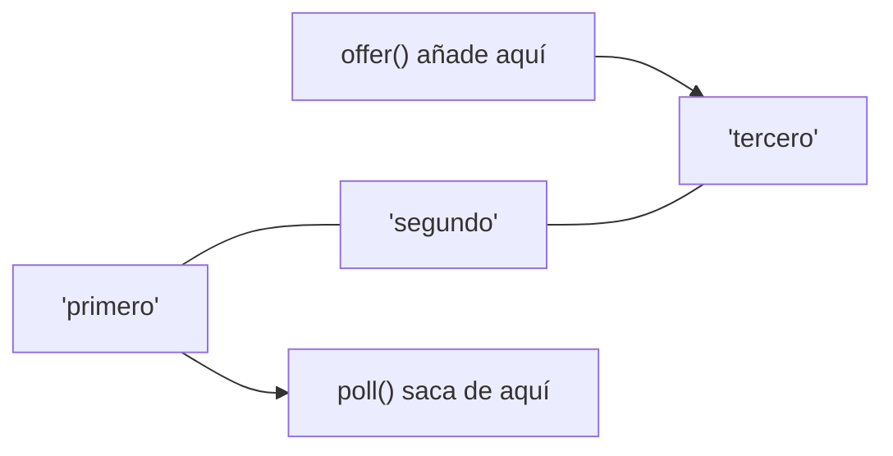
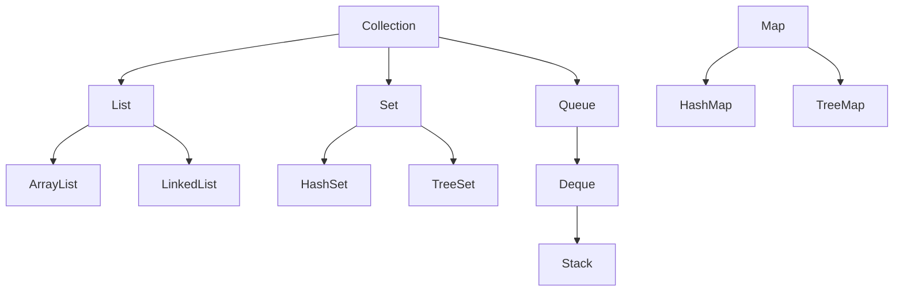

<a id="colecciones"></a>

# 3. Colecciones

{ type=application/pdf style="width:100%;min-height:80vh" }

!!!info "Descarga de diapositivas"
    [Descarga las diapositivas](diapositivas/03-colecciones.pptx){target="_blank" rel="noopener"}

Cuando necesitas guardar un número de elementos que no conoces de antemano —y que puede cambiar mientras el programa se ejecuta— un array clásico se queda corto porque su tamaño es fijo. Para eso están las colecciones: estructuras dinámicas del paquete `java.util` que crecen y encogen a medida que añades o quitas elementos.

---

## 3.1 Tipos de colecciones

Java agrupa las colecciones en tres grandes familias según cómo se accede a sus elementos:

| Familia | Cómo se accede | Ejemplos |
|---|---|---|
| Listas | por posición (índice numérico) | `ArrayList`, `LinkedList` |
| Mapas | por clave (par clave-valor) | `HashMap`, `TreeMap` |
| Otras | por reglas propias de entrada/salida | pilas, colas, conjuntos |

## 3.2 Listas

!!! info "Idea clave"
    Una lista guarda elementos ordenados, cada uno accesible por su posición. La interfaz `List` tiene dos implementaciones principales, y la diferencia entre ellas está en cómo guardan los datos en memoria.

<div class="tabs-colored" markdown>

=== "🔵 ArrayList"
    Basada en un array que crece internamente. Los elementos están contiguos en memoria: uno pegado al siguiente, como las casillas numeradas de una estantería.

    ```mermaid
    flowchart LR
        c0["índice 0\n'Uno'"] --- c1["índice 1\n'Dos'"] --- c2["índice 2\n'Tres'"]
    ```

    - Acceso por índice: rápido, O(1).
    - Insertar o borrar en medio de la lista: lento, O(n), porque hay que desplazar el resto de elementos.

=== "🟢 LinkedList"
    Lista doblemente enlazada: cada elemento (cada *nodo*) no vive pegado a los demás en memoria, sino que guarda dos referencias — a cuál es el nodo anterior y a cuál es el siguiente. Es más como una cadena de personas dadas de la mano: cada una solo conoce a las de al lado.

    ```mermaid
    flowchart LR
        n0["nodo\n'Uno'"] -- siguiente --> n1["nodo\n'Dos'"]
        n1 -- siguiente --> n2["nodo\n'Tres'"]
        n1 -- anterior --> n0
        n2 -- anterior --> n1
    ```

    - Acceso por índice: más lento, O(n), porque hay que recorrer nodo a nodo.
    - Insertar o borrar al principio o al final: rápido, O(1).

</div>

Esa diferencia de rendimiento no es cosa de magia, sale directamente de cómo está organizada la memoria en cada caso. En un `ArrayList`, `get(2)` calcula la dirección de memoria del elemento directamente (la posición de partida más 2 huecos), así que da igual si la lista tiene 3 elementos o 3 millones: siempre es un único cálculo. En una `LinkedList`, en cambio, no hay forma de "saltar" al nodo 2 sin pasar antes por el nodo 0 y el nodo 1, porque cada nodo solo sabe dónde está el siguiente — de ahí el O(n).

Con la inserción pasa lo simétrico. Insertar en medio de un `ArrayList` obliga a desplazar una posición hacia la derecha a todos los elementos que van después, para dejar el hueco libre. Insertar en una `LinkedList` no mueve ningún dato: solo hay que cambiar a qué apuntan dos o tres referencias del nodo anterior y del nuevo nodo, sin tocar el resto de la cadena — por eso es O(1) en los extremos.

!!! tip "Recuerda"
    Si vas a acceder mucho por posición (`get(i)`), usa `ArrayList`. Si vas a insertar y borrar mucho por los extremos, `LinkedList` sale más a cuenta.

Independientemente de la implementación, toda `List` ofrece métodos para añadir al final o en una posición concreta, borrar por posición, consultar el tamaño y acceder a un elemento:

```java
ArrayList<String> textos = new ArrayList<>();

textos.add("Uno");
textos.add("Dos");
textos.add("Tres");
textos.add(2, "Dos y medio"); // se inserta entre "Dos" y "Tres"

textos.remove(1); // elimina "Dos" (posición 1)

for (int i = 0; i < textos.size(); i++) {
    System.out.println(textos.get(i));
}
```

!!! warning "Cuidado"
    Si recorres una lista con `for-each` e intentas borrar un elemento dentro del propio bucle con `remove()`, Java lanza un `ConcurrentModificationException`: no se puede modificar una colección mientras se está iterando sobre ella con `for-each`. Para borrar mientras recorres, usa un `Iterator` y su método `remove()` (o, como verás más adelante en el tema, un stream que filtre lo que no quieres conservar).

## 3.3 Mapas

!!! info "Idea clave"
    Un mapa (`Map`) guarda pares clave-valor y permite acceder a un elemento por su clave en lugar de por un índice. También se les llama tablas hash o diccionarios.

`HashMap` es la implementación más habitual: internamente calcula un valor numérico (el *hash*) a partir de la clave para decidir en qué posición de una tabla interna guarda cada par.



Ese cálculo se repite para cada par que añades, y el resultado es una tabla interna con huecos numerados, cada uno con el par que le ha tocado (o vacío, si ninguna clave ha caído ahí todavía):



Cuando dos claves distintas producen la misma posición (aquí, `'Emma'` y `'Lucía'` han caído las dos en la posición 6: es una **colisión**), la solución más habitual es encadenar en esa posición una lista con los pares que han colisionado, y recorrerla hasta encontrar la clave exacta que buscas.

| | HashMap | TreeMap |
|---|---|---|
| Orden de los elementos | no garantizado | ordenados según la clave |
| Inserción / borrado / acceso | O(1) en promedio | O(log n) |
| Memoria | usa más memoria | usa menos, solo lo almacenado |

`HashMap` y `TreeMap` no se llevan mal solo en velocidad: por dentro organizan las claves de formas completamente distintas. `HashMap` las dispersa por la tabla de posiciones que acabas de ver, según su hash, sin ningún criterio de orden. `TreeMap`, en cambio, las mantiene en un árbol (un árbol rojo-negro) comparando claves entre sí para decidir a qué rama va cada una — por eso, cuando recorres un `TreeMap`, siempre obtienes las claves ordenadas de menor a mayor, sin tener que ordenarlas tú:



!!! tip "Recuerda"
    Este mismo patrón se repite exactamente en los conjuntos, que ves a continuación: `HashSet` dispersa sus elementos por hash igual que `HashMap` (de hecho, es un `HashMap` por dentro), y `TreeSet` mantiene el mismo árbol ordenado que `TreeMap`. La elección entre `Hash*` y `Tree*` es la misma pregunta tanto si usas un mapa como si usas un conjunto: ¿te importa el orden, o prefieres la velocidad?

```java
HashMap<String, Producto> productos = new HashMap<>();

productos.put("111A", new Producto("111A", "Monitor LG 22 pulg", 99.95f));
productos.put("222B", new Producto("222B", "Disco duro 512GB SSD", 109.95f));
productos.put("333C", new Producto("333C", "Ratón bluetooth", 19.35f));

productos.remove("222B");

// keySet() obtiene todas las claves del mapa
for (String codigo : productos.keySet()) {
    System.out.println(productos.get(codigo));
}
```

!!! warning "Cuidado"
    `HashMap` usa `equals()` y `hashCode()` de la clave para calcular en qué posición de la tabla guardar y buscar cada par. Con `String` no tienes que pensar en ello porque ya vienen bien definidos. Pero si usas una clase propia como clave (por ejemplo, un `Producto` entero en vez de su código), tienes que sobrescribir tú `equals()` y `hashCode()` en esa clase — si no, el mapa no va a encontrar el par aunque el objeto que busques "parezca" idéntico al que guardaste.

## 3.4 Otras colecciones

Listas y mapas cubren casi todo lo que vas a necesitar, pero hay tres estructuras más que aparecen constantemente porque imponen una regla estricta sobre el orden de entrada y salida (o sobre la repetición) de los elementos: pilas, colas y conjuntos.

### Pilas (LIFO)

!!! info "Idea clave"
    Una pila sigue la regla **LIFO** (*Last In, First Out*: el último en entrar es el primero en salir), como una pila de platos: solo puedes coger el de arriba, que es justo el que has dejado el último.



En Java, la interfaz recomendada para pilas hoy en día es `Deque` (doble cola), implementada por ejemplo con `ArrayDeque`. La antigua clase `Stack` todavía existe, pero ya no se recomienda su uso.

| Método | Qué hace |
|---|---|
| `push(e)` | añade `e` en la cima |
| `pop()` | quita y devuelve el elemento de la cima |
| `peek()` | consulta el elemento de la cima, sin quitarlo |
| `isEmpty()` | comprueba si la pila está vacía |

```java
Deque<String> pila = new ArrayDeque<>();

pila.push("primero");
pila.push("segundo");
pila.push("tercero");

System.out.println(pila.peek()); // "tercero": mira la cima sin sacarla
System.out.println(pila.pop());  // "tercero": el último en entrar es el primero en salir
System.out.println(pila.pop());  // "segundo"
```

### Colas (FIFO)

!!! info "Idea clave"
    Una cola sigue la regla **FIFO** (*First In, First Out*: el primero en entrar es el primero en salir), como una cola de gente en una tienda: el primero en ponerse en la fila es el primero en ser atendido.



`LinkedList` implementa la interfaz `Queue`, así que puedes usarla directamente como cola sin tener que crear ninguna clase nueva.

| Método | Qué hace |
|---|---|
| `offer(e)` | añade `e` al final de la cola |
| `poll()` | quita y devuelve el primer elemento |
| `peek()` | consulta el primer elemento, sin quitarlo |
| `isEmpty()` | comprueba si la cola está vacía |

```java
Queue<String> cola = new LinkedList<>();

cola.offer("primero");
cola.offer("segundo");
cola.offer("tercero");

System.out.println(cola.peek()); // "primero": mira el primero sin sacarlo
System.out.println(cola.poll()); // "primero": el primero en entrar es el primero en salir
System.out.println(cola.poll()); // "segundo"
```

!!! warning "Cuidado"
    No confundas `push`/`pop` (pila) con `offer`/`poll` (cola): las dos operan sobre un `Deque` o una `Queue`, pero sacan el elemento por un extremo distinto. Fíjate en cuál has llamado, porque el código compila igual de bien saques el elemento correcto o el equivocado.

### Conjuntos

!!! info "Idea clave"
    Un conjunto (`Set`) guarda elementos sin admitir repetidos: si intentas añadir un elemento que ya está (según `equals()`), la segunda llamada a `add()` simplemente no hace nada.

Las tres implementaciones más comunes se diferencian en el orden en que luego recorres los elementos:

| | `HashSet` | `LinkedHashSet` | `TreeSet` |
|---|---|---|---|
| Orden de iteración | no garantizado | orden de inserción | ordenado según el valor |
| Inserción / borrado / acceso | O(1) en promedio | O(1) en promedio | O(log n) |

```java
Set<String> nombres = new HashSet<>();

nombres.add("Ana");
nombres.add("Luis");
nombres.add("Ana"); // ya estaba: no se añade una segunda vez

System.out.println(nombres.size()); // 2, no 3
System.out.println(nombres.contains("Luis")); // true
```

| Método | Qué hace |
|---|---|
| `add(e)` | añade `e`, si no estaba ya |
| `remove(e)` | quita `e`, si estaba |
| `contains(e)` | comprueba si `e` está en el conjunto |
| `size()` | número de elementos |

!!! tip "Recuerda"
    Por dentro, un `HashSet` es literalmente un `HashMap` donde tus elementos son las claves y el valor no se usa para nada (es un relleno interno). Por eso usa la misma tabla con posiciones y el mismo mecanismo de `equals()`/`hashCode()` que ya has visto en los mapas: si `equals()` dice que dos objetos son iguales, el segundo no se llega a añadir.

## 3.5 Java Collection Framework

Todas estas estructuras encajan en una jerarquía de interfaces. Lo importante para no liarse: `List`, `Set` y `Queue` heredan de `Collection`, pero **`Map` va por su cuenta y no extiende de `Collection`**, porque no guarda elementos sueltos, sino pares clave-valor.



!!! warning "Cuidado"
    Es un error común dar por hecho que `Map` es una `Collection` más solo porque vive en el mismo paquete `java.util`. No lo es: no tiene `add()` ni se puede recorrer directamente con un `for-each` sin pasar antes por `keySet()`, `values()` o `entrySet()`.
