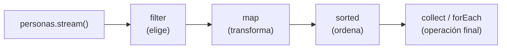

<a id="programacion-funcional"></a>

# 4. Programación funcional

{ type=application/pdf style="width:100%;min-height:80vh" }

!!!info "Descarga de diapositivas"
    [Descarga las diapositivas](diapositivas/04-programacion-funcional.pptx){target="_blank" rel="noopener"}

Hasta ahora has programado sobre todo de forma imperativa: dices paso a paso *cómo* resolver un problema (declara un índice, recorre con un bucle, comprueba una condición...). La programación funcional propone otro enfoque: describir *qué* quieres obtener, y dejar que sea el lenguaje quien decida cómo recorrer los datos.

---

## 4.1 ¿Qué es la programación funcional?

Antes de definirlo formalmente, piensa en esta situación cotidiana: le pides a un compañero que "te avise cuando lleguen los pedidos que superen los 50€". No le explicas paso a paso cómo mirar la lista, comparar cada pedido, etc. Le das una **regla** ("que supere los 50€") y él se encarga de aplicarla. Eso es, en esencia, lo que vas a hacer en este apartado: en vez de escribir tú el bucle que recorre y compara, le vas a dar a Java la regla, y Java se encarga de aplicarla a cada elemento.

!!! info "Idea clave"
    Es un paradigma que se apoya en dos ideas: los datos no cambian de valor una vez creados (inmutabilidad) y las funciones se tratan como datos, de forma que la salida de una se puede encadenar como entrada de la siguiente (composición de funciones).

Esa primera idea, la inmutabilidad, tiene una consecuencia muy concreta que verás una y otra vez en este apartado: cuando filtras o transformas una lista con las herramientas que vas a aprender, la lista original **no se toca**. Se genera un resultado nuevo a partir de ella, y `personas` sigue teniendo exactamente los mismos elementos que antes. Esto evita un error clásico: que una parte del programa modifique una colección mientras otra la está usando sin saberlo (el mismo problema que viste con `ConcurrentModificationException` en el apartado de colecciones).

Hay lenguajes funcionales puros (Lisp, Haskell, Clojure), pero los que más se usan en la práctica son híbridos que han incorporado este estilo sin dejar de ser orientados a objetos: es el caso de Java desde la versión 8, con las lambdas y los streams que vamos a ver en este apartado.

Compara las dos formas de resolver el mismo problema: dada una lista de personas, obtener una sublista solo con las mayores de edad.

<div class="tabs-colored" markdown>

=== "🔵 Imperativo"
    ```java
    List<Persona> adultos = new ArrayList<>();
    for (int i = 0; i < personas.size(); i++) {
        if (personas.get(i).getEdad() >= 18)
            adultos.add(personas.get(i));
    }
    ```

=== "🟢 Funcional"
    ```java
    List<Persona> adultos = personas.stream()
            .filter(p -> p.getEdad() >= 18)
            .toList();
    ```

</div>

La versión funcional es más compacta y encadena operaciones (composición de funciones), a costa de ser algo más propensa a errores si no tienes claro qué hace cada pieza — por eso merece la pena pararse en cada una.

---

## 4.2 Funciones lambda

!!! info "Idea clave"
    Una función lambda (o anónima) es una función sin nombre y sin clase propia, pensada para operaciones simples que se usan una sola vez.

```
(int a, int b) -> a + b
```

Los parámetros van antes de la flecha `->` (normalmente sin indicar el tipo, Java lo deduce solo) y el código de la función va después. Nos ahorra tener que crear una clase entera solo para pasar un trozo de comportamiento como argumento.

Fíjate en las tres piezas por separado, porque las vas a reconocer en todas las lambdas que escribas a partir de ahora:

| Parte | `(int a, int b)` | `->` | `a + b` |
|---|---|---|---|
| Qué es | los parámetros de entrada | separa los parámetros del cuerpo | el cuerpo: lo que la lambda calcula y devuelve |

!!! warning "Cuidado"
    Una lambda, por sí sola, no tiene un tipo fijo — no puedes escribir `(int a, int b) -> a + b` suelta en tu código y ya está. Java necesita saber **qué interfaz funcional** estás implementando (cuántos parámetros tiene su método, de qué tipo, y qué debe devolver) para poder darle sentido a la lambda. Esa información la saca del contexto: por ejemplo, del tipo de la variable a la que se la asignas, o del tipo de parámetro que espera el método al que se la pasas. Por eso una misma lambda nunca aparece "sola": siempre va asignada a algo o pasada como argumento a algo.

!!! example "Ejemplo: ordenar personas por edad"
    Antes de las lambdas, para ordenar una lista con un criterio propio había que implementar la interfaz funcional `Comparator` en una clase aparte:

    ```java
    class ComparadorPersona implements Comparator<Persona> {
        @Override
        public int compare(Persona p1, Persona p2) {
            return p2.getEdad() - p1.getEdad();
        }
    }

    personas.sort(new ComparadorPersona());
    ```

    Con una lambda, lo mismo en una línea, sin crear ninguna clase:

    ```java
    personas.sort((p1, p2) -> p2.getEdad() - p1.getEdad());
    ```

!!! warning "Cuidado"
    No confundas `Comparable` (visto en el apartado de [relaciones entre clases](02-relaciones-clases.md), define el orden natural de una clase con `compareTo`) con `Comparator` (define un criterio de orden externo con `compare`, que es el que se usa aquí). Un `Comparator` te permite ordenar la misma lista de formas distintas según lo necesites, sin tocar la clase `Persona`.

`Comparator` es en realidad el mismo tipo de interfaz funcional que viste en el apartado de [relaciones entre clases](02-relaciones-clases.md) con `Comparable`: una interfaz con un único método abstracto, que es justo lo que hace falta para poder sustituirla por una lambda.

## 4.3 Métodos de referencia

!!! info "Idea clave"
    Un método de referencia es una forma abreviada de escribir una lambda que se limita a llamar a un método que ya existe, usando la sintaxis `Clase::metodo`.

| Tipo | Ejemplo | Equivale a |
|---|---|---|
| Método estático | `String::toUpperCase` | `s -> s.toUpperCase()` |
| Método de instancia | `Persona::getNombre` | `p -> p.getNombre()` |
| Método de un objeto arbitrario | `Integer::sum` | `(a, b) -> a + b` |

```java
List<String> nombres = List.of("ana", "Luis", "MARÍA");

// Método estático: String::toUpperCase en vez de s -> s.toUpperCase()
nombres.stream()
        .map(String::toUpperCase)
        .forEach(System.out::println); // ANA, LUIS, MARÍA

// Método de instancia: Persona::getNombre en vez de p -> p.getNombre()
List<String> soloNombres = personas.stream()
        .map(Persona::getNombre)
        .toList();

// Método de un objeto arbitrario: Integer::sum en vez de (a, b) -> a + b
int total = List.of(10, 20, 30).stream()
        .reduce(0, Integer::sum); // 60
```

Se usan sobre todo dentro de streams, cuando la lambda no hace más que delegar en un método ya existente — como verás en los ejemplos de `map` y `reduce` más abajo.

---

## 4.4 Streams

!!! info "Idea clave"
    Un stream es un envoltorio sobre una colección que permite encadenar operaciones sobre sus datos sin modificar la colección original: cada operación intermedia crea un stream nuevo, y el original queda intacto.

Piensa en un stream como una cadena de montaje: `personas` entra por un extremo, pasa por una serie de estaciones que le van haciendo cosas (una la filtra, otra la transforma, otra la ordena...), y al final sale un resultado. Cada estación solo sabe hacer su trabajo y pasarle el resultado a la siguiente; no le importa qué hay antes ni después:



Las operaciones de un stream se dividen en dos tipos, que corresponden a las estaciones intermedias de la cadena y a la última estación que recoge el resultado:

| Tipo | Qué hace | Ejemplos |
|---|---|---|
| Intermedia | recibe un stream y devuelve otro, para seguir encadenando | `filter`, `map`, `sorted` |
| Final | cierra el stream y devuelve un resultado que ya no es un stream | `collect`, `forEach`, `reduce` |

!!! warning "Cuidado"
    Un stream se consume una sola vez. En cuanto llamas a una operación final (`collect`, `forEach`, `reduce`...) el stream se cierra, y si intentas volver a usar esa misma variable de stream, Java lanza `IllegalStateException: stream has already been operated upon or closed`. Si necesitas recorrer los datos de dos formas distintas, vuelve a llamar a `.stream()` sobre la colección original para crear un stream nuevo.

Vamos a partir del mismo ejemplo en todos los casos: una lista `personas` de tipo `List<Persona>`. Para cada operación verás primero cómo se resolvería de forma imperativa (con bucles) y luego con streams, para que compares las dos formas de pensar el mismo problema.

### filter — filtrar por un criterio

Operación intermedia: se queda solo con los elementos que cumplen la condición indicada, igual que haría un `if` dentro de un bucle, pero sin bucle.

<div class="tabs-colored" markdown>

=== "🔵 Imperativo"
    ```java
    List<Persona> adultos = new ArrayList<>();
    for (Persona p : personas) {
        if (p.getEdad() >= 18) {
            adultos.add(p);
        }
    }
    ```

=== "🟢 Funcional"
    ```java
    Stream<Persona> adultos = personas.stream()
            .filter(p -> p.getEdad() >= 18); // solo las personas "p" con edad >= 18
    ```

</div>

### map — transformar cada elemento

Operación intermedia: aplica una función a cada elemento y devuelve un stream con los resultados, no con las personas originales. Es el equivalente a recorrer la lista y construir una lista nueva con el dato transformado.

<div class="tabs-colored" markdown>

=== "🔵 Imperativo"
    ```java
    List<Integer> edades = new ArrayList<>();
    for (Persona p : personas) {
        if (p.getEdad() >= 18) {
            edades.add(p.getEdad());
        }
    }
    ```

=== "🟢 Funcional"
    ```java
    Stream<Integer> edades = personas.stream()
            .filter(p -> p.getEdad() >= 18)
            .map(Persona::getEdad); // las edades de esas personas, no las personas
    ```

</div>

### sorted — ordenar los elementos

Operación intermedia: ordena el stream según el `Comparator` que le pases, igual que hacía `sort` más arriba.

<div class="tabs-colored" markdown>

=== "🔵 Imperativo"
    ```java
    List<Persona> adultos = new ArrayList<>();
    for (Persona p : personas) {
        if (p.getEdad() >= 18) {
            adultos.add(p);
        }
    }
    Collections.sort(adultos, (p1, p2) -> p2.getEdad() - p1.getEdad());
    ```

=== "🟢 Funcional"
    ```java
    Stream<Persona> personasOrdenadas = personas.stream()
            .filter(p -> p.getEdad() >= 18)
            .sorted((p1, p2) -> p2.getEdad() - p1.getEdad());
    ```

</div>

### collect — obtener una colección o un texto

Operación final: convierte el resultado del stream en una lista, un conjunto o incluso un texto.

```java
List<Integer> edadesAdultos = personas.stream()
        .filter(p -> p.getEdad() >= 18)
        .map(Persona::getEdad)
        .toList(); // atajo equivalente a .collect(Collectors.toList())
```

También sirve para unir los resultados en una cadena de texto, indicando un separador y, si quieres, un prefijo y un sufijo:

```java
String edadesAdultos = personas.stream()
        .filter(p -> p.getEdad() >= 18)
        .map(Persona::getEdad)
        .collect(Collectors.joining(", ", "Adultos: ", ""));
```

### forEach — recorrer el resultado

Operación final: recorre cada elemento del stream resultante para hacer algo con él, como imprimirlo.

```java
personas.stream()
        .filter(p -> p.getEdad() >= 18)
        .map(Persona::getEdad)
        .forEach(System.out::println);
```

### reduce y average — reducir a un solo valor

`reduce` combina todos los elementos en uno solo usando una función de acumulación (por ejemplo, sumándolos uno a uno). Es el equivalente funcional de un acumulador que vas actualizando dentro de un bucle:

<div class="tabs-colored" markdown>

=== "🔵 Imperativo"
    ```java
    List<Integer> edades = Arrays.asList(20, 30, 40);

    int suma = 0;
    for (int edad : edades) {
        suma += edad;
    }
    ```

=== "🟢 Funcional"
    ```java
    List<Integer> edades = Arrays.asList(20, 30, 40);

    int suma = edades.stream()
            .reduce(0, Integer::sum); // 90
    ```

</div>

Ese primer `0` es el **valor inicial del acumulador**: el punto de partida antes de combinar el primer elemento. `reduce` va aplicando la función de acumulación (`Integer::sum`, que aquí equivale a `(acumulado, siguiente) -> acumulado + siguiente`) uno a uno:

```
0 + 20 = 20
20 + 30 = 50
50 + 40 = 90
```

!!! tip "Recuerda"
    El valor inicial tiene que ser el que no cambia el resultado al combinarlo: `0` para sumar (sumar 0 no altera nada), `1` si estuvieras multiplicando. Además, sirve de resultado por defecto si el stream estuviera vacío: `reduce(0, Integer::sum)` sobre una lista vacía devuelve `0` sin más. Por eso existe también una versión de `reduce` sin valor inicial (`edades.stream().reduce(Integer::sum)`), que al no tener ese valor de respaldo devuelve un `Optional<Integer>` en vez de un `int`.

`average` (junto con `mapToInt`, que convierte el stream a uno de `int` para poder hacer operaciones numéricas) calcula la media de un stream numérico:

```java
double mediaEdadAdultos = personas.stream()
        .filter(p -> p.getEdad() >= 18)
        .mapToInt(Persona::getEdad)
        .average()
        .getAsDouble();
```

!!! tip "Recuerda"
    `average()` no devuelve un `double` directamente, sino un `OptionalDouble`: un envoltorio que representa "puede que haya un resultado, o puede que no". Si el stream estuviera vacío (nadie es adulto, por ejemplo) no habría media que calcular, y `getAsDouble()` lanzaría una excepción. `Optional` obliga a pensar en ese caso en lugar de dejar que pase desapercibido, aunque en un repaso rápido como este lo dejemos pasar con `getAsDouble()` directo.

!!! tip "Recuerda"
    No hace falta memorizar todas las operaciones de golpe: con `filter`, `map`, `sorted`, `collect` y `forEach` puedes resolver la inmensa mayoría de los casos que te vas a encontrar. El resto se aprende sobre la marcha, cuando el problema concreto lo pida.

---

## Antes de seguir: cómo encajan todas las piezas

Has visto varios conceptos nuevos seguidos, así que merece la pena pararse un momento a ver cómo se apoyan unos en otros:

- Una **lambda** es una función sin nombre que escribes en el sitio donde antes hacía falta una clase entera.
- Una **interfaz funcional** (`Comparator`, `Predicate`, `Function`, `Consumer`...) es el "molde" que le dice a Java qué forma debe tener esa lambda: cuántos parámetros recibe y qué tiene que devolver.
- Un **método de referencia** (`Persona::getEdad`) es solo un atajo para cuando la lambda no hace más que llamar a un método que ya existe.
- Un **stream** es la cadena de montaje que usa lambdas, interfaces funcionales y métodos de referencia en cada una de sus estaciones (`filter`, `map`, `sorted`...) para procesar una colección de principio a fin, sin que tengas que escribir ni un solo bucle.

Si en algún momento te pierdes con una lambda concreta, vuelve a esta lista: casi siempre el bloqueo está en no tener claro cuál de estas cuatro piezas estás mirando.
