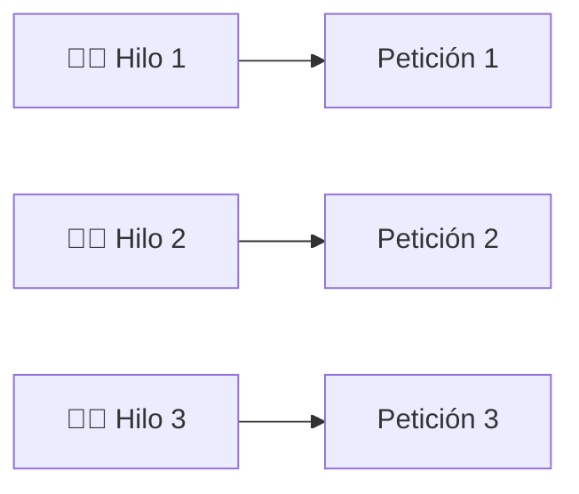
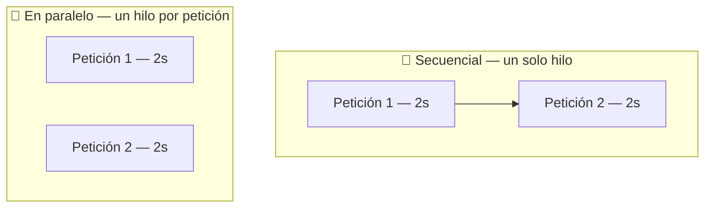
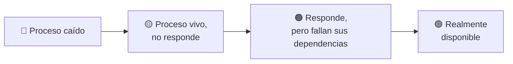

<a id="actuator-disponibilidad"></a>

# 🧩 4. Comunicación simultánea y disponibilidad del servicio

Hasta ahora has comprobado que tu API responde bien a una petición aislada: el código de estado correcto, el JSON esperado, el test que pasa. Hoy cierras el tema con dos preguntas distintas, sobre ese mismo servicio ya en marcha: ¿aguanta varias peticiones a la vez sin que unas tengan que esperar a otras? Y, más allá de una petición concreta, ¿cómo sabes si el servicio en general sigue sano y disponible ahora mismo, sin tener que comprobarlo tú a mano?

---

## 🧵 Comunicación simultánea de varios clientes

Piensa en tu propio GameVault, ya en producción: no lo vas a usar solo tú. Si veinte personas consultan el catálogo a la vez y tu servidor las atendiera de una en una —terminar la primera antes de empezar la segunda—, la última persona esperaría veinte veces más que la primera.

Por suerte, no funciona así: Spring Web, sobre Tomcat, atiende cada petición HTTP en un **hilo** distinto —una línea de ejecución independiente dentro de tu propia aplicación, que avanza en paralelo con las demás— tomado de un ***pool***: un conjunto de hilos ya creados de antemano y listos para usar, en vez de crear uno nuevo por cada petición (verás ambas ideas con detalle en el Tema 3). Es como varios camareros, cada uno con su propia mesa, en vez de un único camarero que no pasa a la siguiente mesa hasta terminar con la anterior:



Vas a comprobarlo tú mismo en la Actividad 1.4: montarás un método del service con un `Thread.sleep(2000)` puesto a propósito, que simula una consulta lenta, y lanzarás dos peticiones **simultáneas** contra su endpoint, así:

```bash
time (curl -s http://localhost:8080/api/v1/libros/top & \
      curl -s http://localhost:8080/api/v1/libros/top & \
      wait)
```

Antes de probarlo tú mismo, compara las dos formas posibles en que tu servidor podría atender esas dos peticiones:



Si las dos peticiones se atendieran una detrás de otra (el bloque "Secuencial"), el conjunto tardaría unos 4 segundos. Si se atienden en paralelo (el bloque "En paralelo"), tardan aproximadamente 2 — porque cada una la procesa un hilo distinto del pool, igual que los dos camareros de la analogía. Puedes confirmarlo añadiendo temporalmente una traza con `Thread.currentThread().getName()` en el método y mirando el log: verás dos nombres de hilo distintos (`http-nio-8080-exec-1`, `http-nio-8080-exec-2`...) para las dos peticiones.

---

## 🩺 Qué es la disponibilidad de un servicio

Todo lo anterior daba por hecho algo que no has cuestionado en ningún momento: que tu servicio está funcionando de verdad. ¿Cómo lo sabes, en realidad?

Imagina que tu GameVault, ya desplegado, se cae un sábado a las tres de la madrugada. Si nadie lo comprueba a mano, nadie se entera hasta que un usuario se queja de que la web no funciona — pueden pasar horas. Este es exactamente el problema que resuelve comprobar la disponibilidad de forma automática, sin esperar a que un humano lo note.

Que un servicio esté **disponible** no es una única cosa binaria — hay distintos niveles de "estar bien", cada uno más exigente que el anterior:

1. **El proceso está arrancado**: la aplicación no se ha caído, sigue viva.
2. **Responde peticiones**: acepta conexiones y contesta algo, lo que sea.
3. **Sus dependencias funcionan**: la base de datos, la cola de mensajería, cualquier servicio del que dependa, están accesibles — un proceso vivo que no puede hablar con su base de datos no está realmente "disponible" para hacer su trabajo.



Un **health check** (comprobación de salud) es una forma automática — pensada para que la ejecute una máquina, sin intervención humana — de responder a estas preguntas cada pocos segundos, sin que nadie tenga que mirar una pantalla. Quien consulta esa información no eres tú, a mano: puede ser un programa que compruebe el servicio cada pocos minutos y avise a alguien en cuanto deje de responder, un sistema de despliegue que reinicie el servicio automáticamente si detecta que ha dejado de estar sano, o el propio **CI**, que puede comprobar que el servicio arranca correctamente antes de darlo por bueno.

---

## 🛠️ Spring Boot Actuator

**Spring Boot Actuator** es la implementación de todo esto para una aplicación Spring Boot: un conjunto de endpoints HTTP listos para usar que exponen información operativa sobre tu aplicación — entre ellos, su salud.

Tu propio proyecto no incluye Actuator todavía (revisa tu `pom.xml`: no está la dependencia) — es la mejora que añades esta semana:

```xml
<dependency>
    <groupId>org.springframework.boot</groupId>
    <artifactId>spring-boot-starter-actuator</artifactId>
</dependency>
```

!!! tip "No vas a verlos en Swagger UI, y es lo esperado"
    Los endpoints de Actuator no aparecen en tu documentación de Swagger UI, aunque ya la tengas configurada desde el apartado anterior. No es un descuido: springdoc solo documenta los `@RestController` de tu propia API, y Actuator expone sus endpoints por un mecanismo completamente distinto, al margen de ese escaneo. Tiene sentido — `/actuator/health` no es un recurso de tu API pensado para los clientes de GameVault, es información operativa para quien vigila que el servicio esté vivo.

Con solo esa dependencia, Spring Boot expone automáticamente `/actuator/health`. Para ver el detalle de cada dependencia (y no solo un `UP`/`DOWN` genérico), hace falta una línea de configuración:

```yaml
management:
  endpoint:
    health:
      show-details: always
```

---

## 🟢 El endpoint `/actuator/health`

Con los detalles activados, `/actuator/health` no solo dice si tu aplicación responde — agrega el estado de **cada dependencia real** que Spring Boot detecta en el classpath. En una aplicación con varias piezas de infraestructura (por ejemplo, tu propio GameVault más adelante, cuando tenga PostgreSQL y MongoDB a la vez), eso se ve así:

```json
{
  "status": "UP",
  "components": {
    "db": { "status": "UP" },
    "mongo": { "status": "UP" }
  }
}
```

Fíjate en la implicación: si el contenedor de MongoDB se cae, `/actuator/health` pasa a `DOWN` con el detalle del componente `mongo` marcado como el culpable — **aunque la aplicación siga respondiendo peticiones sobre PostgreSQL sin ningún problema**. Es exactamente el matiz del punto 3 de más arriba: "responder" y "estar realmente sano" no son lo mismo.

!!! tip "Es un GET más, pensado para máquinas"
    `/actuator/health` no deja de ser una petición HTTP estándar — el mismo protocolo de siempre. La diferencia es quién lo consulta: normalmente no una persona con un navegador, sino un orquestador o un monitor, cada pocos segundos, de forma automática. Eso es exactamente para lo que sirve: verificar la disponibilidad del servicio.

Actuator trae también otros endpoints útiles, como `/actuator/info` (metadatos de la aplicación) o `/actuator/metrics` (métricas de rendimiento) — no vas a profundizar en ellos ahora, pero conviene que sepas que existen.

---

## ✅ Ideas clave

??? tip "Abrir resumen"

    - Cada petición HTTP la atiende un hilo distinto del *pool* de Tomcat — por eso dos peticiones lentas simultáneas no tardan el doble, sino aproximadamente lo mismo que una sola.
    - La **disponibilidad** de un servicio tiene varios niveles: proceso vivo, responde peticiones, dependencias funcionando — no son lo mismo.
    - Un **health check** es una comprobación automática, pensada para que la consulte una máquina (un programa de monitorización, un sistema de despliegue, el propio CI), no una persona.
    - **Spring Boot Actuator** expone `/actuator/health` con la dependencia `spring-boot-starter-actuator`; `management.endpoint.health.show-details: always` muestra el detalle de cada dependencia.
    - `/actuator/health` agrega el estado de cada dependencia real (PostgreSQL, MongoDB...) — si una cae, el estado general pasa a `DOWN` aunque el resto siga funcionando.
    - Los endpoints de Actuator no aparecen en Swagger UI: springdoc solo escanea tus propios `@RestController`, no el mecanismo aparte que usa Actuator.
