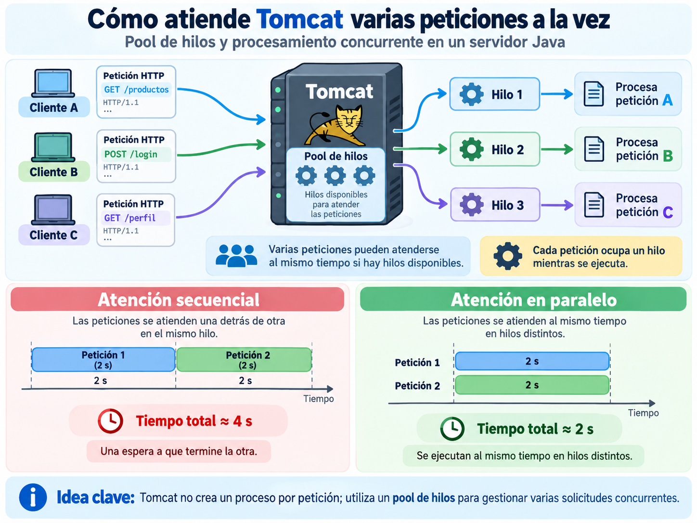
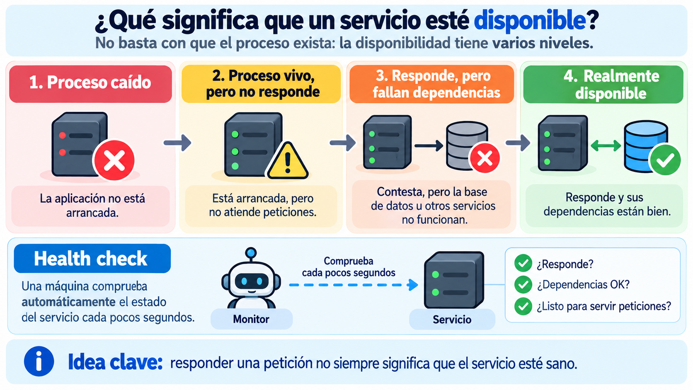
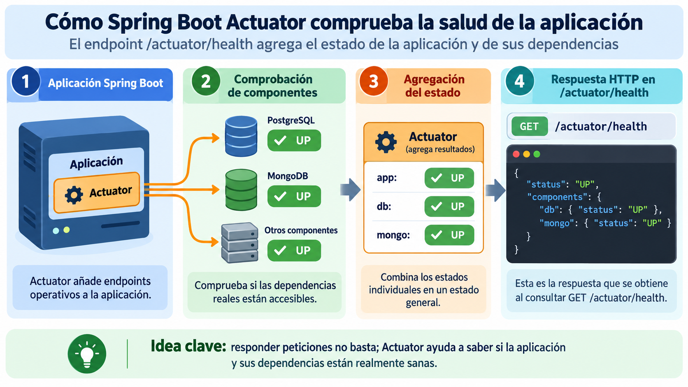
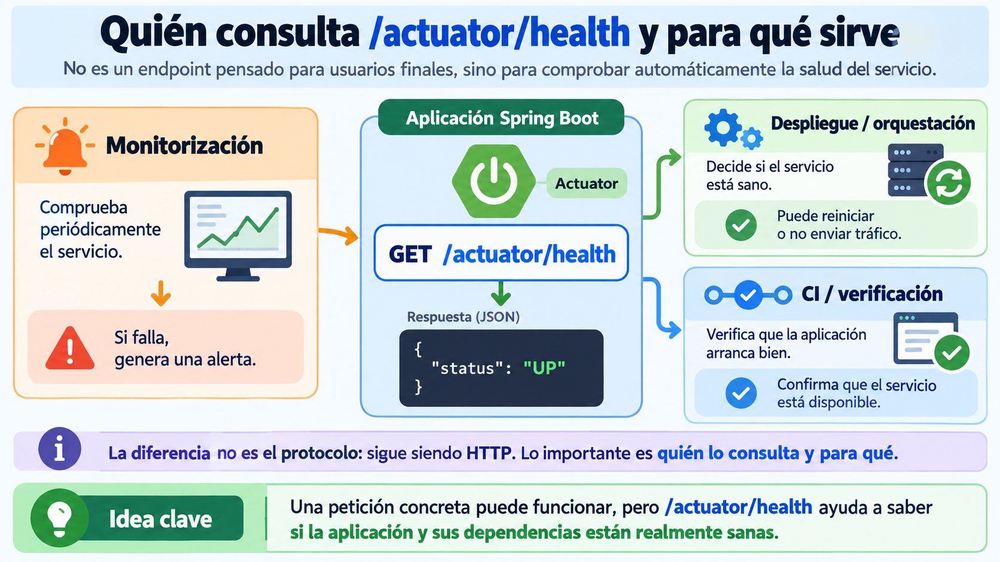
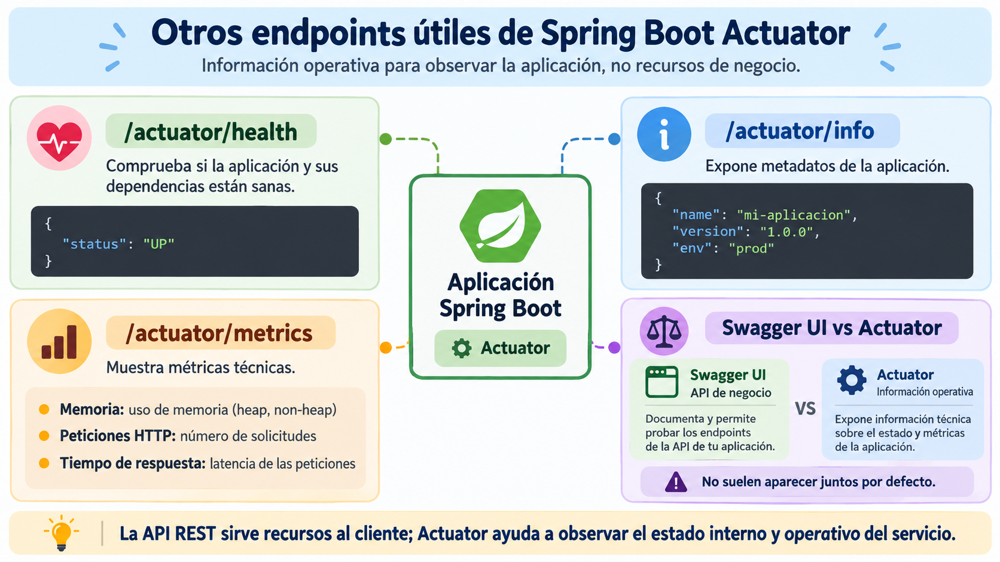

<a id="actuator-disponibilidad"></a>

# 🧩 4. Comunicación simultánea y disponibilidad del servicio

{ type=application/pdf style="width:100%;min-height:80vh" }

!!!info "Descarga de diapositivas"
    [Descarga las diapositivas](diapositivas/actuator-disponibilidad.pptx){target="_blank" rel="noopener"}

---

Hasta ahora has comprobado que tu API responde correctamente a una petición aislada: devuelve el código de estado esperado, genera el JSON previsto y supera sus tests.

Para cerrar el tema vamos a plantear dos preguntas distintas sobre ese mismo servicio cuando ya está en ejecución:

- ¿puede atender **varias peticiones a la vez** sin obligarlas a esperar unas detrás de otras?;
- ¿cómo podemos saber automáticamente si el servicio está **sano y disponible**, más allá de comprobar manualmente un endpoint concreto?

---

## 🧵 Comunicación simultánea de varios clientes

Piensa en GameVault funcionando para varios usuarios. Si veinte personas consultan el catálogo al mismo tiempo y el servidor atendiera las peticiones de una en una, las últimas tendrían que esperar a que terminaran todas las anteriores.

Spring Web, sobre Tomcat, no trabaja así. Tomcat dispone de un **pool de hilos**: un conjunto de hilos preparados para atender peticiones. Cuando llegan varias solicitudes y hay hilos disponibles, distintas peticiones pueden avanzar de forma concurrente.



*Figura 1. Tomcat utiliza un pool de hilos para atender varias peticiones concurrentes sin procesarlas necesariamente de forma secuencial. Elaboración propia.*

En la Actividad 1.4 comprobarás este comportamiento de forma experimental. Introducirás temporalmente un `Thread.sleep(2000)` en un método del service para simular una operación lenta y lanzarás dos peticiones simultáneas:

```bash
time (curl -s http://localhost:8080/api/v1/libros/top & \
      curl -s http://localhost:8080/api/v1/libros/top & \
      wait)
```

Si se ejecutaran una detrás de otra, el tiempo total sería aproximadamente:

```text
petición 1 → 2 s
petición 2 → 2 s

total ≈ 4 s
```

Si ambas se atienden en hilos distintos, el tiempo total debería acercarse a:

```text
petición 1 ─┐
            ├→ aproximadamente 2 s
petición 2 ─┘
```

Puedes comprobar además qué hilo atiende cada petición registrando temporalmente:

```java
Thread.currentThread().getName()
```

En el log aparecerán nombres distintos, por ejemplo:

```text
http-nio-8080-exec-1
http-nio-8080-exec-2
```

!!! info "No significa que haya recursos infinitos"
    El pool dispone de un número limitado de hilos. La idea importante en esta sesión es que Tomcat puede atender **varias peticiones concurrentemente** mientras haya capacidad disponible; estudiarás con más detalle hilos, pools y concurrencia en el Tema 3.

---

## 🩺 Qué significa que un servicio esté disponible

Hasta ahora hemos dado por hecho que el servicio está funcionando. Pero que el proceso exista no garantiza que pueda realizar correctamente su trabajo.

La disponibilidad puede observarse en varios niveles:



*Figura 2. Un proceso puede estar arrancado y responder peticiones sin que todas sus dependencias estén realmente disponibles. Elaboración propia.*

Conviene distinguir al menos estas situaciones:

1. **Proceso caído**: la aplicación ni siquiera está ejecutándose.
2. **Proceso vivo pero sin respuesta útil**: existe, pero no atiende correctamente las peticiones.
3. **Responde pero falla una dependencia**: por ejemplo, la API sigue levantada pero no puede acceder a la base de datos.
4. **Servicio saludable**: la aplicación responde y las dependencias necesarias para realizar su trabajo también están disponibles.

La consecuencia es importante:

> **Responder una petición no siempre significa que el servicio esté sano.**

Un **health check** es una comprobación automática diseñada precisamente para responder a esa pregunta. Normalmente no la ejecuta una persona manualmente, sino otro sistema de forma periódica.

---

## 🛠️ Spring Boot Actuator

**Spring Boot Actuator** proporciona endpoints operativos preparados para observar el estado de una aplicación Spring Boot. Entre ellos se encuentra el endpoint de salud.

Para utilizarlo añade la dependencia:

```xml
<dependency>
    <groupId>org.springframework.boot</groupId>
    <artifactId>spring-boot-starter-actuator</artifactId>
</dependency>
```

Con esta dependencia, Spring Boot expone automáticamente:

```text
/actuator/health
```

!!! tip "Actuator y Swagger UI cumplen funciones distintas"
    Con la configuración actual, springdoc documenta tus propios endpoints REST, pero no añade automáticamente `/actuator/health` a Swagger UI.

    Tiene sentido mantener ambos espacios separados: los endpoints `/api/...` ofrecen **funcionalidad de negocio** a los clientes; `/actuator/...` ofrece **información operativa** sobre la aplicación.

Para ver durante el desarrollo el detalle de los componentes comprobados, añade en `application-dev.yml`:

```yaml
management:
  endpoint:
    health:
      show-details: always
```

!!! warning "Configuración para desarrollo"
    `show-details: always` permite que cualquier cliente con acceso a `/actuator/health` vea información sobre los componentes internos comprobados.

    En local resulta muy útil para diagnosticar si ha fallado PostgreSQL, MongoDB u otra dependencia. En producción, este detalle suele ocultarse o restringirse a usuarios autorizados.

---

## 🟢 Cómo funciona `/actuator/health`

Actuator no se limita a preguntar si el proceso Java sigue ejecutándose. Puede incorporar **health indicators** de componentes y dependencias que Spring Boot detecta en la aplicación.



*Figura 3. Actuator consulta distintos componentes, agrega sus estados y expone el resultado mediante `/actuator/health`. Elaboración propia.*

Con los detalles activados, una aplicación con PostgreSQL y MongoDB podría responder:

```json
{
  "status": "UP",
  "components": {
    "db": { "status": "UP" },
    "mongo": { "status": "UP" }
  }
}
```

Si MongoDB deja de estar disponible, el estado del componente puede pasar a `DOWN` y afectar al estado agregado del servicio.

La aplicación podría incluso seguir respondiendo correctamente a algún endpoint que solo dependa de PostgreSQL. Esa situación demuestra de nuevo que:

```text
responder una petición
≠
estar completamente sano
```

!!! tip "Sigue siendo HTTP"
    `/actuator/health` es simplemente un endpoint HTTP que responde a un `GET`. La diferencia no está en el protocolo, sino en **qué información ofrece y quién suele consultarla**.

---

## 🤖 Quién consulta un health check

Un health check está pensado principalmente para otras máquinas. Diferentes sistemas pueden consultar periódicamente `/actuator/health` y actuar según el resultado.



*Figura 4. Monitorización, sistemas de despliegue y procesos de CI pueden consultar automáticamente el estado del servicio. Elaboración propia.*

Algunos usos habituales son:

- **monitorización**: detectar una caída y generar una alerta;
- **despliegue u orquestación**: decidir si una instancia debe recibir tráfico, reiniciarse o sustituirse;
- **CI/verificación**: comprobar que la aplicación arranca correctamente antes de considerar válido un despliegue.

En todos los casos se aprovecha el mismo principio: una máquina puede consultar el estado del servicio **sin intervención humana**.

---

## 📊 Otros endpoints de Actuator

`/actuator/health` es el endpoint que utilizarás en esta actividad, pero Actuator ofrece más información operativa.



*Figura 5. Algunos endpoints de Actuator permiten consultar salud, metadatos y métricas de la aplicación. Elaboración propia.*

Entre los más habituales:

| Endpoint | Para qué sirve |
|---|---|
| `/actuator/health` | estado de salud de la aplicación y sus componentes |
| `/actuator/info` | metadatos de la aplicación |
| `/actuator/metrics` | métricas técnicas disponibles |

No profundizarás todavía en `info` ni `metrics`; basta con situarlos dentro de una idea más amplia: **Actuator expone información operativa para observar y diagnosticar la aplicación**.

!!! info "API de negocio y API operativa"
    Swagger UI está orientado a explorar y probar los endpoints funcionales de tu API. Actuator expone información técnica sobre la aplicación.

    Ambos utilizan HTTP, pero están dirigidos a necesidades distintas.

---

## ✅ Ideas clave

??? tip "Abrir resumen"

    - Tomcat utiliza un **pool de hilos** y puede atender varias peticiones concurrentemente mientras haya capacidad disponible.
    - Dos operaciones de 2 segundos atendidas en paralelo pueden completar el conjunto en aproximadamente 2 segundos, no necesariamente en 4.
    - Que el proceso esté vivo o incluso responda peticiones no garantiza que el servicio esté **completamente sano**.
    - Un **health check** es una comprobación automática pensada para ser consultada periódicamente por otras máquinas.
    - **Spring Boot Actuator** añade endpoints operativos como `/actuator/health`.
    - `/actuator/health` puede agregar el estado de dependencias reales y señalar cuál está fallando.
    - `management.endpoint.health.show-details: always` resulta útil durante el desarrollo, pero expone información interna que normalmente debe restringirse en producción.
    - Monitorización, CI/CD y sistemas de despliegue u orquestación pueden utilizar el health check para tomar decisiones automáticas.
    - `/actuator/info` y `/actuator/metrics` forman parte del mismo conjunto de herramientas operativas, aunque no se trabajen en profundidad en esta sesión.
