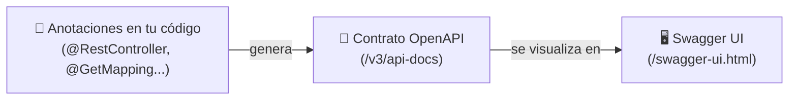

<a id="escritura-y-openapi"></a>

# 🧩 2. Escritura en la API y documentación con OpenAPI

Ya conoces los DTOs de entrada y de salida, las anotaciones de Bean Validation, `@Valid` y `@Transactional` — los has usado para construir un CRUD completo. Aquí no repites nada de eso: ves esos mismos endpoints de escritura completos, con su código real, y añades algo que todavía no tenías — documentación automática de tu API con OpenAPI.

---

## 📖 El `LibroController` completo, leído desde HTTP

Aquí está de nuevo el `LibroController` que ya explicamos, esta vez completo, con los cinco métodos juntos:

```java
@RestController
@RequestMapping("/api/v1/libros")
@RequiredArgsConstructor
public class LibroController {
    private final LibroService libroService;

    @GetMapping
    public ResponseEntity<List<LibroResponseDTO>> getAll() {
        return ResponseEntity.ok(libroService.findAll());
    }

    @GetMapping("/{id}")
    public ResponseEntity<LibroResponseDTO> getById(@PathVariable Long id) {
        return ResponseEntity.ok(libroService.findById(id));
    }

    @PostMapping
    public ResponseEntity<LibroResponseDTO> create(@Valid @RequestBody LibroCreateDTO dto) {
        return ResponseEntity.status(HttpStatus.CREATED).body(libroService.create(dto));
    }

    @PutMapping("/{id}")
    public ResponseEntity<LibroResponseDTO> update(@PathVariable Long id, @Valid @RequestBody LibroCreateDTO dto) {
        return ResponseEntity.ok(libroService.update(id, dto));
    }

    @DeleteMapping("/{id}")
    public ResponseEntity<Void> delete(@PathVariable Long id) {
        libroService.delete(id);
        return ResponseEntity.noContent().build();
    }
}
```

`getAll` y `getById` responden con `200`. Los otros tres, con el mismo criterio — qué código de estado espera cada uno y si repetirlo cambia algo:

| Verbo | Código habitual de éxito | ¿Repetirlo cambia algo? |
|---|---|---|
| `POST` | `201 Created` | Sí — crea un recurso nuevo cada vez |
| `PUT` | `200 OK` | No |
| `DELETE` | `204 No Content` | No |

Y, elemento a elemento, lo que hace cada pieza de esos tres métodos:

| Elemento | Qué representa |
|---|---|
| `ResponseEntity.status(HttpStatus.CREATED).body(...)` | `201`, con el recurso creado en el cuerpo — la respuesta natural de un `POST`. |
| `ResponseEntity.ok(...)` en el `PUT` | `200`, con el recurso ya actualizado en el cuerpo. |
| `ResponseEntity.noContent().build()` | `204`, sin cuerpo — la respuesta natural de un `DELETE`. |
| `@RequestBody LibroCreateDTO dto` | El cuerpo JSON de la petición, convertido automáticamente en un objeto Java. |
| `@Valid` | La misma validación que ya conoces, ahora en el flujo de escritura: si el DTO incumple alguna restricción, la petición nunca llega a ejecutar el método — se profundiza en el Tema 2. |

Fíjate en algo: nada de este código menciona OpenAPI ni Swagger. Eso es justo lo que viene ahora — cómo este mismo controller, sin tocarle una línea, termina documentado y ejecutable desde el navegador.

---

## 📜 El contrato de una API: qué es OpenAPI

Toda esa semántica —qué verbo usar, qué código esperar, si es seguro reintentar— la conoces tú, porque ya la viste en el apartado anterior. Pero cuando el consumidor de tu API es otro programa (o un compañero de equipo que no ha leído tu código), necesita saber lo mismo sin adivinar: qué rutas existen, qué verbo usa cada una, qué reciben y qué devuelven. A esa descripción formal se la llama el **contrato** de la API.

**OpenAPI** es el formato estándar más usado para escribir ese contrato (un documento, normalmente en YAML o JSON, que describe rutas, verbos, parámetros y esquemas de datos). **Swagger UI** es un visor interactivo que lee ese documento y genera, automáticamente, una página web donde se puede explorar la API — y también **ejecutarla de verdad**.



Lo importante: tú no escribes el documento OpenAPI a mano. Una librería lo genera automáticamente, leyendo las mismas anotaciones (`@RestController`, `@GetMapping`, los DTOs...) que ya usas para construir la API — el contrato y el código nunca se desincronizan porque son la misma fuente.

### 🖥️ Así se ve Swagger UI, paso a paso

Esto es exactamente lo que vas a tener delante en tu propia pantalla, sobre tu propio `LibroController` (o el equivalente en tu proyecto):

1. Abres `/swagger-ui.html` en el navegador y ves los controllers de tu API agrupados por *tag* (normalmente, el nombre de la clase), cada uno desplegable.
2. Despliegas, por ejemplo, `POST /api/v1/libros` — Swagger UI te muestra el esquema esperado del cuerpo (los mismos campos de `LibroCreateDTO`, con sus tipos y sus restricciones de Bean Validation) y un ejemplo de JSON ya relleno.
3. Pulsas **Try it out**: ese ejemplo se vuelve editable. Cambias los valores que quieras.
4. Pulsas **Execute**.

!!! info "Swagger UI no es solo documentación: manda peticiones HTTP reales"
    Ese último clic, **Execute**, no es una simulación. Swagger UI construye y envía una petición HTTP de verdad contra tu aplicación, corriendo en `localhost:8080` — la misma petición que mandarías con `curl`, byte a byte. La respuesta que aparece justo debajo (código de estado, cabeceras, cuerpo) es la respuesta real de tu servidor, no una previsualización. Si el `POST` crea un libro, ese libro queda guardado en tu base de datos exactamente igual que si lo hubieras creado con `curl`.

### Documentando con OpenAPI

La documentación se genera con la dependencia `springdoc-openapi-starter-webmvc-ui` y una clase de configuración mínima:

```java
@Configuration
public class OpenApiConfig {

    @Bean
    public OpenAPI libreriaOpenAPI() {
        return new OpenAPI()
                .info(new Info()
                        .title("Librería API")
                        .version("v1")
                        .description("API para gestionar el catálogo de libros, editoriales, reseñas..."));
    }
}
```

Con solo esa dependencia y esa clase, springdoc escanea todos los `@RestController` del proyecto y genera, sin más trabajo por tu parte, la especificación OpenAPI en `/v3/api-docs` y la interfaz visual en `/swagger-ui.html` — los mismos endpoints que el controller ya tenía quedan documentados, y puedes ejecutarlos de verdad desde el navegador con "Try it out", tal como acabas de ver.

---

## 🆚 Ventajas del protocolo estándar, con ejemplos concretos

Para el diagrama de arriba —anotaciones, contrato OpenAPI, Swagger UI— existe una condición: tu API tiene que hablar un protocolo que herramientas de terceros (springdoc, Swagger UI) ya entiendan de fábrica, sin que tú les enseñes nada. Ya viste en el apartado anterior que un protocolo estándar permite eso: que cualquier cliente hable con tu API sin acordar nada a medida. Aquí tienes dos consecuencias prácticas, ahora que ya has visto OpenAPI en marcha:

- Los **códigos de estado son universales**: cualquier cliente (el tuyo, el de un compañero, una app de otro lenguaje) sabe qué significa un `201` o un `404` sin necesidad de leer tu documentación particular — es parte del estándar HTTP, no una convención tuya.
- Las **herramientas funcionan sin configuración específica**: Swagger UI, `curl`... todas saben "hablar HTTP" de fábrica. No has tenido que instalar ni configurar nada especial en Swagger UI para que entienda las respuestas de tu API — el protocolo ya es compartido.

---

## ✅ Ideas clave

??? tip "Abrir resumen"

    - El **contrato** de una API describe formalmente sus rutas, verbos y datos; **OpenAPI** es el formato estándar de ese contrato, generado automáticamente a partir de las anotaciones del código (no se escribe a mano).
    - **Swagger UI** agrupa tus endpoints por controller; al desplegar uno ves su esquema, y con "Try it out" + "Execute" mandas una petición HTTP real contra tu aplicación, sin escribir código — la misma petición que mandarías con `curl`.
    - `@RequestBody` mapea el cuerpo JSON a un objeto Java; `@Valid` activa su validación.
    - Que Swagger UI y `curl` puedan hablar los dos con la misma API sin adaptar nada en el servidor es la demostración práctica de qué aporta un protocolo estándar.
