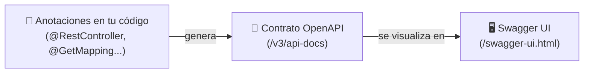

<a id="escritura-y-openapi"></a>

# 🧩 2. Escritura en la API y documentación con OpenAPI

Esta misma semana, en Acceso a Datos, estás construyendo un CRUD completo — controller, service y DTOs de escritura incluidos. Aquí no repites esa construcción: ves la **vertiente HTTP** de ese tipo de endpoints (qué código de estado espera cada verbo, qué significa que una operación sea idempotente) y añades algo que la semana pasada no tenías — documentación automática de tu API con OpenAPI.

---

## ✍️ La semántica completa de los verbos de escritura

La semana pasada viste `GET`. Los otros tres verbos, con el código de estado que "les corresponde" quinientos por defecto:

| Verbo | Qué hace | Código habitual de éxito |
|---|---|---|
| `POST` | Crea un recurso nuevo | `201 Created` |
| `PUT` | Reemplaza un recurso existente | `200 OK` |
| `DELETE` | Elimina un recurso | `204 No Content` |

`204 No Content` significa "todo ha ido bien, y no hay nada que devolverte en el cuerpo" — tiene sentido en un `DELETE`: una vez borrado el recurso, no hay nada que enseñar.

---

## 🔁 Qué es la idempotencia

Una operación es **idempotente** si repetirla varias veces produce el mismo resultado que hacerla una sola vez. Es una propiedad HTTP importante porque, en una red real, las peticiones pueden perderse o duplicarse (un reintento automático, una doble pulsación) — y conviene saber qué pasa si eso ocurre.

- **`PUT` es idempotente**: si mandas diez veces el mismo `PUT` con el mismo cuerpo, el recurso queda igual que si lo hubieras mandado una sola vez — cada vez "reemplaza" con los mismos datos.
- **`DELETE` es idempotente**: borrar algo que ya está borrado no cambia nada más (aunque el código de estado de la segunda vez pueda ser un `404` en vez de un `204`, el *estado del sistema* es el mismo).
- **`POST` NO es idempotente**: si mandas diez veces el mismo `POST` de "crear un libro", obtienes diez libros distintos — cada llamada crea uno nuevo.

!!! example "Por qué importa en la práctica"
    Si el formulario de "añadir libro" de una aplicación web falla al enviar y el usuario pulsa "Reintentar", con un `POST` corres el riesgo de crear el recurso duplicado. Con un `PUT` (por ejemplo, "guardar cambios de este libro concreto"), reintentar no tiene ese riesgo: el resultado final es el mismo se mande una vez o cinco.

---

## 📜 El contrato de una API: qué es OpenAPI

Cuando el consumidor de tu API es otro programa (o un compañero de equipo que no ha leído tu código), necesita saber, sin adivinar: qué rutas existen, qué verbo usa cada una, qué reciben y qué devuelven. A esa descripción formal se la llama el **contrato** de la API.

**OpenAPI** es el formato estándar más usado para escribir ese contrato (un documento, normalmente en YAML o JSON, que describe rutas, verbos, parámetros y esquemas de datos). **Swagger UI** es un visor interactivo que lee ese documento y genera, automáticamente, una página web donde se puede explorar y **probar** la API sin escribir una sola línea de código — ni siquiera un `curl`.



Lo importante: tú no escribes el documento OpenAPI a mano. Una librería lo genera automáticamente, leyendo las mismas anotaciones (`@RestController`, `@GetMapping`, los DTOs...) que ya usas para construir la API — el contrato y el código nunca se desincronizan porque son la misma fuente.

---

## 📖 Los endpoints de escritura, leídos desde HTTP

Con esa base, lee ahora los métodos de escritura del `LibroController` del apartado anterior desde la óptica HTTP:

```java
@PostMapping
public ResponseEntity<LibroResponseDTO> create(@Valid @RequestBody LibroCreateDTO dto) {
    return ResponseEntity.status(HttpStatus.CREATED).body(libroService.create(dto));
}

@PutMapping("/{id}")
public ResponseEntity<LibroResponseDTO> update(@PathVariable Long id, @Valid @RequestBody LibroCreateDTO dto) {
    return ResponseEntity.ok(libroService.update(id, dto));
}

@DeleteMapping("/{id}")
public ResponseEntity<Void> delete(@PathVariable Long id) {
    libroService.delete(id);
    return ResponseEntity.noContent().build();
}
```

| Elemento | Qué representa |
|---|---|
| `ResponseEntity.status(HttpStatus.CREATED).body(...)` | `201`, con el recurso creado en el cuerpo — la respuesta natural de un `POST`. |
| `ResponseEntity.ok(...)` en el `PUT` | `200`, con el recurso ya actualizado en el cuerpo. |
| `ResponseEntity.noContent().build()` | `204`, sin cuerpo — la respuesta natural de un `DELETE`. |
| `@RequestBody LibroCreateDTO dto` | El cuerpo JSON de la petición, convertido automáticamente en un objeto Java. |
| `@Valid` | Activa la validación del DTO antes de que el método se ejecute — se profundiza en el Tema 2. |

### Documentando con OpenAPI

La documentación se genera con la dependencia `springdoc-openapi-starter-webmvc-ui` y una clase de configuración mínima:

```java
@Configuration
public class OpenApiConfig {

    @Bean
    public OpenAPI libreriaOpenAPI() {
        return new OpenAPI()
                .info(new Info()
                        .title("Librería API")
                        .version("v1")
                        .description("API para gestionar el catálogo de libros, editoriales, reseñas..."));
    }
}
```

Con solo esa dependencia y esa clase, springdoc escanea todos los `@RestController` del proyecto y genera, sin más trabajo por tu parte, la especificación OpenAPI en `/v3/api-docs` y la interfaz visual en `/swagger-ui.html` — los mismos endpoints que el controller ya tenía quedan documentados y son "probables" desde el navegador.

---

## 🆚 Ventajas del protocolo estándar, con ejemplos concretos

Ya viste la semana pasada que un protocolo estándar permite que cualquier cliente hable con tu API sin acordar nada a medida. Aquí tienes dos consecuencias prácticas de esa idea:

- Los **códigos de estado son universales**: cualquier cliente (el tuyo, el de un compañero, una app de otro lenguaje) sabe qué significa un `201` o un `404` sin necesidad de leer tu documentación particular — es parte del estándar HTTP, no una convención tuya.
- Las **herramientas funcionan sin configuración específica**: Postman, Swagger UI, `curl`... todas saben "hablar HTTP" de fábrica. No has tenido que instalar ni configurar nada especial en Swagger UI para que entienda las respuestas de tu API — el protocolo ya es compartido.

---

## ✅ Ideas clave

??? tip "Abrir resumen"

    - `POST` → `201 Created`; `PUT` → `200 OK`; `DELETE` → `204 No Content` son las combinaciones habituales verbo/código para operaciones de escritura.
    - Una operación es **idempotente** si repetirla no cambia el resultado respecto a hacerla una vez: `PUT` y `DELETE` lo son, `POST` no.
    - El **contrato** de una API describe formalmente sus rutas, verbos y datos; **OpenAPI** es el formato estándar de ese contrato, generado automáticamente a partir de las anotaciones del código (no se escribe a mano).
    - **Swagger UI** visualiza ese contrato y permite probar la API desde el navegador, sin escribir código.
    - `@RequestBody` mapea el cuerpo JSON a un objeto Java; `@Valid` activa su validación.
    - Que Swagger UI, `curl` y Postman puedan hablar todos con la misma API sin adaptar nada en el servidor es la demostración práctica de qué aporta un protocolo estándar.
