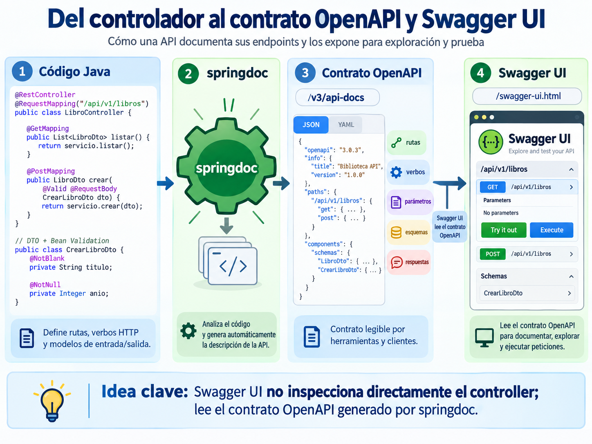
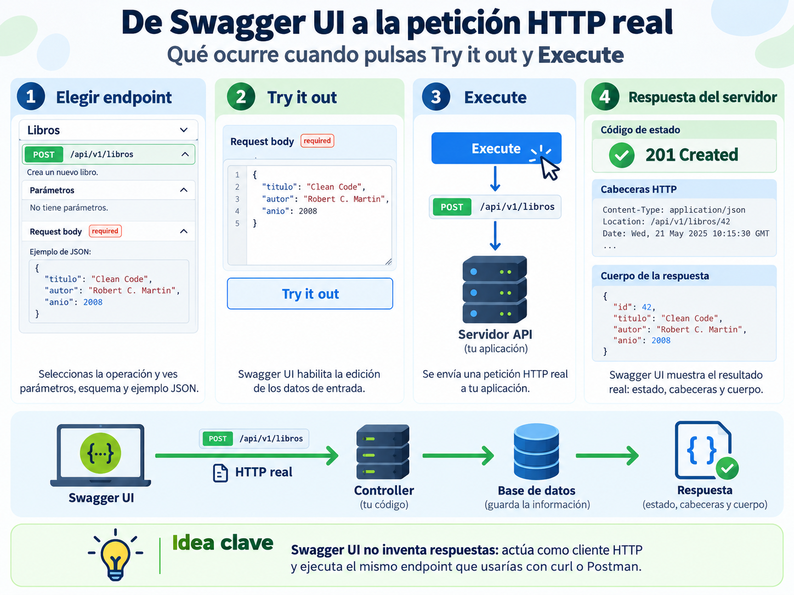
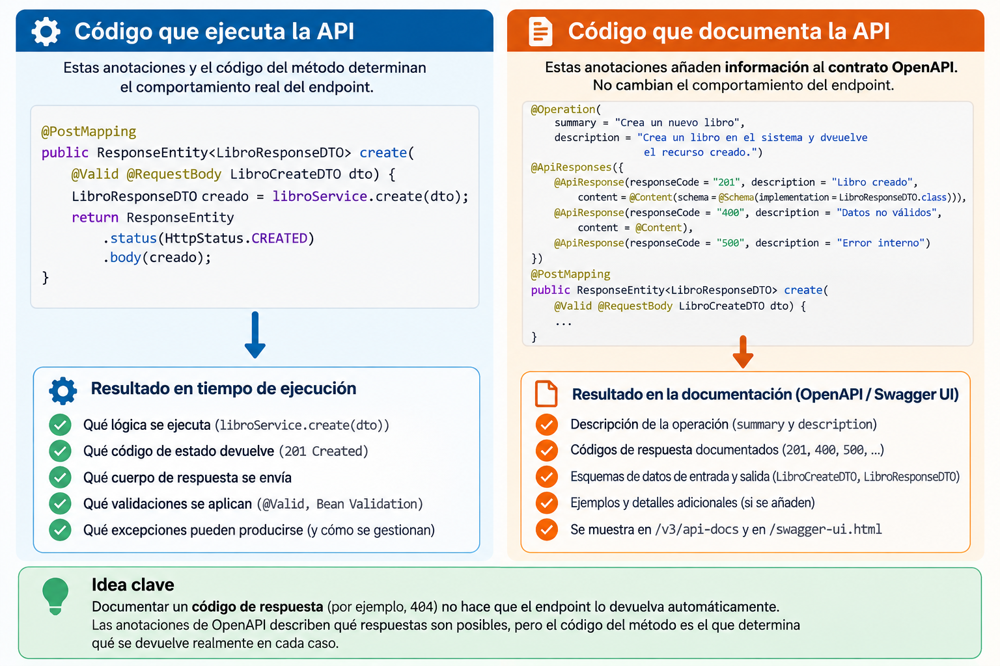
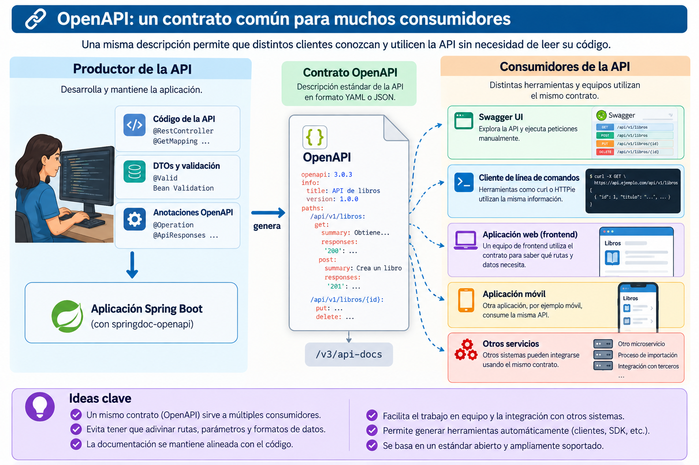

<a id="escritura-y-openapi"></a>

# 🧩 2. Escritura en la API y documentación con OpenAPI

{ type=application/pdf style="width:100%;min-height:80vh" }

!!!info "Descarga de diapositivas"
    [Descarga las diapositivas](diapositivas/escritura-y-openapi.pptx){target="_blank" rel="noopener"}

---

Ya conoces los DTOs de entrada y de salida, las anotaciones de Bean Validation, `@Valid` y `@Transactional`: los has usado para construir un CRUD completo. Aquí no repites nada de eso. Vas a leer esos mismos endpoints de escritura completos, con su código real, y añadirás algo que todavía no tenías: **documentación automática de la API mediante OpenAPI**.

---

## 📖 El `LibroController` completo, leído desde HTTP

Aquí está de nuevo el `LibroController` que ya explicamos, esta vez completo, con los cinco métodos juntos:

```java
@RestController
@RequestMapping("/api/v1/libros")
@RequiredArgsConstructor
public class LibroController {
    private final LibroService libroService;

    @GetMapping
    public ResponseEntity<List<LibroResponseDTO>> getAll() {
        return ResponseEntity.ok(libroService.findAll());
    }

    @GetMapping("/{id}")
    public ResponseEntity<LibroResponseDTO> getById(@PathVariable Long id) {
        return ResponseEntity.ok(libroService.findById(id));
    }

    @PostMapping
    public ResponseEntity<LibroResponseDTO> create(
            @Valid @RequestBody LibroCreateDTO dto) {
        return ResponseEntity
                .status(HttpStatus.CREATED)
                .body(libroService.create(dto));
    }

    @PutMapping("/{id}")
    public ResponseEntity<LibroResponseDTO> update(
            @PathVariable Long id,
            @Valid @RequestBody LibroCreateDTO dto) {
        return ResponseEntity.ok(libroService.update(id, dto));
    }

    @DeleteMapping("/{id}")
    public ResponseEntity<Void> delete(@PathVariable Long id) {
        libroService.delete(id);
        return ResponseEntity.noContent().build();
    }
}
```

`getAll` y `getById` responden con `200 OK`. Los tres endpoints de escritura utilizan un código distinto según el resultado que producen:

| Verbo | Código habitual de éxito | Qué indica |
|---|---|---|
| `POST` | `201 Created` | Se ha creado un recurso nuevo. |
| `PUT` | `200 OK` | El recurso se ha reemplazado correctamente y se devuelve su estado actualizado. |
| `DELETE` | `204 No Content` | El recurso se ha eliminado y no hay ningún cuerpo que devolver. |

!!! tip "Qué debes reconocer"
    - `@RequestBody` convierte el JSON recibido en un objeto Java.
    - `@Valid` valida el DTO antes de ejecutar el método.
    - `ResponseEntity` permite decidir explícitamente el código de estado y el cuerpo de la respuesta.

Nada de este código menciona todavía OpenAPI ni Swagger. Eso es precisamente lo que viene ahora: cómo el mismo controller puede terminar documentado y ejecutable desde el navegador sin duplicar manualmente toda su estructura.

---

## 📜 El contrato de una API: qué es OpenAPI

Cuando quien consume tu API es otro programa —o un compañero que no ha leído tu código— necesita conocer qué rutas existen, qué verbo usa cada una, qué reciben y qué devuelven. A esa descripción formal se la llama el **contrato** de la API.

**OpenAPI** es el formato estándar más usado para expresar ese contrato. Describe rutas, verbos, parámetros, cuerpos, códigos de respuesta y esquemas de datos. En nuestro proyecto, **springdoc** puede generar automáticamente gran parte de esa información a partir de los controllers, DTOs y anotaciones que ya utilizas.



*Figura 1. Del código Java al contrato OpenAPI y su representación mediante Swagger UI. Elaboración propia.*

La idea importante es que **Swagger UI no inspecciona directamente tu controller**. Lee el documento OpenAPI generado por springdoc en `/v3/api-docs` y lo representa como una interfaz navegable.

Así, las rutas, los verbos y los esquemas básicos permanecen vinculados al código. Si añades un endpoint o cambia un DTO, springdoc puede reflejar automáticamente gran parte de ese cambio en el contrato. Otros detalles, como una descripción legible o todos los códigos de respuesta posibles, necesitan información adicional que añadiremos mediante anotaciones específicas de OpenAPI.

### Así se ve Swagger UI, paso a paso

Swagger UI no sirve únicamente para leer documentación. También actúa como un **cliente HTTP real**.



*Figura 2. Swagger UI actúa como cliente HTTP y ejecuta peticiones reales contra la aplicación. Elaboración propia.*

El proceso es sencillo: seleccionas un endpoint, pulsas **Try it out**, modificas los datos si es necesario y finalmente pulsas **Execute**. Swagger UI construye entonces una petición HTTP y la envía al mismo endpoint que utilizarían `curl`, Postman, una aplicación web o cualquier otro cliente.

!!! warning "No es una simulación"
    Si ejecutas un `POST`, `PUT` o `DELETE` desde Swagger UI, estás modificando realmente el estado de la aplicación y, cuando corresponda, de su base de datos.

### Configuración de OpenAPI y rutas de documentación

La documentación se genera con la dependencia `springdoc-openapi-starter-webmvc-ui` y una clase de configuración mínima:

```java
@Configuration
public class OpenApiConfig {

    @Bean
    public OpenAPI libreriaOpenAPI() {
        return new OpenAPI()
                .info(new Info()
                        .title("Librería API")
                        .version("v1")
                        .description(
                                "API para gestionar el catálogo de libros, "
                                + "editoriales, reseñas..."));
    }
}
```

Con la dependencia y esta configuración, springdoc examina los `@RestController` del proyecto y genera:

```text
/v3/api-docs
```

como **contrato OpenAPI** en formato JSON, y:

```text
/swagger-ui.html
```

como punto de entrada a la interfaz visual.

`/v3/api-docs` contiene la especificación. Swagger UI **lee esa especificación** y la presenta de forma navegable; no mantiene una descripción independiente de la API. Por eso ambas piezas están relacionadas: si Swagger UI no puede acceder al contrato, la interfaz no tendrá endpoints que mostrar.

!!! tip "Cambiar la ruta de Swagger UI"
    En `application-dev.yml` puedes mover el punto de entrada:

    ```yaml
    springdoc:
      swagger-ui:
        path: /documentacion
    ```

    Con esto, `/documentacion` lleva a Swagger UI, aunque el navegador termina redirigido a `/swagger-ui/index.html`, que es donde vive realmente la interfaz.

    Si más adelante proteges la aplicación con Spring Security, tendrás que permitir las rutas necesarias para servir la documentación y el contrato, no únicamente `/documentacion`.

!!! warning "`operations-sorter: method` no hace lo que parece"
    Esta propiedad ordena **alfabéticamente por el nombre del verbo**, no con un orden CRUD conceptual. El resultado es `DELETE, GET, PATCH, POST, PUT`.

---

## 📝 Documentar qué puede devolver cada endpoint

Springdoc puede deducir automáticamente mucha información, pero no puede conocer por sí solo toda la **semántica** de cada operación. Para añadir un resumen legible y documentar los códigos de respuesta posibles podemos usar `@Operation` y `@ApiResponses`.

Por ejemplo:

```java
@Operation(summary = "Crear un libro nuevo")
@ApiResponses({
        @ApiResponse(
                responseCode = "201",
                description = "Libro creado correctamente"),
        @ApiResponse(
                responseCode = "400",
                description = "El cuerpo de la petición no supera las validaciones"),
        @ApiResponse(
                responseCode = "404",
                description = "La editorial indicada no existe")
})
@PostMapping
public ResponseEntity<LibroResponseDTO> create(
        @Valid @RequestBody LibroCreateDTO dto) {
    return ResponseEntity
            .status(HttpStatus.CREATED)
            .body(libroService.create(dto));
}
```

`@Operation(summary = ...)` aporta una descripción legible de la operación. `@ApiResponses` agrupa varios `@ApiResponse`, cada uno con un código y una explicación de cuándo puede producirse.

Estas anotaciones **enriquecen el contrato**, pero no sustituyen al código que realmente ejecuta la aplicación:



*Figura 3. Diferencia entre el código que determina el comportamiento real del endpoint y las anotaciones que describen ese comportamiento en OpenAPI. Elaboración propia.*

!!! warning "Documentar no cambia el comportamiento"
    Declarar un `404` mediante `@ApiResponse` **no hace que el endpoint devuelva un `404`**. La anotación documenta esa posibilidad; el código de la aplicación sigue siendo el responsable de producir realmente esa respuesta.

El mismo criterio se aplica al resto del controller: `getById` puede documentar `200`/`404`, `getAll` un `200`, `update` `200`/`400`/`404` y `delete` `204`/`404`.

---

## 🔗 OpenAPI como contrato compartido

Una API no suele tener un único consumidor. El mismo servicio puede ser utilizado desde Swagger UI, una herramienta de línea de comandos, una aplicación web, una aplicación móvil u otros servicios.



*Figura 4. Un mismo contrato OpenAPI puede ser utilizado por herramientas y clientes diferentes. Elaboración propia.*

El valor de utilizar un contrato estándar es precisamente ese: los consumidores no necesitan leer el código Java para descubrir cómo utilizar la API. Comparten una descripción formal que puede ser interpretada tanto por personas como por herramientas.

Esto enlaza con una idea del apartado anterior: los **códigos de estado HTTP son universales** y las herramientas como Swagger UI o `curl` pueden comunicarse con la API sin que tengas que inventar un protocolo o un cliente específico para cada caso.

---

## ✅ Ideas clave

??? tip "Abrir resumen"

    - El **contrato** de una API describe sus rutas, verbos, parámetros, cuerpos, respuestas y esquemas de datos; **OpenAPI** es un estándar para representarlo.
    - **Springdoc** genera automáticamente gran parte del contrato a partir de los controllers, DTOs y anotaciones ya existentes.
    - **Swagger UI** lee `/v3/api-docs`; no inspecciona directamente el código Java.
    - **Try it out** y **Execute** envían peticiones HTTP reales contra la aplicación.
    - `@RequestBody` mapea el cuerpo JSON a un objeto Java y `@Valid` activa su validación.
    - `@Operation` y `@ApiResponses` enriquecen la documentación, pero **no cambian el comportamiento real** del endpoint.
    - Un mismo contrato OpenAPI puede ser utilizado por personas, herramientas y aplicaciones diferentes.
