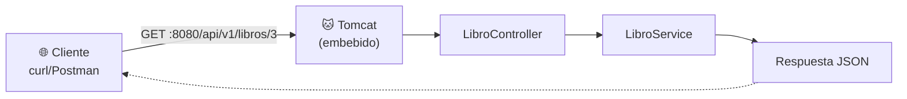

<a id="protocolos-y-rest"></a>

# 🧩 1. Protocolos estándar y servicios REST: leyendo el controlador

Llegas a este módulo sabiendo Java, Git/Docker y bases de datos — pero nada de cómo dos programas hablan entre sí por red. En Acceso a Datos (AD) trabajas la persistencia — del service hacia abajo; aquí miras la aplicación desde el otro extremo: cómo llega una petición desde fuera hasta que tu código se ejecuta. Esta semana no vas a escribir código nuevo — vas a aprender a **leer** un controlador REST, con un ejemplo del mismo tipo que construirás tú mismo la semana que viene.

---

## 🌐 Cómo funciona la web en una petición

Cuando escribes una URL en el navegador o llamas a una API desde tu código, pasan siempre los mismos dos papeles: un **cliente** (quien pide) y un **servidor** (quien responde). El cliente puede ser un navegador, una app móvil, otro servidor, o simplemente `curl` desde tu terminal — lo único que importa es que inicia la conversación.

Toda esa conversación viaja hacia una dirección concreta: una **URL**. Diseccionada pieza a pieza:

```
http://localhost:8080/api/v1/libros/3
└─┬──┘ └────┬───────┘└──────┬──────────┘
protocolo  host:puerto      ruta
```

- **Protocolo** (`http`): las reglas de comunicación que van a usar los dos.
- **Host y puerto** (`localhost:8080`): dónde está el servidor y por qué puerta escucha.
- **Ruta** (`/api/v1/libros/3`): qué recurso concreto se pide dentro de ese servidor.

---

## 📨 Qué es HTTP

**HTTP** (*HyperText Transfer Protocol*) es el protocolo de petición-respuesta que usa la web: el cliente manda una petición con un formato fijo, el servidor responde con una respuesta con otro formato fijo, y ahí termina esa conversación (la siguiente petición empieza de cero). Por debajo del navegador o de Postman, una petición HTTP real es texto plano con esta forma:

```http
GET /api/v1/libros/3 HTTP/1.1
Host: localhost:8080
Accept: application/json
```

Y la respuesta, también texto plano:

```http
HTTP/1.1 200 OK
Content-Type: application/json

{"id": 3, "titulo": "El nombre del viento", "precio": 19.95}
```

| Parte | En la petición | En la respuesta |
|---|---|---|
| Primera línea | Método + ruta + versión | Versión + código de estado |
| Cabeceras (*headers*) | Metadatos: qué formato aceptas, quién eres... | Metadatos: qué formato devuelve, tamaño... |
| Cuerpo (*body*) | Datos que envías (puede no haberlo) | Datos que devuelve (puede no haberlo) |

---

## 🔤 Verbos y códigos de estado

Cada petición HTTP declara un **verbo** (o método) que expresa la intención de la operación:

| Verbo | Qué expresa |
|---|---|
| `GET` | Leer un recurso, sin modificarlo. |
| `POST` | Crear un recurso nuevo. |
| `PUT` | Reemplazar un recurso existente. |
| `DELETE` | Eliminar un recurso. |

El servidor responde siempre con un **código de estado** de tres cifras que resume qué ha pasado, agrupado por familias:

| Familia | Significa | Ejemplos que vas a usar todo el curso |
|---|---|---|
| `2xx` | Todo ha ido bien | `200 OK`, `201 Created`, `204 No Content` |
| `4xx` | Error del cliente | `400 Bad Request`, `401/403`, `404 Not Found` |
| `5xx` | Error del servidor | — |

!!! tip "No hace falta memorizar todos los códigos"
    Con estos 5-6 tienes cubierto casi todo lo que verás en el curso: `200` (petición de lectura correcta), `201` (se ha creado algo), `204` (correcto, pero no hay nada que devolver — típico en un `DELETE`), `400` (la petición está mal formada), `401`/`403` (no autenticado / autenticado pero sin permiso — se ve en detalle en el Tema 2), `404` (el recurso no existe).

---

## 📦 JSON como formato del cuerpo

Ya has visto JSON antes, aunque sea de pasada — es el formato en el que casi todas las APIs modernas envían y reciben datos dentro del cuerpo de la petición/respuesta: pares clave-valor, anidables, sin tipos estrictos declarados:

```json
{
  "titulo": "El nombre del viento",
  "precio": 19.95,
  "editorial": {
    "nombre": "Plaza & Janés"
  }
}
```

Volverás a JSON con más detalle cuando lo necesites de verdad (al construir cuerpos de petición en la Actividad 1.1 y, en Acceso a Datos, al persistir estructuras JSON completas en el Tema 3) — de momento basta con reconocer la forma.

---

## 🧩 Qué es una API y qué es REST

Una **API** (*Application Programming Interface*) es el conjunto de operaciones que una aplicación expone para que otros programas la usen, sin que necesiten conocer cómo está construida por dentro. **REST** es un estilo concreto de diseñar APIs sobre HTTP: los datos se modelan como **recursos**, cada recurso tiene una **URL** propia, y las operaciones sobre ese recurso se expresan con los verbos HTTP que ya has visto.

!!! example "Una API de librería, como ejemplo de patrón"
    | Operación | Verbo + ruta |
    |---|---|
    | Listar todos los libros | `GET /libros` |
    | Ver un libro concreto | `GET /libros/3` |
    | Añadir un libro nuevo | `POST /libros` |
    | Reemplazar un libro | `PUT /libros/3` |
    | Borrar un libro | `DELETE /libros/3` |

    Fíjate en el patrón: la **ruta** identifica *qué* recurso, y el **verbo** identifica *qué operación* — no hace falta una ruta distinta para cada acción (`/libros/borrar/3` sería el estilo antiguo, no REST).

---

## 📖 Leyendo un controlador REST completo

Con esa base, ya puedes leer un controlador REST real — el de la API de libros del ejemplo, de momento solo con los métodos `GET` (los de escritura llegan la semana que viene):

```java
@RestController
@RequestMapping("/api/v1/libros")
@RequiredArgsConstructor
public class LibroController {
    private final LibroService libroService;

    @GetMapping
    public ResponseEntity<Page<LibroResponseDTO>> getAll(
            @ModelAttribute LibroFiltroDTO filtro,
            @PageableDefault(size = 5) Pageable pageable
    ) {
        return ResponseEntity.ok(libroService.findAllPaginated(filtro, pageable));
    }

    @GetMapping("/{id}")
    public ResponseEntity<LibroResponseDTO> getById(@PathVariable Long id) {
        return ResponseEntity.ok(libroService.findById(id));
    }
}
```

Anotación a anotación, desde la óptica HTTP (la óptica de "qué hace cada cosa con la persistencia" es de Acceso a Datos, no la repitas aquí):

| Anotación / elemento | Qué representa en HTTP |
|---|---|
| `@RestController` | Marca la clase como controlador cuyas respuestas se serializan directamente al cuerpo HTTP (a JSON, normalmente). |
| `@RequestMapping("/api/v1/libros")` | La ruta base del recurso — todo lo que hay dentro de esta clase cuelga de `/api/v1/libros`. El `/v1` es el **versionado** de la API: si el día de mañana cambia el contrato, se puede publicar un `/v2` sin romper a los clientes que siguen usando la v1. |
| `@GetMapping` / `@GetMapping("/{id}")` | Verbo (`GET`) + ruta = una operación concreta. `{id}` es una parte variable de la ruta. |
| `@PathVariable Long id` | Extrae ese trozo variable de la URL y lo entrega como parámetro Java. |
| `ResponseEntity.ok(...)` | Construye la respuesta con el código de estado `200` explícito y el cuerpo indicado. |

El viaje completo de una petición `GET /api/v1/libros/3`:



El puerto `8080` y el servidor **Tomcat** que escucha en él no son magia: los trae la dependencia `spring-boot-starter-webmvc` del `pom.xml`, que ya conoces de Acceso a Datos — es la "librería que implementa el servicio en red" de la que habla el currículo. Tú no arrancas ningún servidor a mano: Spring Boot lo hace por ti al ejecutar la clase anotada con `@SpringBootApplication`.

---

## 🆚 Por qué un protocolo estándar

Podrías diseñar tu propio protocolo casero sobre sockets (lo verás en el Tema 4) en vez de usar HTTP/REST. La diferencia es que HTTP es un protocolo **estándar**: cualquier cliente que exista — un navegador, `curl`, Postman, otra aplicación escrita en otro lenguaje — ya sabe hablarlo, sin que tengas que documentar ni acordar nada a medida. Con un protocolo propio, cada cliente nuevo tendría que aprender tus reglas particulares desde cero.

---

## ✅ Ideas clave

??? tip "Abrir resumen"

    - Toda comunicación HTTP es petición-respuesta entre un **cliente** y un **servidor**, con la URL como dirección (protocolo, host, puerto, ruta).
    - HTTP es texto con una primera línea, cabeceras y cuerpo opcional; los **verbos** (`GET`, `POST`, `PUT`, `DELETE`) expresan la intención, los **códigos de estado** (2xx/4xx/5xx) resumen el resultado.
    - **JSON** es el formato habitual del cuerpo de petición/respuesta en las APIs modernas.
    - **REST** modela los datos como recursos con URL propia, y usa los verbos HTTP para operar sobre ellos — la ruta identifica *qué*, el verbo identifica *qué operación*.
    - `@RestController` + `@RequestMapping` + `@GetMapping` son las anotaciones que traducen "verbo + ruta" en un método Java concreto; `ResponseEntity` construye la respuesta con su código de estado.
    - El servidor embebido (Tomcat) que atiende las peticiones lo trae `spring-boot-starter-webmvc` — no lo arrancas tú a mano.
    - Usar un protocolo estándar como HTTP significa que cualquier cliente existente ya sabe hablar con tu API, sin acordar nada a medida.
