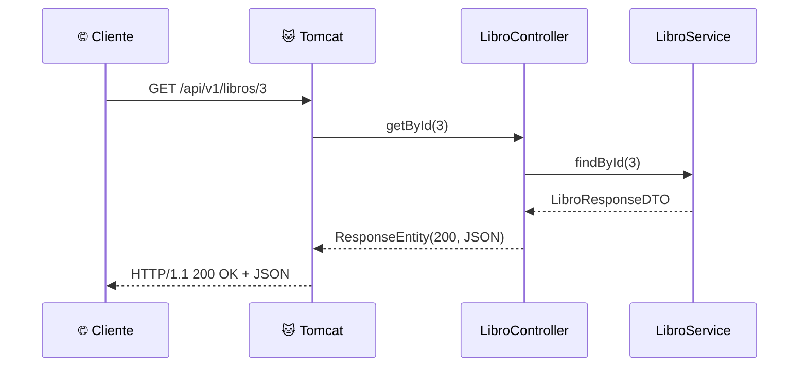
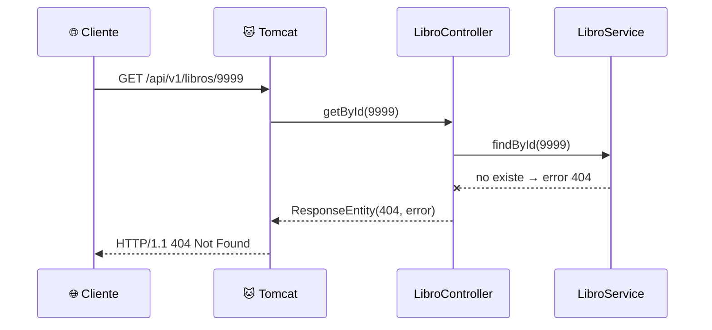

<a id="protocolos-y-rest"></a>

# 🧩 1. Protocolos estándar y servicios REST: leyendo el controlador

Ya sabes que dos programas pueden hablarse por red usando una IP y un puerto, y que para entenderse necesitan un protocolo: un conjunto de reglas fijas sobre cómo tiene que ser cada mensaje, que los dos lados conocen de antemano — como cuando rellenas un formulario con casillas fijas en vez de escribir una carta libre: quien lo lee sabe exactamente dónde va a encontrar cada dato, porque el formato ya está pactado. Hoy vas a ver ese protocolo en detalle en el caso concreto de una API web: qué forma exacta tiene cada mensaje, qué reglas sigue, y cómo termina convirtiéndose en código Java que se ejecuta de verdad. Esta semana no vas a escribir código nuevo — vas a aprender a **leer** un controlador REST ya hecho, del mismo tipo que vas a construir tú mismo la semana que viene.

---

## 🌐 La URL, pieza a pieza

Cuando escribes una URL en el navegador o llamas a una API desde tu código, hay siempre un **cliente** (quien pide) y un **servidor** (quien responde) — el cliente puede ser un navegador, una app móvil, otro servidor, o simplemente `curl` desde tu terminal. Esa petición viaja hacia una dirección concreta, la **URL**, que en el caso de una API web añade una pieza nueva sobre el host y el puerto que ya conoces: la ruta del recurso.

```
http://localhost:8080/api/v1/libros/3
└─┬──┘ └────┬───────┘└──────┬──────────┘
protocolo  host:puerto      ruta
```

- **Protocolo** (`http`): las reglas de comunicación que van a usar los dos — la que vas a mirar por dentro en este apartado.
- **Host y puerto** (`localhost:8080`): dónde está el servidor y por qué puerta escucha.
- **Ruta** (`/api/v1/libros/3`): qué recurso concreto se pide dentro de ese servidor — esta pieza es la que no tenía equivalente hasta ahora, y es la que vas a usar para identificar cada libro, cada usuario o cada pedido de tu API: uno por URL, sin ambigüedad.

---

## 📨 Qué es HTTP

**HTTP** (*HyperText Transfer Protocol*) es el protocolo de petición-respuesta que usa la web: el cliente manda una petición con un formato fijo, el servidor responde con una respuesta con otro formato fijo, y ahí termina esa conversación (la siguiente petición empieza de cero). Por debajo del navegador, o de una herramienta de línea de comandos como **`curl`** —la que vas a usar en la Actividad 1.1 para mandar peticiones HTTP a mano, sin escribir código—, una petición HTTP real es texto plano con esta forma:

```http
GET /api/v1/libros/3 HTTP/1.1
Host: localhost:8080
Accept: application/json
```

Y la respuesta, también texto plano:

```http
HTTP/1.1 200 OK
Content-Type: application/json

{"id": 3, "titulo": "El nombre del viento", "precio": 19.95}
```

| Parte | En la petición | En la respuesta |
|---|---|---|
| Primera línea | Método + ruta + versión | Versión + código de estado |
| Cabeceras (*headers*) | Metadatos: qué formato aceptas, quién eres... | Metadatos: qué formato devuelve, tamaño... |
| Cuerpo (*body*) | Datos que envías (puede no haberlo) | Datos que devuelve (puede no haberlo) |

Fíjate en las dos cabeceras del ejemplo, porque se confunden fácilmente al principio: `Accept` la manda el cliente, y significa "esto es lo que quiero que me devuelvas"; `Content-Type` la manda quien envía un cuerpo (aquí, el servidor en la respuesta), y significa "esto es lo que de verdad te estoy mandando". Es la diferencia entre pedir y confirmar: es como pedir un plato en un restaurante — le dices al camarero qué quieres (`Accept`), y cuando te lo trae, la etiqueta del plato confirma qué es realmente lo que tienes delante (`Content-Type`). Un mismo servidor podría saber responder en JSON o en otro formato según lo que le pida cada cliente en su `Accept`; y `Content-Type` es lo que le dice a quien recibe el mensaje cómo tiene que leer ese cuerpo antes de intentarlo.

---

## 🔤 Verbos y códigos de estado

Cada petición HTTP declara un **verbo** (o método) que expresa la intención de la operación:

| Verbo | Qué expresa | ¿Repetirla cambia algo? |
|---|---|---|
| `GET` | Leer un recurso, sin modificarlo. | No — pedir el mismo libro 5 veces da 5 veces la misma respuesta. |
| `POST` | Crear un recurso nuevo. | Sí — repetirla crea un recurso nuevo cada vez. |
| `PUT` | Reemplazar un recurso existente. | No — reemplazar por el mismo valor 5 veces deja el recurso igual que la primera. |
| `DELETE` | Eliminar un recurso. | No — borrarlo dos veces deja el mismo resultado que borrarlo una (la segunda ya no encuentra nada que borrar). |

Esa última columna importa más de lo que parece. Piensa en el botón de llamada de un ascensor: pulsarlo una vez o pulsarlo nerviosamente diez veces seguidas hace exactamente lo mismo — el ascensor viene una sola vez. `GET`, `PUT` y `DELETE` funcionan igual: si tu conexión falla justo después de mandarlos y no sabes si han llegado, puedes repetirlos sin miedo, el resultado final es el mismo. `POST` es distinto, más parecido a pulsar el botón de "pedir" en una máquina expendedora: cada pulsación te cobra y te da un producto nuevo — repetirlo a ciegas puede dejarte con el mismo libro duplicado dos veces.

El servidor responde siempre con un **código de estado** de tres cifras que resume qué ha pasado, agrupado por familias:

| Familia | Significa | Ejemplos que vas a usar todo el curso |
|---|---|---|
| `2xx` | Todo ha ido bien | `200 OK`, `201 Created`, `204 No Content` |
| `4xx` | Error del cliente | `400 Bad Request`, `401/403`, `404 Not Found` |
| `5xx` | Error del servidor | — |

!!! tip "No hace falta memorizar todos los códigos"
    Con estos 5-6 tienes cubierto casi todo lo que verás en el curso: `200` (petición de lectura correcta), `201` (se ha creado algo), `204` (correcto, pero no hay nada que devolver — típico en un `DELETE`), `400` (la petición está mal formada), `401`/`403` (no autenticado / autenticado pero sin permiso — se ve en detalle en el Tema 2), `404` (el recurso no existe).

---

## 📦 JSON como formato del cuerpo

Ya has visto JSON antes, aunque sea de pasada — es el formato en el que casi todas las APIs modernas envían y reciben datos dentro del cuerpo de la petición/respuesta: pares clave-valor, anidables, sin tipos estrictos declarados:

```json
{
  "titulo": "El nombre del viento",
  "precio": 19.95,
  "editorial": {
    "nombre": "Plaza & Janés"
  }
}
```

Volverás a JSON con más detalle cuando lo necesites de verdad (al construir cuerpos de petición en la Actividad 1.1 y, en Acceso a Datos, al persistir estructuras JSON completas en el Tema 2) — de momento basta con reconocer la forma.

---

## 🧩 Qué es una API y qué es REST

Piensa en el mando de una tele: tiene un botón para subir volumen, otro para cambiar de canal, otro para apagar. No necesitas saber nada de electrónica para usarlo — solo conoces los botones disponibles y qué hace cada uno. Una **API** (*Application Programming Interface*) es exactamente eso, pero para programas: el conjunto de operaciones que una aplicación expone para que otros programas la usen, sin que necesiten conocer cómo está construida por dentro. **REST** es un estilo concreto de diseñar esos "botones" sobre HTTP: los datos se modelan como **recursos** (un libro, un usuario, un pedido), cada recurso tiene su propia **URL** — su propio "botón" — y las operaciones sobre ese recurso se expresan con los verbos HTTP que ya has visto (`GET` para leerlo, `POST` para crearlo...).

!!! example "Una API de librería, como ejemplo de patrón"
    | Operación | Verbo + ruta |
    |---|---|
    | Listar todos los libros | `GET /libros` |
    | Ver un libro concreto | `GET /libros/3` |
    | Añadir un libro nuevo | `POST /libros` |
    | Reemplazar un libro | `PUT /libros/3` |
    | Borrar un libro | `DELETE /libros/3` |

    Fíjate en el patrón: la **ruta** identifica *qué* recurso, y el **verbo** identifica *qué operación* — no hace falta una ruta distinta para cada acción (`/libros/borrar/3` sería el estilo antiguo, no REST).

---

## 📖 Leyendo un controlador REST completo

Con esa base, ya puedes leer un controlador REST real — el de la API de libros del ejemplo, de momento solo con los métodos `GET` (los de escritura llegan en el próximo apartado). No hace falta que entiendas cada símbolo a la primera: mira primero la forma general (una clase con dos métodos, cada uno con una anotación encima) y luego ve bajando a la tabla, anotación por anotación.

```java
@RestController
@RequestMapping("/api/v1/libros")
@RequiredArgsConstructor
public class LibroController {
    private final LibroService libroService;

    @GetMapping
    public ResponseEntity<List<LibroResponseDTO>> getAll() {
        return ResponseEntity.ok(libroService.findAll());
    }

    @GetMapping("/{id}")
    public ResponseEntity<LibroResponseDTO> getById(@PathVariable Long id) {
        return ResponseEntity.ok(libroService.findById(id));
    }
}
```

Fíjate en algo antes de entrar en las anotaciones: ninguno de los dos métodos consulta nada directamente. `getAll` y `getById` se limitan a llamar a `libroService.findAll()` y `libroService.findById(id)` y a envolver lo que les devuelve en una respuesta HTTP — es `LibroService` quien de verdad hace el trabajo (comprobar si el libro existe, consultar el repositorio, aplicar cualquier regla de negocio que haga falta) y le entrega al controller el resultado ya listo. El controller no sabe nada de bases de datos: solo traduce entre HTTP y esa llamada Java.

Anotación a anotación, mirando solo la parte de HTTP (qué hace cada cosa con la persistencia por debajo no es el foco aquí):

| Anotación / elemento | Qué representa en HTTP |
|---|---|
| `@RestController` | Marca la clase como controlador cuyas respuestas se **serializan** —se convierten del objeto Java a texto, aquí a JSON— directamente al cuerpo HTTP. |
| `@RequestMapping("/api/v1/libros")` | La ruta base del recurso — todo lo que hay dentro de esta clase cuelga de `/api/v1/libros`. El `/v1` es el **versionado** de la API: si el día de mañana cambia el contrato, se puede publicar un `/v2` sin romper a los clientes que siguen usando la v1. |
| `@GetMapping` / `@GetMapping("/{id}")` | Verbo (`GET`) + ruta = una operación concreta. Los dos métodos cuelgan de la misma ruta base (`/api/v1/libros`), pero Spring solo ejecuta uno de los dos según cómo termine esa combinación: si la petición es exactamente `/api/v1/libros`, entra `getAll`; si trae algo más detrás (`/3`, `/57`...), entra `getById`. `{id}` es esa parte variable de la ruta. |
| `@PathVariable Long id` | Extrae ese trozo variable de la URL y lo entrega como parámetro Java — el `3` de `/api/v1/libros/3` llega aquí convertido ya en un `Long`, listo para usar. |
| `ResponseEntity.ok(...)` | Construye la respuesta con el código de estado `200` explícito y el cuerpo indicado — es tu código Java decidiendo, a propósito, la primera línea de la respuesta HTTP que viste más arriba. |

Vuelve un momento a la petición en texto plano de antes: `GET /api/v1/libros/3 HTTP/1.1`. Ese `GET`, esa ruta y ese `3` son exactamente lo que decide Spring para escoger `getById` y rellenar su parámetro `id` — nada de lo que hace el controlador es magia añadida, es la traducción directa de esas tres piezas del texto plano a una llamada Java.

El viaje completo de una petición `GET /api/v1/libros/3`, ida y vuelta — fíjate en que la respuesta recorre exactamente el mismo camino que la petición, pero al revés: pasa otra vez por el controller (que la envuelve en la respuesta HTTP) y por Tomcat (que la manda de verdad por la red) antes de llegar al cliente:



El puerto `8080` y el servidor **Tomcat** que escucha en él no son magia: los trae la dependencia `spring-boot-starter-webmvc` del `pom.xml` — es la "librería que implementa el servicio en red" de la que habla el currículo. Tú no arrancas ningún servidor a mano: Spring Boot lo hace por ti al ejecutar la clase anotada con `@SpringBootApplication`.

---

## ❌ ¿Y si el libro no existe?

Todo lo de arriba asume que el libro con ese `id` existe. Cuando no es así, el viaje de la petición es el mismo hasta `LibroService` — solo cambia lo que pasa a partir de ahí:



`LibroService` es quien comprueba si el libro existe de verdad, y quien decide, en ese punto exacto, que la respuesta tiene que ser un error con código `404` en vez de un `200` con el libro dentro. El código de estado que acaba viendo el cliente nace ahí, no en Tomcat.

En el controller, esa decisión se traduce en algo así — una versión sencilla de lo que verás en detalle más adelante:

```java
@GetMapping("/{id}")
public ResponseEntity<LibroResponseDTO> getById(@PathVariable Long id) {
    LibroResponseDTO libro = libroService.findById(id);
    if (libro == null) {
        return ResponseEntity.notFound().build();
    }
    return ResponseEntity.ok(libro);
}
```

`ResponseEntity.notFound().build()` es el mismo tipo de objeto que `ResponseEntity.ok(...)`, solo que con el código `404` en vez del `200` y sin cuerpo. Esta versión con `if` es la más fácil de leer con lo que sabes hoy; más adelante en el curso verás una forma más limpia de expresar lo mismo, sin tener que repetir ese `if` en cada método.

---

## 🆚 Por qué un protocolo estándar

Podrías diseñar tu propio protocolo casero sobre sockets (lo verás en el Tema 4) en vez de usar HTTP/REST. La diferencia es que HTTP es un protocolo **estándar**: cualquier cliente que exista — un navegador, `curl`, otra aplicación escrita en otro lenguaje — ya sabe hablarlo, sin que tengas que documentar ni acordar nada a medida. Con un protocolo propio, cada cliente nuevo tendría que aprender tus reglas particulares desde cero.

| | Protocolo estándar (HTTP) | Protocolo propio a medida |
|---|---|---|
| ¿Quién ya sabe hablarlo? | Cualquier cliente existente: navegadores, `curl`, librerías de cualquier lenguaje. | Solo el que tú mismo escribas para hablarlo. |
| Documentación necesaria | La del propio recurso (qué rutas, qué devuelve cada una) — el formato de mensaje ya está definido de antemano. | Tienes que documentar y mantener también el propio formato de mensaje. |
| Herramientas de por medio | Servidores, proxies, balanceadores, cachés — todos entienden HTTP sin configuración especial. | Ninguna herramienta genérica te sirve; hay que escribirlas o adaptarlas todas. |
| Coste de un cliente nuevo | Bajo: ya sabe HTTP, solo aprende tus rutas. | Alto: tiene que aprender tu protocolo entero desde cero. |

---

## ✅ Ideas clave

??? tip "Abrir resumen"

    - Toda comunicación HTTP es petición-respuesta entre un **cliente** y un **servidor**, con la URL como dirección (protocolo, host, puerto, ruta).
    - HTTP es texto con una primera línea, cabeceras y cuerpo opcional; `Accept` es lo que pide el cliente, `Content-Type` es lo que confirma el que envía el cuerpo.
    - Los **verbos** (`GET`, `POST`, `PUT`, `DELETE`) expresan la intención de la operación; repetir un `GET`, `PUT` o `DELETE` dado no cambia el resultado, repetir un `POST` sí. Los **códigos de estado** (2xx/4xx/5xx) resumen el resultado sin tener que leer el cuerpo.
    - **JSON** es el formato habitual del cuerpo de petición/respuesta en las APIs modernas.
    - **REST** modela los datos como recursos con URL propia, y usa los verbos HTTP para operar sobre ellos — la ruta identifica *qué*, el verbo identifica *qué operación*.
    - `@RestController` + `@RequestMapping` + `@GetMapping` son las anotaciones que traducen "verbo + ruta" en un método Java concreto; `ResponseEntity` construye la respuesta con su código de estado.
    - Un código de error como `404` no lo decide Tomcat solo: nace de una comprobación en el service, que el controller traduce en `ResponseEntity.notFound().build()` en vez de `ResponseEntity.ok(...)`.
    - El servidor embebido (Tomcat) que atiende las peticiones lo trae `spring-boot-starter-webmvc` — no lo arrancas tú a mano.
    - Usar un protocolo estándar como HTTP significa que cualquier cliente existente ya sabe hablar con tu API, sin acordar nada a medida.
