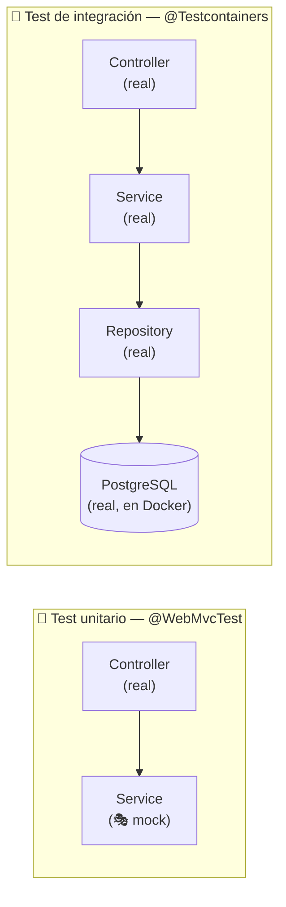
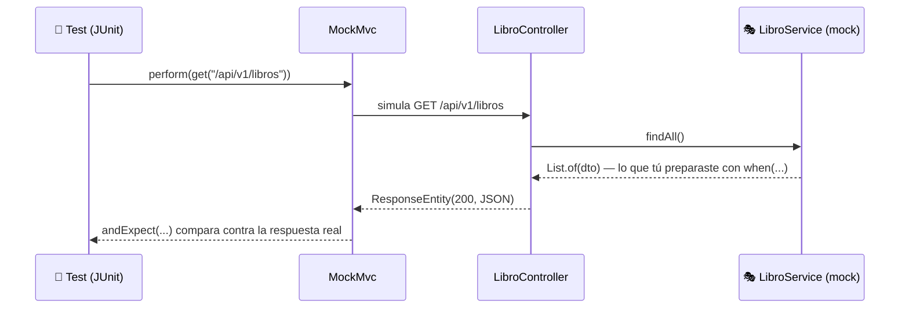

<a id="tests-mockmvc"></a>

# 🧩 3. Probar servicios con MockMvc

Hasta ahora has probado la API a mano: con `curl` (Actividad 1.1) y con Swagger UI (Actividad 1.2). Los dos funcionan, pero comparten un problema — tienes que repetir los mismos clics o comandos cada vez que quieres comprobar que todo sigue funcionando. Hoy conoces un tercer cliente, uno que se ejecuta solo: un **test automatizado**.

---

## 🧪 Qué es un test automatizado

Imagina que `LibroService` ya funciona bien, y hoy cambias algo en `update()` para arreglar un fallo. ¿Cómo sabes que ese cambio no ha roto `create()`, que no habías tocado para nada? La forma manual es volver a probar cada endpoint a mano —con Swagger UI o `curl`— cada vez que cambias una línea, y eso se vuelve más pesado cuantos más endpoints tenga tu proyecto. Un **test automatizado** es código que hace exactamente esa comprobación por ti: lo escribes una vez, y lo repites en segundos cada vez que lo necesites, sin abrir el navegador ni recordar qué había que probar.

**JUnit** es la librería estándar para escribir y ejecutar tests en Java: tú escribes métodos que comprueban un comportamiento concreto, y JUnit se encarga de ejecutarlos todos y decirte, uno a uno, cuáles han pasado y cuáles no. Un test JUnit sigue casi siempre la misma estructura, conocida como **preparar-actuar-afirmar** (*Arrange-Act-Assert*):

```java
@Test
void sumar_DebeDevolverLaSumaCorrecta() {
    Calculadora calc = new Calculadora();      // preparar

    int resultado = calc.sumar(2, 3);          // actuar

    assertEquals(5, resultado);                // afirmar
}
```

`@Test` marca el método como un test que JUnit debe ejecutar. Primero **preparas** lo que necesitas, luego **actúas** (llamas al método que quieres probar), y por último **afirmas** con `assertEquals(esperado, actual)` — el primer parámetro es siempre el valor que tú esperas, el segundo el que de verdad ha devuelto tu código. Si los inviertes el test sigue funcionando igual, pero el mensaje de error, cuando falle, sale con "esperado" y "obtenido" cambiados — confunde al leerlo, así que conviene respetar el orden.

Cambia el `5` de arriba por un `6` (una afirmación ahora incorrecta) y ejecuta el test otra vez. JUnit no se limita a decir "algo falla" — te da un error concreto, con el valor que esperaba y el que ha obtenido de verdad:

```
org.opentest4j.AssertionFailedError:
Expected :6
Actual   :5
```

Esa es la razón de ser de un test: no solo te avisa de que algo va mal, te dice exactamente qué esperabas y qué ha pasado en realidad, sin que tengas que ir imprimiendo valores por consola para averiguarlo tú mismo.

---

## 🎭 Qué es un mock

Antes de ver los dos tipos de test, entiende qué es un mock — lo vas a usar constantemente a partir de aquí. Piensa en una entrevista de trabajo simulada, antes de la real: alguien hace de entrevistador, siguiendo un guion que habéis decidido de antemano ("cuando te pregunte esto, responde aquello"), y tú practicas cómo reaccionar, sin que haya un puesto real en juego todavía. Un **mock** es exactamente eso, para código: un objeto falso que sustituye a una dependencia real, programado por ti para responder exactamente lo que decidas cuando lo llamen de una forma concreta.

En Java, con Mockito (la librería que Spring Boot ya trae integrada), se ve así:

```java
LibroService mockService = mock(LibroService.class);
when(mockService.findAll()).thenReturn(List.of());
```

`mock(LibroService.class)` crea el objeto falso — por defecto, no sabe hacer nada por sí solo. `when(...).thenReturn(...)` es el "guion": le dices qué debe devolver cuando lo llamen de una forma concreta. Dentro de un test de Spring, en vez de crear el mock a mano con `mock(...)`, se usa la anotación `@MockitoBean` sobre el campo — Spring se encarga de crearlo e inyectarlo él solo, pero por debajo es exactamente el mismo mecanismo.

¿Por qué usar un objeto falso en vez del real? Porque aísla lo que quieres probar. Si tu test dependiera del `LibroService` real, dependería a su vez de una base de datos real conectada, con datos reales dentro — y el resultado de tu test cambiaría según qué datos hubiera en ese momento en esa base de datos, algo que ni controlas ni te interesa cuando lo único que quieres saber es "¿mi controller responde bien a lo que le da el service?". Con un mock, el service siempre se comporta exactamente como tú decidiste, esté la base de datos levantada o no, sea la hora que sea.

!!! tip "Material de apoyo: JUnit y mocks desde cero"
    Si quieres repasar JUnit y los mocks con más calma —antes de verlos aplicados aquí a un controller REST—, tienes material dedicado en [Entornos de Desarrollo, Tema 3: Pruebas unitarias](https://aitorventura.github.io/entornos-de-desarrollo/tema3/unitarias/).

Pero mockear no es obligatorio: a veces sí quieres saber si las piezas reales (el service de verdad, la base de datos de verdad) funcionan bien juntas, no solo si tu controller reacciona bien a un valor inventado. Esa decisión — mockear o no — es justo lo que separa dos tipos de test distintos.

---

## 🆚 Test unitario vs. test de integración

Según esa decisión, un test cae en uno de estos dos grupos:

| | Test unitario | Test de integración |
|---|---|---|
| **Qué prueba** | Una pieza aislada (una clase, un método) | Varias piezas reales trabajando juntas |
| **Colaboradores** | Simulados (*mocks*) | Reales |
| **Velocidad** | Muy rápido | Más lento |

Visualmente, la diferencia está en dónde se corta la cadena real de piezas — en un test unitario, justo después del controller; en uno de integración, en ningún sitio:



El test unitario nunca llega a saber si hay una base de datos detrás siquiera — se detiene en el mock. El de integración recorre la cadena entera, con piezas reales de principio a fin.

---

## 🌐 MockMvc: un cliente HTTP programable

**MockMvc** es la herramienta de Spring para probar controllers REST sin necesitar un servidor HTTP real arrancado: simula peticiones HTTP contra tus controladores, dentro del propio test, y te permite comprobar el código de estado y el cuerpo de la respuesta con código Java.

Es, en esencia, un tercer cliente — como `curl` o Swagger UI — pero con una diferencia clave: es **repetible** y se puede ejecutar automáticamente (en tu máquina o en un pipeline de CI) cada vez que cambias algo, sin que nadie tenga que abrir el navegador.

El viaje completo de una petición dentro de un test MockMvc, de principio a fin — fíjate en que nunca sale del propio proceso Java, no hay ningún puerto `8080` real de por medio:



`MockMvc` simula la parte de Tomcat (recibir la petición, encaminarla al método correcto) sin arrancar ningún servidor de verdad; `LibroController` es exactamente el mismo código que corre en producción, sin cambiar una línea; y `LibroService`, al estar mockeado, responde con el valor que tú preparaste en el test — no con nada calculado de verdad.

---

## 📖 Primer ejemplo: un test que sí necesita el mock

```java
@WebMvcTest(LibroController.class)
@AutoConfigureMockMvc(addFilters = false)
class LibroControllerTest {

    @Autowired
    private MockMvc mockMvc;

    @MockitoBean
    private LibroService libroService;

    @Test
    void getAll_DebeDevolverListaDeLibros() throws Exception {
        var dto = new LibroResponseDTO(1L, "El nombre del viento", new BigDecimal("19.95"),
                LocalDate.of(2007, 3, 27), new EditorialDTO("Plaza & Janés"));
        when(libroService.findAll()).thenReturn(List.of(dto));

        mockMvc.perform(get("/api/v1/libros"))
                .andExpect(status().isOk())
                .andExpect(jsonPath("$[0].titulo").value("El nombre del viento"));
    }
}
```

Pieza a pieza:

- `@WebMvcTest(LibroController.class)`: arranca solo la capa web de Spring (el controller y lo relacionado con MVC), sin levantar toda la aplicación ni conectar con una base de datos real — mucho más rápido que un arranque completo.
- `@AutoConfigureMockMvc(addFilters = false)`: `@WebMvcTest` ya te prepara un `MockMvc` listo para usar; esta anotación te deja ajustar esa configuración. `addFilters = false` desactiva los filtros de *servlet* que se aplican a cada petición — en concreto, los que añadirá Spring Security a partir del Tema 2. Sin este flag, en cuanto tu proyecto tenga seguridad configurada, estos mismos tests empezarían a fallar con un `401` en vez del código que de verdad quieres comprobar, porque la petición simulada quedaría bloqueada por el login antes de llegar al controller. Ponerlo ya, desde ahora, evita ese problema por adelantado.
- `@MockitoBean private LibroService libroService`: sustituye el service real por un mock — el test prueba el controller de forma aislada, sin que la lógica del service (ni la base de datos que hay detrás) entre en juego.
- `when(libroService.findAll()).thenReturn(List.of(dto))`: esta es la parte de **preparar**. Le dices al mock, explícitamente, qué debe devolver cuando alguien lo llame con `findAll()` — no hay ninguna base de datos decidiéndolo, decides tú, a mano, exactamente qué datos ve el controller.
- `mockMvc.perform(get(...))`: construye y envía una petición simulada — el equivalente, en código, al `curl` que ya conoces.
- `.andExpect(status().isOk())` / `.andExpect(jsonPath("$[0].titulo").value(...))`: la parte de **afirmar**. `jsonPath` navega el cuerpo JSON de la respuesta como si fuera un mini-selector — aquí, `$[0].titulo` es el campo `titulo` del primer elemento del array que devuelve `getAll()`.

### 📖 Segundo ejemplo: cuando el mock no hace falta

```java
@Test
void create_DebeDevolver400_CuandoElDtoNoEsValido() throws Exception {
    String body = """
            {"titulo": "", "precio": -5, "fechaPublicacion": null, "editorialId": -1}
            """;

    mockMvc.perform(post("/api/v1/libros")
                    .contentType(MediaType.APPLICATION_JSON)
                    .content(body))
            .andExpect(status().isBadRequest())
            .andExpect(jsonPath("$.status").value(400));
}
```

Fíjate en que este test **no usa `when(...)` en ningún momento**. La validación de `@Valid` ocurre antes de que el controller llegue a llamar a `libroService.create(...)` — Spring rechaza la petición con un `400` sin que el service (ni, por tanto, el mock que lo sustituye) entre nunca en juego. Este test concreto es de **capa web**: prueba que el controller valida correctamente el DTO de entrada (gracias a `@Valid`, que ya viste el apartado anterior) sin necesitar preparar ningún valor de retorno.

### 🎭 Instruyendo al mock para que falle: `thenThrow`

`thenReturn` prepara un valor de éxito. Para el caso "no encontrado", preparas una excepción en su lugar:

```java
@Test
void getById_DebeDevolver404_CuandoNoExiste() throws Exception {
    when(libroService.findById(999L))
            .thenThrow(new ResponseStatusException(HttpStatus.NOT_FOUND, "Libro no encontrado"));

    mockMvc.perform(get("/api/v1/libros/999"))
            .andExpect(status().isNotFound());
}
```

`.thenThrow(...)` en vez de `.thenReturn(...)`: en vez de decirle al mock qué devolver, le dices qué excepción lanzar cuando lo llamen con ese parámetro concreto (`999L`). Reproduce, sin tocar la base de datos, exactamente el mismo camino que ya conoces del `orElseThrow(...)` real de `LibroService` (Tema 1 de Acceso a Datos) — el mock se limita a lanzar la misma excepción que lanzaría el service de verdad en ese caso.

### ¿Y el test de integración completo?

Existe otro tipo de test, con `@Testcontainers`, que levanta bases de datos **reales** en contenedores Docker solo para la duración del test — no mockea nada. Lo trabajarás a fondo en Acceso a Datos; aquí basta con que sitúes los dos niveles: `@WebMvcTest` prueba una capa aislada y rápida, un test de integración prueba varias piezas reales trabajando juntas y es más lento pero da más confianza sobre el sistema completo.

---

## 🎯 Lo que viene

Tu propio proyecto ya tiene el CRUD completo de `Videojuego` y de `Estudio`, documentado además con `@ApiResponses` (Actividad 1.2) — en la Actividad 1.3 no construyes ningún endpoint nuevo, escribes los tests MockMvc que comprueban con código que esos mismos códigos que documentaste (`200`, `201`, `400`, `404`...) son, de verdad, los que tu API devuelve. La Actividad 1.4 cierra el tema con dos piezas más: cuánto tarda tu API en atender varias peticiones a la vez, y Actuator.

---

## ✅ Ideas clave

??? tip "Abrir resumen"

    - Un **test automatizado** comprueba comportamiento sin intervención humana, y se puede repetir en cada cambio; sigue el patrón preparar-actuar-afirmar. `assertEquals(esperado, actual)`: el orden importa para que el mensaje de error, si falla, se lea bien.
    - Un **mock** es un objeto falso que sustituye a una dependencia real, programado por ti (`when(...).thenReturn(...)`) para aislar lo que quieres probar de todo lo demás — así el resultado del test no depende de que haya una base de datos real conectada, con datos reales dentro.
    - Un test **unitario** aísla una pieza con **mocks**; un test de **integración** prueba varias piezas reales juntas.
    - **MockMvc** simula peticiones HTTP contra tus controladores sin arrancar un servidor real — un cliente HTTP programable y repetible.
    - `@WebMvcTest` arranca solo la capa web; `@AutoConfigureMockMvc(addFilters = false)` desactiva los filtros de seguridad para que estos tests no dependan de login; `@MockitoBean` sustituye una dependencia por un mock; `mockMvc.perform(...).andExpect(...)` construye la petición y afirma el resultado; `jsonPath` navega el cuerpo JSON.
    - `when(mock.metodo(...)).thenReturn(valor)` prepara un valor de éxito; `.thenThrow(excepcion)` prepara que el mock lance una excepción en su lugar (el mismo camino que seguiría `orElseThrow(...)` en el service real).
    - No todos los tests necesitan `when(...)`: uno que verifica una validación con `@Valid` puede fallar antes de que el controller llegue a llamar al service.
    - La Actividad 1.3 no construye endpoints nuevos: escribe los tests MockMvc de los dos controllers ya completos, `Videojuego` y `Estudio`.
