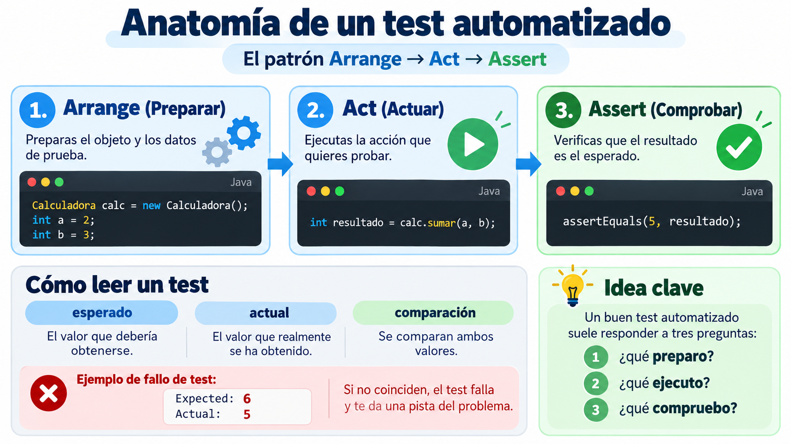
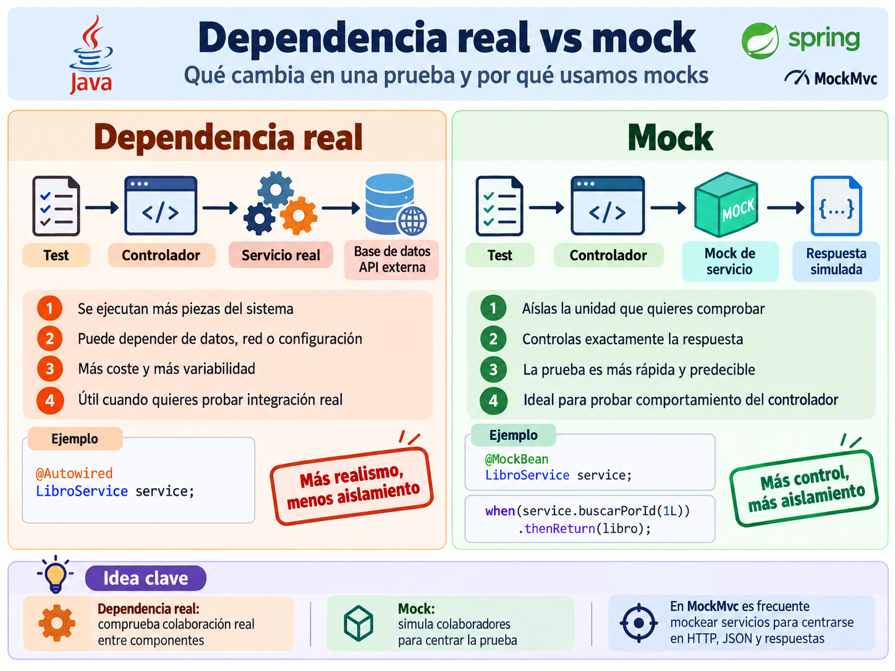
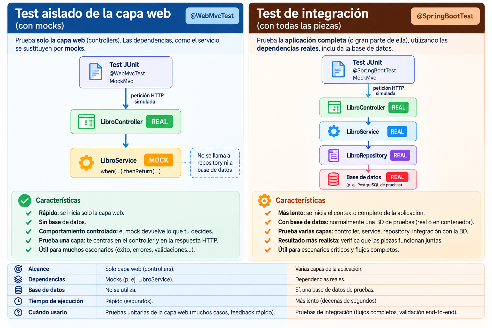
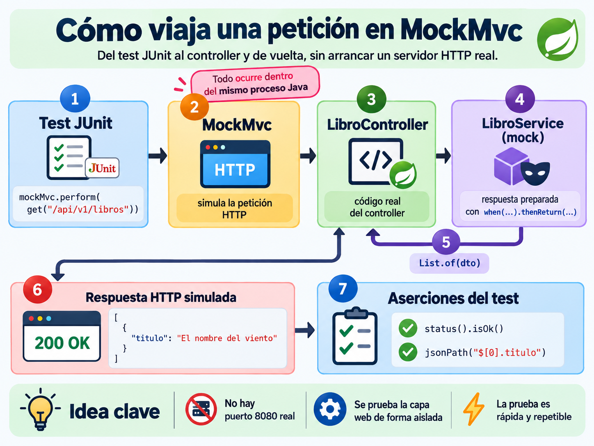
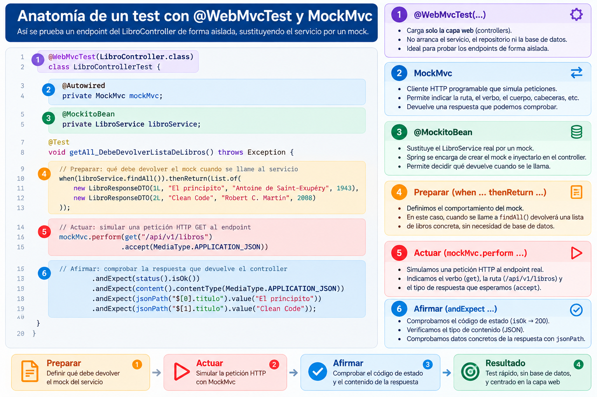
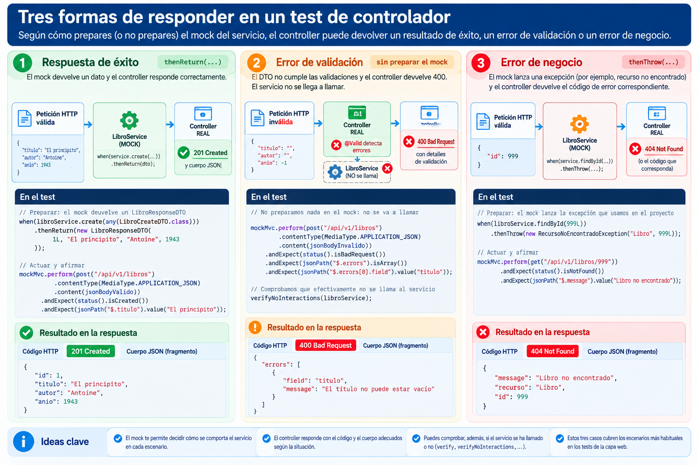

<a id="tests-mockmvc"></a>

# 🧩 3. Probar servicios con MockMvc

{ type=application/pdf style="width:100%;min-height:80vh" }

!!!info "Descarga de diapositivas"
    [Descarga las diapositivas](diapositivas/tests-mockmvc.pptx){target="_blank" rel="noopener"}

---

Hasta ahora has probado la API a mano: con `curl` (Actividad 1.1) y con Swagger UI (Actividad 1.2). Ambos funcionan, pero comparten un problema: tienes que repetir los mismos clics o comandos cada vez que quieres comprobar que todo sigue funcionando.

En esta sesión aparece un tercer cliente, uno que puede ejecutarse solo: un **test automatizado**.

---

## 🧪 Qué es un test automatizado

Imagina que `LibroService` ya funciona bien y hoy modificas `update()` para corregir un fallo. ¿Cómo sabes que ese cambio no ha roto `create()`, aunque no lo hayas tocado?

La alternativa manual sería volver a probar cada endpoint con Swagger UI o `curl`. A medida que crece el proyecto, repetir todas esas comprobaciones se vuelve cada vez más costoso.

Un **test automatizado** es código que realiza esas comprobaciones por ti. Lo escribes una vez y puedes ejecutarlo en segundos cada vez que cambias algo.

**JUnit** es la librería estándar para escribir y ejecutar tests en Java. Un test suele organizarse siguiendo el patrón **preparar → actuar → afirmar** (*Arrange → Act → Assert*).



*Figura 1. Estructura habitual de un test automatizado mediante el patrón Arrange-Act-Assert. Elaboración propia.*

En código:

```java
@Test
void sumar_DebeDevolverLaSumaCorrecta() {
    Calculadora calc = new Calculadora();      // preparar

    int resultado = calc.sumar(2, 3);          // actuar

    assertEquals(5, resultado);                // afirmar
}
```

`@Test` marca el método como un test que JUnit debe ejecutar. `assertEquals(esperado, actual)` compara lo que debería ocurrir con lo que realmente ha ocurrido.

!!! tip "Respeta el orden esperado → actual"
    Si inviertes los parámetros, el test puede seguir detectando el fallo, pero el mensaje mostrará intercambiados los valores esperado y obtenido, lo que dificulta leer el error.

Si cambias el `5` por un `6`, JUnit muestra una discrepancia concreta:

```text
org.opentest4j.AssertionFailedError:
Expected :6
Actual   :5
```

La utilidad del test no es solo avisar de que algo falla: deja registrada una **expectativa verificable y repetible**.

---

## 🎭 Qué es un mock

Un test no siempre necesita ejecutar todas las piezas reales de la aplicación.

Un **mock** es un objeto falso que sustituye a una dependencia real y cuyo comportamiento decides tú dentro del test. En Java, con Mockito:

```java
LibroService mockService = mock(LibroService.class);

when(mockService.findAll())
        .thenReturn(List.of());
```

`mock(...)` crea el objeto falso. `when(...).thenReturn(...)` define el comportamiento que tendrá cuando reciba una llamada concreta.



*Figura 2. Una dependencia real ejecuta más piezas del sistema; un mock permite aislar la unidad que se quiere probar y controlar su respuesta. Elaboración propia.*

¿Por qué interesa sustituir una dependencia real? Porque permite **aislar lo que quieres comprobar**. Si al probar `LibroController` utilizases `LibroService` y la base de datos reales, un fallo podría provenir del controller, del service, del repository, de los datos o de la configuración.

Con un mock, el service responde exactamente como has decidido y el test puede centrarse en preguntas como:

- ¿elige el controller el código HTTP adecuado?;
- ¿genera el JSON esperado?;
- ¿reacciona correctamente ante un resultado concreto del service?

Dentro de un test de Spring se utiliza habitualmente `@MockitoBean` para sustituir un bean real por su mock.

!!! tip "Material de apoyo: JUnit y mocks desde cero"
    Si quieres repasar JUnit y los mocks con más calma, tienes material dedicado en [Entornos de Desarrollo, Tema 3: Pruebas unitarias](https://aitorventura.github.io/entornos-de-desarrollo/tema3/unitarias/).

Mockear no es obligatorio. A veces precisamente quieres comprobar que varias piezas reales funcionan correctamente juntas. Esa decisión separa dos tipos de test distintos.

---

## 🆚 Test aislado vs. test de integración

Según el alcance que quieras comprobar, puedes plantear el test de dos formas:



*Figura 3. Un test aislado sustituye dependencias para centrarse en una capa; un test de integración ejecuta varias piezas reales conjuntamente. Elaboración propia.*

| | Test aislado | Test de integración |
|---|---|---|
| **Qué prueba** | Una parte concreta de la aplicación | Varias partes reales trabajando juntas |
| **Dependencias** | Se sustituyen mediante *mocks* | Se utilizan dependencias reales |
| **Base de datos** | No es necesaria | Puede utilizarse una base de datos de prueba |
| **Velocidad** | Muy rápido | Más lento |

En este apartado trabajarás principalmente con **tests aislados de la capa web** mediante `@WebMvcTest`: el `LibroController` será real y `LibroService` será un mock.

Un test de integración completo, en cambio, puede recorrer controller, service, repository y una base de datos real de pruebas. Más adelante utilizarás este enfoque con herramientas como Testcontainers.

---

## 🌐 MockMvc: un cliente HTTP programable

**MockMvc** es la herramienta de Spring para probar controllers REST sin arrancar un servidor HTTP real. Simula peticiones HTTP dentro del propio proceso Java y permite comprobar mediante código el estado, las cabeceras y el cuerpo de la respuesta.

Es, en esencia, otro cliente de tu API —como `curl` o Swagger UI—, pero **programable, repetible y automatizable**.



*Figura 4. Recorrido de una petición MockMvc desde el test JUnit hasta el controller y de vuelta, utilizando un service mockeado. Elaboración propia.*

En este recorrido:

```text
JUnit
→ MockMvc
→ LibroController real
→ LibroService mock
→ respuesta del controller
→ andExpect(...)
```

MockMvc simula la recepción y el encaminamiento de la petición sin que exista un puerto `8080` real. El controller es el mismo código que se ejecuta en la aplicación y el mock del service devuelve el valor que hayas preparado.

!!! info "La idea importante"
    No estás comprobando una llamada de red real. Estás comprobando **cómo responde la capa web** cuando recibe una petición concreta y sus dependencias se comportan de una forma conocida.

---

## 📖 Anatomía de un test con `@WebMvcTest`

Este es un test completo del endpoint `GET /api/v1/libros`:

```java
@WebMvcTest(LibroController.class)
@AutoConfigureMockMvc(addFilters = false)
class LibroControllerTest {

    @Autowired
    private MockMvc mockMvc;

    @MockitoBean
    private LibroService libroService;

    @Test
    void getAll_DebeDevolverListaDeLibros() throws Exception {
        var dto = new LibroResponseDTO(
                1L,
                "El nombre del viento",
                new BigDecimal("19.95"),
                LocalDate.of(2007, 3, 27),
                new EditorialDTO(1L, "Plaza & Janés")
        );

        when(libroService.findAll())
                .thenReturn(List.of(dto));

        mockMvc.perform(get("/api/v1/libros"))
                .andExpect(status().isOk())
                .andExpect(jsonPath("$[0].titulo")
                        .value("El nombre del viento"));
    }
}
```

La siguiente figura conecta cada pieza del test con su función:



*Figura 5. Relación entre la configuración de `@WebMvcTest`, el mock del service y las fases preparar-actuar-afirmar. Elaboración propia.*

### Qué hace cada pieza

| Elemento | Función |
|---|---|
| `@WebMvcTest(LibroController.class)` | carga un entorno reducido para probar la capa web |
| `@AutoConfigureMockMvc(addFilters = false)` | configura MockMvc y desactiva los filtros de servlet |
| `@MockitoBean` | sustituye el service real por un mock |
| `when(...).thenReturn(...)` | prepara el comportamiento del mock |
| `mockMvc.perform(...)` | simula la petición HTTP |
| `.andExpect(...)` | comprueba la respuesta |
| `jsonPath(...)` | navega y verifica datos concretos del JSON |

`addFilters = false` evita que los filtros que añadirá Spring Security más adelante bloqueen estas peticiones antes de llegar al controller. Así el test sigue centrado en la respuesta que quieres comprobar.

---

## 🔀 Tres situaciones habituales en un test de controller

No todos los tests necesitan preparar el mock de la misma manera. Hay tres situaciones que aparecerán constantemente:



*Figura 6. Tres escenarios habituales en tests de controller: valor preparado, validación previa al service y excepción preparada en el mock. Elaboración propia.*

### 1. El mock devuelve un valor: `thenReturn`

En un caso de éxito puedes decidir qué devuelve el service:

```java
when(libroService.findAll())
        .thenReturn(List.of(dto));
```

Después actúas con MockMvc y verificas la respuesta:

```java
mockMvc.perform(get("/api/v1/libros"))
        .andExpect(status().isOk())
        .andExpect(jsonPath("$[0].titulo")
                .value("El nombre del viento"));
```

### 2. La validación falla antes de llamar al mock

Este test no necesita `when(...)`:

```java
@Test
void create_DebeDevolver400_CuandoElDtoNoEsValido() throws Exception {
    String body = """
            {
              "titulo": "",
              "precio": -5,
              "fechaPublicacion": null,
              "editorialId": -1
            }
            """;

    mockMvc.perform(post("/api/v1/libros")
                    .contentType(MediaType.APPLICATION_JSON)
                    .content(body))
            .andExpect(status().isBadRequest());
}
```

La validación de `@Valid` se produce antes de que el controller llegue a llamar a `libroService.create(...)`. Si el DTO no supera sus restricciones, Spring responde con `400 Bad Request` y el service no necesita intervenir.

En este momento basta con comprobar el código de estado. Cuando la aplicación disponga de un formato de error estable, podrás añadir comprobaciones `jsonPath(...)` sobre ese cuerpo.

### 3. El mock lanza una excepción: `thenThrow`

Para simular un recurso no encontrado:

```java
@Test
void getById_DebeDevolver404_CuandoNoExiste() throws Exception {
    when(libroService.findById(999L))
            .thenThrow(new ResponseStatusException(
                    HttpStatus.NOT_FOUND,
                    "Libro no encontrado"));

    mockMvc.perform(get("/api/v1/libros/999"))
            .andExpect(status().isNotFound());
}
```

`thenThrow(...)` no prepara un valor de retorno: prepara el **fallo que debe producir la dependencia** cuando se invoque de esa manera.

---

## 🔗 ¿Y el test de integración completo?

Existe otro nivel de prueba en el que no se sustituye el service por un mock. El test puede levantar varias capas reales e incluso una base de datos temporal mediante **Testcontainers**.

Ese enfoque permite comprobar la colaboración real entre componentes, pero también es más costoso y lento. Lo trabajarás con más profundidad en Acceso a Datos; aquí basta con distinguir los dos niveles:

```text
@WebMvcTest
→ capa web aislada
→ dependencias mockeadas
→ rápido y controlado

Test de integración
→ varias capas reales
→ base de datos de prueba
→ más lento y más completo
```

---

## 🎯 Lo que viene

Tu proyecto ya tiene el CRUD completo de `Videojuego` y de `Estudio`, documentado con `@ApiResponses` en la Actividad 1.2.

En la **Actividad 1.3** no construirás endpoints nuevos: escribirás tests MockMvc que comprueben mediante código que los estados que has documentado (`200`, `201`, `400`, `404`...) son realmente los que devuelve tu API.

La Actividad 1.4 cerrará el tema con dos piezas adicionales: comprobar cuánto tarda la API en atender varias peticiones y utilizar Actuator.

---

## ✅ Ideas clave

??? tip "Abrir resumen"

    - Un **test automatizado** comprueba comportamiento de forma repetible y suele seguir el patrón **preparar → actuar → afirmar**.
    - Un **mock** sustituye una dependencia real por un objeto cuyo comportamiento controla el propio test.
    - Un **test aislado** se centra en una parte de la aplicación; un **test de integración** ejecuta varias piezas reales conjuntamente.
    - **MockMvc** simula peticiones HTTP contra los controllers sin arrancar un servidor HTTP real.
    - `@WebMvcTest` carga la capa web, `@MockitoBean` sustituye dependencias y `mockMvc.perform(...).andExpect(...)` permite actuar y afirmar sobre la respuesta.
    - `when(...).thenReturn(...)` prepara un valor; `thenThrow(...)` prepara una excepción.
    - No todos los tests necesitan preparar el mock: `@Valid` puede detener una petición antes de que el service llegue a ejecutarse.
