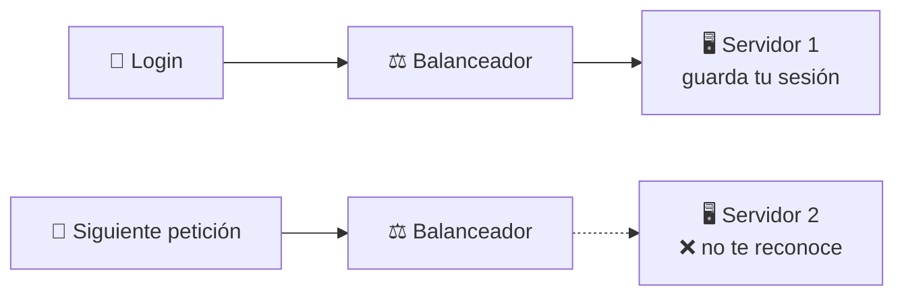
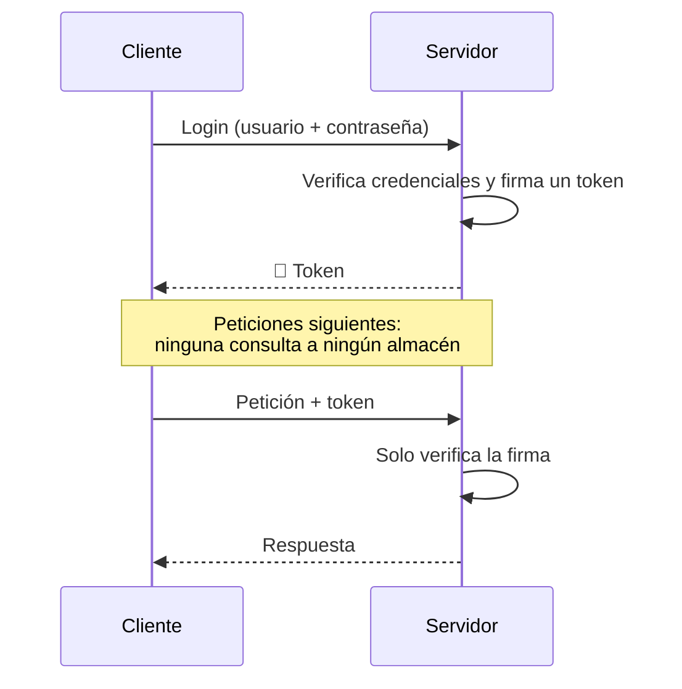
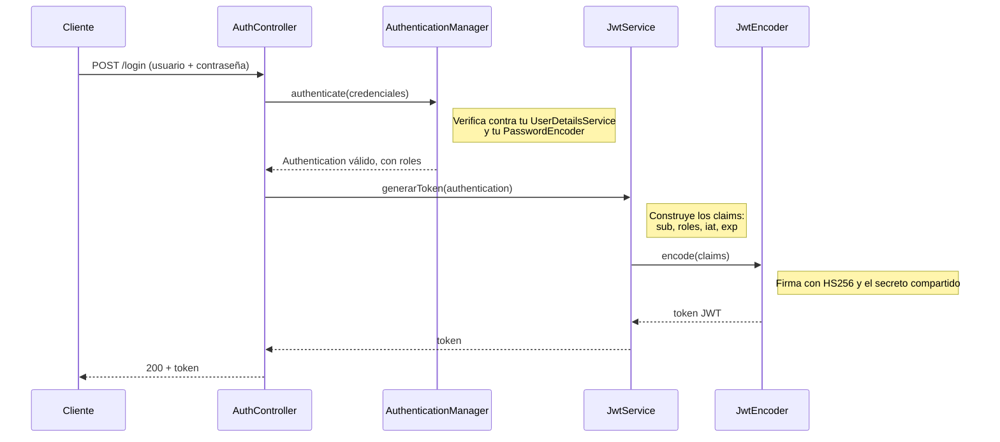
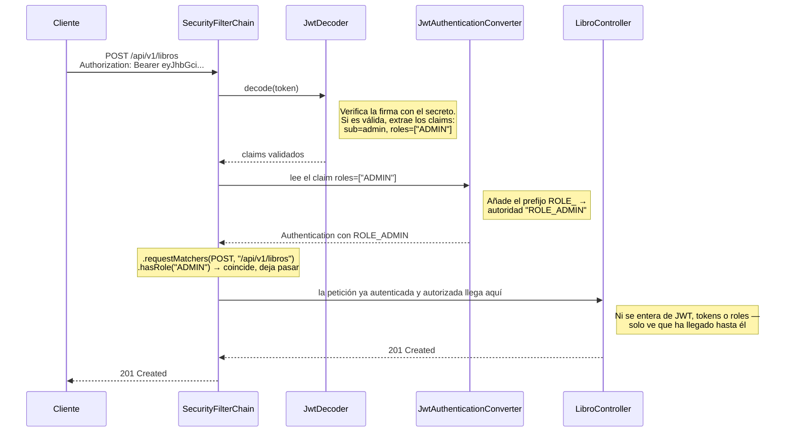
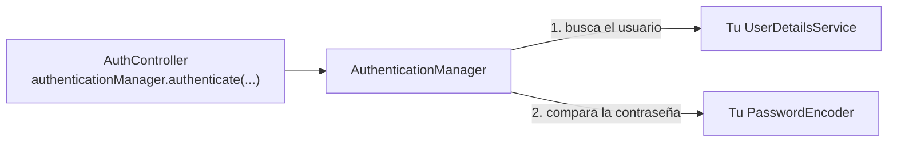

<a id="autenticacion-jwt"></a>

# 🧩 4. Autenticación con JWT

Al terminar el apartado anterior, tus usuarios ya eran reales —persistidos en PostgreSQL, con la contraseña protegida por BCrypt— y hasta los secretos vivían ya fuera del código. Pero seguía quedando el problema señalado desde entonces: con HTTP Basic, cada petición —absolutamente todas— volvía a mandar usuario y contraseña, aunque fuera solo codificados en Base64, no cifrados.

De paso, hoy también cierras algo pendiente desde antes: Swagger nunca ha tenido una forma cómoda de autenticarte desde su propia interfaz — hoy consigue, por fin, un botón "Authorize" de verdad.

HTTP es un protocolo **sin estado**: cada petición llega sola, sin memoria de la anterior. El servidor no "recuerda" que hace un segundo te autenticaste — por eso, hasta ahora, cada petición ha tenido que volver a mandar usuario y contraseña. Hoy sustituyes eso por algo mejor.

---

## 🍪 Dos soluciones históricas al problema de "recordar quién eres"

### Sesión en el servidor

El servidor, tras el login, guarda en su propia memoria (o en una base de datos de sesiones) quién eres, y te entrega una **cookie** con un identificador de sesión. En cada petición posterior, mandas esa cookie, y el servidor busca en su almacén "¿quién es el dueño de esta sesión?".

Límite: el servidor tiene que **guardar** el estado de cada sesión activa, en algún sitio. El problema aparece en cuanto tu aplicación corre en varias copias detrás de un **balanceador de carga** —un componente que reparte las peticiones entrantes entre esas copias, sin fijarse en quién atendió la anterior—:



Tu sesión vive solo en la memoria del Servidor 1 — si la siguiente petición cae en el Servidor 2, es como si no hubieras iniciado sesión nunca. Arreglarlo exige que todas las copias compartan el mismo almacén de sesiones, o forzar al balanceador a mandarte siempre contra la misma copia — ninguna de las dos es gratis.

### Token autocontenido

El servidor no guarda nada. En el login, te entrega un **token**: un "carné" firmado que contiene, dentro de sí mismo, quién eres y qué puedes hacer. En cada petición posterior, presentas ese token, y el servidor solo necesita **verificar la firma** — no consultar ningún almacén de sesiones, porque toda la información ya viaja dentro del propio token.



Fíjate en que el login (el primer paso del diagrama) **sigue** mandando usuario y contraseña — eso no desaparece, y ahí sigues expuesto exactamente igual que con HTTP Basic. Lo que cambia es la frecuencia: en vez de en todas y cada una de las peticiones, viajan una única vez, contra un único endpoint (`/login`) que puedes proteger a fondo. Todas las peticiones posteriores —pueden ser cientos, durante toda tu sesión de trabajo— ya no llevan la contraseña en ningún sitio, solo el token.

De las dos, esta —el token autocontenido— es la que vas a construir en tu API: resuelve justo el problema que acabas de ver con la sesión en servidor (no hay ningún almacén que compartir ni coordinar entre copias, porque no hay nada que guardar), y encaja con una API pensada para poder escalar en varias instancias. **JWT** (*JSON Web Token*) es el formato estándar de ese token autocontenido, y es lo que vas a implementar hoy.

---

## ✍️ Qué significa "firmado"

Retoma la criptografía del apartado anterior: **firmar no es lo mismo que cifrar**. Firmar un dato no oculta su contenido — sigue siendo legible por cualquiera — pero garantiza dos cosas: que no se ha modificado desde que se firmó, y quién lo firmó (si conoces la clave de verificación). Un JWT está firmado, no cifrado: su contenido es legible por cualquiera que lo intercepte, pero nadie puede modificarlo sin invalidar la firma.

El algoritmo concreto que vas a usar se llama **HMAC** (*Hash-based Message Authentication Code*): parte de la misma idea de función hash que ya conoces de BCrypt —una función que reduce unos datos de entrada, aquí el header y el payload del JWT, a una huella de longitud fija—, pero le añade un segundo ingrediente: un secreto compartido, sin el cual es imposible calcular esa huella.

`HS256`, el nombre que verás en el código, es HMAC combinado con **SHA-256**, la misma función hash rápida que descartaste para contraseñas en el apartado anterior por ser demasiado rápida ante la fuerza bruta. Aquí sí es la elección correcta: no estás protegiendo una contraseña de un atacante que prueba millones de combinaciones, sino verificando que un mensaje no se ha tocado, con una clave que solo tiene el servidor.

---

## 🧬 Anatomía de un JWT

Un JWT tiene tres partes separadas por puntos: `header.payload.signature`. Cada parte va codificada en Base64:

```
eyJhbGciOiJIUzI1NiJ9.eyJzdWIiOiJhZG1pbiIsInJvbGVzIjpbIkFETUlOIl0sImlhdCI6MTczMDAwMDAwMCwiZXhwIjoxNzMwMDAzNjAwfQ.SflKxwRJ...
```

| Parte | Qué contiene | En este ejemplo |
|---|---|---|
| `header` | Metadatos sobre el propio token: qué algoritmo de firma se ha usado (`alg`) y el tipo de token, siempre `"JWT"` (`typ`) | `eyJhbGciOiJIUzI1NiJ9` |
| `payload` | Los **claims**: los datos reales, quién eres y qué puedes hacer (los ves decodificados justo debajo) | `eyJzdWIiOiJhZG1pbiIsInJvbGVzIjpbIkFETUlOIl0sImlhdCI6MTczMDAwMDAwMCwiZXhwIjoxNzMwMDAzNjAwfQ` |
| `signature` | El resultado de firmar `header + payload` con el algoritmo indicado y el secreto del servidor — lo que garantiza que nadie los ha tocado | `SflKxwRJ...` |

Decodifica el `payload` de cualquier JWT (por ejemplo, en [jwt.io](https://jwt.io) o con `base64 -d`) y verás algo como:

```json
{"sub": "admin", "roles": ["ADMIN"], "iat": 1730000000, "exp": 1730003600}
```

Tres de estos campos son estándar de JWT (los define la propia especificación, con ese nombre exacto); `roles` no lo es — te lo inventas tú, según lo que tu aplicación necesite saber de cada usuario:

| Campo | Qué es | ¿De dónde sale? |
|---|---|---|
| `sub` (*subject*) | Quién eres — el usuario autenticado | Estándar de JWT |
| `iat` (*issued at*) | Cuándo se emitió el token, como timestamp Unix (segundos desde 1970) | Estándar de JWT |
| `exp` (*expiration*) | Cuándo caduca el token, mismo formato que `iat` | Estándar de JWT |
| `roles` | Qué puedes hacer — tus roles | Personalizado: lo añades tú, con el nombre que quieras |

!!! danger "El contenido NO va cifrado — y eso tiene dos consecuencias distintas"
    Cualquiera que capture un JWT puede leer su payload completo, sin necesitar ninguna clave — igual que decodificaste HTTP Basic en la Actividad 2.2. De ahí salen dos escenarios que conviene no mezclar:

    **Si alguien roba un token válido y lo reenvía tal cual**, sin tocarlo, el servidor lo acepta sin más — para el servidor es indistinguible de una petición tuya de verdad. La firma no protege de esto: el token sigue siendo perfectamente válido, solo que en manos equivocadas. (Es justo lo que resuelve HTTPS, más abajo: que nadie pueda interceptarlo por el camino.)

    **Si alguien intenta modificarlo, o fabricar uno nuevo desde cero** —por ejemplo, cambiando tu rol de `USER` a `ADMIN` en un token robado—, ahí sí entra en juego la **firma** (la tercera parte del token): se calcula con HMAC, el algoritmo que acabas de ver, y un secreto que solo conoce el servidor. Sin ese secreto, no se puede calcular una firma válida para un contenido nuevo — así que cualquier cambio, por pequeño que sea, deja la firma sin coincidir, y el servidor lo rechaza al instante.

---

## 🔑 El flujo completo, pieza a pieza

Antes de entrar en el código de cada pieza, aquí tienes el mapa completo: primero cómo se genera el token en el login, después cómo se valida ese mismo token en cada petición posterior. Los nombres son los mismos que vas a ver en el código de más abajo — vuelve a este mapa si te pierdes en algún punto.



Ese token, en cada petición posterior, sigue un camino distinto —ya no pasa por el login, ni por `AuthenticationManager`—. Con un ejemplo concreto: un `POST /api/v1/libros`, una ruta que solo puede tocar `ADMIN`, con el token que acabas de obtener en el login:



Esta es la parte que suele pasar desapercibida: `SecurityFilterChain` no genera la respuesta, solo decide si la petición **llega** o no a tu controller. Si `hasRole("ADMIN")` coincide, la deja pasar sin más —tu `LibroController` ejecuta exactamente el mismo código que ejecutaría con HTTP Basic, sin saber nada de JWT—; si no coincide, la petición nunca llega a tu controller, y es `SecurityFilterChain` quien responde directamente con `403`.

Si el token fuera de un usuario sin `ADMIN`, la firma seguiría siendo válida —`JwtDecoder` no rechaza nada por ahí—, pero la autoridad resultante sería `ROLE_USER`, no coincidiría con `hasRole("ADMIN")`, y la petición se cortaría ahí mismo, sin llegar nunca a `LibroController`: la firma certifica que el token es auténtico, no que tengas permiso para todo.

Siguiendo con la API de la librería: vas a ver las cuatro piezas que convierten el login en un token y ese token en identidad para el resto de peticiones.

### El secreto y los beans de `SecurityConfig`

Todas las clases de este apartado —`JwtEncoder`, `JwtDecoder`, `JwtAuthenticationConverter`...— vienen de un starter que no habías necesitado hasta ahora, aparte de `spring-boot-starter-security`:

```xml
<dependency>
    <groupId>org.springframework.boot</groupId>
    <artifactId>spring-boot-starter-oauth2-resource-server</artifactId>
</dependency>
```

`JwtEncoder` firma tokens nuevos; `JwtDecoder` verifica los que llegan en cada petición. Pero ninguno de los dos hace nada por sí solo: ambos necesitan la misma clave, el **secreto** con el que se calcula la firma HMAC — es el mismo secreto en los dos lados, porque HMAC usa una única clave tanto para firmar como para verificar (a diferencia de la criptografía de clave pública/privada, que usa dos distintas).

Todo lo que ves en esta pieza va en tu misma `SecurityConfig` de siempre, junto a lo que ya construiste en los apartados anteriores.

Ese secreto sigue el mismo patrón que ya usaste para la contraseña del primer `ADMIN`, en el apartado anterior: vive en tu fichero de propiedades excluido de Git, nunca en el código ni en la configuración que sí subes.

```java
@Value("${libreria.jwt.secret}")
private String jwtSecret;

@Bean
public JwtEncoder jwtEncoder() {
    return new NimbusJwtEncoder(new ImmutableSecret<>(jwtSecret.getBytes(StandardCharsets.UTF_8)));
}

@Bean
public JwtDecoder jwtDecoder() {
    SecretKeySpec secretKey = new SecretKeySpec(jwtSecret.getBytes(StandardCharsets.UTF_8), "HmacSHA256");
    return NimbusJwtDecoder.withSecretKey(secretKey).macAlgorithm(MacAlgorithm.HS256).build();
}
```

!!! warning "El secreto tiene que ser largo, no solo secreto"
    HS256 exige una clave de al menos 256 bits (32 caracteres). Si usas algo corto, tipo `"clave123"`, Spring lanza una excepción al arrancar la aplicación — no es un capricho de seguridad, es un requisito matemático del propio algoritmo: una clave corta es más fácil de adivinar por fuerza bruta, así que HMAC-SHA256 se niega a trabajar con una. Una cadena aleatoria larga, como la que ya generaste para `application-dev-local.yml`, cumple de sobra.

Aprovecha esta misma clase para exponer una pieza más, que no tiene que ver con el secreto pero sí hace falta para el login: el `AuthenticationManager`. Es la interfaz de Spring Security con un único trabajo: recibir unas credenciales todavía sin comprobar y, si son correctas, devolver un `Authentication` ya validado —o lanzar una excepción si no lo son—. Es justo lo que necesitas en tu endpoint de login para verificar `usuario`/`contraseña`.

Por debajo, el `AuthenticationManager` usa dos piezas que ya tienes en tu contexto desde el apartado anterior: tu `UserDetailsService` (busca al usuario) y tu `PasswordEncoder` (compara la contraseña con el hash BCrypt guardado). No conectas nada de esto a mano — es el mismo mecanismo que ya viste entonces: como en tu contexto de Spring solo existe **un** bean de cada tipo (tu única clase `BdUserDetailsService`, tu único `@Bean PasswordEncoder`), no hay ambigüedad que resolver, y Spring Boot los detecta y los usa sin que se lo indiques por nombre.



Lo único que falta es poder acceder a esa cadena ya montada desde tu propio código: Spring Security la construye internamente, pero no la publica como bean inyectable por su cuenta. `AuthenticationConfiguration.getAuthenticationManager()` es la forma soportada de pedírsela — sin este método, no podrías inyectar un `AuthenticationManager` en tu `AuthController`, como vas a hacer un poco más abajo.

```java
@Bean
public AuthenticationManager authenticationManager(AuthenticationConfiguration configuration) throws Exception {
    return configuration.getAuthenticationManager();
}
```

### Generar el token: `JwtService`

```java
@Service
@RequiredArgsConstructor
public class JwtService {

    private final JwtEncoder jwtEncoder;

    @Value("${libreria.jwt.expiration-minutes}")
    private long expirationMinutes;

    public String generarToken(Authentication authentication) {
        Instant ahora = Instant.now();
        List<String> roles = authentication.getAuthorities().stream()
                .map(GrantedAuthority::getAuthority)
                .filter(a -> a.startsWith("ROLE_"))
                .map(a -> a.replace("ROLE_", ""))
                .toList();

        JwtClaimsSet claims = JwtClaimsSet.builder()
                .issuer("libreria")
                .issuedAt(ahora)
                .expiresAt(ahora.plusSeconds(expirationMinutes * 60))
                .subject(authentication.getName())
                .claim("roles", roles)
                .build();

        JwsHeader jwsHeader = JwsHeader.with(MacAlgorithm.HS256).build();
        return jwtEncoder.encode(JwtEncoderParameters.from(jwsHeader, claims)).getTokenValue();
    }

    public long getExpiresInSeconds() {
        return expirationMinutes * 60;
    }
}
```

Ese `Authentication` es el mismo que viste en el diagrama de arriba: te lo entrega `authenticationManager.authenticate(...)`, en el endpoint de login que ves justo después de esta pieza. `generarToken` no lo construye, solo lo lee.

Los **claims** son los datos que viajan dentro del token: `subject` (quién eres), `roles` (qué puedes hacer, extraído de las autoridades que ya tenía la `Authentication` tras el login), `issuedAt`/`expiresAt` (cuándo se emitió y cuándo caduca). `jwtEncoder.encode(...)` firma todo esto con el algoritmo `HS256` (HMAC-SHA256) y el secreto configurado.

`getExpiresInSeconds()` es un pequeño ayudante para el endpoint de login, que ves justo después: expresa esa misma duración en segundos, para que el cliente sepa cuánto le queda de validez al token sin tener que decodificarlo.

### El endpoint de login

Antes de tocar el controller, dos records sencillos para lo que entra y lo que sale del login:

```java
public record LoginRequestDTO(
        @NotBlank(message = "El nombre de usuario no puede estar vacío") String username,
        @NotBlank(message = "La contraseña no puede estar vacía") String password
) {}

public record LoginResponseDTO(String accessToken, String tokenType, long expiresInSeconds) {}
```

`LoginResponseDTO` no llama a su campo `token` a secas, sino `accessToken` —el nombre habitual en APIs con JWT/OAuth2—; `tokenType` viaja siempre como `"Bearer"`, el prefijo que el cliente tendrá que anteponer en la cabecera `Authorization` de sus siguientes peticiones.

`AuthController` ya existe desde el apartado anterior, con el endpoint de registro. Hoy le añades el login, con dos dependencias nuevas:

```java
@RestController
@RequestMapping("/api/v1/auth")
@RequiredArgsConstructor
public class AuthController {

    private final UsuarioRepository usuarioRepository;
    private final PasswordEncoder passwordEncoder;
    private final AuthenticationManager authenticationManager;
    private final JwtService jwtService;

    @PostMapping("/register")
    public ResponseEntity<Void> register(@Valid @RequestBody RegisterRequestDTO dto) {
        // el mismo método del apartado anterior, sin cambios
    }

    @Operation(summary = "Autenticarse y obtener un token JWT")
    @ApiResponses({
            @ApiResponse(responseCode = "200", description = "Login correcto, token generado"),
            @ApiResponse(responseCode = "400", description = "El cuerpo de la petición no supera las validaciones"),
            @ApiResponse(responseCode = "401", description = "Usuario o contraseña incorrectos")
    })
    @PostMapping("/login")
    public ResponseEntity<LoginResponseDTO> login(@Valid @RequestBody LoginRequestDTO dto) {
        Authentication authentication = authenticationManager.authenticate(
                new UsernamePasswordAuthenticationToken(dto.username(), dto.password())
        );
        String token = jwtService.generarToken(authentication);
        return ResponseEntity.ok(new LoginResponseDTO(token, "Bearer", jwtService.getExpiresInSeconds()));
    }
}
```

`authenticationManager.authenticate(...)` dispara la verificación que viste en la pieza anterior (tu `UserDetailsService` + tu `PasswordEncoder`). Si las credenciales son correctas, te devuelve el `Authentication` con el que generas el token; si no, lanza una `AuthenticationException` (en la práctica, casi siempre `BadCredentialsException`, que hereda de ella).

Aquí hay una diferencia importante con el `401` de HTTP Basic, que nunca llegaba a tu `GlobalExceptionHandler` —lo generaba un filtro de seguridad, antes de que la petición llegara al `DispatcherServlet`—. Esta excepción es distinta: `authenticate(...)` se llama aquí dentro de tu propio método de controller, no en ningún filtro, así que sí pasa por el ciclo normal de Spring MVC.

Un sexto `@ExceptionHandler`, en el mismo `GlobalExceptionHandler` que construiste en el primer apartado del tema, la atrapa sin problema:

```java
@ExceptionHandler(AuthenticationException.class)
public ResponseEntity<ErrorResponse> handleAuthenticationException(
        AuthenticationException ex, HttpServletRequest request) {

    ErrorResponse response = new ErrorResponse(
            LocalDateTime.now().toString(), 401, "No autenticado",
            "Usuario o contraseña incorrectos", request.getRequestURI()
    );
    return ResponseEntity.status(HttpStatus.UNAUTHORIZED).body(response);
}
```

Añádelo a la misma clase de siempre, junto a los otros cinco. Es un caso distinto al `AuthenticationEntryPoint` que construiste en la Actividad 2.2, aunque los dos acaben resolviendo un `401`. La diferencia está en **quién llama a `authenticate(...)`**:

| | `AuthenticationEntryPoint` (Actividad 2.2) | Este `@ExceptionHandler` (hoy) |
|---|---|---|
| ¿Quién genera el fallo? | Spring Security, dentro de un filtro, antes de cualquier controller | Tu propio código, dentro de `AuthController.login(...)` |
| Ejemplo concreto | `GET /api/v1/libros/1` sin token, o con uno caducado | `POST /api/v1/auth/login` con la contraseña equivocada |
| ¿La petición llega a un controller? | No — se corta antes | Sí — la ruta es `permitAll()`, y falla ya dentro |
| ¿Pasa por `DispatcherServlet`? | No | Sí |
| Respuesta | `401` | `401` |

Misma herramienta de siempre, `@ExceptionHandler`, aplicada a un caso que hasta ahora no se había dado.

### El cambio de modo en `SecurityConfig`

Este es el mismo bean `securityFilterChain(...)` que ya construiste en la seguridad básica —el `SecurityFilterChain` que acabas de ver como protagonista del segundo diagrama—, con el método completo. Las rutas, `exceptionHandling` (tu `AuthenticationEntryPoint`) y `csrf` son exactamente lo que ya tenías; lo nuevo de hoy es `sessionManagement`, `oauth2ResourceServer` y el cambio en `httpBasic`:

```java
@Bean
public SecurityFilterChain securityFilterChain(HttpSecurity http, AuthenticationEntryPoint customAuthenticationEntryPoint) throws Exception {
    return http
            .sessionManagement(session -> session.sessionCreationPolicy(SessionCreationPolicy.STATELESS))
            .authorizeHttpRequests(auth -> auth
                    .requestMatchers(HttpMethod.POST, "/api/v1/auth/register", "/api/v1/auth/login").permitAll()
                    .requestMatchers(HttpMethod.GET, "/api/v1/libros/**").permitAll()
                    .requestMatchers("/v3/api-docs/**", "/swagger-ui/**", "/documentacion").permitAll()
                    .anyRequest().authenticated()
            )
            .exceptionHandling(exceptions -> exceptions
                    .authenticationEntryPoint(customAuthenticationEntryPoint)
            )
            .csrf(AbstractHttpConfigurer::disable)
            .oauth2ResourceServer(oauth2 -> oauth2.jwt(jwt -> jwt.jwtAuthenticationConverter(jwtAuthenticationConverter())))
            .httpBasic(AbstractHttpConfigurer::disable)
            .build();
}
```

`SessionCreationPolicy.STATELESS` es la consecuencia directa de usar tokens autocontenidos: con JWT no hace falta que el servidor guarde ninguna sesión, así que se lo dices explícitamente a Spring Security. `oauth2ResourceServer(oauth2 -> oauth2.jwt(...))` activa la validación de JWT en cada petición protegida — Spring verifica la firma automáticamente, usando el `JwtDecoder` que ya viste más arriba. `httpBasic(AbstractHttpConfigurer::disable)` retira oficialmente el mecanismo provisional de los apartados anteriores: JWT es ahora el único mecanismo de autenticación.

La regla de `/v3/api-docs/**`, `/swagger-ui/**` y `/documentacion` también es nueva: desde la seguridad básica, Swagger ha estado bloqueado detrás de autenticación, igual que el resto de la API. Sin ella, el navegador no podría ni cargar `/documentacion` —`STATELESS` no manda ningún token solo por navegar a una URL—, y el botón "Authorize" que ves un poco más abajo no sería alcanzable.

Hay una pieza más en esa misma línea que merece explicación aparte: `jwtAuthenticationConverter()`. Por defecto, Spring Security espera encontrar los roles en un claim llamado `scope` o `scp` —el habitual en OAuth2—, pero tú los guardas en un claim propio, `roles`.

Sin decírselo explícitamente, Spring no sabría traducir tu token en autoridades utilizables por `hasRole(...)`, y todas tus reglas de autorización dejarían de reconocer ningún rol, aunque el token en sí fuera perfectamente válido:

```java
@Bean
public JwtAuthenticationConverter jwtAuthenticationConverter() {
    JwtGrantedAuthoritiesConverter authoritiesConverter = new JwtGrantedAuthoritiesConverter();
    authoritiesConverter.setAuthoritiesClaimName("roles");
    authoritiesConverter.setAuthorityPrefix("ROLE_");

    JwtAuthenticationConverter authenticationConverter = new JwtAuthenticationConverter();
    authenticationConverter.setJwtGrantedAuthoritiesConverter(authoritiesConverter);
    return authenticationConverter;
}
```

`setAuthoritiesClaimName("roles")` le dice dónde mirar; `setAuthorityPrefix("ROLE_")` reconstruye el prefijo que ya conoces de la seguridad básica —recuerda que `JwtService` te lo quitó al generar el token, precisamente para no guardarlo por duplicado dentro del JWT—.

Con eso, tus reglas `hasRole("ADMIN")` de siempre siguen funcionando sin tocar ni una línea.

### `GET /api/v1/auth/me`

```java
@GetMapping("/me")
public ResponseEntity<AuthMeResponse> getCurrentUser() {
    Authentication authentication = SecurityContextHolder.getContext().getAuthentication();
    // construir la respuesta con authentication.getName() y sus roles
}
```

Un endpoint sencillo para verificar qué información viaja dentro de tu propio token: útil tanto para probar como para entender qué sabe el servidor de ti en cada petición autenticada.

### Por fin, un botón "Authorize" de verdad en Swagger

En "Seguridad básica" viste que Swagger no sabía pedirte credenciales por su cuenta —con HTTP Basic, o lo hacía el propio navegador, o no había forma cómoda de autenticarte desde la interfaz—. Con JWT eso se resuelve de raíz: le declaras a Swagger que tu API usa un esquema de seguridad `bearer`, y a cambio te da un botón "Authorize" real, donde pegas tu token una sola vez.

Se declara en el mismo `OpenApiConfig` que ya tienes, añadiendo un `SecurityScheme`:

```java
@Bean
public OpenAPI libreriaOpenAPI() {
    final String esquema = "bearerAuth";
    return new OpenAPI()
            .info(new Info()
                    .title("Mi librería")
                    .version("v1")
                    .description("API de la librería del curso."))
            .components(new Components()
                    .addSecuritySchemes(esquema, new SecurityScheme()
                            .type(SecurityScheme.Type.HTTP)
                            .scheme("bearer")
                            .bearerFormat("JWT")))
            .addSecurityItem(new SecurityRequirement().addList(esquema));
}
```

`addSecuritySchemes(...)` define el esquema —tipo `HTTP`, variante `bearer`, formato `JWT`, solo para que Swagger sepa cómo mostrarlo, no cambia nada del backend—; `addSecurityItem(...)` lo aplica por defecto a **todos** los endpoints de la especificación.

¿Y de dónde sacas el token la primera vez? No hace falta salir a curl: `/login` es `permitAll()`, así que aparece en `/documentacion` como cualquier otro endpoint. Reinicia, entra en `/documentacion`, busca `POST /api/v1/auth/login` y pruébalo con "Try it out" —sin pulsar "Authorize" antes, no lo necesita—; copia el `accessToken` de la respuesta.

Con eso, pulsa "Authorize", pega el token (sin escribir `Bearer `, Swagger lo añade solo) y prueba cualquier endpoint protegido con "Try it out" — ya no hace falta pegar la cabecera `Authorization` a mano en cada petición.

---

## 🔒 HTTPS: lo que JWT resuelve y lo que no

JWT evita reenviar la contraseña en cada petición — un avance real. Pero el **canal** en sí sigue siendo el mismo: si no hay HTTPS, tanto el login como el propio token viajan en claro por la red, interceptables por cualquiera con acceso a esa red. La firma del JWT garantiza **integridad** (que no se ha modificado), no **confidencialidad del transporte** — son dos cosas distintas, y JWT solo resuelve la primera.

HTTPS añade esa confidencialidad cifrando el canal con TLS, mediante un certificado: en desarrollo se suele usar uno autofirmado (`keytool`, incluido en el propio JDK, genera uno sin depender de nada externo); en producción, lo emite una autoridad certificadora (CA) reconocida, o el cifrado se delega a un proxy/gateway (Nginx, un balanceador) que termina la conexión segura antes de reenviar al servidor de aplicación.

El resto de este curso sigue trabajando en HTTP simple, sin HTTPS — es una simplificación deliberada para no complicar cada actividad con certificados, no la recomendación para un proyecto real.

---

## 🔁 Lo que JWT tampoco resuelve: revocar un token

Hay otra pregunta que probablemente te has hecho ya: si un usuario cierra sesión, o un administrador quiere echarlo del sistema ahora mismo, ¿cómo se invalida su token? La respuesta incómoda es que, con JWT tal y como lo has construido hoy, **no se puede**: el servidor no guarda ningún registro de qué tokens ha emitido —es justo lo que lo hace *stateless*—, así que un token firmado sigue siendo válido para el servidor hasta que caduca por su cuenta (`exp`), pase lo que pase mientras tanto.

No vas a implementar una solución en este curso, pero merece la pena saber que el problema existe y cómo se aborda en un proyecto real: o bien el servidor mantiene una lista negra de tokens revocados que consulta en cada petición (lo que reintroduce parte del estado que JWT prometía evitar), o bien se usan tokens de vida muy corta —minutos, no horas— combinados con un *refresh token* aparte, de forma que un token robado o que haya que revocar deja de ser útil por sí solo, sin más que esperar.

---

## ✅ Ideas clave

??? tip "Abrir resumen"

    - HTTP es sin estado; la **sesión en servidor** (cookie + almacén) y el **token autocontenido** (JWT) son las dos soluciones clásicas para "recordar quién eres".
    - **Firmar ≠ cifrar**: un JWT es legible por cualquiera, pero su firma impide modificarlo sin que se detecte.
    - Un JWT tiene tres partes (`header.payload.signature`); los **claims** del payload llevan quién eres, tus roles y la expiración.
    - `SessionCreationPolicy.STATELESS` + `oauth2ResourceServer(...).jwt(...)` activan la validación automática de JWT; `httpBasic(disable)` retira el mecanismo provisional.
    - El `AuthenticationManager` y el `jwtAuthenticationConverter()` no vienen listos de fábrica: hay que declararlos tú mismo como beans en `SecurityConfig` — el primero para poder inyectarlo en el login, el segundo para que Spring sepa leer tus roles desde el claim `roles` en vez del `scope` por defecto.
    - JWT resuelve el reenvío de contraseña en cada petición, pero **no** sustituye a HTTPS — la firma da integridad, no confidencialidad del canal.
    - `authenticate(...)` se llama dentro de tu controller, no en un filtro — por eso, a diferencia del `401` de HTTP Basic, su excepción sí llega a tu `GlobalExceptionHandler`: un sexto `@ExceptionHandler(AuthenticationException.class)` le da el mismo formato que al resto de errores.
    - Un `SecurityScheme` en `OpenApiConfig` le da a Swagger un botón "Authorize" real — pegas el token una vez, y se añade solo a cada "Try it out" siguiente.
    - JWT tampoco resuelve la revocación: un token firmado es válido hasta que caduca, sin importar si el usuario cierra sesión — se aborda con listas negras o con tokens de vida corta + *refresh token*, ninguna implementada en este curso.
