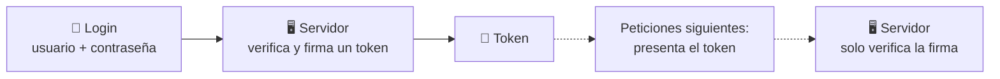

<a id="autenticacion-jwt"></a>

# 🧩 4. Autenticación con JWT

HTTP es un protocolo **sin estado**: cada petición llega sola, sin memoria de la anterior. El servidor no "recuerda" que hace un segundo te autenticaste — por eso, hasta ahora, cada petición ha tenido que volver a mandar usuario y contraseña. Hoy sustituyes eso por algo mejor.

---

## 🍪 Dos soluciones históricas al problema de "recordar quién eres"

### Sesión en el servidor

El servidor, tras el login, guarda en su propia memoria (o en una base de datos de sesiones) quién eres, y te entrega una **cookie** con un identificador de sesión. En cada petición posterior, mandas esa cookie, y el servidor busca en su almacén "¿quién es el dueño de esta sesión?".

Límite: el servidor tiene que **guardar** el estado de cada sesión activa — si tienes muchos servidores detrás de un balanceador, todos necesitan acceso a ese mismo almacén de sesiones, o coordinarse de alguna forma.

### Token autocontenido

El servidor no guarda nada. En el login, te entrega un **token**: un "carné" firmado que contiene, dentro de sí mismo, quién eres y qué puedes hacer. En cada petición posterior, presentas ese token, y el servidor solo necesita **verificar la firma** — no consultar ningún almacén de sesiones, porque toda la información ya viaja dentro del propio token.



**JWT** (*JSON Web Token*) es el formato estándar de ese token autocontenido, y es lo que vas a implementar hoy.

---

## ✍️ Qué significa "firmado"

Retoma la criptografía del apartado anterior: **firmar no es lo mismo que cifrar**. Firmar un dato no oculta su contenido — sigue siendo legible por cualquiera — pero garantiza dos cosas: que no se ha modificado desde que se firmó, y quién lo firmó (si conoces la clave de verificación). Un JWT está firmado, no cifrado: su contenido es legible por cualquiera que lo intercepte, pero nadie puede modificarlo sin invalidar la firma.

---

## 🧬 Anatomía de un JWT

Un JWT tiene tres partes separadas por puntos: `header.payload.signature`. Cada parte va codificada en Base64:

```
eyJhbGciOiJIUzI1NiJ9.eyJzdWIiOiJhZG1pbiIsInJvbGVzIjpbIkFETUlOIl19.SflKxwRJ...
└──────header───────┘└──────────payload──────────┘└───signature───┘
```

Decodifica el `payload` de cualquier JWT (por ejemplo, en [jwt.io](https://jwt.io) o con `base64 -d`) y verás algo como:

```json
{"sub": "admin", "roles": ["ADMIN"], "iat": 1730000000, "exp": 1730003600}
```

!!! danger "El contenido NO va cifrado"
    Cualquiera que capture un JWT puede leer su payload completo, sin necesitar ninguna clave — igual que decodificaste HTTP Basic en la Actividad 2.2. Lo que impide falsificarlo es la **firma** (la tercera parte), calculada con un algoritmo criptográfico (HMAC, en el ejemplo que vas a ver) y un secreto que solo conoce el servidor. Si alguien modificara el payload a mano, la firma dejaría de coincidir, y el servidor lo rechazaría.

---

## 🔑 El flujo completo, pieza a pieza

Siguiendo con la API de la librería: vas a ver las tres piezas que convierten el login en un token y ese token en identidad para el resto de peticiones.

### Generar el token: `JwtService`

```java
@Service
@RequiredArgsConstructor
public class JwtService {

    private final JwtEncoder jwtEncoder;

    @Value("${libreria.jwt.expiration-minutes}")
    private long expirationMinutes;

    public String generarToken(Authentication authentication) {
        Instant ahora = Instant.now();
        List<String> roles = authentication.getAuthorities().stream()
                .map(GrantedAuthority::getAuthority)
                .filter(a -> a.startsWith("ROLE_"))
                .map(a -> a.replace("ROLE_", ""))
                .toList();

        JwtClaimsSet claims = JwtClaimsSet.builder()
                .issuer("libreria")
                .issuedAt(ahora)
                .expiresAt(ahora.plusSeconds(expirationMinutes * 60))
                .subject(authentication.getName())
                .claim("roles", roles)
                .build();

        JwsHeader jwsHeader = JwsHeader.with(MacAlgorithm.HS256).build();
        return jwtEncoder.encode(JwtEncoderParameters.from(jwsHeader, claims)).getTokenValue();
    }
}
```

Los **claims** son los datos que viajan dentro del token: `subject` (quién eres), `roles` (qué puedes hacer, extraído de las autoridades que ya tenía la `Authentication` tras el login), `issuedAt`/`expiresAt` (cuándo se emitió y cuándo caduca). `jwtEncoder.encode(...)` firma todo esto con el algoritmo `HS256` (HMAC-SHA256) y el secreto configurado.

### El endpoint de login

```java
@RestController
@RequestMapping("/api/v1/auth")
@RequiredArgsConstructor
public class AuthController {

    private final AuthenticationManager authenticationManager;
    private final JwtService jwtService;

    @PostMapping("/login")
    public ResponseEntity<LoginResponseDTO> login(@Valid @RequestBody LoginRequestDTO dto) {
        Authentication authentication = authenticationManager.authenticate(
                new UsernamePasswordAuthenticationToken(dto.username(), dto.password())
        );
        String token = jwtService.generarToken(authentication);
        return ResponseEntity.ok(new LoginResponseDTO(token, "Bearer", jwtService.getExpiresInSeconds()));
    }
}
```

`AuthenticationManager.authenticate(...)` es quien verifica de verdad las credenciales — por debajo, usa el `UserDetailsService` y el `PasswordEncoder` que ya construiste en el apartado anterior. Si las credenciales son correctas, genera el token; si no, lanza una excepción (que `GlobalExceptionHandler`, de "Principios de programación segura", convierte en una respuesta coherente).

### El cambio de modo en `SecurityConfig`

```java
.sessionManagement(session -> session.sessionCreationPolicy(SessionCreationPolicy.STATELESS))
.authorizeHttpRequests(auth -> auth
        .requestMatchers(HttpMethod.POST, "/api/v1/auth/login").permitAll()
        .anyRequest().authenticated()
)
.oauth2ResourceServer(oauth2 -> oauth2.jwt(jwt -> jwt.jwtAuthenticationConverter(jwtAuthenticationConverter())))
.httpBasic(AbstractHttpConfigurer::disable)
```

`SessionCreationPolicy.STATELESS` es la consecuencia directa de usar tokens autocontenidos: con JWT no hace falta que el servidor guarde ninguna sesión, así que se lo dices explícitamente a Spring Security. `oauth2ResourceServer(oauth2 -> oauth2.jwt(...))` activa la validación de JWT en cada petición protegida — Spring verifica la firma automáticamente, usando el `JwtDecoder` configurado con el mismo secreto. `httpBasic(AbstractHttpConfigurer::disable)` retira oficialmente el mecanismo provisional de los apartados anteriores ("Seguridad básica" y "Usuarios persistidos y BCrypt"): JWT es ahora el único mecanismo de autenticación.

Sobre el secreto (`@Value("${libreria.jwt.secret}")`): sigue el mismo principio que viste en "Principios de programación segura" — nunca en el código, siempre en configuración externa (`application-dev.yaml`), para que en un entorno real ese valor pueda ser distinto y no viaje en el propio código fuente.

### `GET /api/v1/auth/me`

```java
@GetMapping("/me")
public ResponseEntity<AuthMeResponse> getCurrentUser() {
    Authentication authentication = SecurityContextHolder.getContext().getAuthentication();
    // construir la respuesta con authentication.getName() y sus roles
}
```

Un endpoint sencillo para verificar qué información viaja dentro de tu propio token: útil tanto para probar como para entender qué sabe el servidor de ti en cada petición autenticada.

---

## 🔒 HTTPS: lo que JWT resuelve y lo que no

JWT evita reenviar la contraseña en cada petición — un avance real. Pero el **canal** en sí sigue siendo el mismo: si no hay HTTPS, tanto el login como el propio token viajan en claro por la red, interceptables por cualquiera con acceso a esa red. La firma del JWT garantiza **integridad** (que no se ha modificado), no **confidencialidad del transporte** — son dos cosas distintas.

Monta HTTPS mínimo en tu entorno de desarrollo, con un certificado autofirmado. `keytool` es la herramienta de gestión de claves y certificados que viene incluida con el propio JDK — no hace falta instalar nada aparte:

```bash
keytool -genkeypair -alias miapp -keyalg RSA -keysize 2048 \
  -storetype PKCS12 -keystore keystore.p12 -validity 365
```

Y en `application-dev.yaml` (o un perfil `https` aparte, para no obligar al resto del curso a complicarse con certificados):

```yaml
server:
  ssl:
    key-store: classpath:keystore.p12
    key-store-password: tu-contraseña
    key-store-type: PKCS12
  port: 8443
```

Arranca y prueba:

```bash
curl -k -X POST https://localhost:8443/api/v1/auth/login \
  -H "Content-Type: application/json" -d '{"username":"admin","password":"admin123"}'
```

(`-k` le dice a `curl` que acepte el certificado autofirmado, que no está validado por ninguna autoridad reconocida — exactamente lo que pasaría si un usuario real visitara esta URL en un navegador, con su aviso de "conexión no segura").

En producción real, se usaría un certificado emitido por una autoridad certificadora (CA) reconocida, o se delegaría el TLS a un proxy/gateway (Nginx, un balanceador) que termina la conexión cifrada antes de reenviar al servidor de aplicación. El resto de este curso sigue trabajando en HTTP simple, sin HTTPS — es una simplificación deliberada para no complicar cada actividad con certificados, no la recomendación para un proyecto real.

---

## 🧭 Conexión con Acceso a Datos

Este mismo `Principal`/JWT es el que usará el `PUT` de reseñas con control de autoría que construirás en Acceso a Datos — el servidor sabrá quién eres a partir de este mismo token, sin que tengas que volver a autenticarte para esa operación.

---

## ✅ Ideas clave

??? tip "Abrir resumen"

    - HTTP es sin estado; la **sesión en servidor** (cookie + almacén) y el **token autocontenido** (JWT) son las dos soluciones clásicas para "recordar quién eres".
    - **Firmar ≠ cifrar**: un JWT es legible por cualquiera, pero su firma impide modificarlo sin que se detecte.
    - Un JWT tiene tres partes (`header.payload.signature`); los **claims** del payload llevan quién eres, tus roles y la expiración.
    - `SessionCreationPolicy.STATELESS` + `oauth2ResourceServer(...).jwt(...)` activan la validación automática de JWT; `httpBasic(disable)` retira el mecanismo provisional.
    - JWT resuelve el reenvío de contraseña en cada petición, pero **no** sustituye a HTTPS — la firma da integridad, no confidencialidad del canal.
