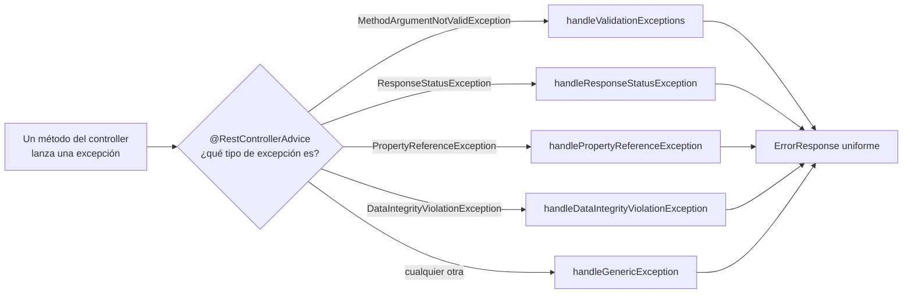

<a id="principios-programacion-segura"></a>

# 🧩 1. Principios de programación segura: validación y gestión de errores

Tu proyecto, tal y como está ahora, no comprueba quién hace las peticiones ni les pone ningún límite: cualquiera que sepa la URL puede leer, crear, modificar o borrar lo que quiera. Antes de tocar autenticación (eso empieza el apartado que viene), toca dar un paso atrás y preguntarse algo más básico: ¿qué significa exactamente que una aplicación sea "segura"?

!!! example "Un caso concreto, sin que haga falta ningún atacante experto"
    Manda un `POST /api/v1/videojuegos` con un `precio` negativo. Ya tienes `@Valid` desde Acceso a Datos, así que la petición se rechaza — pero mira la respuesta: un mensaje genérico en inglés, sin decirte qué campo ha fallado ni por qué. Ahora prueba a pedir un listado ordenado por un campo que no existe, algo como `?sort=noExiste,asc`: ahí ni siquiera hay rechazo controlado, lo que ves es una traza de pila completa. Ninguno de los dos casos necesita un atacante: basta con un cliente mal hecho, o con probar a mano.

Ese ejemplo, multiplicado por todos los puntos por los que algo externo entra en tu sistema, es justo lo que este apartado trata de arreglar — sin necesitar todavía ni un login.

---

## 🔒 Qué significa que una aplicación sea "segura"

La seguridad de una aplicación se apoya, clásicamente, en tres pilares:

| Pilar | En una aplicación web |
|---|---|
| **Confidencialidad** | Que nadie lea lo que no debe (datos de otro usuario, contraseñas...). |
| **Integridad** | Que nadie modifique lo que no debe (cambiar el precio de un producto ajeno, alterar un pedido). |
| **Disponibilidad** | Que el servicio siga funcionando (no se caiga por un ataque o un uso malintencionado). |

---

## 🎯 El modelo mental del atacante

El ejemplo de antes no necesitaba mala intención — pero ese mismo hueco, aceptar cualquier dato sin comprobarlo, es también la puerta favorita de quien sí actúa con mala intención. Toda API tiene una **superficie de ataque**: todo endpoint expuesto, todo dato de entrada que acepta, todo mensaje de error que devuelve — cualquier punto por el que algo externo puede interactuar con tu sistema es, potencialmente, un punto de ataque.

!!! warning "La regla de oro"
    **Nunca te fíes de lo que llega de fuera.** Todo dato de entrada es hostil hasta que se valida — no porque asumas mala fe de cada usuario, sino porque no controlas qué envía realmente el cliente: puede ser un formulario mal rellenado, un bug del cliente, o alguien probando deliberadamente a romper tu API.

---

## 🛡️ Principios generales de programación segura

La regla de oro de antes no se queda en una frase bonita: se traduce en varias decisiones concretas de diseño, antes incluso de escribir la primera línea de un endpoint.

- **Validar en la frontera**: comprobar los datos de entrada en el punto donde entran al sistema, antes de que lleguen a la lógica de negocio — no confiar en que "ya vendrán bien" desde el cliente.
- **Mínimo privilegio / mínima exposición**: por defecto, todo cerrado; se abre explícitamente solo lo necesario — no al revés.
- **No filtrar información interna en los errores**: un mensaje de error no debería revelar detalles de implementación (nombres de tablas, rutas del servidor, versiones de librerías) que ayuden a un atacante.
- **No guardar secretos en el código**: contraseñas, claves, tokens — nunca escritos directamente en una clase Java; viven en configuración externa.
- **Defensa en profundidad**: varias capas de protección, no una sola barrera — si una falla, las siguientes siguen ahí.

!!! tip "¿Y la contraseña de Postgres en tu propio `application-dev.yaml`?"
    Si te has fijado, tu GameVault incumple este principio desde el primer día (Acceso a Datos, Actividad 1.1): `password: password123` viaja en un fichero versionado, subido a tu repositorio. Aquí se deja así a propósito — esa base de datos vive dentro de la red privada de tu Dev Container, nadie fuera de tu propia máquina puede alcanzarla, así que filtrar esa contraseña concreta no compromete nada real (es una convención habitual incluso en proyectos reales, para servicios que nunca salen de un entorno local). La diferencia está en la **exposición**, no en el tipo de dato: si algún día desplegaras GameVault contra una base de datos en la nube (un Postgres de Supabase, por ejemplo, en vez del contenedor local), esa misma contraseña dejaría de ser inofensiva y pasaría a ser un secreto real — del mismo tipo que los que vas a manejar más adelante en este tema, cuando trabajes con autenticación.

Estos principios no son abstractos: detrás de cada uno hay un ataque real que previenen. Un vistazo rápido, sin profundizar todavía — irás viendo cada uno con más detalle a lo largo del tema:

| Ataque | En qué consiste |
|---|---|
| **Inyección** | Código que trata datos externos como si fueran código — ya lo has visto de primera mano en Acceso a Datos, con JDBC puro y `Statement`. |
| **Datos malformados** | Entradas que rompen la lógica de la aplicación si no se comprueban antes de usarlas. |
| **Fuerza bruta sobre logins** | Probar contraseñas una tras otra hasta acertar. |
| **Robo de credenciales en tránsito** | Interceptar datos sensibles mientras viajan por la red. |

---

## 🛠️ Dos prácticas concretas

De los cinco principios anteriores, hoy vas a convertir dos en código real: validar en la frontera y no filtrar información en los errores. Los otros tres —mínima exposición, no guardar secretos, defensa en profundidad— los vas a ver materializados en los próximos apartados, cuando entre en juego la autenticación (lo tienes resumido al final de esta página, en "Lo que viene"). Siguiendo con la API de la librería que ya conoces:

### Validación de entrada con Bean Validation

Las anotaciones de Bean Validation (`@NotBlank`, `@NotNull`, `@PositiveOrZero`...) ya las conoces — las has usado para construir tu CRUD en Acceso a Datos. Lo que falta es decirles qué mensaje devolver cuando fallan, con el atributo `message`:

```java
public record LibroCreateDTO(
        @NotBlank(message = "El título no puede estar vacío")
        @Size(max = 150)
        String titulo,

        @NotNull
        @PositiveOrZero(message = "El precio no puede ser negativo")
        BigDecimal precio,
        // ...
) {}
```

Sin `message`, cada anotación usa su texto por defecto — genérico, y en inglés (`must not be blank`, por ejemplo). Con él, la respuesta dice exactamente lo que tú decidas, en el idioma que quieras.

El `create(...)` del controller ya tiene `@Valid` sobre este DTO, así que nada cambia en esa parte: `@Valid` activa la comprobación de estas anotaciones **antes** de que el cuerpo del método se ejecute — si algo no cumple, ni siquiera llega a tu lógica de negocio. Esto es "validar en la frontera" hecho código: el dato hostil se rechaza en la puerta, no dentro de la casa.

### Gestión centralizada de errores

Sin nada más, cuando una validación falla, Spring devuelve una respuesta por defecto — funcional, pero poco cuidada y potencialmente reveladora. La solución pasa por centralizar la conversión de excepciones en un único punto, en vez de que cada método decida por su cuenta qué responder. Antes de escribir ningún handler, hace falta un formato común: así, sea cual sea el error, el cliente siempre recibe la misma forma.

```java
public record ErrorResponse(
        String timestamp,
        int status,
        String error,
        String message,
        String path,
        Map<String, List<String>> fields
) {
    public ErrorResponse(String timestamp, int status, String error, String message, String path) {
        this(timestamp, status, error, message, path, Map.of());
    }
}
```

| Campo | Qué guarda |
|---|---|
| `timestamp` | Cuándo ha ocurrido el error. |
| `status` | El código HTTP, repetido también en el cuerpo, no solo en la cabecera. |
| `error` | Nombre corto del error ("Error de validación", "Not Found"...). |
| `message` | Explicación legible, pensada para quien consume la API. |
| `path` | La ruta que se ha pedido, para saber qué endpoint ha fallado. |
| `fields` | Solo se rellena en errores de validación: qué campo ha fallado y con qué mensajes — puede haber más de uno por campo, si incumple varias reglas a la vez. El segundo constructor, sin `fields`, la deja vacía para el resto de errores. |

Con esa forma decidida, `@RestControllerAdvice` es la anotación que la pone en marcha de verdad: marca una clase como punto **transversal**, que intercepta las excepciones de **todos** los controllers de la aplicación, no de uno solo. Dentro, cada método marcado con `@ExceptionHandler(TipoDeExcepcion.class)` decide qué tipo de excepción atrapa y cómo la convierte en un `ErrorResponse`.



Vas a construir la clase con sus cinco handlers uno a uno — cada uno responde a una excepción que ya conoces de algún sitio.

#### Handler 1: la validación que acabas de ver

Es el que atrapa lo que provoca `@Valid` cuando `LibroCreateDTO` no cumple alguna de sus anotaciones:

```java
@ExceptionHandler(MethodArgumentNotValidException.class)
public ResponseEntity<ErrorResponse> handleValidationExceptions(
        MethodArgumentNotValidException ex, HttpServletRequest request) {

    Map<String, List<String>> fields = ex.getBindingResult().getFieldErrors().stream()
            .collect(Collectors.groupingBy(
                    FieldError::getField,
                    Collectors.mapping(FieldError::getDefaultMessage, Collectors.toList())
            ));

    ErrorResponse response = new ErrorResponse(
            LocalDateTime.now().toString(), 400, "Error de validación",
            "La petición contiene campos inválidos", request.getRequestURI(), fields
    );
    return ResponseEntity.status(HttpStatus.BAD_REQUEST).body(response);
}
```

`ex.getBindingResult().getFieldErrors()` es la lista de campos que han fallado la validación, con el mensaje que tú mismo has escrito en el DTO (`message = "..."`). `Collectors.groupingBy` la convierte en un mapa campo → lista de mensajes: si un mismo campo incumple dos anotaciones a la vez —por ejemplo, `@NotBlank` y `@Size` sobre el mismo `titulo`— aparecen los dos mensajes, no solo el primero.

#### Handler 2: los errores que ya lanzas tú explícitamente

Este atrapa `ResponseStatusException`, la misma excepción que usas en el service al escribir `orElseThrow(() -> new ResponseStatusException(HttpStatus.NOT_FOUND, "..."))`. El resultado ya te suena: es el mismo `404` que has visto en el Tema 1 al pedir un `id` que no existe — solo que ahora pasa por este único punto, en vez de construirse "a mano" en cada sitio donde podría lanzarse.

```java
@ExceptionHandler(ResponseStatusException.class)
public ResponseEntity<ErrorResponse> handleResponseStatusException(
        ResponseStatusException ex, HttpServletRequest request) {

    int statusCode = ex.getStatusCode().value();
    HttpStatus status = HttpStatus.resolve(statusCode);
    String error = status != null ? status.getReasonPhrase() : "Error";
    String message = ex.getReason() != null ? ex.getReason() : error;

    ErrorResponse response = new ErrorResponse(
            LocalDateTime.now().toString(), statusCode, error, message, request.getRequestURI()
    );
    return ResponseEntity.status(ex.getStatusCode()).body(response);
}
```

Aquí el código de estado no está fijo, al contrario que en el handler anterior (siempre `400`): sale de la propia excepción, con `ex.getStatusCode()`, porque un `ResponseStatusException` puede llevar cualquier código que tú hayas decidido al lanzarla — no solo `404`.

#### Handler 3: un parámetro que Spring Data no sabe interpretar

El tercero viene motivado por un problema real, no teórico: en Acceso a Datos, Actividad 1.5 (Specifications y paginación), pedir un listado ordenado por un campo que no existe en la entidad —por ejemplo `?sort=noExiste,asc`— lanza `PropertyReferenceException` (`org.springframework.data.core`): Spring Data intenta traducir ese nombre de campo a una propiedad real de tu entidad, y no la encuentra. Sin capturarla, cae en exactamente lo que este apartado lleva rato evitando: una traza de pila filtrada al cliente, con un `500` que además es el código equivocado — el problema es que el **cliente** ha pedido algo que no existe, no que el servidor haya fallado.

```java
@ExceptionHandler(PropertyReferenceException.class)
public ResponseEntity<ErrorResponse> handlePropertyReferenceException(
        PropertyReferenceException ex, HttpServletRequest request) {

    ErrorResponse response = new ErrorResponse(
            LocalDateTime.now().toString(), 400, "Parámetro inválido",
            "Uno de los parámetros de la consulta no es válido", request.getRequestURI()
    );
    return ResponseEntity.status(HttpStatus.BAD_REQUEST).body(response);
}
```

A diferencia del primer handler, aquí no hay un campo concreto que señalar —la excepción no identifica el parámetro que ha fallado con la misma precisión que `FieldError`—, así que el mensaje es fijo. Sigue siendo mucho mejor que una traza de pila de servidor.

#### Handler 4: una restricción que solo existe en la base de datos

Bean Validation comprueba lo que puede comprobar sin tocar la base de datos — pero una clave foránea solo existe ahí, y ninguna anotación puede replicarla. Dos ejemplos de tu propio GameVault, con destinos muy distintos:

| Operación | ¿Algo lo comprueba antes de llegar a la base de datos? | Qué pasa |
|---|---|---|
| `POST /videojuegos` con un `estudioId` inexistente | Sí — `VideojuegoService.create()` hace `orElseThrow` sobre el `Estudio` | Nunca llega a la base de datos: se queda en un `404` controlado (Handler 2) |
| `DELETE /estudios/{id}` sobre un `Estudio` con `Videojuego`s asociados | Solo si tu `@OneToMany` tiene `cascade`/`orphanRemoval` — y eso lo resuelve JPA, no una comprobación tuya | Sin ese `cascade`, la clave foránea rechaza el borrado de verdad |

El segundo caso es el que vas a provocar tú mismo en la actividad, comentando ese `cascade` un momento. Es el mismo principio de **defensa en profundidad** que has visto al principio de este apartado: la comprobación explícita (o el `cascade` automático) es la primera barrera; la clave foránea es la segunda, por si el día de mañana algo se salta la primera. Este handler es lo que convierte esa segunda barrera en una respuesta útil, en vez de un `500` en blanco.

```java
@ExceptionHandler(DataIntegrityViolationException.class)
public ResponseEntity<ErrorResponse> handleDataIntegrityViolationException(
        DataIntegrityViolationException ex, HttpServletRequest request) {

    ErrorResponse response = new ErrorResponse(
            LocalDateTime.now().toString(), 409, "Conflicto de datos",
            "La operación viola una restricción de la base de datos (una referencia que no existe, un registro del que aún dependen otros, un valor duplicado, etc.)",
            request.getRequestURI()
    );
    return ResponseEntity.status(HttpStatus.CONFLICT).body(response);
}
```

Aquí cambia también el código de estado: `409 Conflict`, no `400`. La diferencia es sutil pero real — un `400` dice "tu petición está mal construida"; un `409` dice "tu petición está bien construida, pero choca con el estado actual de los datos" (ese `estudioId` podría ser válido para *otro* videojuego, el problema es que ahora mismo no existe). Es el mismo tipo de fallo que provoca una clave foránea que no encaja al insertar directamente en la base de datos, solo que aquí puede ocurrir en caliente, con cualquier petición HTTP normal, no solo al cargar datos a mano.

#### Handler 5: la red de seguridad final

Los cuatro handlers anteriores cubren tipos concretos de error. Pero cualquier excepción que no sea ninguno de esos —un bug en tu propio código, por ejemplo— no tiene quién la atrape, y cae directamente en el manejo por defecto de Spring: la misma fuga de información que este apartado lleva rato evitando. Un último handler, genérico, cierra ese hueco:

```java
@ExceptionHandler(Exception.class)
public ResponseEntity<ErrorResponse> handleGenericException(
        Exception ex, HttpServletRequest request) {

    ErrorResponse response = new ErrorResponse(
            LocalDateTime.now().toString(), 500, "Error interno",
            "Ha ocurrido un error inesperado", request.getRequestURI()
    );
    return ResponseEntity.status(HttpStatus.INTERNAL_SERVER_ERROR).body(response);
}
```

!!! warning "No devuelvas `ex.getMessage()` aquí"
    Es tentador pasarle al cliente el mensaje real de la excepción, para depurar más rápido — pero ese mensaje puede contener justo lo que este apartado lleva rato evitando: nombres de clases, de tablas, rutas internas. Usa siempre un mensaje fijo como el de arriba. El `ex` real solo debería acabar en un sitio donde solo tú lo veas (un logger del lado del servidor, algo que queda fuera del alcance de hoy), nunca en el cuerpo de la respuesta.

#### Todo junto

Con los cinco handlers ya explicados por separado, así queda la clase completa:

```java
@RestControllerAdvice
public class GlobalExceptionHandler {

    @ExceptionHandler(MethodArgumentNotValidException.class)
    public ResponseEntity<ErrorResponse> handleValidationExceptions(
            MethodArgumentNotValidException ex, HttpServletRequest request) {

        Map<String, List<String>> fields = ex.getBindingResult().getFieldErrors().stream()
                .collect(Collectors.groupingBy(
                        FieldError::getField,
                        Collectors.mapping(FieldError::getDefaultMessage, Collectors.toList())
                ));

        ErrorResponse response = new ErrorResponse(
                LocalDateTime.now().toString(), 400, "Error de validación",
                "La petición contiene campos inválidos", request.getRequestURI(), fields
        );
        return ResponseEntity.status(HttpStatus.BAD_REQUEST).body(response);
    }

    @ExceptionHandler(ResponseStatusException.class)
    public ResponseEntity<ErrorResponse> handleResponseStatusException(
            ResponseStatusException ex, HttpServletRequest request) {

        int statusCode = ex.getStatusCode().value();
        HttpStatus status = HttpStatus.resolve(statusCode);
        String error = status != null ? status.getReasonPhrase() : "Error";
        String message = ex.getReason() != null ? ex.getReason() : error;

        ErrorResponse response = new ErrorResponse(
                LocalDateTime.now().toString(), statusCode, error, message, request.getRequestURI()
        );
        return ResponseEntity.status(ex.getStatusCode()).body(response);
    }

    @ExceptionHandler(PropertyReferenceException.class)
    public ResponseEntity<ErrorResponse> handlePropertyReferenceException(
            PropertyReferenceException ex, HttpServletRequest request) {

        ErrorResponse response = new ErrorResponse(
                LocalDateTime.now().toString(), 400, "Parámetro inválido",
                "Uno de los parámetros de la consulta no es válido", request.getRequestURI()
        );
        return ResponseEntity.status(HttpStatus.BAD_REQUEST).body(response);
    }

    @ExceptionHandler(DataIntegrityViolationException.class)
    public ResponseEntity<ErrorResponse> handleDataIntegrityViolationException(
            DataIntegrityViolationException ex, HttpServletRequest request) {

        ErrorResponse response = new ErrorResponse(
                LocalDateTime.now().toString(), 409, "Conflicto de datos",
                "La operación viola una restricción de la base de datos (una referencia que no existe, un registro del que aún dependen otros, un valor duplicado, etc.)",
                request.getRequestURI()
        );
        return ResponseEntity.status(HttpStatus.CONFLICT).body(response);
    }

    @ExceptionHandler(Exception.class)
    public ResponseEntity<ErrorResponse> handleGenericException(
            Exception ex, HttpServletRequest request) {

        ErrorResponse response = new ErrorResponse(
                LocalDateTime.now().toString(), 500, "Error interno",
                "Ha ocurrido un error inesperado", request.getRequestURI()
        );
        return ResponseEntity.status(HttpStatus.INTERNAL_SERVER_ERROR).body(response);
    }
}
```

Resumen de los cinco, de un vistazo:

| Handler | Qué atrapa | Cuándo salta |
|---|---|---|
| `handleValidationExceptions` | `MethodArgumentNotValidException` | Un DTO con `@Valid` no cumple sus anotaciones (`@NotBlank`, `@PositiveOrZero`...) |
| `handleResponseStatusException` | `ResponseStatusException` | Un `orElseThrow(...)` lanza un `404`, u otro código que hayas decidido tú explícitamente |
| `handlePropertyReferenceException` | `PropertyReferenceException` | Spring Data recibe un parámetro que no sabe interpretar — por ejemplo, un `sort` sobre un campo que no existe |
| `handleDataIntegrityViolationException` | `DataIntegrityViolationException` | La base de datos rechaza la operación — una clave foránea que no existe, un registro del que aún dependen otros, un valor duplicado, etc. |
| `handleGenericException` | `Exception` | Cualquier otra excepción no prevista — la red de seguridad final |

!!! danger "Lo que este handler evita filtrar"
    Sin él, una excepción no controlada puede acabar devolviendo al cliente una traza de pila completa: nombres de clases internas, de tablas, incluso versiones de librerías. Eso es información gratis para un atacante sobre cómo está construido tu sistema por dentro. `GlobalExceptionHandler` garantiza que, pase lo que pase, el cliente solo ve el mensaje controlado que tú decides — nunca los detalles internos.

---

## 🗺️ Lo que viene

El resto de este tema va a materializar, uno a uno, los principios que has visto hoy: mínima exposición se convierte en rutas cerradas por defecto ("Roles, rutas protegidas y tests de seguridad"), no guardar secretos en el código se convierte en el `jwt.secret` como propiedad externa ("Autenticación con JWT"), no almacenar contraseñas en claro se convierte en BCrypt ("Usuarios persistidos y BCrypt"). Hoy has visto los principios; en los próximos apartados les pones nombre y apellido en Spring Security.

---

## ✅ Ideas clave

??? tip "Abrir resumen"

    - Los tres pilares clásicos de la seguridad: **confidencialidad**, **integridad**, **disponibilidad**.
    - La **superficie de ataque** es todo punto por el que algo externo interactúa con tu sistema; la regla de oro es no fiarse nunca de los datos de entrada.
    - Principios clave: validar en la frontera, mínima exposición, no filtrar información en los errores, no guardar secretos en el código, defensa en profundidad.
    - `@Valid` + anotaciones de `jakarta.validation` en los DTOs validan la entrada antes de que llegue a la lógica de negocio.
    - `@RestControllerAdvice` + `@ExceptionHandler` centralizan la conversión de excepciones en respuestas HTTP coherentes, sin filtrar detalles internos.
    - Cinco handlers cubren los casos que ya conoces: `MethodArgumentNotValidException` (validación), `ResponseStatusException` (404 y similares), `PropertyReferenceException` (parámetros de consulta que Spring Data no sabe interpretar, como un `sort` sobre un campo que no existe), `DataIntegrityViolationException` (restricciones que solo existen en la base de datos, como una clave foránea) y, como red de seguridad final, `Exception` genérica — todos devuelven un código y un formato coherente en vez del `500` genérico por defecto, sin filtrar nunca el mensaje real de la excepción al cliente.
