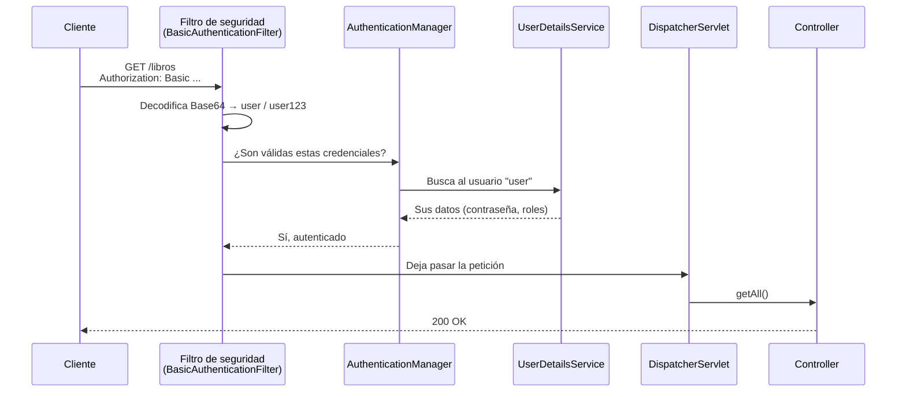
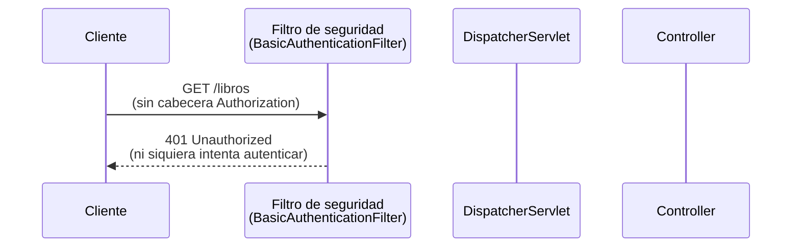
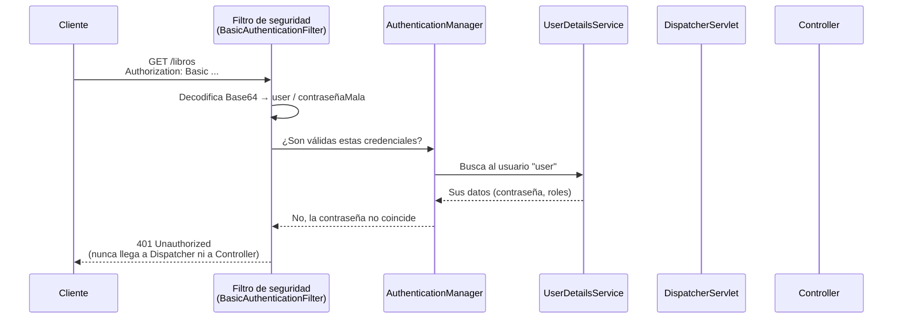

<a id="seguridad-basica-http-basic"></a>

# 🧩 2. Seguridad básica: usuarios en memoria y HTTP Basic

!!! tip "¿Por qué empezar por algo que vas a sustituir?"
    Lo que ves en este apartado —usuarios en memoria y HTTP Basic— no es la versión final: dentro de dos apartados no quedará ni rastro de ninguna de las dos piezas. Puede parecer que se pierde tiempo construyendo algo que se va a borrar, pero es al revés: los problemas concretos de esta versión (los vas a ver explícitamente más abajo) son justo los que motivan lo que viene después. Si empezaras directamente por la versión final —contraseñas cifradas, autenticación con token— tendrías un código que funciona, pero no sabrías responder a "¿por qué hace falta cifrar la contraseña?" o "¿por qué no basta con mandar usuario y contraseña en cada petición?": esas respuestas solo se entienden habiendo visto antes la versión sin esa pieza, y el problema real que causa. El camino completo es: usuarios en memoria y HTTP Basic (aquí), contraseñas cifradas con BCrypt en base de datos (próximo apartado), autenticación con JWT (dos apartados más adelante) — cada paso resuelve un problema concreto del anterior.

---

## 🔒 Lo primero que hace Spring Security: cerrarlo todo

**Spring Security** es el framework de seguridad del propio ecosistema Spring: una librería que se encarga de comprobar quién hace cada petición y qué tiene permiso para hacer, en vez de que tengas que escribir ese código a mano en cada controller. Se instala como una dependencia más de Maven, igual que `spring-boot-starter-webmvc` o `spring-boot-starter-data-jpa` — pero con una diferencia importante frente a esas otras: en cuanto está en el proyecto, empieza a actuar sola, con un comportamiento por defecto muy estricto, sin que hayas escrito ni una línea de configuración propia todavía.

Hasta ahora, la API de la librería respondía a cualquiera que le preguntara. Imagina que, sobre ese proyecto, añadieras la dependencia `spring-boot-starter-security` al `pom.xml` y reiniciaras, sin tocar nada más — y repitieras la misma petición de siempre:

```bash
curl -i http://localhost:8080/api/v1/libros
```

Antes de esa dependencia, esta petición daba un `200` con el catálogo. Con Spring Security ya en el proyecto, la respuesta pasa a ser un `401 Unauthorized`, sin cuerpo útil, y con una cabecera nueva: `WWW-Authenticate: Basic realm="Realm"`. **Toda** la API deja de responder libremente de golpe — cada petición exige autenticarse, incluida la que hace un momento era pública. Es el principio de "mínima exposición" que has visto en el apartado anterior, llevado al extremo por defecto: Spring Security asume que, si no se le dice explícitamente qué dejar abierto, todo debe estar cerrado.

Eso lo consigue insertando un **filtro** delante de todos los controllers — un filtro, en Spring, es una pieza que intercepta la petición HTTP antes de que llegue al código de la aplicación, la inspecciona (o la modifica), y decide si la deja continuar o la corta ahí mismo. Spring Security no añade uno, sino una cadena entera de ellos (la *filter chain*), y el primero que se encuentra cualquier petición es uno que, por defecto, exige credenciales válidas antes de dejarla pasar.

---

## 🚦 Dónde encaja Spring Security en una petición

Antes de tocar código, conviene ver el mapa completo: por dónde pasa una petición desde que sale del cliente hasta que llega al `Controller`, y qué pieza decide, en cada paso, si la deja continuar. Mejor verlo en tres pasos, de menos a más complicado, que de golpe.

### 1. Cuando todo va bien



El filtro intercepta la petición y decodifica la cabecera; el `AuthenticationManager` coordina la comprobación; el `UserDetailsService` es quien de verdad sabe si ese usuario existe y con qué contraseña y roles. Si todo eso sale bien, la petición llega al `DispatcherServlet` — la pieza de Spring MVC que recibe **todas** las peticiones de tu aplicación, sin excepción, y decide a qué método de qué controller mandar cada una, mirando la URL y el verbo HTTP contra las anotaciones `@GetMapping`/`@PostMapping` que ya conoces. Es el mismo mecanismo que llevas usando desde tu primer `@RestController`, solo que hasta ahora nunca lo habías visto actuar de forma explícita, porque siempre acertaba sin que hicieras nada especial. Con Spring Security delante, el `DispatcherServlet` sigue haciendo exactamente lo mismo que siempre — lo único que cambia es que, antes de llegar hasta él, la petición ahora tiene que pasar primero el control del filtro.

### 2. Sin ninguna cabecera `Authorization`

El fallo más simple: la petición no trae credenciales de ningún tipo.



Fíjate en quién falta en este diagrama: ni `AuthenticationManager` ni `UserDetailsService` llegan a aparecer. Sin nada que comprobar, el filtro ni se molesta en preguntar — corta directamente, antes de que la petición se acerque siquiera al `DispatcherServlet`.

### 3. Credenciales incorrectas

El caso menos evidente: la petición sí trae una cabecera `Authorization`, con forma correcta, pero el usuario no existe o la contraseña no coincide.



Este es casi idéntico al del punto 1 hasta el penúltimo paso — el filtro sí pregunta, `AuthenticationManager` sí consulta al `UserDetailsService`, todo el circuito se recorre igual — y solo al final cambia la respuesta. El resultado es el mismo `401` que en el punto 2, pero el camino para llegar hasta ahí es bastante más largo.

En los tres casos, algo no cambia nunca: el filtro de seguridad actúa **antes** que el `DispatcherServlet`. Cuando falla —le falten credenciales o le sobren credenciales equivocadas—, la petición nunca llega a pisar tu `Controller`, ni ningún otro código de la aplicación, y el `401` lo construye Spring Security por su cuenta.

!!! note "Queda pendiente un tercer tipo de fallo: el `403`"
    Los tres diagramas de arriba son todos sobre **autenticación** (¿quién eres?): o se resuelve, o no. Pero hay un cuarto caso que no aparece aquí: credenciales perfectamente válidas, de un usuario real, que simplemente no tiene permiso para *esa* ruta en concreto — eso ya no es autenticación, es **autorización**, y da un `403 Forbidden`, no un `401`. Ese caso lo trabajarás a fondo más adelante en el tema, con su propia comparación `401` vs `403`.

---

## 🎭 Autenticación vs. autorización

Dos preguntas distintas, que conviene no confundir:

| | Pregunta que responde | Ejemplo |
|---|---|---|
| **Autenticación** | ¿Quién eres? | Comprobar que el usuario y la contraseña son correctos. |
| **Autorización** | ¿Puedes hacer esto? | Comprobar que, siendo tú, tienes permiso para borrar un libro del catálogo. |

Puedes estar autenticado (Spring Security sabe quién eres) y aun así no autorizado para una acción concreta (no tienes el rol necesario). Son dos capas distintas, y las vas a ver aplicadas por separado.

Piensa en la tarjeta de acceso de un edificio de oficinas: en la entrada, un lector comprueba que la tarjeta es tuya y está activa — eso es autenticación, y pasa una sola vez, al entrar. Pero esa misma tarjeta puede abrirte la puerta de tu planta y no la del laboratorio del piso de arriba — eso es autorización, y se comprueba cada vez que intentas abrir una puerta concreta, no solo al entrar al edificio. Spring Security separa las dos cosas igual: `httpBasic(...)` resuelve la autenticación (la petición trae credenciales válidas); `authorizeHttpRequests(...)`, que ves un poco más abajo, resuelve la autorización (esas credenciales, en concreto, tienen permiso para *esta* ruta).

---

## 📦 HTTP Basic: cómo viaja usuario y contraseña

**HTTP Basic** es el mecanismo de autenticación más simple de HTTP: el cliente manda usuario y contraseña en una cabecera `Authorization`, codificados en **Base64** — un sistema que convierte cualquier secuencia de bytes en texto imprimible, para que quepa sin problemas dentro de una cabecera HTTP. La construcción es mecánica, sin ningún secreto de por medio:

```
"user:user123"  →  codificar en Base64  →  "dXNlcjp1c2VyMTIz"
```

Usuario y contraseña, separados por `:`, codificados de un tirón. Así queda la cabecera completa:

```
Authorization: Basic dXNlcjp1c2VyMTIz
```

!!! danger "Base64 NO es cifrado"
    Si decodificaras esa cabecera —`echo "dXNlcjp1c2VyMTIz" | base64 -d`— obtendrías `user:user123`, en texto legible. Base64 es solo una **codificación** (una forma de representar bytes como texto), no una forma de ocultar información: cualquiera que intercepte esa cabecera lee la contraseña directamente. HTTP Basic solo es aceptable sobre una conexión cifrada con HTTPS — sin eso, la contraseña viaja prácticamente en claro en cada petición.

---

## 🧑‍🤝‍🧑 Usuarios en memoria y una primera política de rutas

Para empezar, sin base de datos todavía de por medio, Spring Security permite declarar usuarios directamente en código con `InMemoryUserDetailsManager` — es la pieza que en el diagrama de antes aparecía como `UserDetailsService`: quien responde cuando el `AuthenticationManager` pregunta "¿quién es el usuario `user`, y con qué contraseña y roles?".

```java
@Bean
public UserDetailsService userDetailsService() {
    UserDetails user = User.withUsername("user")
            .password("{noop}user123")
            .roles("USER")
            .build();

    UserDetails admin = User.withUsername("admin")
            .password("{noop}admin123")
            .roles("ADMIN")
            .build();

    return new InMemoryUserDetailsManager(user, admin);
}
```

El prefijo `{noop}` le dice a Spring Security "esta contraseña no está cifrada, compárala tal cual" — una simplificación deliberada para este paso intermedio (en el próximo apartado la sustituyes por contraseñas de verdad protegidas con BCrypt).

!!! tip "`.roles("USER")` no es literalmente el rol"
    Por debajo, Spring Security le añade el prefijo `ROLE_`: el rol real que queda registrado es `ROLE_USER`, no `USER`. No tienes que escribir ese prefijo tú mismo —`.roles("USER")` ya se encarga de añadirlo—, pero si más adelante lo comparas a mano en algún sitio (o ves `ROLE_USER` en un log o en un test), ya sabes de dónde sale.

Y una primera política de acceso, con `authorizeHttpRequests`:

```java
@Bean
public SecurityFilterChain securityFilterChain(HttpSecurity http) throws Exception {
    return http
            .authorizeHttpRequests(auth -> auth
                    .requestMatchers(HttpMethod.GET, "/api/v1/libros/**").permitAll()
                    .anyRequest().authenticated()
            )
            .csrf(AbstractHttpConfigurer::disable)
            .httpBasic(Customizer.withDefaults())
            .build();
}
```

Léela como una lista de reglas, de arriba abajo:

| Pieza | Qué significa |
|---|---|
| `.requestMatchers(HttpMethod.GET, "/api/v1/libros/**")` | Esta regla se aplica solo a peticiones `GET` bajo `/api/v1/libros/` (el `**` cubre cualquier cosa después, incluidos sub-recursos). |
| `.permitAll()` | Esa regla concreta no exige ninguna autenticación — pasan hasta las peticiones anónimas. |
| `.anyRequest()` | La regla "para todo lo demás" — solo se aplica a lo que ninguna regla anterior haya capturado ya. |
| `.authenticated()` | Exige estar autenticado (con cualquier usuario válido, sin mirar el rol todavía). |
| `.csrf(AbstractHttpConfigurer::disable)` | Desactiva la protección CSRF (ver aviso justo debajo). |
| `.httpBasic(Customizer.withDefaults())` | Activa HTTP Basic como mecanismo de autenticación — es lo que registra el `BasicAuthenticationFilter` del diagrama de antes en la cadena de filtros. |

!!! warning "El orden importa: gana la primera regla que encaje"
    Spring Security evalúa las reglas de `authorizeHttpRequests` de arriba abajo, y aplica la **primera** que encaje con la petición — no la más específica, la primera en el código. Si pusieras `.anyRequest().authenticated()` antes que la regla de `/api/v1/libros/**`, esa segunda regla nunca llegaría a aplicarse: `anyRequest()` ya lo captura todo. Por eso las reglas más concretas (una ruta exacta) van siempre antes que las más generales (`anyRequest()`), nunca al revés.

!!! warning "Por qué hace falta `.csrf(AbstractHttpConfigurer::disable)`"
    Sin esta línea, cualquier `POST`/`PUT`/`DELETE` te va a devolver un `401` desconcertante **aunque mandes las credenciales correctas** — incluso antes de que Spring Security llegue a comprobarlas. CSRF (*Cross-Site Request Forgery*) es una protección pensada para aplicaciones que autentican con cookies de sesión automáticas del navegador: evita que una web maliciosa aproveche que ya estás logueado en otra pestaña para enviar peticiones en tu nombre sin que te enteres. Como Spring Security crea sesión por defecto, esa protección está activa aunque tu API no la necesite —te autenticas con una cabecera `Authorization` explícita en cada petición, no con una cookie que el navegador manda solo—, y el filtro de CSRF actúa *antes* que el filtro de HTTP Basic en la cadena, así que corta la petición sin haber llegado siquiera a mirar tus credenciales. Desactivarlo es lo normal en una API REST como esta.

Esta es una versión simplificada — lectura del catálogo pública, todo lo demás exige estar autenticado — de la matriz de rutas completa que construirás más adelante en el tema. Los roles `ADMIN` y `USER` que acabas de usar son los mismos que vas a formalizar más adelante como un enum `RolUsuario` — solo esos dos valores, sin más complicación.

---

## 🩹 Cerrando la grieta: `AuthenticationEntryPoint`

Prueba a pedir una ruta protegida sin credenciales y mira el cuerpo del `401` que recibes: no tiene el formato de tu `ErrorResponse` (`timestamp`, `status`, `error`, `message`, `path`) — es la respuesta por defecto de Spring Security. La razón es la misma que separaba, en el apartado anterior, las excepciones que sí atrapa tu `@RestControllerAdvice` de las que no: este `401` lo genera un filtro de seguridad, **antes** de que la petición llegue al `DispatcherServlet` — tu `GlobalExceptionHandler` nunca llega a intervenir. Un séptimo `@ExceptionHandler` no serviría de nada: ese código nunca se ejecuta para este caso, porque la petición no llega tan lejos.

Spring Security tiene su propia pieza para el mismo trabajo, con otro nombre: un **`AuthenticationEntryPoint`**. Es una interfaz con un único método, `commence(...)`, que Spring Security llama exactamente cuando una petición no autenticada intenta entrar en una ruta protegida — el mismo momento en el que, sin esta pieza, se genera la respuesta por defecto que acabas de ver.

```java
@Component
public class ErrorResponseAuthenticationEntryPoint implements AuthenticationEntryPoint {

    private final ObjectMapper objectMapper = new ObjectMapper();

    @Override
    public void commence(HttpServletRequest request, HttpServletResponse response,
                          AuthenticationException authException) throws IOException {

        ErrorResponse error = new ErrorResponse(
                LocalDateTime.now().toString(), HttpStatus.UNAUTHORIZED.value(),
                "No autenticado", "Se requieren credenciales válidas para acceder a este recurso",
                request.getRequestURI()
        );

        response.setStatus(HttpStatus.UNAUTHORIZED.value());
        response.setContentType(MediaType.APPLICATION_JSON_VALUE);
        response.getWriter().write(objectMapper.writeValueAsString(error));
    }
}
```

!!! tip "No hace falta memorizar esto"
    Esta clase es prácticamente idéntica en cualquier proyecto Spring Security que quiera dar errores coherentes — cambia poco más que el mensaje del `ErrorResponse`. No merece la pena memorizar la sintaxis exacta de `commence(...)` ni los detalles de `HttpServletResponse`; lo que importa es entender **qué hace y por qué hace falta**: que Spring Security tiene su propio punto de entrada para este caso, fuera del circuito normal de tu `GlobalExceptionHandler`. El código, cuando lo necesites, se copia y se adapta — es la misma idea en todos los proyectos.

Fíjate en la diferencia con un `@ExceptionHandler` normal: ahí devuelves un `ResponseEntity<ErrorResponse>` y Spring MVC se encarga solo de convertirlo a JSON. Aquí no hay ningún `ResponseEntity` — trabajas directamente sobre `HttpServletResponse`, la clase de bajo nivel que representa la respuesta HTTP en crudo, porque `commence(...)` se ejecuta **antes** de que exista ningún mecanismo de Spring MVC que convierta objetos a JSON por ti. Por eso el método construye su propio `ObjectMapper` (la misma clase de Jackson que usa Spring MVC por debajo) y llama a `writeValueAsString(...)` a mano.

Falta un último paso: decirle a Spring Security que use esta pieza en vez de la suya por defecto. Se registra en el mismo `securityFilterChain` que has visto un poco más arriba, añadiendo un bloque nuevo:

```java
@Bean
public SecurityFilterChain securityFilterChain(HttpSecurity http, AuthenticationEntryPoint customAuthenticationEntryPoint) throws Exception {
    return http
            .authorizeHttpRequests(auth -> auth
                    .requestMatchers(HttpMethod.GET, "/api/v1/libros/**").permitAll()
                    .anyRequest().authenticated()
            )
            .exceptionHandling(exceptions -> exceptions
                    .authenticationEntryPoint(customAuthenticationEntryPoint)
            )
            .csrf(AbstractHttpConfigurer::disable)
            .httpBasic(Customizer.withDefaults())
            .build();
}
```

Fíjate en que `.httpBasic(Customizer.withDefaults())` no cambia — sigue activando HTTP Basic exactamente igual que antes. La pieza nueva vive en `.exceptionHandling(...)`, un bloque **independiente de qué mecanismo de autenticación esté activo**: le dice a Spring Security "cuando falle cualquier autenticación, consulta primero aquí, antes de aplicar tu respuesta por defecto" — sin importar si el fallo viene de HTTP Basic, de JWT, o de cualquier otro mecanismo que uses en el futuro. El propio `AuthenticationEntryPoint` que has anotado con `@Component` se inyecta solo, como parámetro del método, sin que tengas que instanciarlo tú.

!!! tip "Por qué no va dentro de `.httpBasic(...)`"
    Podrías registrarlo como `.httpBasic(basic -> basic.authenticationEntryPoint(...))`, y también funcionaría — pero quedaría atado a HTTP Basic. Dentro de dos apartados sustituyes `.httpBasic(...)` por la configuración de JWT, y esa línea desaparecería con él, rompiendo la conexión. Puesto en `.exceptionHandling(...)`, en cambio, sobrevive al cambio sin tocar nada: es el mismo bloque, pase lo que pase con el mecanismo de autenticación que tengas encima.

Con esto, el `401` de HTTP Basic pasa a tener el mismo formato que cualquier otro error de tu API — aunque, técnicamente, nunca llegue a pasar por tu `GlobalExceptionHandler`. Vas a construir esta pieza tú mismo en la Actividad 2.2.

!!! note "El `403` tiene la misma grieta, y queda pendiente"
    Todo lo de aquí es sobre **autenticación** — el `401`. La **autorización** (un usuario autenticado, pero sin el rol necesario) genera un `403` con el mismo problema de fondo, por la misma razón: lo construye Spring Security por su cuenta, fuera de tu `GlobalExceptionHandler`. La pieza equivalente se llama `AccessDeniedHandler`, y se registra en este mismo `.exceptionHandling(...)`, con `.accessDeniedHandler(...)` junto a `.authenticationEntryPoint(...)`. La trabajarás más adelante en el tema.

---

## ⚠️ Las limitaciones de esta versión — a propósito

Esta configuración tiene dos problemas serios, y son intencionados: sirven de motivación para lo que viene.

1. **Usuarios hardcodeados**: vivirían en el propio código Java, se perderían cada vez que se reiniciara la aplicación, y cualquiera con acceso al código vería las contraseñas. El próximo apartado los mueve a PostgreSQL, con contraseñas protegidas por BCrypt.
2. **Credenciales que viajan en cada petición**: con HTTP Basic, cada única petición volvería a mandar usuario y contraseña, apenas ofuscados en Base64. Más adelante en el tema esto se sustituye por JWT: te autenticas una vez, y presentas un token en las peticiones siguientes.

---

## ✅ Ideas clave

??? tip "Abrir resumen"

    - Spring Security, nada más añadirse, cierra **todo** por defecto — mínima exposición llevada al extremo — insertando un filtro que examina cada petición antes de que llegue a tu `DispatcherServlet`.
    - **Autenticación** (¿quién eres?) y **autorización** (¿puedes hacer esto?) son capas distintas — la tarjeta de acceso de un edificio ilustra las dos: te identifica en la entrada, pero no todas las puertas se abren con ella.
    - **HTTP Basic** manda `usuario:contraseña` codificado en Base64 en la cabecera `Authorization` — Base64 no es cifrado, así que Basic solo es seguro sobre HTTPS.
    - `InMemoryUserDetailsManager` es tu `UserDetailsService` — declara usuarios directamente en código, útil para empezar, pero se pierden al reiniciar.
    - En `authorizeHttpRequests`, las reglas se evalúan de arriba abajo y gana la primera que encaje — las rutas concretas van siempre antes que `anyRequest()`.
    - `.roles("USER")` registra internamente `ROLE_USER`, con el prefijo `ROLE_` añadido por Spring Security.
    - Sin `.csrf(AbstractHttpConfigurer::disable)`, cualquier `POST`/`PUT`/`DELETE` da `401` aunque las credenciales sean correctas — el filtro de CSRF actúa antes que el de HTTP Basic. Es normal desactivarlo en una API que se autentica por cabecera, no por cookie de sesión.
    - El `401` que genera Spring Security no pasa por tu `GlobalExceptionHandler` — lo lanza un filtro, antes de llegar al `DispatcherServlet`, así que no tiene el formato de tu `ErrorResponse`. Un `AuthenticationEntryPoint` a medida (Actividad 2.2) lo arregla, porque un `@ExceptionHandler` no puede.
    - Esta configuración es un estado **intermedio** deliberado: más adelante en el tema se resuelven, por separado, los usuarios hardcodeados (BCrypt + PostgreSQL) y las credenciales viajando en cada petición (JWT).
