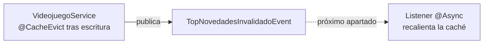

<a id="eventos-warmup-cache"></a>

# 🧩 2. Eventos internos de Spring: el warm-up de caché (1/2)

Sabes que tu aplicación ya es multihilo (pool de Tomcat, listeners de RabbitMQ), y que el warm-up de la caché quedó como problema pendiente. Su solución llega ahora, en dos piezas repartidas en dos apartados: hoy el evento y su publicación; en el próximo apartado, el listener que reacciona.

---

## 📢 Qué es un evento (patrón observador/publicador-suscriptor)

Un **evento** es, conceptualmente, "algo ha pasado" — empaquetado como un objeto que describe ese suceso. El patrón que lo rodea tiene dos papeles: quien **publica** el evento (lo anuncia, sin saber quién lo va a escuchar) y quien **escucha** (reacciona cuando ocurre, sin que el publicador tenga que conocerlo).

!!! example "Una notificación con varios suscriptores"
    Piensa en publicar una foto en una red social: tú (el publicador) no sabes, ni te importa, cuántas apps o servicios reaccionarán a ese evento (notificar a tus seguidores, generar una miniatura, actualizar un contador) — cada uno se suscribe por su cuenta, y podrían añadirse reacciones nuevas sin que tú cambies nada de cómo publicas la foto.

Ese desacoplamiento es la ganancia central del patrón: el que publica no conoce a los que reaccionan, y se pueden añadir reacciones nuevas sin tocar al emisor. De hecho, ya has usado dos versiones de este mismo patrón sin ponerles ese nombre: los eventos de una interfaz gráfica (un clic de botón dispara un *listener*, sin que el botón sepa qué hace ese listener) y RabbitMQ, que ya conoces (Actividad 3.1) — un broker externo con productores y consumidores que no se conocen entre sí. Es el mismo patrón, a distintas escalas.

---

## 💾 Qué es una caché

Una **caché** guarda el resultado de una operación cara (lenta, costosa) para reutilizarlo sin repetir el trabajo. Cuando ese resultado deja de ser válido (los datos subyacentes han cambiado), hay que **invalidarla** — borrar el resultado guardado, para que la próxima vez se recalcule. **Recalentar** una caché es volver a calcular ese resultado por adelantado, antes de que alguien lo pida, para que quien lo pida a continuación no pague el coste de calcularlo de cero.

Es exactamente lo que vas a conseguir en esta pareja de apartados con `@Cacheable` sobre el `getTopNovedades()` que ya tienes (Actividad 1.4) — pero antes de anotarlo, falta decidir **dónde** se guarda físicamente ese resultado.

---

## 🔴 Qué es Redis, y por qué aparece en este proyecto

**Redis** es una base de datos en memoria, de tipo clave-valor, muy rápida, que se usa típicamente como **caché compartida**. La diferencia frente a una caché que viviera solo en la memoria de tu propia aplicación: una caché en Redis sobrevive a un reinicio de la aplicación, y podría compartirse entre varias instancias de la misma aplicación corriendo a la vez (si algún día hubiera más de una).

Con `spring-boot-starter-cache` y `spring-boot-starter-data-redis` presentes en el `pom.xml` (las vas a añadir en la actividad de hoy), Spring Boot autoconfigura Redis como el almacén real detrás de `@Cacheable`. Es decir: cuando `getTopNovedades()` guarde su resultado en la caché `"topNovedades"`, ese resultado se va a guardar **físicamente en un contenedor Redis**, no en un mapa en memoria de tu propia aplicación Java.

Una vez lo tengas montado, vas a poder comprobarlo tú mismo:

```bash
docker exec -it <tu-contenedor-redis> redis-cli
> KEYS *
> GET "topNovedades::SimpleKey []"
```

Tras la primera petición a `/api/v1/videojuegos/top`, deberías ver aparecer una clave relacionada con `topNovedades` en Redis.

---

## ⚙️ Los eventos internos de Spring: `ApplicationEventPublisher`

Spring implementa el patrón observador/publicador-suscriptor **dentro de la propia aplicación**, sin ningún broker externo de por medio, con `ApplicationEventPublisher` y los *listeners* que reaccionan a lo que publica.

!!! danger "No lo confundas con RabbitMQ"
    Es fácil mezclar ambos, así que distínguelos desde ya: **RabbitMQ** es mensajería entre procesos/módulos, a través de un broker externo (lo que ya conoces, con `VideojuegoEvent` en el paquete de eventos del catálogo). **`ApplicationEventPublisher`** son eventos **dentro de la misma JVM**, entre beans de la misma aplicación, sin ningún broker — mucho más ligero, pero solo sirve dentro del propio proceso.

---

## 🎯 El diseño del warm-up (pieza 1 de 2)

En este apartado construyes el evento y su publicación; en el próximo, el listener que reacciona. El plan completo:



Cuando `VideojuegoService` invalida la caché `"topNovedades"` (en `create`/`update`/`delete`, cada uno anotado `@CacheEvict`), va a publicar además un evento interno `TopNovedadesInvalidadoEvent`. Ahora mismo, sin listener todavía, publicar ese evento **no hace nada visible** — el sistema queda "emitiendo" a la espera de la pieza 2.

### La clase de evento: un record inmutable

```java
public record TopNovedadesInvalidadoEvent(Instant momento) {}
```

Un `record` (ya lo conoces de Acceso a Datos) encaja perfectamente aquí: es **inmutable** por diseño, y eso importa especialmente cuando el objeto va a viajar entre hilos distintos. Un objeto inmutable no puede cambiar después de crearse — así que no hay riesgo de que un hilo lo modifique mientras otro lo está leyendo, sin necesitar ningún `synchronized` ni ningún lock: la inmutabilidad es, en sí misma, una forma segura de compartir información entre hilos.

### La publicación

```java
@Service
@RequiredArgsConstructor
public class VideojuegoService {
    private final VideojuegoRepository videojuegoRepository;
    private final ApplicationEventPublisher eventPublisher;

    @CacheEvict(value = "topNovedades", allEntries = true)
    @Transactional
    public VideojuegoResponseDTO create(VideojuegoCreateDTO dto) {
        // ... lógica de creación ya existente ...
        eventPublisher.publishEvent(new TopNovedadesInvalidadoEvent(Instant.now()));
        return mapToDTO(saved);
    }
}
```

`ApplicationEventPublisher` se inyecta exactamente igual que cualquier otra dependencia — con `@RequiredArgsConstructor`, como todo en este proyecto. `publishEvent(...)` es la llamada que dispara el evento hacia quien esté escuchando — que, de momento, es nadie.

!!! tip "Esta pieza es nueva, no la tienes todavía"
    Es una mejora que tú vas a construir desde cero: no confundas este evento interno de Spring con los `VideojuegoEvent` que ya conoces, que son de RabbitMQ, entre módulos — son dos mecanismos distintos.

---

## 🗺️ El mapa completo

Este apartado: evento + publicación. El próximo: listener `@Async` que recalienta la caché, sincronizado con el momento exacto en que la transacción hace commit. Con las dos piezas montadas, el "primer usuario tras una escritura" dejará de pagar los 2 segundos de `getTopNovedades()`.

---

## ✅ Ideas clave

??? tip "Abrir resumen"

    - Un **evento** es "algo ha pasado", empaquetado como objeto; publicador y suscriptor no se conocen entre sí (desacoplamiento).
    - **Invalidar** una caché borra un resultado que ya no es válido; **recalentar** la vuelve a calcular por adelantado.
    - **Redis** es una base de datos en memoria clave-valor, usada aquí como caché compartida real detrás de `@Cacheable` — el resultado de `getTopNovedades()` se guarda físicamente en el contenedor Redis, no en memoria de la aplicación.
    - `ApplicationEventPublisher` implementa eventos **dentro** de la JVM, entre beans — distinto de RabbitMQ (broker externo, entre procesos).
    - Un evento como `record` es inmutable, lo que lo hace seguro de compartir entre hilos sin locks.
    - En este apartado: evento + publicación (sin efecto visible todavía). En el próximo: el listener `@Async` que cierra el ciclo.
