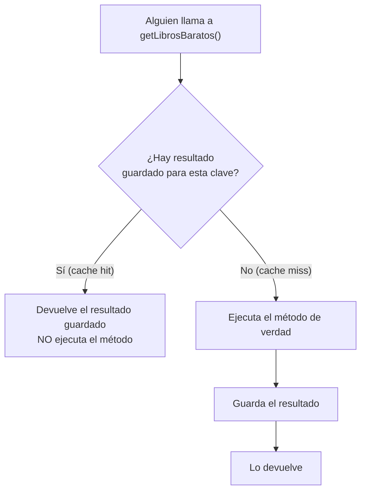
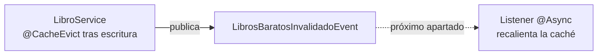

<a id="eventos-warmup-cache"></a>

# 🧩 2. Eventos internos de Spring: el warm-up de caché (1/2)

{ type=application/pdf style="width:100%;min-height:80vh" }

!!! info "Descarga de diapositivas"
    [Descarga las diapositivas](diapositivas/eventos-warmup-cache.pptx){target="_blank" rel="noopener"}

---

Sabes que tu aplicación ya es multihilo (pool de Tomcat, listeners de RabbitMQ). Ahora vas a construir tú mismo una pieza nueva que se apoya en eso: el warm-up de una caché, repartido en dos apartados — hoy montas la caché y el evento que avisa cuando deja de ser válida; en el próximo apartado, el listener que reacciona a ese aviso.

---

## 💾 Qué es una caché

Una **caché** guarda el resultado de una operación cara (lenta, costosa) para reutilizarlo sin repetir el trabajo. Imagina que tu catálogo de libros quisiera ofrecer un listado con los **libros más baratos** — una consulta que, con un catálogo grande y aplicando ordenación y filtros, tarda un rato en calcularse cada vez.

| Momento | Sin caché | Con caché |
|---|---|---|
| 1ª petición | Paga el coste completo | Paga el coste completo, y lo guarda |
| 2ª petición (nada ha cambiado) | Vuelve a pagar el coste completo | Instantánea — usa lo ya guardado |
| Justo después de crear/editar/borrar un libro | Paga el coste completo (como siempre) | Paga el coste completo otra vez — la caché ya no vale |

Esa última fila es el problema que le falta resolver a una caché simple: en cuanto los datos subyacentes cambian, hay que **invalidarla** — borrar el resultado guardado, para que la próxima petición fuerce un recálculo. Pero invalidar sin más solo traslada el problema: la siguiente persona que pida el listado paga otra vez el precio completo, justo la que tuvo la mala suerte de llegar después de una escritura. **Recalentar** una caché es volver a calcular ese resultado por adelantado, nada más invalidarla y antes de que nadie lo pida, para que esa próxima petición reciba el resultado ya listo, sin pagar ningún coste — la fila que le falta a esta tabla.

---

## ⚙️ Cómo funcionan `@Cacheable` y `@CacheEvict` por debajo

Empieza por la mitad más sencilla: guardar y reutilizar. Por dentro, una caché funciona igual que un `Map` de toda la vida, clave-valor: cada resultado guardado tiene una **clave** que lo identifica, y para recuperarlo hace falta esa misma clave.

`@Cacheable("librosBaratos")` sobre un método le dice a Spring que, antes de ejecutarlo de verdad, siga estos dos pasos:

1. Calcula la clave que le corresponde a esta llamada, y comprueba si ya hay algo guardado bajo esa clave.
2. Si lo hay, lo devuelve directamente — **sin ejecutar ni una línea del método**. Si no lo hay, ejecuta el método como siempre, guarda lo que devuelva bajo esa clave, y a partir de ahora responde con eso.

Tú no escribes ese "compruebo primero, ejecuto si hace falta" en ningún sitio de tu código — es Spring quien lo añade automáticamente en cuanto detecta la anotación, sin que toques el cuerpo del método para nada. Para que lo haga de verdad hace falta un interruptor a nivel de toda la aplicación: `@EnableCaching`, en tu clase principal. Sin él, `@Cacheable`/`@CacheEvict` se quedan ahí escritas pero Spring las ignora por completo, en silencio, sin ningún error que te avise.

!!! tip "Ese interruptor puede romper tests que ya tenías"
    `@EnableCaching` se activa para **toda** la aplicación, no solo para el método que te interesa cachear. Si ya tenías tests de la capa web (`@WebMvcTest`) de actividades anteriores, es fácil que dejen de arrancar: cargan tu clase principal (y con ella `@EnableCaching`), pero un test de solo el nivel web no trae la autoconfiguración que normalmente aporta el almacén real detrás de la caché — así que Spring no encuentra dónde guardar nada, y el test falla al arrancar el contexto, no al ejecutar ninguna aserción. Es un buen ejemplo de por qué un test "de una sola capa" (como `@WebMvcTest`) sigue arrastrando piezas de configuración global de tu aplicación, aunque no las necesite para lo que está probando.


```mermaid
flowchart TD
    A["Alguien llama a getLibrosBaratos()"] --> B{"¿Hay resultado<br/>guardado para esta clave?"}
    B -->|"Sí (cache hit)"| C["Devuelve el resultado guardado<br/>NO ejecuta el método"]
    B -->|"No (cache miss)"| D["Ejecuta el método de verdad"]
    D --> E["Guarda el resultado"]
    E --> F["Lo devuelve"]
```

!!! tip "'librosBaratos' no es la clave — es el nombre de la caché"
    `"librosBaratos"` es el nombre de la caché completa —piensa en ella como el propio `Map`—, no una clave dentro de él. La clave de cada entrada se construye, por defecto, a partir de los argumentos con los que se llamó al método: dos llamadas con los mismos parámetros comparten la misma clave. Como `getLibrosBaratos()` no recibe ningún parámetro, Spring usa siempre la misma clave fija (la que representa "sin argumentos"), así que dentro de `"librosBaratos"` solo cabe una entrada guardada, sea quien sea quien la pida. Es justo lo que vas a ver dentro de Redis: la clave completa combina las dos partes, `nombreDeLaCaché::clave`.

!!! example "Contraste: un método con parámetro tiene varias claves"
    Imagina un método distinto, `getLibrosPorAutor(String autor)` (no lo vas a construir, es solo para ver el contraste). Aquí cada autor genera su propia clave, dentro de la misma caché `"librosPorAutor"`:

    | Llamada | Clave generada |
    |---|---|
    | `getLibrosPorAutor("Rothfuss")` | `Rothfuss` |
    | `getLibrosPorAutor("García Márquez")` | `García Márquez` |

    Las dos llamadas guardan resultados **distintos**, uno por cada autor — a diferencia de `getLibrosBaratos()`, que al no recibir parámetros solo tiene sitio para una única entrada, sea quien sea quien lo pida.

Ahora la otra mitad, invalidar. `@CacheEvict` hace justo lo contrario a `@Cacheable`: en vez de comprobar si hay algo guardado, lo borra.

| | `@Cacheable` | `@CacheEvict` |
|---|---|---|
| Va sobre | Un método de **lectura** | Un método de **escritura** (`create`/`update`/`delete`) |
| Qué hace | Guarda el resultado la primera vez; lo reutiliza después | Borra el resultado guardado |
| Con `allEntries = true` | No aplica | Borra **todas** las entradas de esa caché de golpe |

Aquí interesa `allEntries = true` porque cualquier escritura sobre el catálogo (crear, modificar o borrar un libro) puede cambiar cuál es la lista de "más baratos" — no vale la pena intentar borrar solo la entrada afectada.

Falta decidir una última cosa antes de anotar nada: **dónde** se guarda físicamente ese resultado.

---

## 🔴 Qué es Redis

**Redis** es una base de datos en memoria, de tipo clave-valor, muy rápida, que se usa típicamente como **caché compartida**. La diferencia frente a una caché que viviera solo en la memoria de tu propia aplicación:

| | Caché en memoria de la app | Caché en Redis |
|---|---|---|
| ¿Sobrevive a un reinicio de la aplicación? | No — se pierde entera | Sí — vive en su propio contenedor |
| ¿Se comparte entre varias instancias de la misma app? | No — cada instancia tiene la suya | Sí — todas leen del mismo Redis |
| ¿Dónde vive físicamente el dato? | En un mapa dentro de la JVM de tu app | En el contenedor Redis, aparte |

Con `spring-boot-starter-cache` y `spring-boot-starter-data-redis` presentes en el `pom.xml` (las vas a añadir en la actividad de hoy), Spring Boot autoconfigura Redis como el almacén real detrás de `@Cacheable`. Es decir: en cuanto anotes tu método con `@Cacheable("librosBaratos")`, ese resultado se va a guardar **físicamente en un contenedor Redis**, no en un mapa en memoria de tu propia aplicación Java.

!!! warning "Por defecto, Spring exige que lo que guardes en Redis sea `Serializable`"
    Para enviar un objeto por la red hasta Redis, Spring primero tiene que convertirlo a una secuencia de bytes — eso es serializar. Por defecto, `RedisCacheManager` usa la serialización estándar de Java, que exige que la clase implemente `Serializable`. Un `record` como el que devuelve `getLibrosBaratos()` no la implementa por defecto, así que intentar guardarlo en caché tal cual falla con un error de serialización. La solución más simple y fiable es que el propio DTO implemente `Serializable` — un `record` puede hacerlo sin cambiar nada más de su definición.

---

## 🤔 Por qué esto todavía no basta: falta anunciar el cambio

Con `@Cacheable`/`@CacheEvict` montados, invalidar y recalentar ya tienen dónde apoyarse — pero hay un problema de secuencia que ninguna de las dos anotaciones resuelve por sí sola.

| | Invalidar (`@CacheEvict`) | Recalentar (volver a llamar al método) |
|---|---|---|
| ¿Dónde ocurre? | Dentro de `create()`/`update()`/`delete()`, en el hilo de la petición | No ocurre todavía — sería justo ahí mismo, a continuación, si lo llamaras |
| ¿Cuánto cuesta? | Poco — borrar una entrada de Redis | Mucho — la misma consulta lenta de siempre |
| ¿Quién paga ese coste, si lo haces ahí mismo? | — | El cliente que solo quería crear un libro |

Ese último recuadro es el problema — exactamente el mismo que ya has visto con el registro de actividad, en el primer apartado de este tema: un trabajo caro y secundario, colgado del hilo de una petición que no debería tener que esperarlo.

!!! tip "La misma solución de entonces"
    Separar "esto acaba de pasar" de "quién se encarga de reaccionar". Que `create()`/`update()`/`delete()` se limiten a **anunciar** que la caché se ha invalidado, sin saber ni que le importe quién, cómo o cuándo se encarga de recalentarla. Eso es exactamente lo que te da un **evento**.

---

## 📢 Qué es un evento (patrón observador/publicador-suscriptor)

Un **evento** es, conceptualmente, "algo ha pasado" — empaquetado como un objeto que describe ese suceso. El patrón que lo rodea tiene dos papeles: quien **publica** el evento (lo anuncia, sin saber quién lo va a escuchar) y quien **escucha** (reacciona cuando ocurre, sin que el publicador tenga que conocerlo).

!!! example "Una notificación con varios suscriptores"
    Piensa en publicar una foto en una red social: tú (el publicador) no sabes, ni te importa, cuántas apps o servicios reaccionarán a ese evento (notificar a tus seguidores, generar una miniatura, actualizar un contador) — cada uno se suscribe por su cuenta, y podrían añadirse reacciones nuevas sin que tú cambies nada de cómo publicas la foto.

Ese desacoplamiento es la ganancia central del patrón: el que publica no conoce a los que reaccionan, y se pueden añadir reacciones nuevas sin tocar al emisor. De hecho, ya has usado dos versiones de este mismo patrón sin ponerles ese nombre: los eventos de una interfaz gráfica (un clic de botón dispara un *listener*, sin que el botón sepa qué hace ese listener) y RabbitMQ, que ya conoces (Actividad 3.1) — un broker externo con productores y consumidores que no se conocen entre sí. Es el mismo patrón, a distintas escalas.

---

## ⚙️ Los eventos internos de Spring: `ApplicationEventPublisher`

Para el aviso de "la caché se ha invalidado" no hace falta nada tan pesado como un broker externo — el publicador y el listener viven en la misma aplicación, así que Spring ofrece una versión más ligera del mismo patrón: `ApplicationEventPublisher` implementa el patrón observador/publicador-suscriptor **dentro de la propia aplicación**, sin ningún broker externo de por medio.

!!! danger "No lo confundas con RabbitMQ"
    Es fácil mezclar ambos, así que distínguelos desde ya: **RabbitMQ** es mensajería entre procesos/módulos, a través de un broker externo (el `LibroEvent` que has visto en el apartado anterior). **`ApplicationEventPublisher`** son eventos **dentro de la misma JVM**, entre beans de la misma aplicación, sin ningún broker — mucho más ligero, pero solo sirve dentro del propio proceso.

---

## 🎯 El diseño del warm-up (pieza 1 de 2)

Con la caché, Redis y el mecanismo de eventos ya explicados, toca montarlos juntos. En este apartado construyes el evento y su publicación; en el próximo, el listener que reacciona. El plan completo, siguiendo con el mismo ejemplo de los libros más baratos:


```mermaid
flowchart LR
    A["LibroService<br/>@CacheEvict tras escritura"] -->|"publica"| B["LibrosBaratosInvalidadoEvent"]
    B -.->|"próximo apartado"| C["Listener @Async<br/>recalienta la caché"]
```

Cuando `LibroService` invalida la caché `"librosBaratos"` (en `create`/`update`/`delete`, cada uno anotado `@CacheEvict`), va a publicar además un evento interno `LibrosBaratosInvalidadoEvent`. Ahora mismo, sin listener todavía, publicar ese evento **no hace nada visible** — el sistema queda "emitiendo" a la espera de la pieza 2.

### La clase de evento: un record inmutable

```java
public record LibrosBaratosInvalidadoEvent(Instant momento) {}
```

Un `record` (ya lo conoces de Acceso a Datos) encaja perfectamente aquí: es **inmutable** por diseño, y eso importa especialmente cuando el objeto va a viajar entre hilos distintos. Un objeto inmutable no puede cambiar después de crearse — así que no hay riesgo de que un hilo lo modifique mientras otro lo está leyendo, sin necesitar ningún `synchronized` ni ningún lock: la inmutabilidad es, en sí misma, una forma segura de compartir información entre hilos.

### La publicación

```java
@Service
@RequiredArgsConstructor
public class LibroService {
    private final LibroRepository libroRepository;
    private final ApplicationEventPublisher eventPublisher;

    @CacheEvict(value = "librosBaratos", allEntries = true, beforeInvocation = true)
    @Transactional
    public LibroResponseDTO create(LibroCreateDTO dto) {
        // ... lógica de creación ya existente ...
        eventPublisher.publishEvent(new LibrosBaratosInvalidadoEvent(Instant.now()));
        return mapToDTO(saved);
    }
}
```

`ApplicationEventPublisher` se inyecta exactamente igual que cualquier otra dependencia — con `@RequiredArgsConstructor`, como todo en este proyecto. `publishEvent(...)` es la llamada que dispara el evento hacia quien esté escuchando — que, de momento, es nadie.

La misma línea de publicación va también en `update()` y en `delete()`, junto a su propio `@CacheEvict`: un libro editado o borrado puede cambiar igual de bien cuáles son los "más baratos", así que las tres operaciones de escritura necesitan avisar por igual.

!!! warning "`beforeInvocation = true` no es un detalle menor"
    Por defecto, `@CacheEvict` elimina la entrada después de que el método termine correctamente. Aquí usamos `beforeInvocation = true` para hacerlo **antes de entrar en `create()`/`update()`/`delete()`**, garantizando así que, cuando esos métodos publiquen el evento de invalidación, la entrada anterior ya se haya eliminado. La contrapartida es que, si la escritura termina fallando, la caché ya habrá sido vaciada y tendrá que calcularse de nuevo más adelante. Es una decisión sencilla y adecuada para este ejemplo, no una solución general a todos los posibles problemas de concurrencia.

!!! tip "Esta pieza es nueva, no la tienes todavía"
    Es una mejora que tú vas a construir desde cero, sobre tu propio proyecto: no confundas este evento interno de Spring con el `LibroEvent` que ya conoces del apartado anterior, que es de RabbitMQ, entre módulos — son dos mecanismos distintos.

---

## 🗺️ El mapa completo

| Pieza | ¿Dónde se construye? | ¿Ya tiene efecto visible? |
|---|---|---|
| Caché con Redis (`@Cacheable`/`@CacheEvict`) | Este apartado | Sí — la segunda petición ya sale gratis |
| Evento + publicación (`LibrosBaratosInvalidadoEvent`) | Este apartado | No — nadie lo escucha todavía |
| Listener `@Async` que recalienta | Próximo apartado | — |

Con las dos primeras piezas montadas, ya tienes caché de verdad: la segunda petición a un mismo listado es instantánea. Pero sigue quedando pendiente la fila que peor sale en la tabla de "Qué es una caché", más arriba: el "primer usuario tras una escritura" todavía paga el coste completo, porque la caché acaba de invalidarse y nadie la ha vuelto a llenar. Ese alivio final —que ni siquiera ese primer usuario tenga que esperar, porque el listener ya ha recalentado la caché en segundo plano antes de que él la pida— llega con la pieza que construyes en el próximo apartado, y lo vas a medir tú mismo, con números reales, en la Actividad 3.3.

---

## ✅ Ideas clave

??? tip "Abrir resumen"

    - Una **caché** guarda el resultado de una operación cara para no repetir el trabajo. **Invalidar** borra un resultado que ya no es válido; **recalentar** la vuelve a calcular por adelantado, antes de que alguien la pida.
    - `@Cacheable` hace que Spring intercepte la llamada: si ya hay un resultado guardado para esa clave, lo devuelve sin ejecutar el método; si no, lo ejecuta y guarda el resultado. `@CacheEvict(allEntries = true)` borra todo lo guardado; con `beforeInvocation = true`, ese borrado ocurre antes de ejecutar el método anotado.    
    - `@EnableCaching` activa ese mecanismo para toda la aplicación — y, precisamente por eso, puede romper tests de una sola capa (`@WebMvcTest`) que carguen la clase principal sin traer la autoconfiguración que da soporte real a la caché.
    - **Redis** es una base de datos en memoria clave-valor, usada aquí como caché compartida real detrás de `@Cacheable` — el resultado se guarda físicamente en el contenedor Redis, no en memoria de la aplicación, y sobrevive a un reinicio.
    - Por defecto, Spring guarda en Redis con serialización JDK, que exige `Serializable` — un `record` no lo es por defecto. Se resuelve añadiendo `implements Serializable` al DTO.
    - Invalidar (barato) y recalentar (caro) hay que separarlos, para que el coste de recalentar no se lo lleve por delante quien hizo la escritura — el mismo problema que ya has resuelto con el registro de actividad del primer apartado.
    - Un **evento** es "algo ha pasado", empaquetado como objeto; publicador y suscriptor no se conocen entre sí (desacoplamiento).
    - `ApplicationEventPublisher` implementa eventos **dentro** de la JVM, entre beans — distinto de RabbitMQ (broker externo, entre procesos).
    - Un evento como `record` es inmutable, lo que lo hace seguro de compartir entre hilos sin locks.
    - En este apartado: evento + publicación (sin efecto visible todavía). En el próximo: el listener `@Async` que cierra el ciclo.
