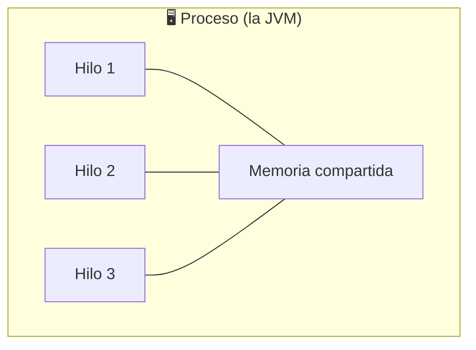
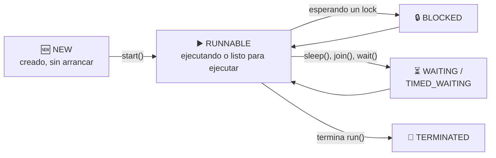
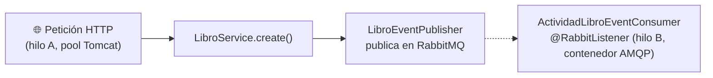

<a id="hilos-en-una-app-real"></a>

# 🧩 1. Hilos en una aplicación real: dónde ya los estás usando

Esta semana es distinta a todas las anteriores: no vas a escribir código de producción — vas a aprender a **ver** algo que ya está pasando delante de ti sin que lo hayas notado. Tu aplicación Spring Boot ya es multihilo, aunque nunca hayas escrito `new Thread()`.

---

## 🧵 Proceso vs. hilo

Un **proceso** es un programa en ejecución con su propia memoria, aislada de la de otros procesos — cuando arrancas tu aplicación Spring Boot, la JVM entera es un proceso (puedes comprobarlo en el administrador de tareas de tu sistema: verás un proceso `java`).

Un **hilo** (*thread*) es una línea de ejecución **dentro** de ese proceso — un proceso puede tener varios hilos, y todos ellos comparten la misma memoria del proceso al que pertenecen.



---

## 🏃 Concurrencia vs. paralelismo

- **Concurrencia**: varios hilos se turnan para avanzar, aunque haya un solo núcleo de procesador disponible — el planificador del sistema operativo reparte pequeñas porciones de tiempo entre ellos, tan rápido que parece simultáneo.
- **Paralelismo**: varios hilos ejecutan de verdad **al mismo tiempo**, en núcleos de procesador distintos.

En ambos casos, **el planificador del sistema operativo decide** cuándo se ejecuta cada hilo — tu programa no controla ese detalle.

---

## 🚀 Crear hilos en Java

La forma más directa: implementar `Runnable` (el trabajo a hacer) y envolverlo en un `Thread`:

```java
Runnable tarea = () -> {
    for (int i = 0; i < 3; i++) {
        System.out.println(Thread.currentThread().getName() + ": " + i);
    }
};

new Thread(tarea, "Hilo-A").start();
new Thread(tarea, "Hilo-B").start();
```

!!! warning "`start()`, no `run()`"
    Si llamas directamente a `tarea.run()`, ejecutas ese código en el hilo actual, como una llamada a método normal — no se crea ningún hilo nuevo. `start()` es lo que de verdad arranca un hilo nuevo del sistema operativo, que ejecutará el `run()` de forma independiente.

Ejecuta este código dos veces seguidas: la salida por consola **no será idéntica** las dos veces — el entrelazado entre "Hilo-A" e "Hilo-B" es no determinista, porque depende de cómo el planificador reparta el tiempo entre ambos en cada ejecución.

---

## 🔄 El ciclo de vida de un hilo



Un hilo nace en `NEW` (creado pero sin arrancar), pasa a `RUNNABLE` con `start()`, y desde ahí puede quedar `BLOCKED` (esperando un *lock* que otro hilo tiene ocupado) o en `WAITING`/`TIMED_WAITING` (por un `sleep()`, un `join()` esperando a que otro hilo termine, o un `wait()`), antes de volver a `RUNNABLE` y, finalmente, `TERMINATED` cuando su `run()` acaba.

---

## ⚠️ El problema central: compartir memoria

Como los hilos de un mismo proceso comparten memoria, dos hilos pueden intentar modificar el mismo dato **a la vez** — y ahí aparece la **condición de carrera**. El ejemplo clásico: dos hilos incrementando un contador compartido 10.000 veces cada uno.

```java
class Contador {
    private int valor = 0;
    public void incrementar() { valor++; }
    public int getValor() { return valor; }
}
```

Si lanzas dos hilos que llaman a `incrementar()` 10.000 veces cada uno, el resultado final **no da 20.000** — casi siempre da menos. ¿Por qué? `valor++` no es una sola operación atómica: son **tres** pasos (leer el valor actual, sumarle uno, escribir el resultado), y esos tres pasos de un hilo se pueden intercalar con los de otro. Si ambos leen el mismo valor antes de que ninguno escriba, uno de los dos incrementos se pierde.

La solución básica es `synchronized`: marca una **sección crítica** (un bloque de código) que solo un hilo puede ejecutar a la vez — cualquier otro hilo que quiera entrar debe esperar a que el primero salga.

```java
public synchronized void incrementar() { valor++; }
```

!!! danger "El peligro opuesto: deadlock"
    Si te pasas de precavido bloqueando en exceso, puedes acabar con un **deadlock**: dos hilos esperando cada uno un recurso que tiene bloqueado el otro, sin que ninguno pueda avanzar nunca. `synchronized` resuelve la condición de carrera, pero mal usado crea un problema distinto.

---

## 🪜 La escala de abstracción

Crear hilos con `Thread`/`Runnable` a mano funciona, pero no escala: crear un hilo nuevo por cada tarea, sin límite, puede agotar los recursos del sistema. La siguiente capa de abstracción es un **`ExecutorService`**: un *pool* de hilos reutilizables que toman tareas de una cola, en vez de crear un hilo nuevo cada vez.

Y por encima de eso están las abstracciones de Spring que usarás en las próximas semanas (`@Async`, los *listeners* de eventos): delegan toda esta gestión en el framework, para que tú declares "esto debe ejecutarse en otro hilo" sin gestionar el `Thread`/`Runnable`/`ExecutorService` explícitamente.

---

## 🔍 Tu aplicación ya es multihilo

Siguiendo con la API de la librería que conoces de los temas anteriores, hay al menos dos sitios donde ya hay varios hilos trabajando sin que tú lo hayas pedido.

### Avistamiento 1 — el pool de Tomcat

Ya lo comprobaste experimentalmente en el Tema 1: dos peticiones simultáneas al endpoint lento (con su `Thread.sleep(2000)` simulado) no tardaban el doble, sino aproximadamente lo mismo que una sola. Ahora tienes el nombre técnico: Tomcat mantiene un **pool de hilos**, y cada petición HTTP se atiende en un hilo distinto de ese pool — es tu primer avistamiento real.

### Avistamiento 2 — los listeners de RabbitMQ

Antes de ver el ejemplo, necesitas saber qué es **RabbitMQ**, porque es la primera vez que aparece en el curso (y va a reaparecer sin volver a explicarse, así que esta es la referencia para el resto del curso, tanto en PSP como en Acceso a Datos):

- Un **broker de mensajería** es un servidor intermediario que recibe mensajes de quien los produce y los entrega a quien los consume — sin que productor y consumidor se conozcan entre sí, ni tengan que estar activos al mismo tiempo.
- Una **cola** es una lista de mensajes pendientes de procesar.
- Un **exchange** decide a qué cola (o colas) llega cada mensaje publicado, según reglas de enrutado.
- `@RabbitListener` marca un método como consumidor de una cola: Spring AMQP lo invoca automáticamente cuando llega un mensaje — en un hilo **propio del contenedor de listeners**, no en el hilo de quien publicó el mensaje.

Con esa base, imagina que la librería registra la actividad del catálogo (altas, cambios de precio...) a partir de eventos:

```java
@Service
@RequiredArgsConstructor
public class ActividadLibroEventConsumer {

    private final ActividadService actividadService;

    @RabbitListener(queues = RabbitMQConfig.ACTIVIDAD_LIBRO_QUEUE)
    public void recibir(String payload) {
        LibroEvent event = /* deserializar */;
        actividadService.registrar(event.tipo(), "Libro", event.libroId().toString());
    }
}
```

El flujo completo, con dos hilos distintos involucrados:



`LibroService.create()` (hilo A, el de la petición HTTP) publica el evento y **no espera** a que se procese — sigue su camino y responde al cliente. El consumer lo recoge y lo procesa en su propio hilo (hilo B), en su propio momento. Eso es justo lo que gana la aplicación: la petición HTTP no se queda esperando a que se registre la actividad.

### El problema motivador: el warm-up de una caché

Imagina ahora un método `getTopNovedades()` (los libros más recientes del catálogo) anotado con `@Cacheable("topNovedades")`, que simula 2 segundos de lentitud con `Thread.sleep(2000)`; cada `create`/`update`/`delete` invalida esa caché con `@CacheEvict`. El resultado: tras cada escritura, el **siguiente** usuario que pida el top paga esos 2 segundos de golpe. Un hilo en segundo plano que recaliente la caché justo después de invalidarla — sin que ningún usuario tenga que esperar — es la situación "útil" de libro para usar varios hilos. Es exactamente lo que vas a construir en las próximas dos semanas, con `@EnableAsync` y `@Async`.

---

## ✅ Ideas clave

??? tip "Abrir resumen"

    - Un **proceso** tiene su propia memoria; un **hilo** es una línea de ejecución dentro de un proceso, compartiendo su memoria con los demás hilos de ese proceso.
    - **Concurrencia** (turnarse) vs. **paralelismo** (a la vez, en núcleos distintos) — el planificador del SO decide, no tu programa.
    - `new Thread(runnable).start()` arranca un hilo real; llamar a `run()` directamente NO crea ningún hilo nuevo.
    - Ciclo de vida: NEW → RUNNABLE → BLOCKED/WAITING → TERMINATED.
    - La **condición de carrera** ocurre cuando varios hilos modifican el mismo dato sin coordinación; `synchronized` la resuelve creando una sección crítica — pero en exceso puede provocar **deadlock**.
    - **RabbitMQ**: un broker de mensajería con colas y exchanges; `@RabbitListener` procesa mensajes en un hilo propio del contenedor, distinto del hilo que publicó.
    - Tu aplicación ya es multihilo: el pool de Tomcat (una petición, un hilo) y los listeners de RabbitMQ (hilo del contenedor AMQP) son avistamientos reales, sin que hayas escrito `new Thread()` nunca.
    - El warm-up de una caché tras invalidarla es el caso motivador que construirás con `@EnableAsync`/`@Async` en las próximas semanas.
