<a id="hilos-en-una-app-real"></a>

# 🧩 1. Hilos en una aplicación real: dónde ya los estás usando

{ type=application/pdf style="width:100%;min-height:80vh" }

!!! info "Descarga de diapositivas"
    [Descarga las diapositivas](diapositivas/hilos-en-una-app-real.pptx){target="_blank" rel="noopener"}

---

Este apartado es distinto a todos los anteriores: no vas a escribir código de producción — vas a aprender a **ver** algo que ya está pasando delante de ti sin que lo hayas notado. Ahora mismo, mientras tu aplicación Spring Boot atiende peticiones, hay varias tareas ejecutándose "a la vez" dentro de ella, sin que tú hayas escrito una sola línea de código pidiéndolo. El mecanismo detrás de eso tiene nombre — el **hilo** — y es el protagonista de todo este tema. Empecemos por ahí.

---

## 🧵 Proceso vs. hilo

Un **proceso** es un programa en ejecución con su propia memoria, aislada de la de otros procesos — cuando arrancas tu aplicación Spring Boot, la JVM entera es un proceso (puedes comprobarlo en el administrador de tareas de tu sistema: verás un proceso `java`).

Un **hilo** (*thread*) es una línea de ejecución **dentro** de ese proceso — un proceso puede tener varios hilos, y todos ellos comparten la misma memoria del proceso al que pertenecen. Piensa en el proceso como un taller cerrado, con sus propias herramientas y materiales que nadie de fuera puede tocar; los hilos son los operarios que trabajan dentro de ese taller. Puede haber uno o varios, y todos usan las mismas herramientas — muy cómodo para colaborar, pero, como vas a ver enseguida, también peligroso si dos operarios cogen la misma herramienta a la vez.

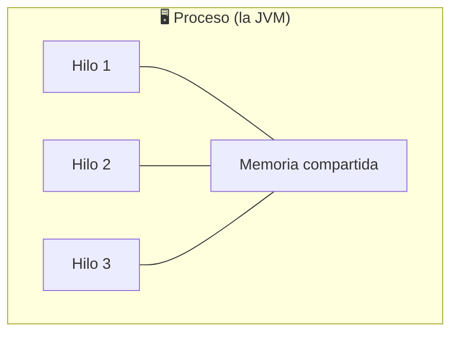
```mermaid
flowchart TB
    subgraph P["🖥️ Proceso (la JVM)"]
        M["Memoria compartida"]
        H1["Hilo 1"] --- M
        H2["Hilo 2"] --- M
        H3["Hilo 3"] --- M
    end
```

---

## 🏃 Concurrencia vs. paralelismo

Retoma el taller de antes: un **único operario** puede llevar varias tareas a la vez turnándose entre ellas — aprieta un tornillo aquí, va a vigilar el horno, vuelve a la pieza anterior — sin terminar ninguna del todo antes de pasar a la siguiente, pero dando la sensación de que todas avanzan a un tiempo. Eso es exactamente lo que hace un procesador con un solo núcleo: reparte su atención entre varios hilos en fracciones de segundo tan pequeñas que parece que van a la vez, aunque en realidad solo hay uno trabajando en cada instante concreto. Si en cambio el taller tiene **varios operarios**, cada uno con su propia tarea, ahí sí hay trabajo sucediendo de verdad al mismo tiempo — y eso necesita varios núcleos de procesador, uno por cada hilo que avanza en paralelo. Esa es la diferencia entre los dos términos:

- **Concurrencia**: varios hilos se turnan para avanzar, aunque haya un solo núcleo de procesador disponible — el planificador del sistema operativo reparte pequeñas porciones de tiempo entre ellos, tan rápido que parece simultáneo.
- **Paralelismo**: varios hilos ejecutan de verdad **al mismo tiempo**, en núcleos de procesador distintos.

En ambos casos, **el planificador del sistema operativo decide** cuándo se ejecuta cada hilo — tu programa no controla ese detalle.

---

## 🚀 Crear hilos en Java

Java separa dos ideas que hasta ahora iban juntas: **qué** trabajo hay que hacer y **quién** lo va a ejecutar. `Runnable` describe el trabajo — es la orden de trabajo que le dejarías a un operario, con las instrucciones de qué hacer, pero todavía sin decir quién la ejecuta ni cuándo. `Thread` es el operario de verdad: al crearlo le entregas esa orden de trabajo (el `Runnable`) y, en cuanto le dices que empiece, la ejecuta de forma concurrente con los demás hilos. Si hay varios núcleos disponibles, algunos de esos hilos pueden llegar a ejecutarse realmente en paralelo.

La forma más directa de repartir una tarea entre varios hilos: implementar `Runnable` con el trabajo a hacer, y envolverlo en tantos `Thread` como operarios quieras poner a trabajar a la vez:

```java
public class HilosDemo {
    public static void main(String[] args) {
        Runnable tarea = () -> {
            for (int i = 0; i < 10; i++) {
                System.out.println(Thread.currentThread().getName() + ": " + i);
            }
        };

        new Thread(tarea, "Hilo-A").start();
        new Thread(tarea, "Hilo-B").start();
    }
}
```

!!! warning "`start()`, no `run()`"
    Si llamas directamente a `tarea.run()`, ejecutas ese código en el hilo actual, como una llamada a método normal — no se crea ningún hilo nuevo. `start()` es lo que de verdad arranca un hilo nuevo del sistema operativo, que ejecutará el `run()` de forma independiente.

Ejecuta este código dos veces seguidas: la salida por consola probablemente no será idéntica. El orden en que aparecen las líneas depende de las decisiones del planificador del sistema operativo y no está garantizado. Aunque tu ordenador tenga varios núcleos y los hilos puedan llegar a ejecutarse realmente en paralelo, esta salida por consola no permite demostrar si en un instante concreto estaban usando núcleos distintos o simplemente alternándose. Lo importante aquí es observar que ambos hilos avanzan de forma concurrente y que su orden de ejecución es no determinista.

<div class="grid" markdown>

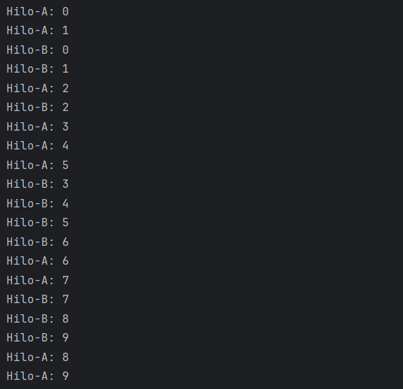

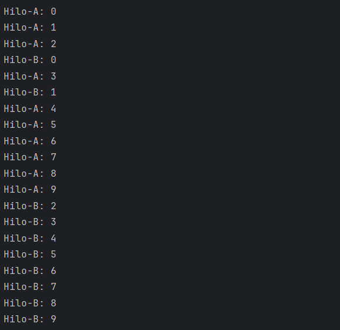

</div>

En la primera, Hilo-A e Hilo-B avanzan a un ritmo muy parecido, así que sus líneas se entrelazan casi una a una; en la segunda, Hilo-A ha ido más rápido y ha completado casi todo su trabajo antes de que las líneas de Hilo-B empiecen a aparecer. Ninguna de las dos es "la correcta" — las dos son resultados válidos del mismo programa ejecutando dos hilos concurrentes, y por eso no puedes dar por hecho en qué orden van a imprimir sus líneas dos hilos que se ejecutan a la vez.

---

## ⚠️ El problema central: compartir memoria

Como los hilos de un mismo proceso comparten memoria, dos hilos pueden intentar modificar el mismo dato **a la vez** — y ahí aparece la **condición de carrera**: el resultado final del programa pasa a depender de en qué orden exacto llegan los hilos a leer y escribir ese dato compartido, un orden que, como ya has visto, es impredecible. Se llama "carrera" porque es literalmente eso — varios hilos compitiendo por el mismo dato — y el resultado cambia según quién "gane" esa carrera en cada ejecución concreta, sin que tú puedas controlarlo ni predecirlo de antemano.

El ejemplo clásico: dos hilos incrementando un contador compartido 10.000 veces cada uno. Cópialo y ejecútalo tú mismo:

```java
class Contador {
    private int valor = 0;
    public void incrementar() { valor++; }
    public int getValor() { return valor; }
}

public class ContadorDemo {
    public static void main(String[] args) throws InterruptedException {
        Contador contador = new Contador();

        Runnable tarea = () -> {
            for (int i = 0; i < 10000; i++) {
                contador.incrementar();
            }
        };

        Thread t1 = new Thread(tarea);
        Thread t2 = new Thread(tarea);
        t1.start();
        t2.start();
        t1.join();
        t2.join();

        System.out.println("Valor final: " + contador.getValor());
    }
}
```

`t1.join()`/`t2.join()` hace que el hilo principal —el que ha creado y arrancado `t1` y `t2`— se quede esperando a que cada uno termine su trabajo antes de seguir. Sin esas dos líneas, `main` podría llegar al `System.out.println("Valor final: ...")` mientras `t1` y `t2` todavía están incrementando el contador por su cuenta, y el número que verías no sería el resultado final de verdad, sino una foto a medio terminar.

Dos ejecuciones reales de este mismo código, en la misma máquina, una detrás de otra:

<div class="grid" markdown>

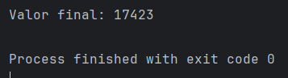

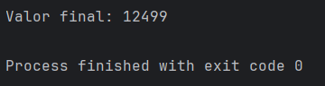

</div>

Ni siquiera coinciden entre sí, y en estas dos ejecuciones ninguna llega a 20.000 — la prueba de que el problema no es solo teórico. Si lanzas dos hilos que llaman a `incrementar()` 10.000 veces cada uno, esperarías obtener 20.000, pero ese resultado **no está garantizado**: normalmente será menor y puede variar entre ejecuciones, aunque alguna podría llegar a dar exactamente 20.000 por casualidad **sin que eso signifique que la condición de carrera haya desaparecido**. ¿Por qué? `valor++` no es una sola operación atómica: son **tres** pasos (leer el valor actual, sumarle uno, escribir el resultado), y esos tres pasos de un hilo se pueden intercalar con los de otro.

Así se pierde un incremento en la práctica — imagina que los dos hilos llegan casi a la vez, cuando `valor` todavía vale 0:

| Paso | Hilo A | Hilo B | `valor` |
|---|---|---|---|
| 1 | lee `valor` → `0` | | 0 |
| 2 | | lee `valor` → `0` | 0 |
| 3 | calcula `0 + 1` | | 0 |
| 4 | | calcula `0 + 1` | 0 |
| 5 | escribe `valor = 1` | | 1 |
| 6 | | escribe `valor = 1` | 1 |

Dos llamadas a `incrementar()` deberían haber dejado `valor` en `2`, pero como ambos hilos han leído el mismo valor antes de que ninguno escribiera, el resultado final es `1` — se ha perdido un incremento entero. Multiplica este mismo entrelazado por miles de llamadas y entenderás por qué el resultado puede variar entre ejecuciones y no podemos garantizar que sea exactamente 20.000.

La solución básica es `synchronized`: marca una **sección crítica** (un bloque de código) que solo un hilo puede ejecutar a la vez — cualquier otro hilo que quiera entrar debe esperar a que el primero salga. Ese "esperar" tiene nombre propio: el hilo que llega tarde queda bloqueado por un **lock**, el candado que el primer hilo mantiene ocupado mientras está dentro de la sección crítica. Es como el baño de una cafetería con una única llave colgada en el mostrador: mientras un cliente la tiene y está dentro, cualquier otro que quiera entrar se queda esperando fuera, por mucha prisa que tenga — nadie entra hasta que la llave vuelve a estar libre.

```java
public synchronized void incrementar() { valor++; }
```

Cambia el `incrementar()` de tu `Contador` por esta versión y vuelve a ejecutar `ContadorDemo` — ahora ningún hilo puede leer, sumar y escribir mientras otro está a mitad de esos mismos tres pasos, así que el resultado deja de depender de qué orden gane la carrera:

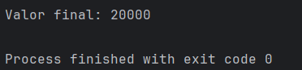

`20000`, exacto, cada vez que lo ejecutes — el `synchronized` no ha hecho que los hilos vayan más rápido (de hecho van más lentos, porque se turnan en vez de solaparse), pero sí ha hecho que el resultado sea siempre correcto.

!!! danger "El peligro opuesto: deadlock"
    Si te pasas de precavido bloqueando en exceso, puedes acabar con un **deadlock**: dos hilos esperando cada uno un recurso que tiene bloqueado el otro, sin que ninguno pueda avanzar nunca. `synchronized` resuelve la condición de carrera, pero mal usado crea un problema distinto.

---

## 🔄 El ciclo de vida de un hilo

Un hilo no está siempre "ejecutando" sin más — pasa por varios estados bien definidos entre que lo creas y que termina, y Java te deja consultar en cuál está en cada momento (`Thread.getState()`). Este es el mapa completo:

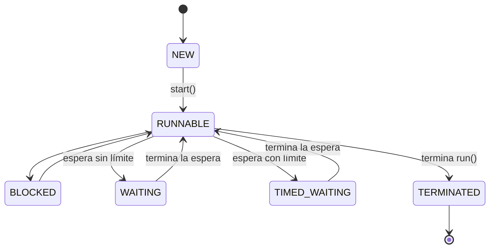
```mermaid
stateDiagram-v2
    [*] --> NEW
    NEW --> RUNNABLE: start()

    RUNNABLE --> BLOCKED
    BLOCKED --> RUNNABLE

    RUNNABLE --> WAITING: espera sin límite
    WAITING --> RUNNABLE: termina la espera

    RUNNABLE --> TIMED_WAITING: espera con límite
    TIMED_WAITING --> RUNNABLE: termina la espera

    RUNNABLE --> TERMINATED: termina run()
    TERMINATED --> [*]
```

La tabla resume qué hace que un hilo entre en cada estado y qué significa realmente estar ahí. La distinción importante es que `BLOCKED` aparece al intentar adquirir un *lock* que otro hilo mantiene ocupado, mientras que `WAITING` y `TIMED_WAITING` aparecen cuando el hilo entra explícitamente en alguna operación de espera.

| Estado | ¿Cómo se llega? | ¿Qué significa? |
|---|---|---|
| `NEW` | Acabas de crearlo con `new Thread(...)` | Existe el objeto, pero todavía no has llamado a `start()` |
| `RUNNABLE` | Llamas a `start()` — no a `run()` | Está ejecutando el código de tu `run()`, o listo para hacerlo en cuanto el planificador le dé turno |
| `BLOCKED` | Intenta entrar en una sección `synchronized` que otro hilo ya ocupa | Espera a poder obtener el *lock* y entrar en esa sección |
| `WAITING` | Llama a `join()` o `wait()` sin indicar un tiempo máximo | Espera sin límite de tiempo hasta que se produzca la condición que le permite continuar |
| `TIMED_WAITING` | Llama a `sleep()`, `join(timeout)` o `wait(timeout)` | Espera durante un tiempo máximo determinado |
| `TERMINATED` | Su `run()` acaba | Fin — ya no vuelve a ejecutarse nunca |

Ojo con no confundir `start()` y `run()` aquí tampoco: es `start()` quien mueve el hilo de `NEW` a `RUNNABLE`, no `run()`. `run()` es solo el método con el código que ese hilo va a ejecutar mientras está en `RUNNABLE` — si llamas a `tarea.run()` directamente (como avisaba el primer recuadro de este apartado), no creas ningún hilo nuevo, así que no hay ningún estado que cambiar: ese código se ejecuta como una llamada normal dentro del hilo que ya tenías.

Nada de esto se queda en la teoría: puedes preguntarle a un hilo en qué estado está en cualquier momento con `getState()`. Retomando el `Contador` de antes —ahora con `incrementar()` ya `synchronized`, y con una pausa añadida solo para facilitar la observación—, el siguiente ejemplo está preparado para que puedas capturar **cinco de los seis estados**: `NEW`, `RUNNABLE`, `BLOCKED`, `TIMED_WAITING` y `TERMINATED`. `WAITING` no aparece en este ejemplo porque la pausa se realiza con `sleep()`, que coloca al hilo en `TIMED_WAITING`. Como `getState()` muestra una instantánea, el resultado exacto puede variar ligeramente según el planificador del sistema operativo.

```java
class Contador {
    private int valor = 0;

    public synchronized void incrementar() {
        valor++;
        dormir(2000); // pausa deliberada, solo para poder observar los estados con calma
    }

    public int getValor() { return valor; }

    private static void dormir(int milisegundos) {
        try {
            Thread.sleep(milisegundos);
        } catch (InterruptedException e) {
            Thread.currentThread().interrupt();
        }
    }
}

public class EstadosDemo {
    public static void main(String[] args) throws InterruptedException {
        Contador contador = new Contador();

        Thread hilo1 = new Thread(contador::incrementar, "Hilo-1");
        System.out.println("Recién creado, sin start():   " + hilo1.getState()); // NEW

        Thread hilo2 = new Thread(contador::incrementar, "Hilo-2");
        hilo2.start();
        Thread.sleep(100); // le da tiempo a Hilo-2 a entrar primero y quedarse con el lock

        hilo1.start();
        System.out.println("Justo después de start():     " + hilo1.getState()); // RUNNABLE

        Thread.sleep(200); // Hilo-2 sigue dentro durmiendo; Hilo-1 ya está intentando entrar
        System.out.println("Compitiendo por el lock:      " + hilo1.getState()); // BLOCKED

        hilo2.join(); // en cuanto Hilo-2 suelta el lock, Hilo-1 entra y empieza su propia pausa
        Thread.sleep(200);
        System.out.println("Dentro ya, durmiendo:         " + hilo1.getState()); // TIMED_WAITING

        hilo1.join();
        System.out.println("Después de join():            " + hilo1.getState()); // TERMINATED

        System.out.println("Valor final: " + contador.getValor());
    }
}
```

!!! tip "Qué hace `Thread.currentThread().interrupt()`"
    `sleep()` puede terminar antes de tiempo si otro hilo llama a `.interrupt()` sobre este hilo — Java lo avisa lanzando `InterruptedException`. Volver a llamar a `interrupt()` dentro del propio `catch` es el patrón estándar para no perder ese aviso, por si algún código más arriba también necesita saber que ha pasado.

Ejecútalo tú mismo. Esta es una posible salida en la que se han conseguido capturar los cinco estados que busca este ejemplo:

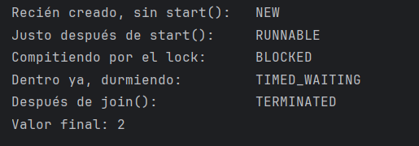

En esta ejecución hemos conseguido observar `Hilo-1` en esos cinco estados: nace en `NEW`, se vuelve `RUNNABLE` en cuanto llamas a `start()`, queda `BLOCKED` mientras `Hilo-2` mantiene ocupado el *lock*, aparece en `TIMED_WAITING` mientras ejecuta su propio `sleep()` y finalmente queda `TERMINATED` cuando acaba su `run()`.

---

## 🪜 La escala de abstracción

Crear hilos con `Thread`/`Runnable` a mano funciona, pero no escala: crear un hilo nuevo por cada tarea, sin límite, puede agotar los recursos del sistema. Es como contratar a un operario nuevo para cada tarea que aparece, por pequeña que sea, y despedirlo en cuanto termina — funciona, pero es un despilfarro si las tareas no dejan de llegar. La siguiente capa de abstracción es un **`ExecutorService`**: un *pool* de hilos reutilizables, más parecido a tener una plantilla fija de operarios ya contratados, que van cogiendo la siguiente tarea de una lista en cuanto terminan la anterior, en vez de crear un hilo nuevo cada vez. Así se ve la diferencia entre los dos enfoques:

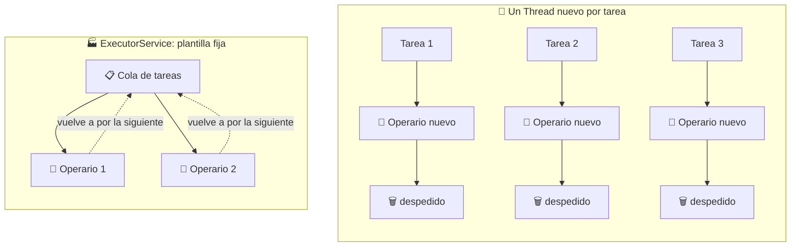
```mermaid
flowchart TB
    subgraph M["🔨 Un Thread nuevo por tarea"]
        direction TB
        T1["Tarea 1"] --> H1["🧍 Operario nuevo"] --> X1["🗑️ despedido"]
        T2["Tarea 2"] --> H2["🧍 Operario nuevo"] --> X2["🗑️ despedido"]
        T3["Tarea 3"] --> H3["🧍 Operario nuevo"] --> X3["🗑️ despedido"]
    end

    subgraph E["🏭 ExecutorService: plantilla fija"]
        direction TB
        Q["📋 Cola de tareas"]
        P1["🧍 Operario 1"]
        P2["🧍 Operario 2"]
        Q --> P1
        Q --> P2
        P1 -.->|"vuelve a por la siguiente"| Q
        P2 -.->|"vuelve a por la siguiente"| Q
    end
```

En "Un Thread nuevo por tarea", cada tarea contrata y despide a su propio operario, por pequeña que sea la tarea. En "ExecutorService: plantilla fija", una plantilla fija de dos operarios se reparte todas las tareas que vayan llegando a la cola, sin contratar ni despedir a nadie de más.

El `ExecutorService` ya resuelve el despilfarro de crear un hilo por tarea, pero sigue siendo trabajo tuyo: crear el *pool*, elegir su tamaño, y enviarle cada tarea explícitamente. Spring da un paso más y se encarga hasta de eso: por encima de `ExecutorService` están las abstracciones que vas a usar en los próximos apartados de este tema — tú ni siquiera gestionas la plantilla, solo escribes una nota en tu propio código (una anotación) y el framework se encarga de todo lo demás, sin que tengas que gestionar el `Thread`/`Runnable`/`ExecutorService` explícitamente. Los tres niveles, resumidos:

| Nivel | Qué haces tú | Quién gestiona los hilos |
|---|---|---|
| `Thread`/`Runnable` a mano | Creas y arrancas cada hilo tú mismo | Nadie — un hilo nuevo por cada `new Thread()` |
| `ExecutorService` | Envías tareas a un *pool* ya creado | El propio `ExecutorService`, reutilizando hilos |
| Abstracciones de Spring (próximos apartados) | Declaras una anotación en tu propio código | Spring, por debajo, con un `ExecutorService` propio |

---

## 🔍 Tu aplicación ya es multihilo

Siguiendo con la API de la librería que conoces de los temas anteriores, hay al menos un sitio donde ya hay varios hilos trabajando sin que tú lo hayas pedido — y vas a construir tú mismo un segundo sitio en la próxima actividad, siguiendo exactamente el mismo patrón.

### El pool de Tomcat

Ya lo comprobaste experimentalmente en el Tema 1: dos peticiones simultáneas al endpoint lento (con su `Thread.sleep(2000)` simulado) no tardaban el doble, sino aproximadamente lo mismo que una sola. Ahora tienes el nombre técnico: Tomcat mantiene un **pool de hilos**, y cada petición HTTP se atiende en un hilo distinto de ese pool — este es el sitio donde ya lo tienes, sin haberlo pedido.

### La próxima pieza — un listener que atiende mensajes

El pool de Tomcat funciona porque hay hilos dedicados a **atender** algo que llega desde fuera: entra una petición HTTP, y un hilo libre del pool se encarga de ella. Lo que vas a construir en la Actividad 3.1 sigue exactamente el mismo patrón, pero atendiendo otra cosa: en vez de peticiones HTTP, atiende **mensajes**. Todavía no lo tienes en tu proyecto — lo vas a montar tú mismo dentro de un momento, pero antes de ver el mecanismo, vale la pena entender **qué problema resuelve** y por qué merece la pena.

#### El problema, antes que la solución

Imagina que quieres que, cada vez que se crea, modifica o borra un `Libro`, quede un registro de esa actividad (qué ha pasado y cuándo) — algo útil para auditoría, pero que a quien hace el `POST` no le importa lo más mínimo. `ActividadService` es la pieza que ya sabe hacer eso: simplemente guarda ese registro en base de datos (una entidad más, con su propio repositorio), para poder consultarlo más adelante. La forma más directa de usarla: llamarla tú mismo, dentro de `LibroService.create()`, en el mismo hilo que atiende la petición:

```java
public LibroResponseDTO create(LibroCreateDTO dto) {
    Libro saved = libroRepository.save(mapToEntity(dto));
    actividadService.registrar("CREADO", "Libro", saved.getId().toString()); // en el mismo hilo A
    return mapToDTO(saved);
}
```

Funciona, pero **acopla** dos cosas que no tienen por qué ir juntas: el cliente que ha hecho el `POST` tiene que esperar a que termine también el registro de actividad antes de recibir su respuesta, aunque ese registro no forme parte de lo que realmente le importa. Si `registrar()` tardara, o si esa pieza fallara, se llevaría por delante la creación del libro entera — un problema secundario contaminando al principal.

La idea que soluciona esto: que el hilo A (el de la petición) haga solo lo esencial —guardar el libro— y **anuncie** que eso ha pasado, sin esperar a que nadie reaccione. Otro hilo, en su propio momento, se encarga de la parte no esencial.

#### Por qué un broker, y no simplemente otro hilo

Podrías pensar: ¿por qué no arrancar directamente un `new Thread()` para eso, sin meter nada más de por medio? Porque un hilo suelto no sobrevive a nada: si la aplicación se reinicia justo después de arrancarlo, ese registro se pierde para siempre, sin dejar rastro. Un **broker de mensajería** guarda el mensaje hasta que alguien lo consuma de verdad — y ese "alguien" ni siquiera tiene que existir todavía en el momento de publicar: el mensaje se queda esperando.

Antes de verlo en acción necesitas saber qué es **RabbitMQ**, porque es la primera vez que aparece en el curso. RabbitMQ es exactamente ese **broker de mensajería**: un servidor intermediario que recibe mensajes de quien los produce y los entrega a quien los consume, sin que productor y consumidor se conozcan entre sí ni tengan que estar activos al mismo tiempo. Funciona como una oficina de correos: echas una carta en un buzón sin saber quién la va a recoger ni cuándo, y la oficina se encarga de llevarla hasta el destinatario correcto.

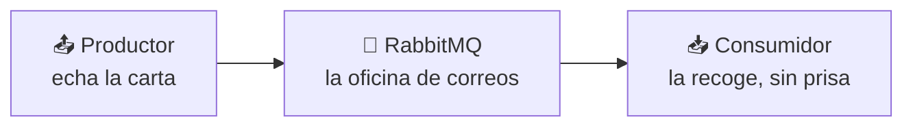
```mermaid
flowchart LR
    P["📤 Productor<br/>echa la carta"] --> B["📮 RabbitMQ<br/>la oficina de correos"]
    B --> C["📥 Consumidor<br/>la recoge, sin prisa"]
```

Por dentro, esa "oficina de correos" tiene sus propias piezas, y cada una tiene su nombre. Los mensajes esperan en una **cola** — una lista de mensajes pendientes de procesar, como la bandeja de cartas sin repartir. Antes de llegar ahí, pasan por un **exchange**: el equivalente al clasificador de la oficina, que mira la "dirección" de cada mensaje (su *routing key*) y decide a qué cola (o colas) lo manda, según reglas de enrutado que tú mismo configuras. Y del lado de quien recibe está el **listener**: un trozo de código que se queda a la espera de que ocurra algo —en este caso, que llegue un mensaje a su cola— y reacciona cuando pasa, sin controlar él cuándo va a ocurrir ni tener que estar comprobándolo activamente. En Spring, `@RabbitListener` marca un método como ese tipo de código: Spring lo invoca automáticamente en cuanto llega un mensaje a la cola indicada, en **un hilo aparte, reservado por Spring para esto** — no en el hilo de quien publicó el mensaje.


```mermaid
flowchart LR
    P["📤 Productor<br/>publica un mensaje"] --> X["🔀 Exchange<br/>mira la dirección"]
    X --> Q["📋 Cola<br/>mensajes pendientes"]
    Q --> C["📥 @RabbitListener<br/>consumidor, otro hilo"]
```

#### La solución completa, con las dos mitades del flujo

Para hablar con RabbitMQ hace falta una dependencia nueva en el `pom.xml`, `spring-boot-starter-amqp` — es la que trae `RabbitTemplate`, `@RabbitListener` y todo lo que ves a continuación; sin ella, ninguna de estas anotaciones haría nada. La añadirás tú mismo en la próxima actividad.

Antes de nada, una pieza que suele generar dudas: el que publica solo conoce el **exchange** (`CATALOGO_EXCHANGE`); el que escucha solo conoce la **cola** (`ACTIVIDAD_LIBRO_QUEUE`) — ninguno de los dos menciona al otro directamente. Lo que conecta ambos nombres es un **binding**: una regla, independiente de publicador y consumidor, que asocia un exchange con una cola bajo un patrón de *routing key* concreto — es literalmente la ficha del clasificador de la oficina de correos ("todo lo que traiga esta dirección, a este casillero"), y es donde de verdad se decide el destino final de un mensaje.

```java
@Configuration
public class RabbitMQConfig {

    public static final String CATALOGO_EXCHANGE = "catalogo.exchange";
    public static final String ACTIVIDAD_LIBRO_QUEUE = "actividad.libro.queue";

    @Bean
    public TopicExchange catalogoExchange() {
        return new TopicExchange(CATALOGO_EXCHANGE);
    }

    @Bean
    public Queue actividadLibroQueue() {
        return new Queue(ACTIVIDAD_LIBRO_QUEUE);
    }

    @Bean
    public Binding actividadBinding(Queue actividadLibroQueue, TopicExchange catalogoExchange) {
        return BindingBuilder.bind(actividadLibroQueue).to(catalogoExchange).with("libro.*");
    }
}
```

Con esta `Binding`, cualquier mensaje publicado en `CATALOGO_EXCHANGE` con una *routing key* que empiece por `"libro."` (`"libro.creado"`, `"libro.actualizado"`...) termina en `ACTIVIDAD_LIBRO_QUEUE` — es el exchange, no el publicador, quien decide el destino final, exactamente como el clasificador de la oficina de correos de antes.

Lo primero que sí toca al código de negocio es el propio mensaje: un `record` sencillo con lo mínimo que el otro lado va a necesitar saber — qué ha pasado, y sobre qué libro:

```java
public record LibroEvent(String tipo, Long libroId) {}
```

Publicar es tan simple como llamar a `RabbitTemplate`, la clase que Spring te da para hablar con el exchange: le dices en qué exchange quieres publicar, con qué *routing key* y qué mensaje mandar (este `LibroEvent`). Esta es la pieza que sustituye a la llamada directa de antes, dentro de `LibroService.create()`:

```java
@Component
@RequiredArgsConstructor
public class LibroEventPublisher {

    private final RabbitTemplate rabbitTemplate;
    private final JsonMapper jsonMapper;

    public void publicar(String tipo, Long libroId) {
        try {
            String payload = jsonMapper.writeValueAsString(new LibroEvent(tipo, libroId));
            rabbitTemplate.convertAndSend(RabbitMQConfig.CATALOGO_EXCHANGE, "libro." + tipo.toLowerCase(), payload);
        } catch (JacksonException e) {
            throw new IllegalStateException("No se ha podido serializar el evento", e);
        }
    }
}
```

`JsonMapper` convierte el `LibroEvent` en JSON antes de enviarlo. De este modo no dependemos de que el `record` implemente `Serializable` ni de configurar todavía un conversor específico para RabbitMQ. En la actividad aplicarás este mismo mecanismo al evento real de GameVault.

`LibroService.create()` llama ahora a `publicar(...)` en vez de invocar directamente a `actividadService.registrar(...)`. Una vez entregado el mensaje a RabbitMQ, continúa y responde al cliente:

```java
@Service
@RequiredArgsConstructor
public class LibroService {

    private final LibroRepository libroRepository;
    private final LibroEventPublisher libroEventPublisher;

    public LibroResponseDTO create(LibroCreateDTO dto) {
        Libro saved = libroRepository.save(mapToEntity(dto));
        libroEventPublisher.publicar("CREADO", saved.getId());
        return mapToDTO(saved);
    }
}
```

El registro real ocurre en el otro extremo. El consumidor recibe la cadena JSON, la reconstruye como un `LibroEvent` y llama al servicio correspondiente:

```java
@Service
@RequiredArgsConstructor
public class ActividadLibroEventConsumer {

    private final ActividadService actividadService;
    private final JsonMapper jsonMapper;


    @RabbitListener(queues = RabbitMQConfig.ACTIVIDAD_LIBRO_QUEUE)
    public void recibir(String payload) {
        LibroEvent event = jsonMapper.readValue(payload, LibroEvent.class);
        actividadService.registrar(event.tipo(), "Libro", event.libroId().toString());
    }
}
```

El flujo completo implica dos hilos distintos:

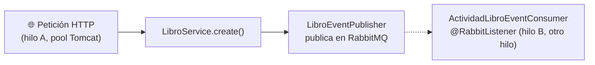
```mermaid
flowchart LR
    A["🌐 Petición HTTP<br/>(hilo A, pool Tomcat)"] --> B["LibroService.create()"]
    B --> C["LibroEventPublisher<br/>publica en RabbitMQ"]
    C -.-> D["ActividadLibroEventConsumer<br/>@RabbitListener (hilo B, otro hilo)"]
```

`LibroService.create()` se ejecuta en el hilo de la petición HTTP, publica el mensaje y continúa sin esperar a que se registre la actividad. El consumidor lo procesa después en uno de los hilos destinados a los listeners de RabbitMQ. Así, una tarea secundaria no retrasa la respuesta principal y el mensaje puede permanecer en la cola hasta que algún consumidor lo procese.

---

## ✅ Ideas clave

??? tip "Abrir resumen"

    - Un **proceso** tiene su propia memoria; un **hilo** es una línea de ejecución dentro de un proceso, compartiendo su memoria con los demás hilos de ese proceso.
    - **Concurrencia** (turnarse) vs. **paralelismo** (a la vez, en núcleos distintos) — el planificador del SO decide, no tu programa.
    - `new Thread(runnable).start()` arranca un hilo real; llamar a `run()` directamente NO crea ningún hilo nuevo.
    - La **condición de carrera** ocurre cuando varios hilos modifican el mismo dato sin coordinación; `synchronized` la resuelve creando una sección crítica protegida por un **lock** — pero en exceso puede provocar **deadlock**.
    - Ciclo de vida: `NEW` → `RUNNABLE` → `BLOCKED` / `WAITING` / `TIMED_WAITING` → `TERMINATED`.
    - `.interrupt()` puede hacer que `sleep()` termine antes lanzando `InterruptedException`; volver a llamar a `interrupt()` en el `catch` es el patrón estándar para no perder ese aviso.
    - **RabbitMQ**: un broker de mensajería con colas y exchanges; `@RabbitListener` procesa mensajes en un hilo aparte, distinto del hilo que publicó. Publicador y consumidor no se conocen entre sí — es el **binding** (exchange + patrón de *routing key* → cola) quien conecta a uno con el otro.
    - Publicar un mensaje y dejar que otro hilo lo procese evita que el trabajo no esencial (como registrar actividad) retrase la respuesta al cliente — y un broker, a diferencia de un `new Thread()` suelto, conserva el mensaje aunque en ese momento no haya nadie escuchando.
    - Tu aplicación ya es multihilo: el pool de Tomcat (una petición, un hilo) ya lo tienes, sin haberlo pedido ni escrito `new Thread()` nunca. El listener de RabbitMQ sigue el mismo patrón, pero es la pieza que vas a construir tú mismo en la próxima actividad.
