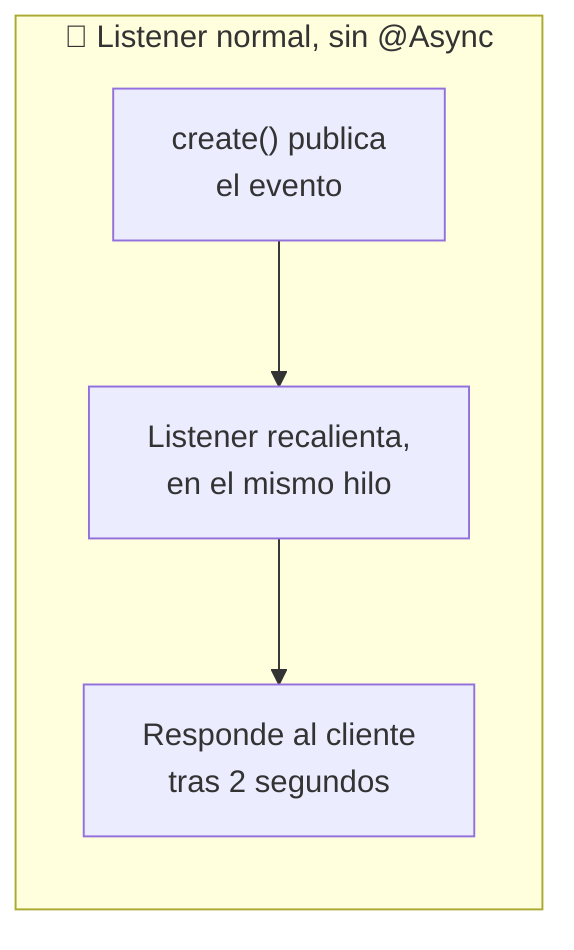
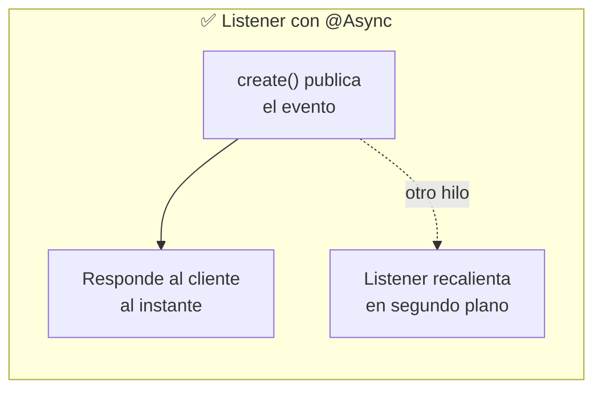
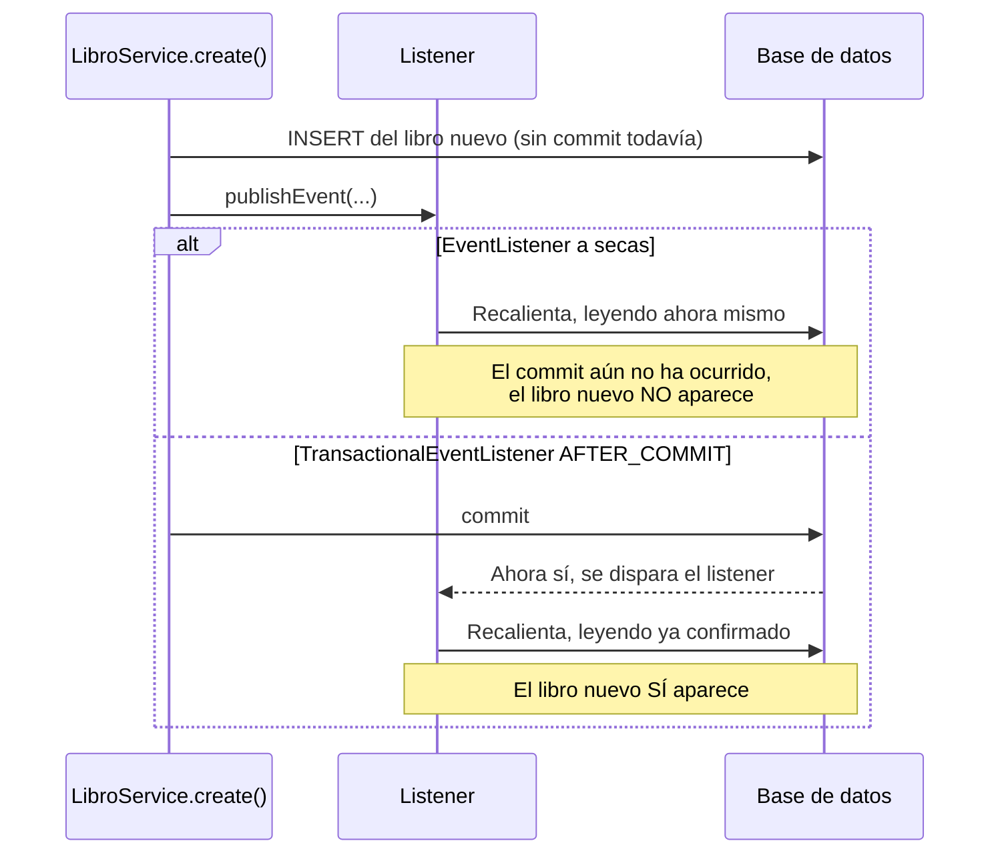

<a id="listeners-asincronos"></a>

# 🧩 3. Listeners asíncronos: el warm-up de caché (2/2)

{ type=application/pdf style="width:100%;min-height:80vh" }

!!! info "Descarga de diapositivas"
    [Descarga las diapositivas](diapositivas/listeners-asincronos.pptx){target="_blank" rel="noopener"}

---

En el apartado anterior has construido el evento y su publicación — sin ningún efecto visible todavía. Hoy construyes la pieza que le da sentido a todo: el listener que reacciona, recalentando la caché en un hilo aparte. Aquí es donde entra en juego `@EnableAsync` — una capacidad que tu proyecto todavía no usa en ningún sitio, y que hoy activas tú mismo junto a la anotación `@Async`.

---

## 🤔 Qué pasaría si el listener no fuera asíncrono

El listener que vas a construir reacciona al mismo evento que ya publicas en `create()`/`update()`/`delete()` — y, para recalentar la caché, tiene que volver a llamar a `getTopNovedades()`, la misma consulta que tarda 2 segundos. Si Spring ejecutara ese listener de la forma más simple posible, sin nada más, lo haría **en el mismo hilo** que ha publicado el evento: el hilo de la petición HTTP que acaba de crear el videojuego. El cliente, que solo quería su `201 Created`, se quedaría esperando esos 2 segundos igualmente — el mismo coste que la caché pretendía evitar, solo que trasladado de sitio, no eliminado.



`@Async` es justo lo que rompe esa cadena — es la pieza que hace que "el listener reacciona" y "el cliente espera" dejen de ser la misma cosa.



---

## ⚡ `@Async`: qué hace exactamente

`@Async` sobre un método le dice a Spring: "no ejecutes este método en el hilo de quien lo llama — despáchalo a un pool de hilos aparte, y devuelve el control inmediatamente a quien llamó". Es el mismo tipo de mecanismo que ya has visto con `@Cacheable` en el apartado anterior: Spring intercepta la llamada al método anotado y hace algo distinto de lo que harías tú al llamarlo a pelo.

| | Sin `@Async` | Con `@Async` |
|---|---|---|
| ¿En qué hilo se ejecuta el método? | En el mismo hilo de quien lo llama | En un hilo del pool, aparte |
| ¿Cuándo recupera el control quien llamó? | Cuando el método termina de ejecutarse | Inmediatamente, sin esperar a que termine |

Por debajo, en cuanto invocas un método `@Async`, Spring no lo ejecuta ahí mismo: lo envía a un `ExecutorService` (recuerda la escala de abstracción del primer apartado de este tema), y el método original se ejecuta en uno de esos hilos del pool.

Ya tienes el contraste medido en la Actividad 3.2: sin `@Async`, tu listener trivial de prueba corría en el **mismo hilo** de la petición HTTP que publicó el evento. Con `@Async`, va a correr en un hilo **distinto** — lo vas a verificar de nuevo hoy, comparando los nombres de hilo en el log.

!!! danger "La trampa clásica: llamar a un método `@Async` desde dentro de la misma clase"
    Spring solo puede interceptar una llamada que venga **de fuera** de la clase. Si en vez de eso un método llama directamente a otro método `@Async` de esa misma clase (`this.metodoAsync(...)`), no hay ninguna llamada externa que interceptar — se ejecuta como una llamada normal de Java, en el mismo hilo, y `@Async` se ignora **en silencio**, sin ningún error ni aviso. Es uno de los fallos más comunes con `@Async` en Spring: en este warm-up no te va a pasar, porque el listener es un bean aparte al que Spring llama desde fuera, pero conviene que lo tengas en la cabeza para el futuro.

---

## ⏱️ `@TransactionalEventListener(phase = AFTER_COMMIT)`

Aquí aparece un problema real, sutil, que un `@EventListener` a secas no resuelve: si el listener se dispara **antes** de que la transacción de `LibroService.create()` haga *commit*, el hilo del warm-up podría leer la base de datos en un estado que **todavía no incluye** el libro recién creado — y recalentaría la caché con datos viejos, justo lo contrario de lo que quieres.



`@TransactionalEventListener(phase = AFTER_COMMIT)` resuelve esto: en vez de dispararse en el momento de `publishEvent(...)`, espera a que la transacción que publicó el evento haga *commit* con éxito, y solo entonces ejecuta el listener. Es la **técnica específica de sincronización** que necesitas para este caso concreto: sincronizar el arranque del hilo del listener con el momento exacto en que los datos ya son consistentes y visibles. Ya conoces `@Transactional` de Acceso a Datos — esto es la contrapartida del lado "quien reacciona a que una transacción ha terminado", no del lado "quien abre la transacción".

```java
@TransactionalEventListener(phase = TransactionPhase.AFTER_COMMIT)
@Async
public void onLibrosBaratosInvalidado(LibrosBaratosInvalidadoEvent event) {
    // se ejecuta DESPUÉS del commit, EN OTRO HILO
}
```

---

## 🔄 Estados de un hilo, ahora observables de verdad

Retoma el ciclo de estados del primer apartado de este tema (`NEW` → `RUNNABLE` → `BLOCKED` / `WAITING` / `TIMED_WAITING` → `TERMINATED`), esta vez con un caso perfectamente observable: el retraso artificial que simula el coste de recalcular los libros más baratos.

| Momento | Estado del hilo del warm-up |
|---|---|
| El listener empieza a ejecutar el recálculo | `RUNNABLE` |
| Dentro del retraso artificial (el `Thread.sleep` simulado) | `TIMED_WAITING` |
| El retraso termina, el listener sigue calculando | `RUNNABLE` |
| El listener termina | `TERMINATED` |

Fíjate en que aquí no aparece `BLOCKED` — ese estado nace de esperar un *lock* ocupado por otro hilo (como en el `Contador` del primer apartado), y este warm-up no compite por ningún *lock*. Puedes verlo tú mismo con `Thread.getState()`, igual que has hecho con `EstadosDemo` en el primer apartado, capturando el estado del hilo justo durante ese retraso.

---

## ⚠️ Problemas de compartición, en este caso concreto

Tres preguntas que conviene hacerse antes de dar el warm-up por terminado:

- **¿Qué pasa si dos escrituras casi simultáneas publican dos eventos?** Se lanzan dos tareas de warm-up que pueden ejecutarse a la vez en hilos distintos del pool. Además del trabajo duplicado, aparece una carrera: si ambas encuentran la caché vacía, una tarea que empezó antes puede terminar después y dejar en Redis un resultado calculado sobre un estado anterior de la base de datos. En el flujo sencillo de esta práctica normalmente no lo vas a apreciar, pero en un sistema real habría que coordinar esos recálculos.
- **¿Y si el listener leyera una entidad JPA compartida en vez de un evento inmutable?** Si `LibrosBaratosInvalidadoEvent` no fuera un `record` inmutable, sino que el listener leyera directamente un objeto mutable compartido con el hilo que publicó, existiría el riesgo de que ese objeto cambiara mientras el listener aún lo está usando — exactamente el tipo de condición de carrera que has visto en la Actividad 3.1. La inmutabilidad del evento elimina ese riesgo por diseño.
- **¿Y si el listener necesitara algo del contexto del hilo original, como el usuario autenticado?** No lo tendría — un hilo nuevo no hereda lo que estuviera guardado en un `ThreadLocal` (así almacena Spring Security el usuario actual), así que ese dato tendría que pasarse como parámetro explícito, nunca leerse esperando que "ya esté ahí".

---

---

## 📈 El resultado que vas a medir

| | Antes (Actividad 3.2, sin warm-up) | Después (hoy, con warm-up) |
|---|---|---|
| Tras crear un libro | La caché queda vacía hasta que alguien vuelve a consultar | El listener empieza a recalentarla automáticamente en segundo plano |
| ¿Quién paga el coste de recalcular? | El primer usuario que pide el listado tras la escritura | El hilo del warm-up intenta asumir ese coste antes de que llegue la siguiente petición |

Con las dos piezas montadas (evento + listener asíncrono sincronizado con el commit), el recálculo de la caché empieza automáticamente en segundo plano después de cada escritura. **Si el warm-up termina antes de la siguiente petición**, ese usuario encontrará ya el resultado en caché y no pagará el coste de recalcularlo. Si una petición llega mientras el warm-up todavía está trabajando, puede encontrar la caché aún vacía y coincidir con ese recálculo. La Actividad 3.3 lo va a demostrar esperando a que el warm-up termine y comparando después los tiempos con los obtenidos en la Actividad 3.2.

---

## ✅ Ideas clave

??? tip "Abrir resumen"

    - `@Async` hace que Spring intercepte la llamada y despache la ejecución del método a un pool de hilos aparte — el llamador no espera a que termine.
    - Llamar a un método `@Async` desde dentro de la misma clase (`this.metodo(...)`) hace que Spring no pueda interceptar la llamada: `@Async` se ignora en silencio y el método corre en el mismo hilo, sin ningún error que lo avise.
    - `@TransactionalEventListener(phase = AFTER_COMMIT)` sincroniza el arranque del listener con el momento en que la transacción que publicó el evento ya ha hecho commit — evita leer datos "a medias".
    - El retraso artificial del endpoint lento es un caso observable real del estado **TIMED_WAITING**.
    - Publicaciones casi simultáneas pueden provocar trabajo duplicado e incluso carreras entre varios recálculos de la misma caché; un evento **inmutable** evita, por su parte, condiciones de carrera sobre los propios datos que se comparten entre hilos.
    - Un hilo nuevo no hereda el contexto del hilo original: nada guardado en un `ThreadLocal` (como el `SecurityContext` de Spring Security) viaja solo. Por eso los datos que un método `@Async` necesita del contexto de la petición se pasan como parámetro explícito, no se leen "mágicamente" desde dentro.
