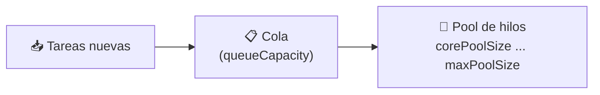

<a id="taskexecutor-prioridades"></a>

# 🧩 4. `TaskExecutor` propio y prioridades

Tomas el control fino de algo que, hasta ahora, ha funcionado "por defecto": el pool de hilos que hay detrás de `@Async`.

---

## 🏊 Por qué un pool, en serio esta vez

Ya mencionaste la idea en la Actividad 3.1: crear un hilo nuevo por cada tarea no escala. Ahora, en detalle: cada hilo tiene un coste real de creación y ocupa memoria propia mientras existe — si un pico de tareas provocara crear miles de hilos de golpe, podría llegar a tumbar el proceso entero por agotamiento de recursos.

Un **pool de hilos** resuelve esto con un grupo de hilos reutilizables que toman tareas de una cola, en vez de crear un hilo nuevo por tarea. Tres parámetros lo definen:



- **`corePoolSize`**: cuántos hilos se mantienen siempre activos, incluso sin tareas que hacer.
- **`maxPoolSize`**: el límite máximo de hilos que el pool puede llegar a crear si la carga aumenta.
- **`queueCapacity`**: cuántas tareas pueden esperar en cola antes de que el pool decida crear más hilos (hasta `maxPoolSize`) o, si ya está en el máximo, rechazar la tarea.

Si la cola se llena y ya se ha alcanzado `maxPoolSize`, la tarea nueva no tiene dónde ir — el comportamiento exacto (bloquear, descartar, lanzar una excepción) depende de la política configurada.

---

## 🎚️ Qué es la prioridad de un hilo — con honestidad técnica

La **prioridad** de un hilo es una pista que le das al planificador del sistema operativo sobre a quién dar turno de ejecución antes cuando varios hilos compiten por CPU. Es importante ser honesto sobre sus límites: es una **sugerencia**, no una garantía — el planificador puede (y a menudo lo hace) ignorarla parcialmente, según el sistema operativo y su carga real.

Por eso, la práctica moderna prefiere **pools separados y tamaños acotados** antes que jugar con prioridades para controlar el comportamiento del sistema: es un mecanismo más fiable y predecible que confiar en que el sistema operativo respete una sugerencia de prioridad.

---

## 🛠️ Un `TaskExecutor` propio para el warm-up

Hasta ahora, el `@Async` del warm-up usa el executor **por defecto** de Spring — genérico, compartido con cualquier otra tarea asíncrona que pudiera existir en la aplicación. La mejora que vas a construir: definir un pool propio, pequeño y con nombre reconocible, específico para el warm-up.

```java
@Configuration
public class WarmupExecutorConfig {

    @Bean(name = "warmupExecutor")
    public TaskExecutor warmupExecutor() {
        ThreadPoolTaskExecutor executor = new ThreadPoolTaskExecutor();
        executor.setCorePoolSize(2);
        executor.setMaxPoolSize(4);
        executor.setQueueCapacity(20);
        executor.setThreadNamePrefix("warmup-");
        executor.setThreadPriority(Thread.MIN_PRIORITY);
        executor.initialize();
        return executor;
    }
}
```

- `corePoolSize(2)`/`maxPoolSize(4)`: un pool deliberadamente pequeño — el warm-up no necesita mucha capacidad, es una tarea de fondo ocasional, no el núcleo de la aplicación.
- `threadNamePrefix("warmup-")`: esto es, en la práctica, la herramienta de **depuración** más útil de todo el apartado — con este prefijo, cualquier hilo llamado `warmup-1`, `warmup-2`... se distingue a simple vista en el log o en jconsole, sin confundirse con los hilos genéricos `http-nio-*` de Tomcat o los del pool por defecto.
- `setThreadPriority(Thread.MIN_PRIORITY)`: prioridad baja, con honestidad sobre sus límites — es exactamente el caso de tarea de fondo que debe ceder el paso ante trabajo más urgente (las peticiones de usuarios reales).

### Dirigir `@Async` a este pool concreto

```java
@TransactionalEventListener(phase = TransactionPhase.AFTER_COMMIT)
@Async("warmupExecutor")
public void onTopNovedadesInvalidado(TopNovedadesInvalidadoEvent event) {
    // ...
}
```

`@Async("warmupExecutor")`, con el nombre del bean entre paréntesis, dirige explícitamente la ejecución a ese pool concreto — en vez del genérico por defecto. Aislar las tareas de fondo en su propio pool pequeño evita que un pico de warm-ups (por ejemplo, muchas escrituras seguidas) "robe" hilos que deberían estar disponibles para atender peticiones de usuarios reales.

---

## 🔍 Depuración y documentación

Con el nombre de hilo distintivo, localizar los hilos `warmup-*` en un thread dump o en jconsole (las mismas herramientas de la Actividad 3.1) es inmediato — y puedes comprobar directamente su prioridad configurada. **Documentar** la decisión de configuración significa dejar por escrito, en un comentario junto al bean o en la documentación del proyecto, por qué se eligieron esos tamaños de pool y esa prioridad — no basta con que el código "funcione", debe quedar claro el razonamiento detrás de cada número.

---

## 🧭 Recapitulación del tema

Con esto se completa el recorrido: analizar los hilos que ya existían en tu aplicación sin haberlos programado (apartado 1) → construir un evento interno inmutable y publicarlo (apartado 2) → un listener `@Async` sincronizado con el commit de la transacción (apartado 3) → un `TaskExecutor` propio, con nombre y prioridad controlados (este apartado). En el Tema 4 los hilos vuelven a aparecer, esta vez gestionados completamente a mano: sockets y WebSocket.

---

## ✅ Ideas clave

??? tip "Abrir resumen"

    - Un pool de hilos se define por `corePoolSize` (mínimo activo), `maxPoolSize` (límite) y `queueCapacity` (cola de espera).
    - La **prioridad** de un hilo es una sugerencia al planificador del SO, no una garantía — por eso se prefieren pools separados y acotados antes que confiar en prioridades.
    - `threadNamePrefix` es la herramienta de depuración más práctica: hilos identificables a simple vista en logs y herramientas de monitorización.
    - `@Async("nombreDelBean")` dirige la ejecución a un `TaskExecutor` concreto, en vez del genérico por defecto — aislar tareas de fondo evita que roben hilos a las peticiones reales.
    - Documentar la configuración (por qué esos tamaños, por qué esa prioridad) es parte del trabajo de depuración y documentación, no un extra opcional.
