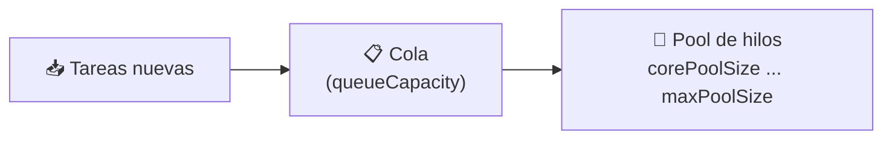

<a id="taskexecutor-prioridades"></a>

# 🧩 4. `TaskExecutor` propio y prioridades

El warm-up ya funciona de principio a fin: un evento se publica, un listener `@Async` lo recoge y recalienta la caché en segundo plano, sincronizado con el momento justo del commit. Queda una sola pieza suelta: **dónde** corre ese trabajo. Hasta ahora, en el pool de hilos genérico que Spring monta por defecto para cualquier `@Async` de tu proyecto, compartido con cualquier otra tarea asíncrona que pudiera existir — sin que tú hayas decidido nada al respecto. Hoy cierras el tema tomando ese control.

---

## 🏊 Por qué un pool

Ya viste la idea en el primer apartado de este tema, en "la escala de abstracción": crear un hilo nuevo por cada tarea, sin límite, es como contratar y despedir a un operario distinto por cada tarea que aparece, por pequeña que sea — funciona, pero es un despilfarro si las tareas no dejan de llegar. Un `ExecutorService` (o, aquí, un `ThreadPoolTaskExecutor`) es la plantilla fija de operarios que resuelve ese despilfarro. Ahora le toca el turno al detalle: cada hilo tiene un coste real de creación y ocupa memoria propia mientras existe — si un pico de tareas provocara crear miles de hilos de golpe, podría llegar a tumbar el proceso entero por agotamiento de recursos.

Un **pool de hilos** resuelve esto con un grupo de hilos reutilizables que toman tareas de una cola, en vez de crear un hilo nuevo por tarea. Tres parámetros lo definen:


```mermaid
flowchart LR
    T["📥 Tareas nuevas"] --> Q["📋 Cola<br/>(queueCapacity)"]
    Q --> P["👷 Pool de hilos<br/>corePoolSize ... maxPoolSize"]
```

- **`corePoolSize`**: cuántos hilos se mantienen siempre activos, incluso sin tareas que hacer.
- **`maxPoolSize`**: el límite máximo de hilos que el pool puede llegar a crear si la carga aumenta.
- **`queueCapacity`**: cuántas tareas pueden esperar en cola antes de que el pool decida crear más hilos (hasta `maxPoolSize`) o, si ya está en el máximo, rechazar la tarea.

Si la cola se llena y ya se ha alcanzado `maxPoolSize`, la tarea nueva no tiene dónde ir — qué pasa entonces lo decide la **política de rechazo** (`RejectedExecutionHandler`) del pool:

| Política | Qué hace con la tarea que no cabe |
|---|---|
| `AbortPolicy` (la de por defecto) | Lanza `RejectedExecutionException` — quien publicó la tarea se entera del rechazo |
| `CallerRunsPolicy` | La ejecuta el propio hilo que intentaba publicarla, en vez de un hilo del pool — frena a quien publica, sin perder la tarea |
| `DiscardPolicy` | La descarta en silencio, sin avisar a nadie |
| `DiscardOldestPolicy` | Descarta la tarea más antigua de la cola, para hacer sitio a la nueva |

Ninguna de las cuatro es "la correcta" en abstracto — depende de si perder una tarea es aceptable (un warm-up de caché, por ejemplo, puede permitírselo) o si hace falta enterarse siempre de un rechazo (una operación que el usuario espera confirmar).

---

## 🎚️ La prioridad de un hilo: qué controla de verdad

Recuerda al **planificador del sistema operativo** del primer apartado de este tema: el que decide, turno a turno, qué hilo ejecuta ahora mismo en cada núcleo. La prioridad es una pista que le das a ese mismo planificador — no un mecanismo nuevo, ni una reserva de CPU.

En Java va de 1 (`Thread.MIN_PRIORITY`) a 10 (`Thread.MAX_PRIORITY`), con 5 (`Thread.NORM_PRIORITY`) por defecto si no tocas nada — fijarla es solo decirle al planificador "si tienes que elegir, prefiere a este hilo".

| | Prioridad de hilo (`setThreadPriority`) |
|---|---|
| Qué hace | Da una pista al planificador del SO sobre a quién preferir |
| Qué no garantiza | Que el hilo de baja prioridad se quede sin CPU, ni que el de alta la consiga siempre |
| Cuándo se nota | Solo si hay contención real por los mismos núcleos |
| Portabilidad | El mismo número puede comportarse distinto según el sistema operativo |

Esa última fila es la que más pesa: Linux, Windows y macOS no tratan la prioridad de Java igual, y encima solo se nota cuando de verdad hay **contención** — varios hilos activos peleando por el turno en el mismo núcleo, al mismo tiempo. Si tu máquina tiene núcleos libres, o los hilos pasan la mayor parte del tiempo esperando (un `sleep`, una respuesta de base de datos) en vez de pedir turno sin parar, la prioridad casi no cambia nada observable.

Por eso la práctica moderna prefiere **pools separados y tamaños acotados** antes que jugar con prioridades para controlar el comportamiento del sistema: acotar `corePoolSize`/`maxPoolSize` es una garantía real (como mucho van a existir tantos hilos de warm-up como hayas fijado, en cualquier sistema operativo), mientras que la prioridad es, como mucho, una esperanza.

---

## 🛠️ Un `TaskExecutor` propio para el warm-up

Hasta ahora, el `@Async` del warm-up usa el executor **por defecto** de Spring — genérico, compartido con cualquier otra tarea asíncrona que pudiera existir en la aplicación. Eso tiene un coste concreto: si mañana añades otra tarea `@Async` a tu proyecto (un envío de correo, por ejemplo), competiría por los mismos hilos que el warm-up, y en el log todos aparecerían con el mismo nombre genérico (`task-1`, `task-2`...), sin forma de saber a simple vista cuál es cuál.

| | Executor por defecto | `TaskExecutor` propio |
|---|---|---|
| ¿Quién más lo usa? | Cualquier otra tarea `@Async` del proyecto | Solo el warm-up |
| Nombre de hilo en el log | Genérico (`task-1`, `task-2`...) | Reconocible (`warmup-1`, `warmup-2`...) |
| Tamaño del pool | El que decida Spring por defecto | El que tú decidas, ajustado a esta tarea concreta |

La mejora que vas a construir: definir un pool propio, pequeño y con nombre reconocible, específico para el warm-up.

```java
@Configuration
public class WarmupExecutorConfig {

    @Bean(name = "warmupExecutor")
    public TaskExecutor warmupExecutor() {
        ThreadPoolTaskExecutor executor = new ThreadPoolTaskExecutor();
        executor.setCorePoolSize(2);
        executor.setMaxPoolSize(4);
        executor.setQueueCapacity(20);
        executor.setThreadNamePrefix("warmup-");
        executor.setThreadPriority(Thread.MIN_PRIORITY);
        executor.initialize();
        return executor;
    }
}
```

Cada valor tiene un porqué concreto, no es arbitrario:

| Parámetro | Qué es | Valor elegido | Por qué |
|---|---|---|---|
| `corePoolSize` | Hilos que el pool mantiene siempre activos, incluso sin tareas | 2 | El warm-up no necesita mucha capacidad — es una tarea de fondo ocasional, no el núcleo de la aplicación |
| `maxPoolSize` | Límite máximo de hilos que el pool puede llegar a crear | 4 | Un límite bajo a propósito: si hay un pico de escrituras, el pool no debe crecer sin control |
| `queueCapacity` | Tareas que pueden esperar en cola antes de crear más hilos | 20 | Margen para picos breves de escrituras seguidas, sin llegar a disparar `maxPoolSize` por cada una |
| `threadNamePrefix` | Prefijo del nombre de cada hilo que crea este pool | `"warmup-"` | La herramienta de **depuración** más útil de todo el apartado — cualquier hilo `warmup-1`, `warmup-2`... se distingue a simple vista en el log, sin confundirse con los `http-nio-*` de Tomcat o los genéricos del pool por defecto |
| `threadPriority` | Pista de prioridad para los hilos de este pool (ver arriba) | `MIN_PRIORITY` | Marca esta tarea de fondo como candidata a ceder el paso ante trabajo más urgente |

### Dirigir `@Async` a este pool concreto

```java
@TransactionalEventListener(phase = TransactionPhase.AFTER_COMMIT)
@Async("warmupExecutor")
public void onTopNovedadesInvalidado(TopNovedadesInvalidadoEvent event) {
    // ...
}
```

`@Async("warmupExecutor")`, con el nombre del bean entre paréntesis, dirige explícitamente la ejecución a ese pool concreto — en vez del genérico por defecto. Aislar las tareas de fondo en su propio pool pequeño evita que un pico de warm-ups (por ejemplo, muchas escrituras seguidas) "robe" hilos que deberían estar disponibles para atender peticiones de usuarios reales.

!!! tip "Cada tarea de fondo distinta, su propio pool"
    `warmupExecutor` no tiene por qué ser el único. Si mañana añadieras otra tarea `@Async` con necesidades distintas —enviar correos, por ejemplo, que puede tardar por depender de un servidor externo, frente al warm-up, rápido y ocasional—, lo normal es darle su propio `@Bean` aparte: otro nombre (`emailExecutor`), otro `threadNamePrefix` (`email-`), y un tamaño de pool y una prioridad pensados para esa tarea, no para el warm-up. Compartir un mismo pool entre dos tareas con necesidades tan distintas es exactamente el problema que ya has visto con el executor por defecto —una puede "robarle" hilos a la otra en un pico—, solo que ahora entre dos pools propios en vez de entre uno propio y el genérico de Spring.

---

## ✅ Ideas clave

??? tip "Abrir resumen"

    - Un pool de hilos se define por `corePoolSize` (mínimo activo), `maxPoolSize` (límite) y `queueCapacity` (cola de espera). Si la cola se llena con el pool al máximo, la política de rechazo (`AbortPolicy` por defecto, o `CallerRunsPolicy`/`DiscardPolicy`/`DiscardOldestPolicy`) decide qué pasa con la tarea que no cabe.
    - La **prioridad** de un hilo es una sugerencia al planificador del SO, no una garantía — por eso se prefieren pools separados y acotados antes que confiar en prioridades.
    - `threadNamePrefix` es la herramienta de depuración más práctica: hilos identificables a simple vista en logs y herramientas de monitorización.
    - `@Async("nombreDelBean")` dirige la ejecución a un `TaskExecutor` concreto, en vez del genérico por defecto — aislar tareas de fondo evita que roben hilos a las peticiones reales.
    - Documentar la configuración (por qué esos tamaños, por qué esa prioridad) es parte del trabajo de depuración y documentación, no un extra opcional.
