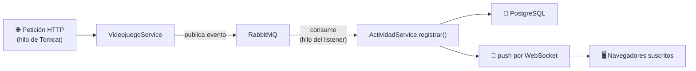

<a id="actividad-en-vivo-cierre"></a>

# 🧩 3. Actividad en vivo y seguridad del canal

Último apartado del módulo. Hoy conectas el canal `/ws-actividad` con los datos reales del proyecto, y afrontas algo que has dejado pendiente a propósito: qué implica en seguridad haber abierto ese canal sin autenticación.

---

## 📡 El punto de emisión: `ActividadService`

`ActividadService.registrar()` ya recibe cada evento del catálogo (a través del consumer de RabbitMQ, analizado en el Tema 3) y lo guarda en PostgreSQL. El plan de hoy: inyectar ahí `SimpMessagingTemplate` y, además de guardar, publicar el mismo registro en `/topic/actividad`.

El viaje completo de un dato, de principio a fin — el broche de todo el módulo, porque atraviesa **todo** lo construido en el curso:



---

## 🧵 Hilos y clientes simultáneos

¿En qué hilo se ejecuta el *push* hacia WebSocket? En el mismo hilo del **listener de RabbitMQ** que procesa el evento — el mismo hilo que ya identificaste en el Tema 3, ahora con una responsabilidad más. ¿Y quién gestiona los N clientes WebSocket conectados a la vez? El propio **contenedor** de Spring, exactamente igual que Tomcat gestiona las peticiones HTTP — es el mismo patrón "un hilo por cliente/conexión" que programaste **a mano** en la Actividad 4.1, aquí resuelto por el framework.

---

## 🔓 El aviso de seguridad del handshake

Aquí llega el momento de mirar atrás con ojo crítico. En la Actividad 4.2 abriste `/ws-actividad` con `permitAll()` — sin exigir ninguna autenticación. Pero `GET /api/v1/actividad` (la misma información, por REST) exige rol `ADMIN`. Hay una incoherencia real: **¿puede un usuario anónimo suscribirse al topic y ver en vivo exactamente lo que por REST está protegido?**

La respuesta es sí, y el motivo técnico es concreto: el *handshake* de WebSocket, tal como lo configuraste, no lleva el JWT por ningún sitio — un cliente que ni siquiera ha hecho login puede conectar y suscribirse sin problema. Las opciones frente a esto:

1. **Restringir el handshake**: exigir un token válido antes de aceptar la conexión.
2. **Filtrar qué se emite**: dejar el canal abierto, pero no mandar por él nada sensible.
3. **Asumirlo y documentarlo** como decisión consciente para un canal de demostración.

!!! danger "Aquí no vale quedarse solo en detectar y documentar"
    Terminar el módulo con un agujero de seguridad real, detectado y descrito por escrito pero sin corregir, transmite el mensaje contrario a todo lo que has construido en programación segura. La remediación **mínima** es obligatoria, no opcional — la vas a aplicar tú mismo en la Actividad 4.3.

### La remediación mínima: JWT en el handshake

La forma más simple de exigir el token en el handshake es pasarlo como parámetro de consulta en la propia URL de conexión (`/ws-actividad?token=...`), y validarlo con un interceptor antes de aceptar:

```java
public class JwtHandshakeInterceptor implements HandshakeInterceptor {

    private final JwtDecoder jwtDecoder;

    public JwtHandshakeInterceptor(JwtDecoder jwtDecoder) {
        this.jwtDecoder = jwtDecoder;
    }

    @Override
    public boolean beforeHandshake(ServerHttpRequest request, ServerHttpResponse response,
                                    WebSocketHandler wsHandler, Map<String, Object> attributes) {
        String query = request.getURI().getQuery();
        String token = extraerToken(query);

        if (token == null) {
            response.setStatusCode(HttpStatus.UNAUTHORIZED);
            return false; // rechaza el handshake
        }

        try {
            jwtDecoder.decode(token); // lanza excepción si no es válido
            return true;
        } catch (JwtException e) {
            response.setStatusCode(HttpStatus.UNAUTHORIZED);
            return false;
        }
    }

    @Override
    public void afterHandshake(ServerHttpRequest request, ServerHttpResponse response,
                                WebSocketHandler wsHandler, Exception exception) {
        // no hace falta nada aquí para este caso
    }

    private String extraerToken(String query) {
        if (query == null) return null;
        for (String param : query.split("&")) {
            if (param.startsWith("token=")) return param.substring(6);
        }
        return null;
    }
}
```

Y se registra en la configuración:

```java
@Override
public void registerStompEndpoints(StompEndpointRegistry registry) {
    registry.addEndpoint("/ws-actividad")
            .setAllowedOriginPatterns("*")
            .addInterceptors(new JwtHandshakeInterceptor(jwtDecoder));
}
```

`beforeHandshake` se ejecuta **antes** de que la conexión WebSocket se establezca — si devuelve `false`, el *handshake* se rechaza y la conexión nunca llega a completarse. Reutilizas el mismo `JwtDecoder` que ya tenías configurado desde el Tema 2 para validar el token — no hace falta ninguna pieza criptográfica nueva.

---

## 📝 Depuración y documentación

Con trazas de nombre de hilo en todo el camino (herencia del Tema 3: HTTP → listener de RabbitMQ → push WebSocket), puedes seguir el recorrido completo de un dato en el log. Y documentar el canal — endpoint, topic, formato del mensaje, política de acceso — de la misma forma en que documentaste la API REST con OpenAPI. Con una salvedad: WebSocket no aparece en Swagger (que solo describe HTTP tradicional), así que este canal se documenta **a mano**, en un fichero aparte.

---

## ✅ Ideas clave

??? tip "Abrir resumen"

    - El push por WebSocket se ejecuta en el mismo hilo del listener de RabbitMQ que procesa el evento; el contenedor gestiona los clientes WebSocket simultáneos, igual que Tomcat con HTTP.
    - Un canal abierto sin autenticación puede exponer, por WebSocket, información que por REST está protegida — una incoherencia real que hay que resolver, no solo señalar.
    - Un `HandshakeInterceptor` puede rechazar la conexión WebSocket antes de establecerse, validando un token pasado como parámetro de consulta.
    - Documentar y detectar un agujero de seguridad no sustituye corregirlo — la remediación mínima es parte obligatoria de la entrega.
    - WebSocket no aparece en Swagger — se documenta a mano.
