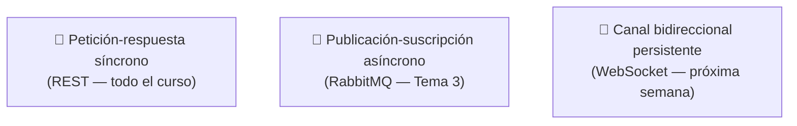

<a id="sockets-cliente-servidor"></a>

# 🧩 1. Sockets: la base de toda comunicación en red

Todo lo que has hecho hasta ahora en este módulo —peticiones REST, JWT, RabbitMQ— viaja, por debajo, sobre una pieza que nunca has tocado directamente: el **socket**. Esta semana la sacas a la superficie.

---

## 🔌 Qué es un socket

Un **socket** es el extremo programable de una conexión de red: una combinación de IP y puerto por la que un programa envía y recibe datos. Es la pieza que hay **debajo** de todo lo que ya has usado sin saberlo: cuando `curl` habla con GameVault en el puerto 8080, cuando tu aplicación se conecta a PostgreSQL (5432), MongoDB (27017) o RabbitMQ (5672), hay sockets TCP funcionando por debajo, en cada uno de esos casos.

Compruébalo en vivo, con tu aplicación arrancada:

```bash
netstat -an | grep 8080
# o, en sistemas más recientes:
ss -tan | grep 8080
```

Verás las conexiones establecidas de tu propia aplicación — cada una es un socket real.

---

## 🎭 Roles cliente y servidor

Dos papeles bien diferenciados:

- **Servidor**: **escucha** en un puerto concreto, esperando conexiones — como Tomcat, escuchando en el 8080 de tu GameVault. En Java clásico, esto es un `ServerSocket`.
- **Cliente**: **inicia** la conexión hacia el servidor — como `curl`, o como tu propia aplicación cuando se conecta a PostgreSQL. En Java clásico, esto es un `Socket`.

El servidor sigue la secuencia *bind* (asociarse a un puerto) → *listen* (empezar a escuchar) → *accept* (aceptar una conexión entrante); el cliente hace *connect* (iniciar la conexión). Una vez establecida la conexión, ambos lados intercambian datos a través de **streams** de entrada y salida sobre el socket — exactamente como los flujos que ya conoces de Java para leer y escribir.

---

## 🆚 Tipos de socket: TCP vs. UDP

| | Stream / TCP | Datagrama / UDP |
|---|---|---|
| **Conexión** | Orientado a conexión — se establece antes de intercambiar datos | Sin conexión — cada paquete viaja independiente |
| **Fiabilidad** | Garantiza entrega y orden | Sin garantías |
| **Dónde se usa** | Todo lo que usa GameVault (HTTP, conexiones a BD, RabbitMQ) | Streaming en tiempo real, juegos en tiempo real, donde perder algún paquete es aceptable a cambio de velocidad |

Todo lo que has construido en este curso usa TCP — la fiabilidad importa más que la velocidad extrema cuando hablamos de peticiones REST o de guardar datos en una base de datos.

---

## 🌐 Modelos de comunicación en arquitecturas distribuidas

Tres modelos, cada uno anclado a algo que ya conoces del curso:



- **Petición-respuesta síncrono**: el cliente pide, el servidor responde, ahí termina esa conversación — el modelo de todo REST que has construido en PSP y AD.
- **Publicación-suscripción asíncrono**: productor y consumidor no se conocen ni tienen que estar activos a la vez — RabbitMQ, del Tema 3.
- **Canal bidireccional persistente**: una conexión que permanece abierta, por la que ambos lados pueden enviar datos en cualquier momento sin volver a conectar — el modelo que falta por conocer, WebSocket, la próxima semana.

---

## 🚨 Escenarios que necesitan algo más que petición-respuesta

¿Cuándo no basta con petición-respuesta? Cuando el **servidor** necesita avisar al cliente de algo que acaba de pasar, **sin que el cliente pregunte primero**. Con REST puro, el cliente tendría que estar preguntando constantemente ("¿ha pasado algo? ¿y ahora? ¿y ahora?") para enterarse a tiempo — ineficiente y con retraso.

El caso concreto que vas a construir en las próximas dos semanas: un panel de actividad en vivo de GameVault, donde el servidor empuja cada evento del catálogo (crear, actualizar, borrar un videojuego) hacia los clientes conectados, en el instante en que ocurre — sin que ellos tengan que preguntar.

---

## 🧭 Lo que viene: la Actividad 4.1

La práctica de esta semana (Actividad 4.1) construye un mini cliente/servidor de consola con `ServerSocket`/`Socket` e hilos — para tocar con las manos exactamente lo que Spring normalmente esconde.

!!! tip "Esta actividad, con sockets reales, ya cubre el contenido de forma completa"
    La Actividad 4.1, con `java.net.Socket`/`ServerSocket` reales y multihilo, cubre de forma **completa** el uso de sockets — no es un aperitivo antes de la "cobertura real" con WebSocket: es ya la cobertura real. Las semanas 18-19 (WebSocket) amplían el mismo contenido sobre un caso de aplicación real, pero no son necesarias para tenerlo cubierto.

---

## ✅ Ideas clave

??? tip "Abrir resumen"

    - Un **socket** es el extremo programable de una conexión de red (IP + puerto) — está debajo de toda comunicación que ya has usado en el curso.
    - **Servidor** (`ServerSocket`: bind/listen/accept) escucha; **cliente** (`Socket`: connect) inicia la conexión.
    - **TCP** (orientado a conexión, fiable) es lo que usa todo GameVault; **UDP** (sin conexión, sin garantías) se usa donde la velocidad importa más que la fiabilidad total.
    - Tres modelos de comunicación: petición-respuesta síncrono (REST), publicación-suscripción asíncrono (RabbitMQ), canal bidireccional persistente (WebSocket).
    - Un servidor necesita avisar proactivamente al cliente cuando petición-respuesta no basta — el escenario que resuelve el panel de actividad en vivo de las próximas semanas.
    - La Actividad 4.1, con sockets reales, cubre el contenido de forma completa — WebSocket es ampliación, no requisito.
