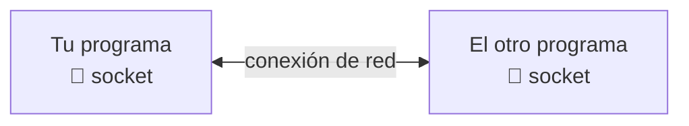
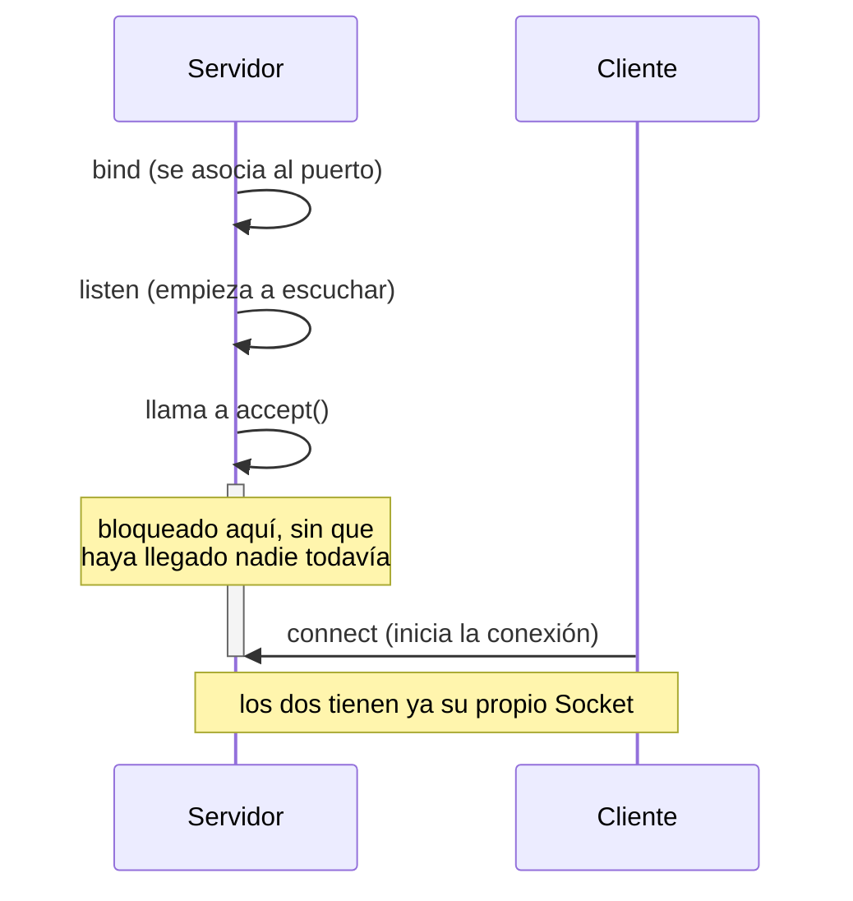
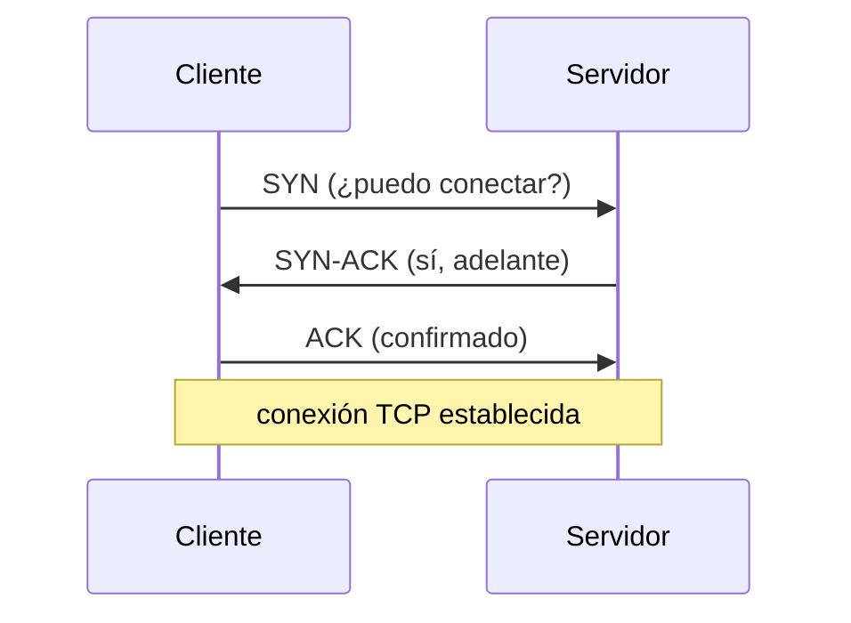
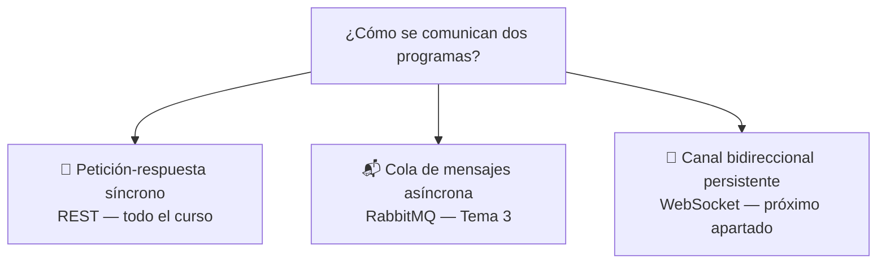

<a id="sockets-cliente-servidor"></a>

# 🧩 1. Sockets: la base de toda comunicación en red

Todo lo que has hecho hasta ahora en este módulo —peticiones REST, JWT, RabbitMQ— viaja, por debajo, sobre una pieza que nunca has tocado directamente: el **socket**. Este apartado la saca a la superficie.

---

## 🔌 Qué es un socket

Dos programas que se comunican por red —tu navegador y un servidor web, tu aplicación y PostgreSQL— lo hacen a través de una **conexión de red**: un canal por el que viajan datos entre una máquina y otra.

Esa máquina, y ese programa concreto dentro de ella, se identifican con dos datos — por ejemplo, en `192.168.1.5:8080`:

| `192.168.1.5` | `8080` |
|---|---|
| **IP** — qué máquina, de entre todas las de la red | **Puerto** — qué programa concreto, de entre todos los que están corriendo en esa máquina a la vez |

Piénsalo como la dirección de un edificio: la IP es el portal (qué edificio, de entre todos los de la calle), y el puerto es el piso concreto dentro de ese portal. No basta con acertar el edificio — si mandas la carta sin el piso, o al piso equivocado, nunca llega a quien la espera. Con una petición de red pasa lo mismo: tiene que llegar exactamente al puerto donde esa aplicación en concreto está esperando, aunque en la misma máquina convivan otras muchas escuchando en sus propios puertos.

Un **socket** es, simplemente, el objeto de tu código que representa uno de los dos extremos de esa conexión — sobre el que lees y escribes datos con los mismos streams de entrada/salida que ya conoces de Java. Cada uno de los dos programas tiene el suyo, en su propio lado:


```mermaid
flowchart LR
    A["Tu programa<br/>🔌 socket"] <-->|conexión de red| B["El otro programa<br/>🔌 socket"]
```

Y esa pieza está **debajo** de todo lo que ya has usado sin saberlo: cuando `curl` habla con tu aplicación en el puerto 8080, o cuando tu aplicación se conecta a PostgreSQL (5432), MongoDB (27017) o RabbitMQ (5672), hay un socket TCP a cada lado en todos esos casos.

Compruébalo en vivo, con tu aplicación arrancada:

```bash
netstat -an | grep 8080
# o, en sistemas más recientes:
ss -tan | grep 8080
```

Verás una línea en estado `LISTEN` sobre el `:8080` — el socket con el que tu aplicación espera que alguien se conecte, no una conversación ya en marcha. Ahora repite el mismo comando cambiando `8080` por `5432`: esta vez verás una línea en estado `ESTABLISHED` — la conexión ya abierta con PostgreSQL, solo que aquí tu aplicación no espera, sino que es ella quien se ha conectado. Dos sockets reales de tu misma aplicación, cada uno con un papel distinto.

---

## 🎭 Roles cliente y servidor

Ya sabes que cada programa tiene su propio socket, en su propio lado de la conexión. Pero esos dos lados no son intercambiables: alguien tiene que existir primero y quedarse esperando a que le contacten, y alguien tiene que decidir el momento de conectarse. Son los dos papeles de toda comunicación en red:

- **Servidor**: **escucha** en un puerto concreto, esperando conexiones — como Tomcat, escuchando en el 8080 de tu aplicación. En Java clásico, esto es un `ServerSocket`.
- **Cliente**: **inicia** la conexión hacia el servidor — como `curl`, o como tu propia aplicación cuando se conecta a PostgreSQL. En Java clásico, esto es un `Socket`.

El servidor y el cliente no hacen lo mismo, ni en el mismo orden. Retomando la analogía del portal y el piso:

| Paso | Qué hace | Como si... |
|---|---|---|
| **bind** | El servidor se asocia a un puerto concreto — lo reclama para sí mismo, nadie más en esa máquina puede usarlo ya | ...te mudaras a un piso y pusieras tu nombre en el buzón |
| **listen** | Pasa de "ocupado pero en silencio" a aceptar que llamen a esa puerta | ...abrieras la puerta, listo para recibir visita |
| **accept** | Se queda bloqueado esperando a que llegue alguien; en cuanto llega, lo acepta y abre un canal dedicado solo para hablar con ese cliente | ...te quedaras de pie junto a la puerta hasta que alguien llamara, y entonces le abrieras y te quedaras hablando con él |
| **connect** | El cliente inicia la conexión hacia la IP y el puerto del servidor | ...fueras tú a la dirección de otra persona y llamaras al timbre |

Puestos en orden, uno detrás de otro, así queda la secuencia completa:


```mermaid
sequenceDiagram
    participant S as Servidor
    participant C as Cliente
    S->>S: bind (se asocia al puerto)
    S->>S: listen (empieza a escuchar)
    S->>S: llama a accept()
    activate S
    Note over S: bloqueado aquí, sin que<br/>haya llegado nadie todavía
    C->>S: connect (inicia la conexión)
    deactivate S
    Note over C,S: los dos tienen ya su propio Socket
```

Nadie le entrega su `Socket` a nadie — cada lado se queda con el suyo propio, cada uno por su lado:

- El **cliente** ya lo tiene desde el principio: su propio `connect()` se lo devuelve en cuanto la conexión queda lista.
- El **servidor** consigue el suyo en ese mismo momento, pero por otro camino: es `accept()` quien se lo devuelve a él. Y ojo, no es el mismo objeto que el `ServerSocket` — es un `Socket` nuevo, creado solo para hablar con ese cliente concreto.

Dos objetos `Socket` distintos, uno en cada lado, cada uno apuntando a su propio extremo de la misma conexión. A partir de ahí, cada uno lee y escribe en el suyo con **streams** de entrada y salida — exactamente como ya haces en Java para leer y escribir.

!!! tip "El ServerSocket nunca habla con nadie"
    Su único trabajo es *bind* + *listen* + *accept*, una y otra vez — nunca lee ni escribe un solo dato de ningún cliente. Cada vez que `accept()` devuelve, se crea un `Socket` **nuevo y distinto**, uno por cada cliente aceptado, y es con **ese** `Socket` con el que de verdad se conversa — nunca con el `ServerSocket`. Mientras tanto, el `ServerSocket` se queda libre, listo para volver a llamar a `accept()` y aceptar al siguiente.

Fíjate en un detalle de *accept*: es una llamada **bloqueante** que devuelve una sola conexión cada vez. Un servidor que solo hace eso, un cliente detrás de otro, no puede atender a una segunda persona mientras sigue "hablando" con la primera — se queda atrapado. Lo vas a comprobar con tus propios ojos, y a resolverlo con hilos, en la Actividad 4.1.

Cada paso de esa secuencia tiene un nombre concreto en la librería `java.net` de Java, la que vas a usar en la Actividad 4.1:

| | Servidor | Cliente |
|---|---|---|
| Asociarse al puerto y escuchar | `new ServerSocket(puerto)` (bind + listen) | — |
| Aceptar / conectar | `serverSocket.accept()` (bloqueante, devuelve un `Socket`) | `new Socket(host, puerto)` (connect) |
| Leer y escribir | streams sobre el `Socket` que ha devuelto `accept()` | streams sobre su propio `Socket` |

---

## 🆚 Tipos de socket: TCP vs. UDP

El `Socket`/`ServerSocket` que acabas de ver son de un tipo concreto de socket — el que vas a usar en todo el curso. Existen dos tipos, según cómo viajan los datos por la red:

| | Stream / TCP | Datagrama / UDP |
|---|---|---|
| **Conexión** | Orientado a conexión — se establece antes de intercambiar datos | Sin conexión — cada paquete viaja independiente |
| **Fiabilidad** | Garantiza entrega y orden | Sin garantías |
| **Clases Java** | `Socket`, `ServerSocket` | `DatagramSocket`, `DatagramPacket` |
| **Dónde se usa** | Todo lo que has construido en el curso (HTTP, conexiones a BD, RabbitMQ) | Streaming en tiempo real, juegos en tiempo real, donde perder algún paquete es aceptable a cambio de velocidad |

"Orientado a conexión" no es solo una etiqueta — es justo lo que acabas de ver con *connect*. Antes de que viaje ni un solo byte de datos, cliente y servidor negocian tres mensajes de control para ponerse de acuerdo en que la conexión existe:


```mermaid
sequenceDiagram
    participant C as Cliente
    participant S as Servidor
    C->>S: SYN (¿puedo conectar?)
    S->>C: SYN-ACK (sí, adelante)
    C->>S: ACK (confirmado)
    Note over C,S: conexión TCP establecida
```

Tu código Java nunca escribe esos tres mensajes — los intercambia el propio sistema operativo, por debajo. Lo único que hace tu programa es llamar a `connect()`; a partir de ahí, es el sistema operativo quien envía y recibe el SYN, el SYN-ACK y el ACK por su cuenta, mientras tu llamada se queda esperando, sin continuar, hasta que ese intercambio termina — solo entonces te devuelve el `Socket`. Es el mismo tipo de espera que ya has visto con `accept()` en el servidor — ninguno de los dos avanza hasta que la negociación termina.

Esa misma conexión, ya abierta, es la que TCP aprovecha después para cumplir su promesa de fiabilidad: cada paquete va numerado, y el otro lado responde con un **ACK** (de *acknowledgement*, "confirmación de recibido") por cada uno, para decir "este ya me ha llegado".

Hay dos formas de que algo se pierda por el camino, y desde el cliente se ven exactamente igual —no le llega confirmación a tiempo—, así que reacciona igual en las dos: reenvía el paquete.

<div class="tabs-colored" markdown>

=== "🔵 Se pierde el paquete"

    ```mermaid
    sequenceDiagram
        participant C as Cliente
        participant S as Servidor
        C->>S: Paquete #1
        S->>C: ACK #1
        C->>S: Paquete #2
        Note over C,S: el paquete #2 se pierde,<br/>nunca llega al servidor
        Note over C: no llega ACK #2 a tiempo
        C->>S: reenvía Paquete #2
        S->>C: ACK #2
    ```

=== "🟢 Se pierde el ACK"

    ```mermaid
    sequenceDiagram
        participant C as Cliente
        participant S as Servidor
        C->>S: Paquete #1
        S->>C: ACK #1
        C->>S: Paquete #2
        S->>C: ACK #2
        Note over C,S: se pierde de vuelta —<br/>el cliente nunca lo ve
        C->>S: reenvía Paquete #2
        Note over S: ya lo tenía —<br/>lo descarta por el número de paquete
        S->>C: ACK #2
    ```

</div>

En el primer caso, el servidor no tenía el paquete y ahora sí. En el segundo, ya lo tenía, y le llega un duplicado — pero como cada paquete va numerado, TCP se da cuenta y lo descarta él solo, sin entregarlo dos veces a tu aplicación. Tu código nunca ve nada de este ir y venir: ni el reenvío, ni el duplicado descartado. Solo lees de un stream, y los datos te llegan completos, en orden, y una sola vez.

UDP no negocia nada de esto por delante: el cliente manda cada paquete directo, con la dirección de destino pegada a él, sin haber quedado antes con nadie.

| | TCP | UDP |
|---|---|---|
| Antes de enviar datos | negocia la conexión primero | envía directo, sin avisar |
| Si un paquete se pierde | se reenvía solo, tú no te enteras | se pierde y nadie te avisa |
| Coste de todo eso | más lento | más rápido |

Esa tabla explica por qué UDP sigue existiendo pese a ser menos fiable: en una videollamada o una partida online, un dato que llega tarde ya no sirve de nada —mejor perder un fotograma y seguir con el siguiente, que congelarse esperando a que TCP reenvíe el que faltó—, así que ahí compensa cambiar fiabilidad por velocidad. En cambio, al guardar una fila en base de datos o hacer una transferencia bancaria, perder un solo byte no es aceptable: ahí es TCP quien tiene sentido, y es exactamente lo que ha usado todo lo que has construido en este curso.

---

## 🌐 Modelos de comunicación en arquitecturas distribuidas

TCP y UDP responden a una pregunta muy concreta: cómo viajan los datos, byte a byte, por la red. Pero hay otra pregunta distinta, un nivel por encima: una vez la conexión existe, ¿qué patrón sigue la conversación entre los dos programas? ¿Uno pregunta y el otro responde? ¿Uno avisa cuando le interesa, sin que nadie se lo pida? Ahí es donde entran los **modelos de comunicación**.

No son los únicos que existen —también hay, por ejemplo, streaming continuo o llamadas a procedimiento remoto—, pero sí los tres que vas a encontrarte una y otra vez en aplicaciones como la tuya, y cada uno está anclado a algo que ya conoces del curso:


```mermaid
flowchart TB
    Q["¿Cómo se comunican dos programas?"]
    Q --> A["🔄 Petición-respuesta síncrono<br/>REST — todo el curso"]
    Q --> B["📬 Cola de mensajes asíncrona<br/>RabbitMQ — Tema 3"]
    Q --> C["🔗 Canal bidireccional persistente<br/>WebSocket — próximo apartado"]
```

- **Petición-respuesta síncrono**: el cliente pide, el servidor responde, ahí termina esa conversación — el modelo de todo REST que has construido en PSP y AD.
- **Cola de mensajes asíncrona**: el productor publica sin saber quién (ni si alguien) lo va a procesar, y cada mensaje concreto lo procesa un único consumidor — RabbitMQ, del Tema 3. Ojo, no es lo mismo que publicación-suscripción: en una cola, cada mensaje tiene un solo destinatario; en pub-sub, varios suscriptores reciben cada uno su propia copia del mismo mensaje.
- **Canal bidireccional persistente**: una conexión que permanece abierta, por la que ambos lados pueden enviar datos en cualquier momento sin volver a conectar — el modelo que falta por conocer, WebSocket, en el próximo apartado.

---

## 🚨 Escenarios que necesitan algo más que petición-respuesta

¿Cuándo no basta con petición-respuesta? Cuando el **servidor** necesita avisar al cliente de algo que acaba de pasar, **sin que el cliente pregunte primero**. Con REST puro, el cliente tendría que estar preguntando constantemente ("¿ha pasado algo? ¿y ahora? ¿y ahora?") para enterarse a tiempo — ineficiente y con retraso.

El caso concreto que vas a construir en las próximas actividades: un panel de actividad en vivo de tu aplicación, donde el servidor empuja cada evento del catálogo hacia los clientes conectados, en el instante en que ocurre — sin que ellos tengan que preguntar.

---

## ✅ Ideas clave

??? tip "Abrir resumen"

    - Un **socket** es el extremo programable de una conexión de red (IP + puerto) — está debajo de toda comunicación que ya has usado en el curso.
    - **Servidor** (`ServerSocket`: bind/listen/accept) escucha; **cliente** (`Socket`: connect) inicia la conexión.
    - **TCP** (orientado a conexión, fiable) es lo que usa todo lo construido en el curso; **UDP** (sin conexión, sin garantías) se usa donde la velocidad importa más que la fiabilidad total.
    - Tres modelos de comunicación: petición-respuesta síncrono (REST), cola de mensajes asíncrona (RabbitMQ — un consumidor por mensaje, no publicación-suscripción), canal bidireccional persistente (WebSocket).
    - Un servidor necesita avisar proactivamente al cliente cuando petición-respuesta no basta — el escenario que resuelve el panel de actividad en vivo de las próximas actividades.
