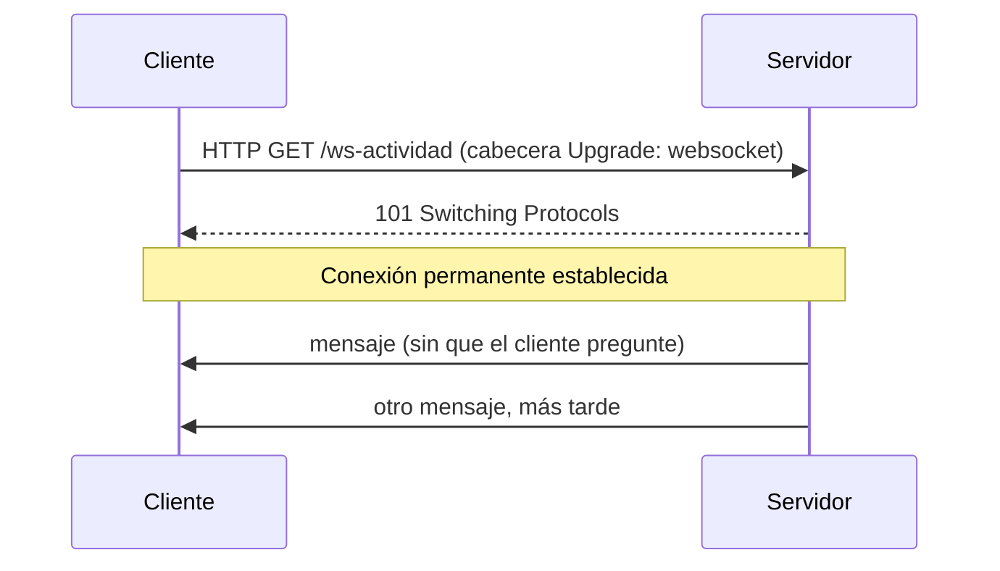
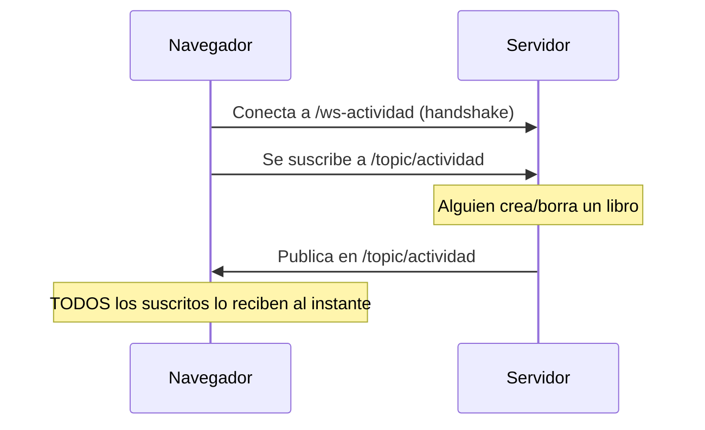

<a id="websocket-stomp"></a>

# 🧩 2. WebSocket con STOMP: el canal de actividad en vivo

!!! warning "Una pieza construida enteramente aquí, paso a paso"
    Lo que ves en este apartado no es un patrón estándar de un manual de Spring — es una funcionalidad concreta que vas a construir completamente guiado, sin nada previo sobre lo que apoyarte. Lo que ya viste con sockets Java reales (Actividad 4.1) queda cubierto de forma completa — este apartado lo **amplía** sobre un protocolo de nivel más alto, pero no es un punto de partida obligatorio para lo anterior.

---

## 🔔 El problema: ¿cómo se entera un cliente de algo que acaba de pasar?

Con todo lo que has construido hasta ahora (REST puro), el cliente siempre pregunta primero. Pero ¿cómo se entera de algo que el servidor sabe y el cliente no ha preguntado todavía? Las soluciones históricas, en orden:

1. **Recargar la página** — a mano, o con un `setTimeout` que recarga entera. Brutal y lento.
2. **Polling**: el cliente pregunta cada X segundos, "¿ha cambiado algo?" — funciona, pero tiene un coste real: peticiones constantes, la mayoría con respuesta "no, nada nuevo", y un retraso de hasta X segundos en enterarse.
3. **Long polling**: una variante donde el servidor retiene la respuesta hasta que hay algo que contar (o hasta un timeout) — mejora el retraso, pero sigue siendo, en el fondo, peticiones repetidas.

WebSocket no es tecnología caída del cielo — es la respuesta a este problema concreto.

---

## 🔗 WebSocket: el canal bidireccional persistente

Recuerda el tercer modelo de comunicación del apartado anterior: el canal bidireccional persistente. **WebSocket** es exactamente eso — un socket de verdad entre navegador y servidor, que empieza como una petición HTTP normal (el *handshake*, con una cabecera especial `Upgrade`) y se convierte en una conexión **permanente**, donde el servidor puede enviar datos sin que el cliente pregunte antes.



---

## 📨 Qué es STOMP

WebSocket, por sí solo, solo da un tubo de bytes/mensajes sin formato — no sabe nada de "canales" o "suscripciones". **STOMP** (*Simple Text Oriented Messaging Protocol*) es un protocolo sencillo que se monta por encima, añadiendo la semántica de mensajería que ya conoces: destinos con nombre (`/topic/algo`), suscribirse a un destino, enviar a un destino — reutilizando el mismo modelo publicación-suscripción que ya conoces de RabbitMQ y de los eventos internos del Tema 3.

---

## 🎯 El caso de uso: actividad en vivo

El punto de partida: imagina que `ActividadService.registrar()` ya guarda cada evento del catálogo (crear, actualizar, borrar un libro) en la base de datos — hoy solo puede consultarse con `GET /api/v1/actividad`, en frío, y solo por `ADMIN`. Vas a construir un canal que emita esos mismos registros **en vivo**, según ocurren.

### La configuración

```java
@Configuration
@EnableWebSocketMessageBroker
public class WebSocketConfig implements WebSocketMessageBrokerConfigurer {

    @Override
    public void registerStompEndpoints(StompEndpointRegistry registry) {
        registry.addEndpoint("/ws-actividad").setAllowedOriginPatterns("*");
    }

    @Override
    public void configureMessageBroker(MessageBrokerRegistry registry) {
        registry.enableSimpleBroker("/topic");
        registry.setApplicationDestinationPrefixes("/app");
    }
}
```

`@EnableWebSocketMessageBroker` activa el soporte de mensajería WebSocket con STOMP. `registerStompEndpoints` declara la URL del *handshake* (`/ws-actividad` — es la dirección a la que el cliente se conecta inicialmente). `configureMessageBroker` activa un broker simple en memoria (`enableSimpleBroker("/topic")`, suficiente para este caso — un broker externo como RabbitMQ también podría hacer de intermediario STOMP, pero no es necesario aquí) y fija el prefijo `/app` para los mensajes que el cliente envíe hacia el servidor (no lo vas a necesitar en este caso de uso, que es solo de servidor hacia cliente, pero forma parte de la configuración estándar).

### El flujo completo



### Comparado con REST

| | REST | WebSocket |
|---|---|---|
| Quién inicia | El cliente, cada vez | El cliente, una vez (el handshake) |
| Respuestas por petición | Una | Ninguna fija — el servidor envía cuando quiere |
| Duración de la conexión | Corta, se cierra tras la respuesta | Persistente |
| Caso de uso típico | Consultas y operaciones bajo demanda | Notificaciones en tiempo real |

Y el paralelismo con RabbitMQ que ya conoces: el mismo modelo publicación-suscripción, pero con distinto alcance — RabbitMQ conecta módulos **dentro** del backend; WebSocket conecta el backend con **navegadores**, fuera del propio servidor.

---

## 🧪 Cómo probar un WebSocket sin escribir un frontend entero

No hace falta una aplicación cliente completa para probar esto — basta con una página HTML mínima con un cliente STOMP en JavaScript (la librería `@stomp/stompjs`, servida desde un CDN o un fichero estático). La Actividad 4.2 te guía paso a paso por esa vía.

---

## ✅ Ideas clave

??? tip "Abrir resumen"

    - Antes de WebSocket: recargar, polling (coste de peticiones repetidas), long polling — soluciones parciales al mismo problema.
    - **WebSocket** es un canal bidireccional persistente: handshake HTTP con `Upgrade`, después conexión permanente donde el servidor envía sin que el cliente pregunte.
    - **STOMP** añade semántica de mensajería (destinos, suscripción) sobre el tubo de bytes desnudo de WebSocket.
    - `@EnableWebSocketMessageBroker` + `registerStompEndpoints` + `configureMessageBroker` son las tres piezas de configuración base.
    - Mismo modelo pub-sub que RabbitMQ, distinto alcance: RabbitMQ entre módulos del backend, WebSocket entre backend y navegadores.
    - Se puede probar sin frontend completo: una página HTML mínima con STOMP.js basta.
