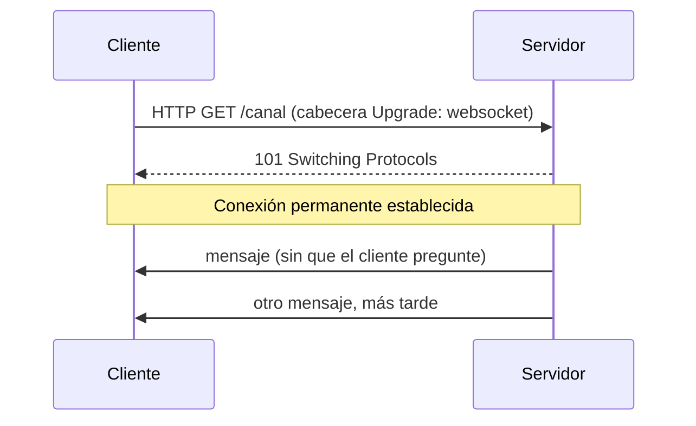
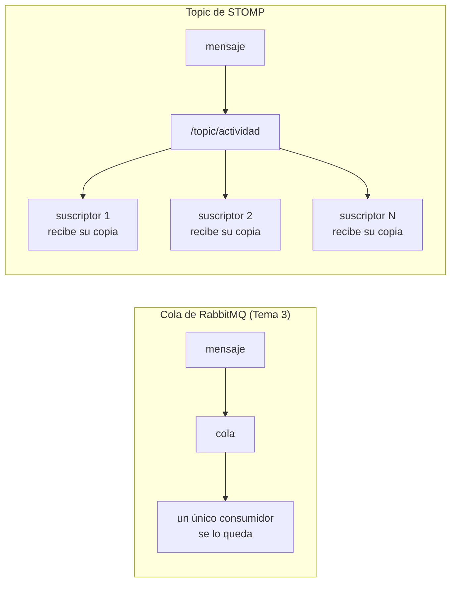
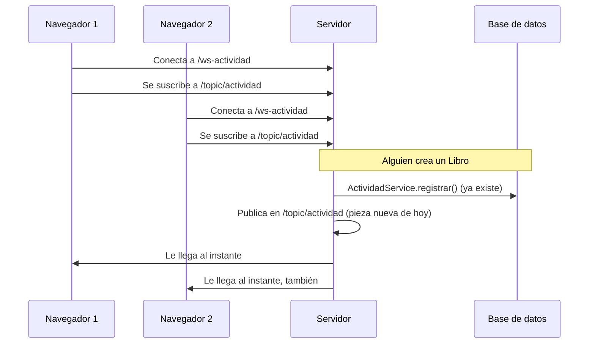
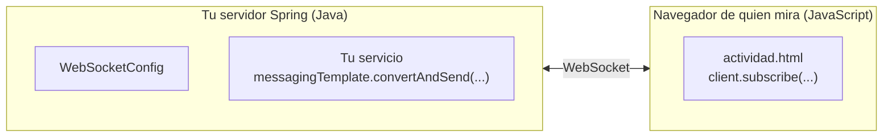

<a id="websocket-stomp"></a>

# 🧩 2. WebSocket con STOMP: el canal de actividad en vivo

Con sockets clásicos (Actividad 4.1) ya sabes, de principio a fin, cómo dos programas se comunican en red. En el apartado anterior has visto también tres modelos de comunicación, y has dejado uno pendiente para hoy: el canal bidireccional persistente. Este apartado lo construye, sobre un protocolo de nivel más alto, para resolver un problema muy concreto que todavía no has resuelto en el curso.

---

## 🔔 El problema: ¿cómo se entera un cliente de algo que acaba de pasar?

Con todo lo que has construido hasta ahora (REST puro), el cliente siempre pregunta primero: manda una petición, el servidor responde, y ahí termina esa conversación. Pero ¿qué pasa cuando el servidor sabe algo que al cliente le interesa, y el cliente todavía no ha preguntado por ello? Con petición-respuesta puro no hay forma de que el servidor tome la iniciativa — solo puede reaccionar. Las soluciones históricas a este problema, en orden de aparición:

1. **Recargar la página** — a mano, o con un `setTimeout` que recarga entera. Brutal y lento: el usuario ve parpadear toda la página por un dato que probablemente ni ha cambiado.
2. **Polling**: el cliente pregunta cada X segundos, "¿ha cambiado algo?" — funciona, pero tiene un coste real: peticiones constantes, la mayoría con respuesta "no, nada nuevo", y un retraso de hasta X segundos en enterarse de lo que sí ha cambiado.
3. **Long polling**: una variante donde el servidor retiene la respuesta hasta que hay algo que contar (o hasta que salta un *timeout*) — mejora el retraso, pero sigue siendo, en el fondo, peticiones repetidas, una detrás de otra.

Las tres funcionan, pero las tres dan vueltas alrededor del mismo obstáculo: el cliente sigue siendo quien tiene que preguntar, una y otra vez, para enterarse de algo que el servidor ya sabía. WebSocket no es tecnología caída del cielo — es la respuesta directa a este problema: en vez de perfeccionar la pregunta, elimina la necesidad de preguntar.

---

## 🔗 WebSocket: el canal bidireccional persistente

Recuerda los tres modelos de comunicación del apartado anterior: petición-respuesta síncrono (REST), cola de mensajes asíncrona (RabbitMQ), y canal bidireccional persistente — el que quedó pendiente de ver en detalle. **WebSocket** es exactamente eso: un socket de verdad entre navegador y servidor, abierto todo el tiempo que haga falta, por el que cualquiera de los dos lados puede enviar datos en cualquier momento.

Para llegar a esa conexión persistente, el navegador manda una única petición HTTP normal, la de siempre. Lo único distinto es una cabecera especial (`Upgrade`) que pide cambiar de protocolo desde ya, en esa misma petición. Si el servidor acepta, ocurre algo que no pasa con ninguna otra petición HTTP: la conexión no se cierra al terminar de responder — se queda abierta de forma **permanente**, y a partir de ahí ya no habla HTTP, habla WebSocket:


```mermaid
sequenceDiagram
    participant C as Cliente
    participant S as Servidor
    C->>S: HTTP GET /canal (cabecera Upgrade: websocket)
    S-->>C: 101 Switching Protocols
    Note over C,S: Conexión permanente establecida
    S->>C: mensaje (sin que el cliente pregunte)
    S->>C: otro mensaje, más tarde
```

Fíjate en las dos últimas líneas del diagrama: el servidor manda mensajes sin que nada los haya provocado desde el cliente. Y el cliente, en su lado, tampoco se queda bloqueado esperándolos, parado hasta que llegue algo — eso desperdiciaría exactamente la ventaja que acabas de ganar. Lo que hace es dejar registrado un aviso —un *callback*— y seguir a lo suyo; en cuanto llega un mensaje por ese canal, se ejecuta ese aviso automáticamente, tantas veces como mensajes lleguen, sin que el cliente tenga que estar pendiente de nada mientras tanto. Por eso el diagrama muestra varios mensajes seguidos: no son respuestas a nada que el cliente haya vuelto a pedir, son avisos que van llegando cada vez que el servidor tiene algo nuevo que contar. Es el mismo patrón `onConnect`/`subscribe` que vas a usar en la Actividad 4.2.

---

## 📨 Qué es STOMP

Imagina una librería online, con su catálogo de `Libro`/`Editorial` y sus notas de lectura de `NotaLectura` — el mismo dominio de ejemplo que ya conoces de otros apartados. Con WebSocket ya tienes el canal abierto — pero fíjate en qué es exactamente lo que has conseguido: un tubo por el que viajan mensajes sueltos, sin ninguna estructura encima. Todo lo que envíes por ahí llega mezclado, tal cual, sin ninguna etiqueta que diga de qué trata.

Imagina que por ese mismo canal quisieras mandar dos cosas distintas —por ejemplo, un aviso cada vez que alguien publica una `NotaLectura` nueva, y una alerta cuando un `Libro` se queda sin ejemplares disponibles— a la vez. Con WebSocket a secas, el cliente que recibe no tiene ninguna forma de distinguir uno de otro más que mirando el propio contenido del mensaje a mano, ni de decir "a mí solo me interesan las alertas de stock, no las notas de lectura".

Eso es justo lo que le falta a WebSocket y lo que añade **STOMP** (*Simple Text Oriented Messaging Protocol*), un protocolo sencillo que se monta encima: la posibilidad de dar un nombre a cada tipo de mensaje —un **destino**, como `/topic/notas` o `/topic/alertas-stock`— y de que cada cliente se **suscriba** solo a los destinos que le interesan, sin que le lleguen los demás. Nada de esto te lo inventas tú a mano: es el mismo patrón de publicación-suscripción que ya has visto con `ApplicationEventPublisher` en el Tema 3, ahora con el protocolo poniendo las reglas.

!!! tip "Quién participa: la diferencia con `ApplicationEventPublisher`"
    Con `ApplicationEventPublisher`, los suscriptores eran otros *beans*, dentro de la misma aplicación. Aquí el suscriptor es un cliente de verdad, fuera del servidor — típicamente un navegador.

El reparto de los mensajes también es distinto al de la cola de RabbitMQ, también del Tema 3 — y esta vez la diferencia sí importa para lo que vas a construir:


```mermaid
flowchart LR
    subgraph RabbitMQ["Cola de RabbitMQ (Tema 3)"]
    M1["mensaje"] --> Q["cola"] --> Con["un único consumidor<br/>se lo queda"]
    end
    subgraph STOMP["Topic de STOMP"]
    M2["mensaje"] --> T["/topic/actividad"]
    T --> S1["suscriptor 1<br/>recibe su copia"]
    T --> S2["suscriptor 2<br/>recibe su copia"]
    T --> S3["suscriptor N<br/>recibe su copia"]
    end
```

Un destino STOMP puede tener varios suscriptores a la vez, y todos reciben su propia copia de cada mensaje — justo lo contrario de una cola de RabbitMQ, donde cada mensaje concreto lo procesa un único consumidor y desaparece de ahí. Piensa otra vez en la alerta de stock: si tienes varias personas de la librería con el panel de administración abierto a la vez, quieres que la reciban **todas**, no que se la quede solo la primera que la pida — exactamente el reparto que da un destino STOMP, y exactamente lo contrario de lo que haría una cola.

---

## 🎯 El caso de uso: actividad en vivo

Ya sabes qué resuelve WebSocket (el canal persistente) y qué añade STOMP encima (destinos y suscripciones). Toca ver las dos cosas juntas, aplicadas a un caso concreto de tu propio proyecto.

Sigue con el mismo ejemplo de la librería online. El punto de partida: cada vez que se crea, modifica o borra un `Libro` en el catálogo, `ActividadService.registrar()` ya guarda ese registro en la base de datos — hoy solo puede consultarse con `GET /api/v1/actividad`, en frío, y solo por `ADMIN`. La pieza que falta es publicar esos mismos registros **en vivo**, según ocurren, a quien esté mirando en ese momento. Antes de entrar en la configuración pieza a pieza, esta es la foto completa de lo que vas a construir:


```mermaid
sequenceDiagram
    participant N1 as Navegador 1
    participant N2 as Navegador 2
    participant S as Servidor
    participant DB as Base de datos

    N1->>S: Conecta a /ws-actividad
    N1->>S: Se suscribe a /topic/actividad
    N2->>S: Conecta a /ws-actividad
    N2->>S: Se suscribe a /topic/actividad

    Note over S,DB: Alguien crea un Libro
    S->>DB: ActividadService.registrar() (ya existe)
    S->>S: Publica en /topic/actividad (pieza nueva de hoy)
    S->>N1: Le llega al instante
    S->>N2: Le llega al instante, también
```

Dos navegadores, conectados por separado, reciben el mismo aviso a la vez — sin que ninguno de los dos haya vuelto a preguntar nada. Todo lo que viene ahora, paso a paso, es cómo se construye esto.

### Las tres piezas base de la configuración

Montar esto en Spring exige tres piezas: activar el soporte de mensajería WebSocket, declarar a qué URL se conecta el cliente, y decidir cómo se reparten los mensajes una vez dentro. Las tres caben en una única clase de configuración:

```java
@Configuration
@EnableWebSocketMessageBroker
public class WebSocketConfig implements WebSocketMessageBrokerConfigurer {

    @Override
    public void registerStompEndpoints(StompEndpointRegistry registry) {
        registry.addEndpoint("/ws-actividad").setAllowedOriginPatterns("*");
    }

    @Override
    public void configureMessageBroker(MessageBrokerRegistry registry) {
        registry.enableSimpleBroker("/topic");
        registry.setApplicationDestinationPrefixes("/app");
    }
}
```

| Método | Responsabilidad | En el diagrama de arriba |
|---|---|---|
| `@EnableWebSocketMessageBroker` | Activa el soporte de mensajería WebSocket con STOMP sobre toda la aplicación | La pieza que hace posible todo lo demás |
| `registerStompEndpoints` | Declara la URL a la que el cliente se conecta inicialmente | El `/ws-actividad` de "Conecta a..." |
| `configureMessageBroker` | Activa el **broker** —el mismo concepto que ya conoces de RabbitMQ (Tema 3), el intermediario que recibe los mensajes y los reparte a quien corresponda— y decide qué prefijos gestiona | El `/topic` de "Se suscribe a..." y de "Publica en..." |

!!! tip "Aquí no hace falta ningún `@RestController`"
    `registerStompEndpoints` es, en sí misma, la declaración del endpoint — a diferencia de REST, no hace falta ningún `@GetMapping("/ws-actividad")`. Esta llamada le dice a Spring que las peticiones a esa URL no pasan por el despachador normal de controllers: las trata como negociación de WebSocket desde el principio. El `@MessageMapping` de más abajo (para `/app`) sí es el equivalente de `@RequestMapping`, pero solo para mensajes que llegan **después** de que la conexión ya esté establecida — el *handshake* inicial lo gestiona directamente esta configuración, sin ningún método de controller de por medio.

Fíjate también en `.setAllowedOriginPatterns("*")`, justo detrás de `addEndpoint(...)`. Por defecto, un navegador no puede abrir una conexión hacia un dominio distinto del que sirve la propia página, sin que el servidor lo autorice explícitamente — `setAllowedOriginPatterns` es esa autorización, para WebSocket. `*` acepta cualquier origen, cómodo para probar mientras desarrollas; en una aplicación real restringirías esto al dominio concreto de tu frontend.

El broker que activas aquí, `enableSimpleBroker("/topic")`, es uno simple, en memoria — suficiente para este caso; un broker externo como el propio RabbitMQ también podría hacer de intermediario STOMP, pero no hace falta para lo que vas a construir.

!!! tip "¿Y para qué sirve `/app`?"
    La misma llamada fija también `/app`, un segundo prefijo para la dirección contraria: mensajes que el cliente manda **hacia** el servidor, no solo al revés. No lo vas a necesitar hoy, que es solo de servidor hacia cliente, pero para que no se quede en el aire: imagina que quisieras que cada cliente de la librería eligiera qué avisos le interesan (por ejemplo, "solo alertas de stock, las notas de lectura no me hacen falta"). El cliente mandaría esa preferencia a `/app/preferencias`, y un método del servidor anotado `@MessageMapping("/preferencias")` la recibiría y la guardaría — el mismo papel que hace `@RequestMapping` con REST, pero para mensajes STOMP en vez de peticiones HTTP.

### Dónde aparece el destino concreto, y quién lo pone

Fíjate otra vez en el código de la configuración: en ningún sitio dice `/topic/actividad`, solo aparece `/topic`, a secas — el prefijo, no el destino final. El destino concreto no se declara ahí. Aparece en otros dos sitios, cada uno responsable de su propio lado.

**En el servidor**, cuando quieras publicar algo (esto lo escribirás en la Actividad 4.2):

```java
messagingTemplate.convertAndSend("/topic/actividad", "Se ha añadido un Libro nuevo al catálogo");
```

**En el cliente**, cuando quieras recibirlo:

```javascript
client.subscribe('/topic/actividad', function (mensaje) {
    console.log('Ha llegado un aviso:', mensaje.body);
});
```

Fíjate en esa segunda pieza, `function (mensaje) { ... }`: es el ***callback*** del que hablábamos más arriba, ahora con código delante. Es una función que tú escribes, pero que **no llamas tú**. Se la entregas a `subscribe(...)` como quien dice "cuando llegue algo por aquí, ejecuta esto" — y ahí termina tu trabajo. La ejecuta el propio cliente STOMP, automáticamente, cada vez que llega un mensaje nuevo a `/topic/actividad`, ni una vez menos ni una vez más.

Con las dos piezas de código delante, ya se puede responder a "por qué no aparece en la configuración": el destino concreto no se **declara** en un sitio central, se **usa** por separado en quien publica y en quien se suscribe — y ambos tienen que escribir el mismo nombre, carácter a carácter, para encontrarse. Es la diferencia clave con RabbitMQ:

| | RabbitMQ (Tema 3) | STOMP |
|---|---|---|
| Qué declaras en la configuración | Cada cola, con su propio `@Bean` | Solo el prefijo (`"/topic"`) |
| Dónde aparece el nombre concreto | En la propia declaración de la cola | Solo donde se publica y donde se suscribe |
| Si el nombre no coincide en algún lado | Error claro al arrancar — la cola no existe | Ningún error — el mensaje simplemente no le llega a nadie |

Y esa misma coincidencia de nombres decide, además, **qué recibe cada cliente**, no solo que lo reciba. Imagina un segundo cliente que hiciera esto:

```javascript
client.subscribe('/topic/alertas-stock', otroCallback);
```

Ese cliente recibiría solo las alertas de stock — nunca los avisos de `/topic/actividad`, aunque los gestione el mismo broker. Cada `subscribe(...)` apunta a un único destino. No existe un "suscríbeme a todo lo que empiece por `/topic/`": para recibir las dos cosas harían falta dos llamadas, una por destino.

### Dos mundos distintos, y dónde vive cada línea de código

Antes de seguir, para el golpe de vista: hasta ahora has visto código Java y código JavaScript mezclados, y es fácil perder de vista que **no corren en el mismo sitio, ni tú los ejecutas de la misma forma**:


```mermaid
flowchart LR
    subgraph Servidor["Tu servidor Spring (Java)"]
        direction TB
        A["WebSocketConfig"]
        B["Tu servicio<br/>messagingTemplate.convertAndSend(...)"]
    end
    subgraph Navegador["Navegador de quien mira (JavaScript)"]
        direction TB
        C["actividad.html<br/>client.subscribe(...)"]
    end
    Servidor <-->|"WebSocket"| Navegador
```

- El código **Java** —`WebSocketConfig`, y el `messagingTemplate.convertAndSend(...)` de más abajo— vive dentro de tu propio proyecto Spring: se compila con Maven y se despliega junto con todo lo demás, el mismo servidor que ya tienes corriendo.
- El código **JavaScript** del cliente no lo ejecutas tú, ni corre en tu servidor: es un fichero HTML con su `<script>` dentro, que tú guardas en `src/main/resources/static/` (Spring lo sirve como un recurso estático más, igual que serviría una imagen) y que **ejecuta el navegador** de quien lo abra, como cualquier página web normal. No hay que "arrancarlo" ni compilarlo — basta con que exista ahí y con que alguien lo visite.

Y la pregunta que queda: ¿dónde escribes tú, dentro de tu propio proyecto, una línea así? En cualquier bean donde ya tengas el evento que te interesa emitir — no hace falta ninguna clase nueva. `SimpMessagingTemplate` se inyecta por constructor exactamente igual que cualquier repositorio o servicio que ya conoces:

```java
@Service
@RequiredArgsConstructor
public class NotaLecturaService {
    private final NotaLecturaRepository notaLecturaRepository;
    private final SimpMessagingTemplate messagingTemplate; // pieza nueva

    public NotaLectura crear(NotaLecturaCreateDTO dto) {
        NotaLectura guardada = notaLecturaRepository.save(mapToEntity(dto));
        messagingTemplate.convertAndSend("/topic/notas", guardada); // pieza nueva
        return guardada;
    }
}
```

El mismo método que ya guardaba algo en base de datos, ahora, además, lo publica por WebSocket — una línea más, al lado de la que ya tenías. En la Actividad 4.2 ves esto aplicado al caso real de tu proyecto, conectado a `ActividadService` desde el primer momento — sin ningún mensaje de prueba de por medio.

!!! question "¿El cliente recibe ese objeto `guardada` tal cual?"
    No. `convertAndSend(destino, objeto)` no manda el objeto Java por el cable —no podría, WebSocket solo transporta texto o bytes—: lo **convierte** primero (de ahí el nombre) a un formato de texto, JSON por defecto, exactamente igual que ya hace Spring con cualquier respuesta REST que devuelves como objeto. Lo que le llega al cliente, en `mensaje.body`, es una cadena de texto con ese JSON, no un objeto Java.

    En JavaScript, esa cadena no es todavía un objeto usable — hace falta convertirla tú mismo con `JSON.parse(mensaje.body)` antes de poder leer sus campos. Es el mismo paso que ya usa el cliente completo de la Actividad 4.2.

!!! tip "¿En qué hilo se ejecuta ese `convertAndSend`?"
    En tu proyecto real, `registrar(...)` no lo llamas tú directamente desde una petición HTTP — lo llama el consumer de RabbitMQ (Tema 3), en su propio hilo de escucha, no en el hilo del pool de Tomcat que atendió la petición original. El `push` hacia WebSocket se ejecuta ahí mismo, en ese hilo del listener, con una responsabilidad más de las que ya tenía.

### Comparado con lo que ya conoces

Para que el contraste con REST quede claro de un vistazo:

| | REST | WebSocket |
|---|---|---|
| Quién inicia | El cliente, cada vez | El cliente, una vez (la conexión inicial) |
| Respuestas por petición | Una | Ninguna fija — el servidor envía cuando quiere |
| Duración de la conexión | Corta, se cierra tras la respuesta | Persistente |
| Caso de uso típico | Consultas y operaciones bajo demanda | Notificaciones en tiempo real |

Y dos matices más, ya con el diagrama completo delante:

- **El paralelismo correcto sigue siendo con `ApplicationEventPublisher`**, no con RabbitMQ (como ya has visto en el `tip` de más arriba): mismo modelo de publicación-suscripción. La única diferencia es quién es el suscriptor: con `ApplicationEventPublisher` era otro *bean*, dentro de la misma aplicación; aquí es un navegador, fuera del servidor por completo.
- **La concurrencia de los dos navegadores del diagrama la gestiona Spring, no tú.** En la Actividad 4.1, cada cliente que se conectaba a tu servidor de sockets exigía que tú mismo lanzaras un hilo nuevo para atenderlo, a mano. Aquí no vas a escribir ni un `Thread` — Spring ya gestiona por ti, internamente, un hilo por cada cliente WebSocket conectado. La necesidad de atender varios clientes a la vez sigue siendo la misma, solo que esta capa más alta te la resuelve sin que tengas que programarla tú.

---

## ✅ Ideas clave

??? tip "Abrir resumen"

    - El problema de fondo: con petición-respuesta puro, el cliente siempre pregunta primero — no hay forma de que el servidor avise por iniciativa propia. Recargar, polling y long polling son soluciones parciales al mismo problema.
    - **WebSocket** es el tercer modelo de comunicación (canal bidireccional persistente): petición HTTP inicial con cabecera `Upgrade` para cambiar de protocolo, después conexión permanente donde el servidor envía sin que el cliente pregunte, y el cliente recibe por *callback*, sin quedarse bloqueado esperando.
    - **STOMP** añade semántica de mensajería (destinos, suscripción) sobre el tubo de bytes desnudo de WebSocket, para no tener que inventártela tú.
    - `@EnableWebSocketMessageBroker` + `registerStompEndpoints` + `configureMessageBroker` son las tres piezas de configuración base.
    - Mismo modelo pub-sub que los eventos internos de Spring (`ApplicationEventPublisher`, Tema 3), pero con el suscriptor fuera de la JVM, en el navegador. RabbitMQ, en cambio, es una cola punto a punto — cada mensaje a un único consumidor, no lo mismo.
